```python
#!pip install keras
#!pip install numpy
#!pip install imageio
#!pip install matplotlib
#!pip install opencv-python
#!pip install pydot
#!pip install graphviz
#!pip install azure-cognitiveservices-search-imagesearch
# Note: restart kernel after installing the above.
#!pip freeze

import threading
import sys
import cv2
import sys
import os
import csv
import itertools
import numpy as np
from PIL import Image
import imageio
import itertools as it
import tensorflow as tf
import keras
import pprint as pp
print("Keras version %s" % keras.__version__)
from keras.models import Sequential
from keras.layers import Dense, Dropout
from keras import backend as K

print("Tensorflow version %s" % tf.__version__)

import pprint
pp = pprint.PrettyPrinter(depth=6)
```

    Using TensorFlow backend.
    

    Keras version 2.2.0
    Tensorflow version 1.1.0
    


```python
# Add the standard include path for FoosMetrics
sys.path.insert(0, './../../Code')

import importlib
import process
importlib.reload(process)
```


    <module 'process' from './../../Code\\process.py'>


```python
# Prep the training data
#preprocess = process.Processor("balltracking_prep.json")
#preprocess.process_all()
#process_all = None
```


```python
# Load the data and frames, and add the normalizer
training = process.Processor("balltracking_loader.json")
validation = process.Processor("balltracking_loader.json")
```

    -------- Load random frames ---------
    Creating transform: random_video_loader
    Adding folder '.'
    '.\balltracking_0.avi': 2430 frames found.
    '.\balltracking_0.avi': Repeating 10.000000 times.
    '.\random_images_0.avi': 6080 frames found.
    Loaded 15190 frames in loader.
    Distribution:
    {'random_images_.avi': 6080, 'balltracking_.avi': 24300}
    Creating transform: require
    Creating transform: require
    -------- Randomize the frame and segmentation map the exact same way --------
    Creating transform: add_random_number
    -------- Normalize both images on range 0.0 to 1.0 per channel --------
    Creating transform: normalize_channels
    Creating transform: normalize_channels
    -------- 'frame' has input, 'segmentation' has output --------
    -------- Load random frames ---------
    Creating transform: random_video_loader
    Adding folder '.'
    '.\balltracking_0.avi': 2430 frames found.
    '.\balltracking_0.avi': Repeating 10.000000 times.
    '.\random_images_0.avi': 6080 frames found.
    Loaded 15190 frames in loader.
    Distribution:
    {'random_images_.avi': 6080, 'balltracking_.avi': 24300}
    Creating transform: require
    Creating transform: require
    -------- Randomize the frame and segmentation map the exact same way --------
    Creating transform: add_random_number
    -------- Normalize both images on range 0.0 to 1.0 per channel --------
    Creating transform: normalize_channels
    Creating transform: normalize_channels
    -------- 'frame' has input, 'segmentation' has output --------
    


```python
import matplotlib
import matplotlib.image as mpimg
import matplotlib.pyplot as plt
%matplotlib inline

def threshold(data, minimum=0.0, maximum=1.0):
    mask = data > maximum
    data[mask] = maximum

    mask = data < minimum
    data[mask] = minimum
    return data

# View the first few frames
for k in range(10):
    data = training.get_next_frame()
    print(data["frame"].shape)
    frames = np.concatenate((data["frame"],data["segmentation"]),1)
    print(frames.shape)
    fig, ax = plt.subplots(figsize=(24, 5))
    plt.imshow(threshold(frames))
    plt.show()
```

    (256, 256, 3)
    (256, 512, 3)
    


    (256, 256, 3)
    (256, 512, 3)
    


    (256, 256, 3)
    (256, 512, 3)
    


    (256, 256, 3)
    (256, 512, 3)
    


    (256, 256, 3)
    (256, 512, 3)
    


    (256, 256, 3)
    (256, 512, 3)
    


    (256, 256, 3)
    (256, 512, 3)
    


    (256, 256, 3)
    (256, 512, 3)
    


    (256, 256, 3)
    (256, 512, 3)
    


    (256, 256, 3)
    (256, 512, 3)
    


```python
# https://stanford.edu/~shervine/blog/keras-generator-multiprocessing.html
class threadsafe_iter(object):
  """
    Takes an iterator/generator and makes it thread-safe by
    serializing call to the `next` method of given iterator/generator.
    """
  def __init__(self, it):
      self.it = it
      self.lock = threading.Lock()

  def __iter__(self):
      return self

  def __next__(self):
      with self.lock:
          return self.it.__next__()

# https://stanford.edu/~shervine/blog/keras-generator-multiprocessing.html
def threadsafe_generator(f):
  """
    A decorator that takes a generator function and makes it thread-safe.
    """
  def g(*a, **kw):
      return threadsafe_iter(f(*a, **kw))
  return g


# Define our training and validation iterators
@threadsafe_generator
def TrainGen(training):
    while True:
        data = training.get_next_frame()
        if data is not None:
            frame = data["frame"]
            segmentation = data["segmentation"]
            
            while frame is not None:
                yield (frame, segmentation)
                data = training.get_next_frame()
                if data is not None:
                    frame = data["frame"]
                    segmentation = data["segmentation"]
                else:
                    frame = None
                    segmentation = None
                
             
# Generators for training the position
@threadsafe_generator
def TrainBatchGen(batch_size, training):
    gen = TrainGen(training)
    while True:
        # Build the next batch
        batch_frames = np.zeros(shape=(batch_size, 256, 256, 3), dtype=np.float32)
        batch_segmentations = np.zeros(shape=(batch_size, 256, 256, 1), dtype=np.float32)
        for i in range(batch_size):
            (frame, segmentation) = next(gen)
            batch_frames[i,:,:,:] = frame
            batch_segmentations[i,:,:,0] = segmentation[:,:,0]
            
        yield (batch_frames, batch_segmentations)

```


```python
from keras.losses import mean_squared_error


# Utilities for plotting the result and training
def plot_validate(generator, model, count, name):   
    (frames, outputs_true) = next(generator)
    outputs_predicted = model.predict(frames, batch_size=frames[0].shape[0], verbose=0)

    for i in range(5):
        # View the first set
        outputs_predicted_cat = np.concatenate((outputs_predicted[i],outputs_predicted[i],outputs_predicted[i]),2)
        outputs_true_cat = np.concatenate((outputs_true[i],outputs_true[i],outputs_true[i]),2)
        inputs = np.concatenate((frames[i], outputs_true_cat, outputs_predicted_cat),1)

        fig, ax = plt.subplots(figsize=(45, 8))
        h = plt.imshow(threshold(inputs))
        plt.title( 'Frame, True Segmentation, Predicted Segmentation' )
        plt.show()
    


#plot_validate(TrainBatchGen(batch_size, validation), frame_prediction_model, 5, "Epoch validation results %i" % epoch)
```


```python
from keras.models import Sequential
from keras.layers import *
from keras.models import Model
from keras.utils import plot_model
#from IPython.display import SVG, display
#from keras.utils.vis_utils import model_to_dot

import gc
K.clear_session()
gc.collect()


image_height       = 256
image_width        = 256
image_channels     = 3

# Model options
batch_size = 10
lstm_output_size = 300
cnn_kernel_count = 40

# Build an hourglass model. Notes on the model structure:
# Two camera frames as input.
# frame0 -> Conv and pooling until embedding (shared convoluations to both frame0 and frame1)
# frame1 -> Conv and pooling until embedding
# Conv both paths together
# Residual upsampling of frame1 until original size
# Pixel-wise error to frame2 as loss

pp.pprint("Input shape without batches:")
pp.pprint((image_height, image_width, image_channels))

# Used to give fixed names to the layers for transferring the model
conv_num = 0 
pool_num = 0
dense_num = 0


# Create the embedding module, the same model runs both frames
frame_in = Input(shape=(image_height, image_width, image_channels,))
x = Conv2D(cnn_kernel_count, (3, 3),
           padding = "same",
           activation = "relu",)(frame_in)
x = Conv2D(cnn_kernel_count, (3, 3),
           padding = "same",
           activation = "relu",)(x)
res0 = x

x = MaxPooling2D((2, 2))(x)

x = Conv2D(cnn_kernel_count, (3, 3),
           padding = "same",
           activation = "relu",)(x)
x = Conv2D(cnn_kernel_count, (3, 3),
           padding = "same",
           activation = "relu",)(x)
res1 = x

x = MaxPooling2D((2, 2))(x)


x = Conv2D(cnn_kernel_count, (3, 3),
           padding = "same",
           activation = "relu",)(x)
x = Conv2D(cnn_kernel_count, (3, 3),
           padding = "same",
           activation = "relu",)(x)
res2 = x
x = MaxPooling2D((2, 2))(x)


x = Conv2D(cnn_kernel_count, (3, 3),
           padding = "same",
           activation = "relu",)(x)
x = Conv2D(cnn_kernel_count, (3, 3),
           padding = "same",
           activation = "relu",)(x)
res3 = x
x = MaxPooling2D((2, 2))(x)


x = Conv2D(cnn_kernel_count, (3, 3),
           padding = "same",
           activation = "relu",)(x)
x = Conv2D(cnn_kernel_count, (3, 3),
           padding = "same",
           activation = "relu",)(x)
res4 = x
x = MaxPooling2D((2, 2))(x)


x = Conv2D(cnn_kernel_count, (3, 3),
           padding = "same",
           activation = "relu",)(x)
x = Conv2D(cnn_kernel_count, (3, 3),
           padding = "same",
           activation = "relu",)(x)
res5 = x
x = MaxPooling2D((2, 2))(x)


# Start the upsampling and residual joining

x = Conv2D(cnn_kernel_count, (3, 3),
           padding = "same",
           activation = "relu",)(x)
x = Conv2D(cnn_kernel_count, (3, 3),
           padding = "same",
           activation = "relu",)(x)

# Create the upsampling stages, feeding residual from frame1
x = UpSampling2D(size=(2, 2), data_format=None)(x)
#res5 = Cropping2D(cropping=(((0, 0), (1, 0))), data_format=None)(res4_b)
x = keras.layers.concatenate([x, res5])
x = Conv2D(cnn_kernel_count, (3, 3),
           padding = "same",
           activation = "relu",)(x)
x = Conv2D(cnn_kernel_count, (3, 3),
           padding = "same",
           activation = "relu",)(x)

x = UpSampling2D(size=(2, 2), data_format=None)(x)
#res5 = Cropping2D(cropping=(((0, 0), (1, 0))), data_format=None)(res4_b)
x = keras.layers.concatenate([x, res4])
x = Conv2D(cnn_kernel_count, (3, 3),
           padding = "same",
           activation = "relu",)(x)
x = Conv2D(cnn_kernel_count, (3, 3),
           padding = "same",
           activation = "relu",)(x)

x = UpSampling2D(size=(2, 2), data_format=None)(x)
#res5 = Cropping2D(cropping=(((0, 0), (1, 0))), data_format=None)(res4_b)
x = keras.layers.concatenate([x, res3])
x = Conv2D(cnn_kernel_count, (3, 3),
           padding = "same",
           activation = "relu",)(x)
x = Conv2D(cnn_kernel_count, (3, 3),
           padding = "same",
           activation = "relu",)(x)

x = UpSampling2D(size=(2, 2), data_format=None)(x)
#res5 = Cropping2D(cropping=(((0, 0), (1, 0))), data_format=None)(res4_b)
x = keras.layers.concatenate([x, res2])
x = Conv2D(cnn_kernel_count, (3, 3),
           padding = "same",
           activation = "relu",)(x)
x = Conv2D(cnn_kernel_count, (3, 3),
           padding = "same",
           activation = "relu",)(x)

x = UpSampling2D(size=(2, 2), data_format=None)(x)
#res5 = Cropping2D(cropping=(((0, 0), (1, 0))), data_format=None)(res4_b)
x = keras.layers.concatenate([x, res1])
x = Conv2D(cnn_kernel_count, (3, 3),
           padding = "same",
           activation = "relu",)(x)
x = Conv2D(cnn_kernel_count, (3, 3),
           padding = "same",
           activation = "relu",)(x)

x = UpSampling2D(size=(2, 2), data_format=None)(x)
#res5 = Cropping2D(cropping=(((0, 0), (1, 0))), data_format=None)(res4_b)
x = keras.layers.concatenate([x, res0])
x = Conv2D(cnn_kernel_count, (3, 3),
           padding = "same",
           activation = "relu",)(x)
x = Conv2D(cnn_kernel_count, (3, 3),
           padding = "same",
           activation = "relu",)(x)


# One channel output
x = Conv2D(1, (1, 1),
           padding = "same",
           activation = "relu",)(x)

frame_prediction_model = Model([frame_in], [x])


frame_prediction_model.compile(optimizer=keras.optimizers.RMSprop(lr=0.00002),
#model.compile(optimizer=keras.optimizers.adam(),
              loss=mean_squared_error,
              metrics=[mean_squared_error])


frame_prediction_model.summary()

#plot_model(frame_prediction_model, to_file='model.png')
#from IPython.display import SVG, display
#from keras.utils.vis_utils import model_to_dot
#display(SVG(model_to_dot(frame_prediction_model).create(prog='dot', format='svg')))

# Train the model to predict the future position. This is the control signal to the robot AI
WEIGHTS_FNAME = '.\\Goalie3Frames\\weights_%i.hdf'
MODELS_FNAME = '.\\Goalie3Frames\\models_%i.h5'
```

    'Input shape without batches:'
    (256, 256, 3)
    __________________________________________________________________________________________________
    Layer (type)                    Output Shape         Param #     Connected to                     
    ==================================================================================================
    input_1 (InputLayer)            (None, 256, 256, 3)  0                                            
    __________________________________________________________________________________________________
    conv2d_1 (Conv2D)               (None, 256, 256, 40) 1120        input_1[0][0]                    
    __________________________________________________________________________________________________
    conv2d_2 (Conv2D)               (None, 256, 256, 40) 14440       conv2d_1[0][0]                   
    __________________________________________________________________________________________________
    max_pooling2d_1 (MaxPooling2D)  (None, 128, 128, 40) 0           conv2d_2[0][0]                   
    __________________________________________________________________________________________________
    conv2d_3 (Conv2D)               (None, 128, 128, 40) 14440       max_pooling2d_1[0][0]            
    __________________________________________________________________________________________________
    conv2d_4 (Conv2D)               (None, 128, 128, 40) 14440       conv2d_3[0][0]                   
    __________________________________________________________________________________________________
    max_pooling2d_2 (MaxPooling2D)  (None, 64, 64, 40)   0           conv2d_4[0][0]                   
    __________________________________________________________________________________________________
    conv2d_5 (Conv2D)               (None, 64, 64, 40)   14440       max_pooling2d_2[0][0]            
    __________________________________________________________________________________________________
    conv2d_6 (Conv2D)               (None, 64, 64, 40)   14440       conv2d_5[0][0]                   
    __________________________________________________________________________________________________
    max_pooling2d_3 (MaxPooling2D)  (None, 32, 32, 40)   0           conv2d_6[0][0]                   
    __________________________________________________________________________________________________
    conv2d_7 (Conv2D)               (None, 32, 32, 40)   14440       max_pooling2d_3[0][0]            
    __________________________________________________________________________________________________
    conv2d_8 (Conv2D)               (None, 32, 32, 40)   14440       conv2d_7[0][0]                   
    __________________________________________________________________________________________________
    max_pooling2d_4 (MaxPooling2D)  (None, 16, 16, 40)   0           conv2d_8[0][0]                   
    __________________________________________________________________________________________________
    conv2d_9 (Conv2D)               (None, 16, 16, 40)   14440       max_pooling2d_4[0][0]            
    __________________________________________________________________________________________________
    conv2d_10 (Conv2D)              (None, 16, 16, 40)   14440       conv2d_9[0][0]                   
    __________________________________________________________________________________________________
    max_pooling2d_5 (MaxPooling2D)  (None, 8, 8, 40)     0           conv2d_10[0][0]                  
    __________________________________________________________________________________________________
    conv2d_11 (Conv2D)              (None, 8, 8, 40)     14440       max_pooling2d_5[0][0]            
    __________________________________________________________________________________________________
    conv2d_12 (Conv2D)              (None, 8, 8, 40)     14440       conv2d_11[0][0]                  
    __________________________________________________________________________________________________
    max_pooling2d_6 (MaxPooling2D)  (None, 4, 4, 40)     0           conv2d_12[0][0]                  
    __________________________________________________________________________________________________
    conv2d_13 (Conv2D)              (None, 4, 4, 40)     14440       max_pooling2d_6[0][0]            
    __________________________________________________________________________________________________
    conv2d_14 (Conv2D)              (None, 4, 4, 40)     14440       conv2d_13[0][0]                  
    __________________________________________________________________________________________________
    up_sampling2d_1 (UpSampling2D)  (None, 8, 8, 40)     0           conv2d_14[0][0]                  
    __________________________________________________________________________________________________
    concatenate_1 (Concatenate)     (None, 8, 8, 80)     0           up_sampling2d_1[0][0]            
                                                                     conv2d_12[0][0]                  
    __________________________________________________________________________________________________
    conv2d_15 (Conv2D)              (None, 8, 8, 40)     28840       concatenate_1[0][0]              
    __________________________________________________________________________________________________
    conv2d_16 (Conv2D)              (None, 8, 8, 40)     14440       conv2d_15[0][0]                  
    __________________________________________________________________________________________________
    up_sampling2d_2 (UpSampling2D)  (None, 16, 16, 40)   0           conv2d_16[0][0]                  
    __________________________________________________________________________________________________
    concatenate_2 (Concatenate)     (None, 16, 16, 80)   0           up_sampling2d_2[0][0]            
                                                                     conv2d_10[0][0]                  
    __________________________________________________________________________________________________
    conv2d_17 (Conv2D)              (None, 16, 16, 40)   28840       concatenate_2[0][0]              
    __________________________________________________________________________________________________
    conv2d_18 (Conv2D)              (None, 16, 16, 40)   14440       conv2d_17[0][0]                  
    __________________________________________________________________________________________________
    up_sampling2d_3 (UpSampling2D)  (None, 32, 32, 40)   0           conv2d_18[0][0]                  
    __________________________________________________________________________________________________
    concatenate_3 (Concatenate)     (None, 32, 32, 80)   0           up_sampling2d_3[0][0]            
                                                                     conv2d_8[0][0]                   
    __________________________________________________________________________________________________
    conv2d_19 (Conv2D)              (None, 32, 32, 40)   28840       concatenate_3[0][0]              
    __________________________________________________________________________________________________
    conv2d_20 (Conv2D)              (None, 32, 32, 40)   14440       conv2d_19[0][0]                  
    __________________________________________________________________________________________________
    up_sampling2d_4 (UpSampling2D)  (None, 64, 64, 40)   0           conv2d_20[0][0]                  
    __________________________________________________________________________________________________
    concatenate_4 (Concatenate)     (None, 64, 64, 80)   0           up_sampling2d_4[0][0]            
                                                                     conv2d_6[0][0]                   
    __________________________________________________________________________________________________
    conv2d_21 (Conv2D)              (None, 64, 64, 40)   28840       concatenate_4[0][0]              
    __________________________________________________________________________________________________
    conv2d_22 (Conv2D)              (None, 64, 64, 40)   14440       conv2d_21[0][0]                  
    __________________________________________________________________________________________________
    up_sampling2d_5 (UpSampling2D)  (None, 128, 128, 40) 0           conv2d_22[0][0]                  
    __________________________________________________________________________________________________
    concatenate_5 (Concatenate)     (None, 128, 128, 80) 0           up_sampling2d_5[0][0]            
                                                                     conv2d_4[0][0]                   
    __________________________________________________________________________________________________
    conv2d_23 (Conv2D)              (None, 128, 128, 40) 28840       concatenate_5[0][0]              
    __________________________________________________________________________________________________
    conv2d_24 (Conv2D)              (None, 128, 128, 40) 14440       conv2d_23[0][0]                  
    __________________________________________________________________________________________________
    up_sampling2d_6 (UpSampling2D)  (None, 256, 256, 40) 0           conv2d_24[0][0]                  
    __________________________________________________________________________________________________
    concatenate_6 (Concatenate)     (None, 256, 256, 80) 0           up_sampling2d_6[0][0]            
                                                                     conv2d_2[0][0]                   
    __________________________________________________________________________________________________
    conv2d_25 (Conv2D)              (None, 256, 256, 40) 28840       concatenate_6[0][0]              
    __________________________________________________________________________________________________
    conv2d_26 (Conv2D)              (None, 256, 256, 40) 14440       conv2d_25[0][0]                  
    __________________________________________________________________________________________________
    conv2d_27 (Conv2D)              (None, 256, 256, 1)  41          conv2d_26[0][0]                  
    ==================================================================================================
    Total params: 448,561
    Trainable params: 448,561
    Non-trainable params: 0
    __________________________________________________________________________________________________
    


```python
def balanced_square_error(y_true, y_pred):
    above_loss = 0.003 * K.mean( K.square( K.clip(y_pred - y_true, 0.0, 100000) ) , axis=-1)
    below_loss = K.mean( K.square( K.clip(y_pred - y_true, -100000, 0.0) ) , axis=-1)
    return above_loss + below_loss

frame_prediction_model.compile(optimizer=keras.optimizers.RMSprop(lr=0.00001),
              loss=balanced_square_error,
              metrics=[balanced_square_error,mean_squared_error])

# Was ran on the above simple model, not pre-trained Inceptionv3 run.
epoch = 0
#batches_validation_per_epoch = 50
#batches_training_per_epoch = 400
batch_size = 10
batches_training_per_epoch = 200
batches_validation_per_epoch = 5
print("Batch size %i: %i training batches, %i validation batches" % (batch_size, batches_training_per_epoch, batches_validation_per_epoch) )
WEIGHTS_FNAME = '.\\Models\\weights_%i.hdf'
MODELS_FNAME = '.\\Models\\models_%i.h5'

for i in range(60):
    frame_prediction_model.fit_generator(
        TrainBatchGen(batch_size, training=training),
        batches_training_per_epoch,
        epochs=epoch+1,
        verbose=1,
        callbacks=None,
        class_weight=None,
        max_q_size=50,
        workers=50,
        validation_data=TrainBatchGen(batch_size, validation),
        validation_steps = batches_validation_per_epoch,
        pickle_safe=False,
        initial_epoch=epoch)
    
    epoch += 1
    
    # Plot occasional validation data plot
    if i % 5 == 0:
        plot_validate(TrainBatchGen(batch_size, validation), frame_prediction_model, 50, "Epoch validation results %i" % epoch)
    
    # Save the model
    frame_prediction_model.save_weights(WEIGHTS_FNAME % epoch)
    frame_prediction_model.save(MODELS_FNAME % epoch)
    print(("Wrote model to " + WEIGHTS_FNAME )  % epoch)


```

    Batch size 10: 200 training batches, 5 validation batches
    

    C:\local\Anaconda3-4.1.1-Windows-x86_64\lib\site-packages\ipykernel\__main__.py:34: UserWarning: Update your `fit_generator` call to the Keras 2 API: `fit_generator(<__main__...., 200, validation_steps=5, verbose=1, class_weight=None, epochs=1, callbacks=None, validation_data=<__main__...., initial_epoch=0, use_multiprocessing=False, max_queue_size=50, workers=50)`
    

    Epoch 1/1
    200/200 [==============================] - 209s 1s/step - loss: 0.0017 - balanced_square_error: 0.0017 - mean_squared_error: 0.0213 - val_loss: 0.0011 - val_balanced_square_error: 0.0011 - val_mean_squared_error: 0.0646
    


    Wrote model to .\Models\weights_1.hdf
    Epoch 2/2
    

    C:\local\Anaconda3-4.1.1-Windows-x86_64\lib\site-packages\ipykernel\__main__.py:34: UserWarning: Update your `fit_generator` call to the Keras 2 API: `fit_generator(<__main__...., 200, validation_steps=5, verbose=1, class_weight=None, epochs=2, callbacks=None, validation_data=<__main__...., initial_epoch=1, use_multiprocessing=False, max_queue_size=50, workers=50)`
    

    200/200 [==============================] - 350s 2s/step - loss: 0.0012 - balanced_square_error: 0.0012 - mean_squared_error: 0.1129 - val_loss: 9.2953e-04 - val_balanced_square_error: 9.2953e-04 - val_mean_squared_error: 0.1166
    Wrote model to .\Models\weights_2.hdf
    Epoch 3/3
    

    C:\local\Anaconda3-4.1.1-Windows-x86_64\lib\site-packages\ipykernel\__main__.py:34: UserWarning: Update your `fit_generator` call to the Keras 2 API: `fit_generator(<__main__...., 200, validation_steps=5, verbose=1, class_weight=None, epochs=3, callbacks=None, validation_data=<__main__...., initial_epoch=2, use_multiprocessing=False, max_queue_size=50, workers=50)`
    

    200/200 [==============================] - 345s 2s/step - loss: 8.6132e-04 - balanced_square_error: 8.6132e-04 - mean_squared_error: 0.1063 - val_loss: 8.5317e-04 - val_balanced_square_error: 8.5317e-04 - val_mean_squared_error: 0.1115
    Wrote model to .\Models\weights_3.hdf
    Epoch 4/4
    

    C:\local\Anaconda3-4.1.1-Windows-x86_64\lib\site-packages\ipykernel\__main__.py:34: UserWarning: Update your `fit_generator` call to the Keras 2 API: `fit_generator(<__main__...., 200, validation_steps=5, verbose=1, class_weight=None, epochs=4, callbacks=None, validation_data=<__main__...., initial_epoch=3, use_multiprocessing=False, max_queue_size=50, workers=50)`
    

    200/200 [==============================] - 238s 1s/step - loss: 7.9513e-04 - balanced_square_error: 7.9513e-04 - mean_squared_error: 0.0977 - val_loss: 0.0014 - val_balanced_square_error: 0.0014 - val_mean_squared_error: 0.1230
    Wrote model to .\Models\weights_4.hdf
    Epoch 5/5
    

    C:\local\Anaconda3-4.1.1-Windows-x86_64\lib\site-packages\ipykernel\__main__.py:34: UserWarning: Update your `fit_generator` call to the Keras 2 API: `fit_generator(<__main__...., 200, validation_steps=5, verbose=1, class_weight=None, epochs=5, callbacks=None, validation_data=<__main__...., initial_epoch=4, use_multiprocessing=False, max_queue_size=50, workers=50)`
    

    200/200 [==============================] - 238s 1s/step - loss: 7.2483e-04 - balanced_square_error: 7.2483e-04 - mean_squared_error: 0.0939 - val_loss: 5.5783e-04 - val_balanced_square_error: 5.5783e-04 - val_mean_squared_error: 0.0761
    Wrote model to .\Models\weights_5.hdf
    Epoch 6/6
    

    C:\local\Anaconda3-4.1.1-Windows-x86_64\lib\site-packages\ipykernel\__main__.py:34: UserWarning: Update your `fit_generator` call to the Keras 2 API: `fit_generator(<__main__...., 200, validation_steps=5, verbose=1, class_weight=None, epochs=6, callbacks=None, validation_data=<__main__...., initial_epoch=5, use_multiprocessing=False, max_queue_size=50, workers=50)`
    

    200/200 [==============================] - 237s 1s/step - loss: 5.0906e-04 - balanced_square_error: 5.0906e-04 - mean_squared_error: 0.0797 - val_loss: 4.8659e-04 - val_balanced_square_error: 4.8659e-04 - val_mean_squared_error: 0.0703
    


    Wrote model to .\Models\weights_6.hdf
    Epoch 7/7
    

    C:\local\Anaconda3-4.1.1-Windows-x86_64\lib\site-packages\ipykernel\__main__.py:34: UserWarning: Update your `fit_generator` call to the Keras 2 API: `fit_generator(<__main__...., 200, validation_steps=5, verbose=1, class_weight=None, epochs=7, callbacks=None, validation_data=<__main__...., initial_epoch=6, use_multiprocessing=False, max_queue_size=50, workers=50)`
    

    200/200 [==============================] - 234s 1s/step - loss: 6.6796e-04 - balanced_square_error: 6.6796e-04 - mean_squared_error: 0.0812 - val_loss: 4.6872e-04 - val_balanced_square_error: 4.6872e-04 - val_mean_squared_error: 0.0816
    Wrote model to .\Models\weights_7.hdf
    Epoch 8/8
    

    C:\local\Anaconda3-4.1.1-Windows-x86_64\lib\site-packages\ipykernel\__main__.py:34: UserWarning: Update your `fit_generator` call to the Keras 2 API: `fit_generator(<__main__...., 200, validation_steps=5, verbose=1, class_weight=None, epochs=8, callbacks=None, validation_data=<__main__...., initial_epoch=7, use_multiprocessing=False, max_queue_size=50, workers=50)`
    

    200/200 [==============================] - 232s 1s/step - loss: 5.8361e-04 - balanced_square_error: 5.8361e-04 - mean_squared_error: 0.0754 - val_loss: 4.4896e-04 - val_balanced_square_error: 4.4896e-04 - val_mean_squared_error: 0.0649
    Wrote model to .\Models\weights_8.hdf
    Epoch 9/9
    

    C:\local\Anaconda3-4.1.1-Windows-x86_64\lib\site-packages\ipykernel\__main__.py:34: UserWarning: Update your `fit_generator` call to the Keras 2 API: `fit_generator(<__main__...., 200, validation_steps=5, verbose=1, class_weight=None, epochs=9, callbacks=None, validation_data=<__main__...., initial_epoch=8, use_multiprocessing=False, max_queue_size=50, workers=50)`
    

    200/200 [==============================] - 232s 1s/step - loss: 5.0430e-04 - balanced_square_error: 5.0430e-04 - mean_squared_error: 0.0699 - val_loss: 0.0013 - val_balanced_square_error: 0.0013 - val_mean_squared_error: 0.0688
    Wrote model to .\Models\weights_9.hdf
    Epoch 10/10
    

    C:\local\Anaconda3-4.1.1-Windows-x86_64\lib\site-packages\ipykernel\__main__.py:34: UserWarning: Update your `fit_generator` call to the Keras 2 API: `fit_generator(<__main__...., 200, validation_steps=5, verbose=1, class_weight=None, epochs=10, callbacks=None, validation_data=<__main__...., initial_epoch=9, use_multiprocessing=False, max_queue_size=50, workers=50)`
    

    200/200 [==============================] - 233s 1s/step - loss: 5.7688e-04 - balanced_square_error: 5.7688e-04 - mean_squared_error: 0.0723 - val_loss: 6.8095e-04 - val_balanced_square_error: 6.8095e-04 - val_mean_squared_error: 0.0549
    Wrote model to .\Models\weights_10.hdf
    Epoch 11/11
    

    C:\local\Anaconda3-4.1.1-Windows-x86_64\lib\site-packages\ipykernel\__main__.py:34: UserWarning: Update your `fit_generator` call to the Keras 2 API: `fit_generator(<__main__...., 200, validation_steps=5, verbose=1, class_weight=None, epochs=11, callbacks=None, validation_data=<__main__...., initial_epoch=10, use_multiprocessing=False, max_queue_size=50, workers=50)`
    

    200/200 [==============================] - 227s 1s/step - loss: 4.0456e-04 - balanced_square_error: 4.0456e-04 - mean_squared_error: 0.0609 - val_loss: 3.4068e-04 - val_balanced_square_error: 3.4068e-04 - val_mean_squared_error: 0.0615
    


    Wrote model to .\Models\weights_11.hdf
    Epoch 12/12
    

    C:\local\Anaconda3-4.1.1-Windows-x86_64\lib\site-packages\ipykernel\__main__.py:34: UserWarning: Update your `fit_generator` call to the Keras 2 API: `fit_generator(<__main__...., 200, validation_steps=5, verbose=1, class_weight=None, epochs=12, callbacks=None, validation_data=<__main__...., initial_epoch=11, use_multiprocessing=False, max_queue_size=50, workers=50)`
    

    200/200 [==============================] - 231s 1s/step - loss: 5.2870e-04 - balanced_square_error: 5.2870e-04 - mean_squared_error: 0.0604 - val_loss: 7.9354e-04 - val_balanced_square_error: 7.9354e-04 - val_mean_squared_error: 0.0969
    Wrote model to .\Models\weights_12.hdf
    Epoch 13/13
    

    C:\local\Anaconda3-4.1.1-Windows-x86_64\lib\site-packages\ipykernel\__main__.py:34: UserWarning: Update your `fit_generator` call to the Keras 2 API: `fit_generator(<__main__...., 200, validation_steps=5, verbose=1, class_weight=None, epochs=13, callbacks=None, validation_data=<__main__...., initial_epoch=12, use_multiprocessing=False, max_queue_size=50, workers=50)`
    

    200/200 [==============================] - 233s 1s/step - loss: 7.5450e-04 - balanced_square_error: 7.5450e-04 - mean_squared_error: 0.0685 - val_loss: 5.4927e-04 - val_balanced_square_error: 5.4927e-04 - val_mean_squared_error: 0.1731
    Wrote model to .\Models\weights_13.hdf
    Epoch 14/14
    

    C:\local\Anaconda3-4.1.1-Windows-x86_64\lib\site-packages\ipykernel\__main__.py:34: UserWarning: Update your `fit_generator` call to the Keras 2 API: `fit_generator(<__main__...., 200, validation_steps=5, verbose=1, class_weight=None, epochs=14, callbacks=None, validation_data=<__main__...., initial_epoch=13, use_multiprocessing=False, max_queue_size=50, workers=50)`
    

    200/200 [==============================] - 233s 1s/step - loss: 6.3826e-04 - balanced_square_error: 6.3826e-04 - mean_squared_error: 0.0665 - val_loss: 3.7642e-04 - val_balanced_square_error: 3.7642e-04 - val_mean_squared_error: 0.0822
    Wrote model to .\Models\weights_14.hdf
    Epoch 15/15
    

    C:\local\Anaconda3-4.1.1-Windows-x86_64\lib\site-packages\ipykernel\__main__.py:34: UserWarning: Update your `fit_generator` call to the Keras 2 API: `fit_generator(<__main__...., 200, validation_steps=5, verbose=1, class_weight=None, epochs=15, callbacks=None, validation_data=<__main__...., initial_epoch=14, use_multiprocessing=False, max_queue_size=50, workers=50)`
    

    200/200 [==============================] - 232s 1s/step - loss: 3.7981e-04 - balanced_square_error: 3.7981e-04 - mean_squared_error: 0.0515 - val_loss: 2.8556e-04 - val_balanced_square_error: 2.8556e-04 - val_mean_squared_error: 0.0599
    Wrote model to .\Models\weights_15.hdf
    Epoch 16/16
    

    C:\local\Anaconda3-4.1.1-Windows-x86_64\lib\site-packages\ipykernel\__main__.py:34: UserWarning: Update your `fit_generator` call to the Keras 2 API: `fit_generator(<__main__...., 200, validation_steps=5, verbose=1, class_weight=None, epochs=16, callbacks=None, validation_data=<__main__...., initial_epoch=15, use_multiprocessing=False, max_queue_size=50, workers=50)`
    

    200/200 [==============================] - 230s 1s/step - loss: 3.1813e-04 - balanced_square_error: 3.1813e-04 - mean_squared_error: 0.0463 - val_loss: 7.9963e-04 - val_balanced_square_error: 7.9963e-04 - val_mean_squared_error: 0.0469
    


    Wrote model to .\Models\weights_16.hdf
    Epoch 17/17
    

    C:\local\Anaconda3-4.1.1-Windows-x86_64\lib\site-packages\ipykernel\__main__.py:34: UserWarning: Update your `fit_generator` call to the Keras 2 API: `fit_generator(<__main__...., 200, validation_steps=5, verbose=1, class_weight=None, epochs=17, callbacks=None, validation_data=<__main__...., initial_epoch=16, use_multiprocessing=False, max_queue_size=50, workers=50)`
    

    200/200 [==============================] - 227s 1s/step - loss: 4.1182e-04 - balanced_square_error: 4.1182e-04 - mean_squared_error: 0.0443 - val_loss: 6.6541e-04 - val_balanced_square_error: 6.6541e-04 - val_mean_squared_error: 0.0441
    Wrote model to .\Models\weights_17.hdf
    Epoch 18/18
    

    C:\local\Anaconda3-4.1.1-Windows-x86_64\lib\site-packages\ipykernel\__main__.py:34: UserWarning: Update your `fit_generator` call to the Keras 2 API: `fit_generator(<__main__...., 200, validation_steps=5, verbose=1, class_weight=None, epochs=18, callbacks=None, validation_data=<__main__...., initial_epoch=17, use_multiprocessing=False, max_queue_size=50, workers=50)`
    

    200/200 [==============================] - 265s 1s/step - loss: 4.5632e-04 - balanced_square_error: 4.5632e-04 - mean_squared_error: 0.0426 - val_loss: 2.2200e-04 - val_balanced_square_error: 2.2200e-04 - val_mean_squared_error: 0.0400
    Wrote model to .\Models\weights_18.hdf
    Epoch 19/19
    

    C:\local\Anaconda3-4.1.1-Windows-x86_64\lib\site-packages\ipykernel\__main__.py:34: UserWarning: Update your `fit_generator` call to the Keras 2 API: `fit_generator(<__main__...., 200, validation_steps=5, verbose=1, class_weight=None, epochs=19, callbacks=None, validation_data=<__main__...., initial_epoch=18, use_multiprocessing=False, max_queue_size=50, workers=50)`
    

    200/200 [==============================] - 254s 1s/step - loss: 4.7053e-04 - balanced_square_error: 4.7053e-04 - mean_squared_error: 0.0429 - val_loss: 1.8757e-04 - val_balanced_square_error: 1.8757e-04 - val_mean_squared_error: 0.0372
    Wrote model to .\Models\weights_19.hdf
    Epoch 20/20
    

    C:\local\Anaconda3-4.1.1-Windows-x86_64\lib\site-packages\ipykernel\__main__.py:34: UserWarning: Update your `fit_generator` call to the Keras 2 API: `fit_generator(<__main__...., 200, validation_steps=5, verbose=1, class_weight=None, epochs=20, callbacks=None, validation_data=<__main__...., initial_epoch=19, use_multiprocessing=False, max_queue_size=50, workers=50)`
    

    200/200 [==============================] - 230s 1s/step - loss: 4.5620e-04 - balanced_square_error: 4.5620e-04 - mean_squared_error: 0.0374 - val_loss: 1.9537e-04 - val_balanced_square_error: 1.9537e-04 - val_mean_squared_error: 0.0288
    Wrote model to .\Models\weights_20.hdf
    Epoch 21/21
    

    C:\local\Anaconda3-4.1.1-Windows-x86_64\lib\site-packages\ipykernel\__main__.py:34: UserWarning: Update your `fit_generator` call to the Keras 2 API: `fit_generator(<__main__...., 200, validation_steps=5, verbose=1, class_weight=None, epochs=21, callbacks=None, validation_data=<__main__...., initial_epoch=20, use_multiprocessing=False, max_queue_size=50, workers=50)`
    

    200/200 [==============================] - 231s 1s/step - loss: 8.1962e-04 - balanced_square_error: 8.1962e-04 - mean_squared_error: 0.0443 - val_loss: 1.8096e-04 - val_balanced_square_error: 1.8096e-04 - val_mean_squared_error: 0.0286
    


    Wrote model to .\Models\weights_21.hdf
    Epoch 22/22
    

    C:\local\Anaconda3-4.1.1-Windows-x86_64\lib\site-packages\ipykernel\__main__.py:34: UserWarning: Update your `fit_generator` call to the Keras 2 API: `fit_generator(<__main__...., 200, validation_steps=5, verbose=1, class_weight=None, epochs=22, callbacks=None, validation_data=<__main__...., initial_epoch=21, use_multiprocessing=False, max_queue_size=50, workers=50)`
    

    200/200 [==============================] - 230s 1s/step - loss: 2.9451e-04 - balanced_square_error: 2.9451e-04 - mean_squared_error: 0.0345 - val_loss: 4.5782e-04 - val_balanced_square_error: 4.5782e-04 - val_mean_squared_error: 0.0170
    Wrote model to .\Models\weights_22.hdf
    Epoch 23/23
    

    C:\local\Anaconda3-4.1.1-Windows-x86_64\lib\site-packages\ipykernel\__main__.py:34: UserWarning: Update your `fit_generator` call to the Keras 2 API: `fit_generator(<__main__...., 200, validation_steps=5, verbose=1, class_weight=None, epochs=23, callbacks=None, validation_data=<__main__...., initial_epoch=22, use_multiprocessing=False, max_queue_size=50, workers=50)`
    

    200/200 [==============================] - 230s 1s/step - loss: 2.9424e-04 - balanced_square_error: 2.9424e-04 - mean_squared_error: 0.0318 - val_loss: 1.2924e-04 - val_balanced_square_error: 1.2924e-04 - val_mean_squared_error: 0.0349
    Wrote model to .\Models\weights_23.hdf
    Epoch 24/24
    

    C:\local\Anaconda3-4.1.1-Windows-x86_64\lib\site-packages\ipykernel\__main__.py:34: UserWarning: Update your `fit_generator` call to the Keras 2 API: `fit_generator(<__main__...., 200, validation_steps=5, verbose=1, class_weight=None, epochs=24, callbacks=None, validation_data=<__main__...., initial_epoch=23, use_multiprocessing=False, max_queue_size=50, workers=50)`
    

    200/200 [==============================] - 229s 1s/step - loss: 3.5363e-04 - balanced_square_error: 3.5363e-04 - mean_squared_error: 0.0329 - val_loss: 0.0015 - val_balanced_square_error: 0.0015 - val_mean_squared_error: 0.0325
    Wrote model to .\Models\weights_24.hdf
    Epoch 25/25
    

    C:\local\Anaconda3-4.1.1-Windows-x86_64\lib\site-packages\ipykernel\__main__.py:34: UserWarning: Update your `fit_generator` call to the Keras 2 API: `fit_generator(<__main__...., 200, validation_steps=5, verbose=1, class_weight=None, epochs=25, callbacks=None, validation_data=<__main__...., initial_epoch=24, use_multiprocessing=False, max_queue_size=50, workers=50)`
    

    200/200 [==============================] - 230s 1s/step - loss: 3.6489e-04 - balanced_square_error: 3.6489e-04 - mean_squared_error: 0.0320 - val_loss: 1.5908e-04 - val_balanced_square_error: 1.5908e-04 - val_mean_squared_error: 0.0393
    Wrote model to .\Models\weights_25.hdf
    Epoch 26/26
    

    C:\local\Anaconda3-4.1.1-Windows-x86_64\lib\site-packages\ipykernel\__main__.py:34: UserWarning: Update your `fit_generator` call to the Keras 2 API: `fit_generator(<__main__...., 200, validation_steps=5, verbose=1, class_weight=None, epochs=26, callbacks=None, validation_data=<__main__...., initial_epoch=25, use_multiprocessing=False, max_queue_size=50, workers=50)`
    

    200/200 [==============================] - 229s 1s/step - loss: 4.6450e-04 - balanced_square_error: 4.6450e-04 - mean_squared_error: 0.0324 - val_loss: 4.4869e-04 - val_balanced_square_error: 4.4869e-04 - val_mean_squared_error: 0.0346
    


    Wrote model to .\Models\weights_26.hdf
    Epoch 27/27
    

    C:\local\Anaconda3-4.1.1-Windows-x86_64\lib\site-packages\ipykernel\__main__.py:34: UserWarning: Update your `fit_generator` call to the Keras 2 API: `fit_generator(<__main__...., 200, validation_steps=5, verbose=1, class_weight=None, epochs=27, callbacks=None, validation_data=<__main__...., initial_epoch=26, use_multiprocessing=False, max_queue_size=50, workers=50)`
    

    200/200 [==============================] - 229s 1s/step - loss: 2.9908e-04 - balanced_square_error: 2.9908e-04 - mean_squared_error: 0.0290 - val_loss: 0.0022 - val_balanced_square_error: 0.0022 - val_mean_squared_error: 0.0260
    Wrote model to .\Models\weights_27.hdf
    Epoch 28/28
    

    C:\local\Anaconda3-4.1.1-Windows-x86_64\lib\site-packages\ipykernel\__main__.py:34: UserWarning: Update your `fit_generator` call to the Keras 2 API: `fit_generator(<__main__...., 200, validation_steps=5, verbose=1, class_weight=None, epochs=28, callbacks=None, validation_data=<__main__...., initial_epoch=27, use_multiprocessing=False, max_queue_size=50, workers=50)`
    

    200/200 [==============================] - 229s 1s/step - loss: 7.5282e-04 - balanced_square_error: 7.5282e-04 - mean_squared_error: 0.0329 - val_loss: 1.6190e-04 - val_balanced_square_error: 1.6190e-04 - val_mean_squared_error: 0.0276
    Wrote model to .\Models\weights_28.hdf
    Epoch 29/29
    

    C:\local\Anaconda3-4.1.1-Windows-x86_64\lib\site-packages\ipykernel\__main__.py:34: UserWarning: Update your `fit_generator` call to the Keras 2 API: `fit_generator(<__main__...., 200, validation_steps=5, verbose=1, class_weight=None, epochs=29, callbacks=None, validation_data=<__main__...., initial_epoch=28, use_multiprocessing=False, max_queue_size=50, workers=50)`
    

    200/200 [==============================] - 228s 1s/step - loss: 2.8058e-04 - balanced_square_error: 2.8058e-04 - mean_squared_error: 0.0285 - val_loss: 1.5298e-04 - val_balanced_square_error: 1.5298e-04 - val_mean_squared_error: 0.0173
    Wrote model to .\Models\weights_29.hdf
    Epoch 30/30
    

    C:\local\Anaconda3-4.1.1-Windows-x86_64\lib\site-packages\ipykernel\__main__.py:34: UserWarning: Update your `fit_generator` call to the Keras 2 API: `fit_generator(<__main__...., 200, validation_steps=5, verbose=1, class_weight=None, epochs=30, callbacks=None, validation_data=<__main__...., initial_epoch=29, use_multiprocessing=False, max_queue_size=50, workers=50)`
    

    200/200 [==============================] - 228s 1s/step - loss: 2.5666e-04 - balanced_square_error: 2.5666e-04 - mean_squared_error: 0.0248 - val_loss: 1.8442e-04 - val_balanced_square_error: 1.8442e-04 - val_mean_squared_error: 0.0291
    Wrote model to .\Models\weights_30.hdf
    Epoch 31/31
    

    C:\local\Anaconda3-4.1.1-Windows-x86_64\lib\site-packages\ipykernel\__main__.py:34: UserWarning: Update your `fit_generator` call to the Keras 2 API: `fit_generator(<__main__...., 200, validation_steps=5, verbose=1, class_weight=None, epochs=31, callbacks=None, validation_data=<__main__...., initial_epoch=30, use_multiprocessing=False, max_queue_size=50, workers=50)`
    

    200/200 [==============================] - 228s 1s/step - loss: 2.7241e-04 - balanced_square_error: 2.7241e-04 - mean_squared_error: 0.0277 - val_loss: 0.0015 - val_balanced_square_error: 0.0015 - val_mean_squared_error: 0.0262
    


    Wrote model to .\Models\weights_31.hdf
    Epoch 32/32
    

    C:\local\Anaconda3-4.1.1-Windows-x86_64\lib\site-packages\ipykernel\__main__.py:34: UserWarning: Update your `fit_generator` call to the Keras 2 API: `fit_generator(<__main__...., 200, validation_steps=5, verbose=1, class_weight=None, epochs=32, callbacks=None, validation_data=<__main__...., initial_epoch=31, use_multiprocessing=False, max_queue_size=50, workers=50)`
    

    200/200 [==============================] - 228s 1s/step - loss: 3.3958e-04 - balanced_square_error: 3.3958e-04 - mean_squared_error: 0.0260 - val_loss: 1.5421e-04 - val_balanced_square_error: 1.5421e-04 - val_mean_squared_error: 0.0223
    Wrote model to .\Models\weights_32.hdf
    Epoch 33/33
    

    C:\local\Anaconda3-4.1.1-Windows-x86_64\lib\site-packages\ipykernel\__main__.py:34: UserWarning: Update your `fit_generator` call to the Keras 2 API: `fit_generator(<__main__...., 200, validation_steps=5, verbose=1, class_weight=None, epochs=33, callbacks=None, validation_data=<__main__...., initial_epoch=32, use_multiprocessing=False, max_queue_size=50, workers=50)`
    

    200/200 [==============================] - 228s 1s/step - loss: 2.2697e-04 - balanced_square_error: 2.2697e-04 - mean_squared_error: 0.0233 - val_loss: 1.5603e-04 - val_balanced_square_error: 1.5603e-04 - val_mean_squared_error: 0.0266
    Wrote model to .\Models\weights_33.hdf
    Epoch 34/34
    

    C:\local\Anaconda3-4.1.1-Windows-x86_64\lib\site-packages\ipykernel\__main__.py:34: UserWarning: Update your `fit_generator` call to the Keras 2 API: `fit_generator(<__main__...., 200, validation_steps=5, verbose=1, class_weight=None, epochs=34, callbacks=None, validation_data=<__main__...., initial_epoch=33, use_multiprocessing=False, max_queue_size=50, workers=50)`
    

    200/200 [==============================] - 229s 1s/step - loss: 5.4914e-04 - balanced_square_error: 5.4914e-04 - mean_squared_error: 0.0299 - val_loss: 0.0018 - val_balanced_square_error: 0.0018 - val_mean_squared_error: 0.0162
    Wrote model to .\Models\weights_34.hdf
    Epoch 35/35
    

    C:\local\Anaconda3-4.1.1-Windows-x86_64\lib\site-packages\ipykernel\__main__.py:34: UserWarning: Update your `fit_generator` call to the Keras 2 API: `fit_generator(<__main__...., 200, validation_steps=5, verbose=1, class_weight=None, epochs=35, callbacks=None, validation_data=<__main__...., initial_epoch=34, use_multiprocessing=False, max_queue_size=50, workers=50)`
    

    200/200 [==============================] - 228s 1s/step - loss: 3.2645e-04 - balanced_square_error: 3.2645e-04 - mean_squared_error: 0.0231 - val_loss: 1.0195e-04 - val_balanced_square_error: 1.0195e-04 - val_mean_squared_error: 0.0259
    Wrote model to .\Models\weights_35.hdf
    Epoch 36/36
    

    C:\local\Anaconda3-4.1.1-Windows-x86_64\lib\site-packages\ipykernel\__main__.py:34: UserWarning: Update your `fit_generator` call to the Keras 2 API: `fit_generator(<__main__...., 200, validation_steps=5, verbose=1, class_weight=None, epochs=36, callbacks=None, validation_data=<__main__...., initial_epoch=35, use_multiprocessing=False, max_queue_size=50, workers=50)`
    

    200/200 [==============================] - 228s 1s/step - loss: 2.6683e-04 - balanced_square_error: 2.6683e-04 - mean_squared_error: 0.0225 - val_loss: 0.0011 - val_balanced_square_error: 0.0011 - val_mean_squared_error: 0.0219
    


    Wrote model to .\Models\weights_36.hdf
    Epoch 37/37
    

    C:\local\Anaconda3-4.1.1-Windows-x86_64\lib\site-packages\ipykernel\__main__.py:34: UserWarning: Update your `fit_generator` call to the Keras 2 API: `fit_generator(<__main__...., 200, validation_steps=5, verbose=1, class_weight=None, epochs=37, callbacks=None, validation_data=<__main__...., initial_epoch=36, use_multiprocessing=False, max_queue_size=50, workers=50)`
    

    200/200 [==============================] - 228s 1s/step - loss: 5.1024e-04 - balanced_square_error: 5.1024e-04 - mean_squared_error: 0.0249 - val_loss: 3.1479e-04 - val_balanced_square_error: 3.1479e-04 - val_mean_squared_error: 0.0811
    Wrote model to .\Models\weights_37.hdf
    Epoch 38/38
    

    C:\local\Anaconda3-4.1.1-Windows-x86_64\lib\site-packages\ipykernel\__main__.py:34: UserWarning: Update your `fit_generator` call to the Keras 2 API: `fit_generator(<__main__...., 200, validation_steps=5, verbose=1, class_weight=None, epochs=38, callbacks=None, validation_data=<__main__...., initial_epoch=37, use_multiprocessing=False, max_queue_size=50, workers=50)`
    

    200/200 [==============================] - 228s 1s/step - loss: 3.4698e-04 - balanced_square_error: 3.4698e-04 - mean_squared_error: 0.0238 - val_loss: 1.2353e-04 - val_balanced_square_error: 1.2353e-04 - val_mean_squared_error: 0.0224
    Wrote model to .\Models\weights_38.hdf
    Epoch 39/39
    

    C:\local\Anaconda3-4.1.1-Windows-x86_64\lib\site-packages\ipykernel\__main__.py:34: UserWarning: Update your `fit_generator` call to the Keras 2 API: `fit_generator(<__main__...., 200, validation_steps=5, verbose=1, class_weight=None, epochs=39, callbacks=None, validation_data=<__main__...., initial_epoch=38, use_multiprocessing=False, max_queue_size=50, workers=50)`
    

    200/200 [==============================] - 227s 1s/step - loss: 5.7098e-04 - balanced_square_error: 5.7098e-04 - mean_squared_error: 0.0213 - val_loss: 6.4269e-04 - val_balanced_square_error: 6.4269e-04 - val_mean_squared_error: 0.0189
    Wrote model to .\Models\weights_39.hdf
    Epoch 40/40
    

    C:\local\Anaconda3-4.1.1-Windows-x86_64\lib\site-packages\ipykernel\__main__.py:34: UserWarning: Update your `fit_generator` call to the Keras 2 API: `fit_generator(<__main__...., 200, validation_steps=5, verbose=1, class_weight=None, epochs=40, callbacks=None, validation_data=<__main__...., initial_epoch=39, use_multiprocessing=False, max_queue_size=50, workers=50)`
    

    200/200 [==============================] - 227s 1s/step - loss: 2.4767e-04 - balanced_square_error: 2.4767e-04 - mean_squared_error: 0.0213 - val_loss: 9.3543e-05 - val_balanced_square_error: 9.3543e-05 - val_mean_squared_error: 0.0232
    Wrote model to .\Models\weights_40.hdf
    Epoch 41/41
    

    C:\local\Anaconda3-4.1.1-Windows-x86_64\lib\site-packages\ipykernel\__main__.py:34: UserWarning: Update your `fit_generator` call to the Keras 2 API: `fit_generator(<__main__...., 200, validation_steps=5, verbose=1, class_weight=None, epochs=41, callbacks=None, validation_data=<__main__...., initial_epoch=40, use_multiprocessing=False, max_queue_size=50, workers=50)`
    

    200/200 [==============================] - 227s 1s/step - loss: 3.3649e-04 - balanced_square_error: 3.3649e-04 - mean_squared_error: 0.0220 - val_loss: 1.2384e-04 - val_balanced_square_error: 1.2384e-04 - val_mean_squared_error: 0.0341
    


    Wrote model to .\Models\weights_41.hdf
    Epoch 42/42
    

    C:\local\Anaconda3-4.1.1-Windows-x86_64\lib\site-packages\ipykernel\__main__.py:34: UserWarning: Update your `fit_generator` call to the Keras 2 API: `fit_generator(<__main__...., 200, validation_steps=5, verbose=1, class_weight=None, epochs=42, callbacks=None, validation_data=<__main__...., initial_epoch=41, use_multiprocessing=False, max_queue_size=50, workers=50)`
    

    200/200 [==============================] - 228s 1s/step - loss: 4.0552e-04 - balanced_square_error: 4.0552e-04 - mean_squared_error: 0.0236 - val_loss: 1.3033e-04 - val_balanced_square_error: 1.3033e-04 - val_mean_squared_error: 0.0108
    Wrote model to .\Models\weights_42.hdf
    Epoch 43/43
    

    C:\local\Anaconda3-4.1.1-Windows-x86_64\lib\site-packages\ipykernel\__main__.py:34: UserWarning: Update your `fit_generator` call to the Keras 2 API: `fit_generator(<__main__...., 200, validation_steps=5, verbose=1, class_weight=None, epochs=43, callbacks=None, validation_data=<__main__...., initial_epoch=42, use_multiprocessing=False, max_queue_size=50, workers=50)`
    

    200/200 [==============================] - 227s 1s/step - loss: 1.6866e-04 - balanced_square_error: 1.6866e-04 - mean_squared_error: 0.0191 - val_loss: 5.9506e-05 - val_balanced_square_error: 5.9506e-05 - val_mean_squared_error: 0.0097
    Wrote model to .\Models\weights_43.hdf
    Epoch 44/44
    

    C:\local\Anaconda3-4.1.1-Windows-x86_64\lib\site-packages\ipykernel\__main__.py:34: UserWarning: Update your `fit_generator` call to the Keras 2 API: `fit_generator(<__main__...., 200, validation_steps=5, verbose=1, class_weight=None, epochs=44, callbacks=None, validation_data=<__main__...., initial_epoch=43, use_multiprocessing=False, max_queue_size=50, workers=50)`
    

    200/200 [==============================] - 227s 1s/step - loss: 2.2991e-04 - balanced_square_error: 2.2991e-04 - mean_squared_error: 0.0194 - val_loss: 2.0680e-04 - val_balanced_square_error: 2.0680e-04 - val_mean_squared_error: 0.0681
    Wrote model to .\Models\weights_44.hdf
    Epoch 45/45
    

    C:\local\Anaconda3-4.1.1-Windows-x86_64\lib\site-packages\ipykernel\__main__.py:34: UserWarning: Update your `fit_generator` call to the Keras 2 API: `fit_generator(<__main__...., 200, validation_steps=5, verbose=1, class_weight=None, epochs=45, callbacks=None, validation_data=<__main__...., initial_epoch=44, use_multiprocessing=False, max_queue_size=50, workers=50)`
    

    200/200 [==============================] - 227s 1s/step - loss: 3.4648e-04 - balanced_square_error: 3.4648e-04 - mean_squared_error: 0.0189 - val_loss: 9.5883e-05 - val_balanced_square_error: 9.5883e-05 - val_mean_squared_error: 0.0242
    Wrote model to .\Models\weights_45.hdf
    Epoch 46/46
    

    C:\local\Anaconda3-4.1.1-Windows-x86_64\lib\site-packages\ipykernel\__main__.py:34: UserWarning: Update your `fit_generator` call to the Keras 2 API: `fit_generator(<__main__...., 200, validation_steps=5, verbose=1, class_weight=None, epochs=46, callbacks=None, validation_data=<__main__...., initial_epoch=45, use_multiprocessing=False, max_queue_size=50, workers=50)`
    

    200/200 [==============================] - 227s 1s/step - loss: 3.6990e-04 - balanced_square_error: 3.6990e-04 - mean_squared_error: 0.0206 - val_loss: 1.5119e-04 - val_balanced_square_error: 1.5119e-04 - val_mean_squared_error: 0.0056
    


    Wrote model to .\Models\weights_46.hdf
    Epoch 47/47
    

    C:\local\Anaconda3-4.1.1-Windows-x86_64\lib\site-packages\ipykernel\__main__.py:34: UserWarning: Update your `fit_generator` call to the Keras 2 API: `fit_generator(<__main__...., 200, validation_steps=5, verbose=1, class_weight=None, epochs=47, callbacks=None, validation_data=<__main__...., initial_epoch=46, use_multiprocessing=False, max_queue_size=50, workers=50)`
    

    200/200 [==============================] - 227s 1s/step - loss: 4.2321e-04 - balanced_square_error: 4.2321e-04 - mean_squared_error: 0.0214 - val_loss: 1.5092e-04 - val_balanced_square_error: 1.5092e-04 - val_mean_squared_error: 0.0447
    Wrote model to .\Models\weights_47.hdf
    Epoch 48/48
    

    C:\local\Anaconda3-4.1.1-Windows-x86_64\lib\site-packages\ipykernel\__main__.py:34: UserWarning: Update your `fit_generator` call to the Keras 2 API: `fit_generator(<__main__...., 200, validation_steps=5, verbose=1, class_weight=None, epochs=48, callbacks=None, validation_data=<__main__...., initial_epoch=47, use_multiprocessing=False, max_queue_size=50, workers=50)`
    

    200/200 [==============================] - 226s 1s/step - loss: 4.0975e-04 - balanced_square_error: 4.0975e-04 - mean_squared_error: 0.0201 - val_loss: 8.2515e-04 - val_balanced_square_error: 8.2515e-04 - val_mean_squared_error: 0.0200
    Wrote model to .\Models\weights_48.hdf
    Epoch 49/49
    

    C:\local\Anaconda3-4.1.1-Windows-x86_64\lib\site-packages\ipykernel\__main__.py:34: UserWarning: Update your `fit_generator` call to the Keras 2 API: `fit_generator(<__main__...., 200, validation_steps=5, verbose=1, class_weight=None, epochs=49, callbacks=None, validation_data=<__main__...., initial_epoch=48, use_multiprocessing=False, max_queue_size=50, workers=50)`
    

    200/200 [==============================] - 227s 1s/step - loss: 3.4203e-04 - balanced_square_error: 3.4203e-04 - mean_squared_error: 0.0215 - val_loss: 9.4148e-05 - val_balanced_square_error: 9.4148e-05 - val_mean_squared_error: 0.0212
    Wrote model to .\Models\weights_49.hdf
    Epoch 50/50
    

    C:\local\Anaconda3-4.1.1-Windows-x86_64\lib\site-packages\ipykernel\__main__.py:34: UserWarning: Update your `fit_generator` call to the Keras 2 API: `fit_generator(<__main__...., 200, validation_steps=5, verbose=1, class_weight=None, epochs=50, callbacks=None, validation_data=<__main__...., initial_epoch=49, use_multiprocessing=False, max_queue_size=50, workers=50)`
    

    200/200 [==============================] - 226s 1s/step - loss: 2.0357e-04 - balanced_square_error: 2.0357e-04 - mean_squared_error: 0.0187 - val_loss: 1.3581e-04 - val_balanced_square_error: 1.3581e-04 - val_mean_squared_error: 0.0069
    Wrote model to .\Models\weights_50.hdf
    Epoch 51/51
    

    C:\local\Anaconda3-4.1.1-Windows-x86_64\lib\site-packages\ipykernel\__main__.py:34: UserWarning: Update your `fit_generator` call to the Keras 2 API: `fit_generator(<__main__...., 200, validation_steps=5, verbose=1, class_weight=None, epochs=51, callbacks=None, validation_data=<__main__...., initial_epoch=50, use_multiprocessing=False, max_queue_size=50, workers=50)`
    

    200/200 [==============================] - 227s 1s/step - loss: 3.4998e-04 - balanced_square_error: 3.4998e-04 - mean_squared_error: 0.0192 - val_loss: 0.0018 - val_balanced_square_error: 0.0018 - val_mean_squared_error: 0.0089
    


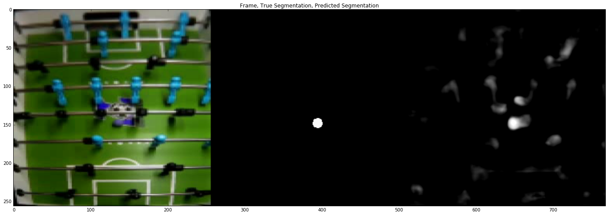


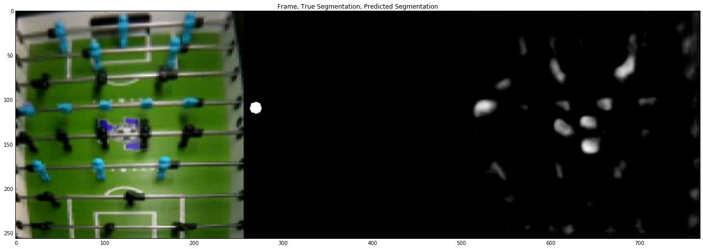


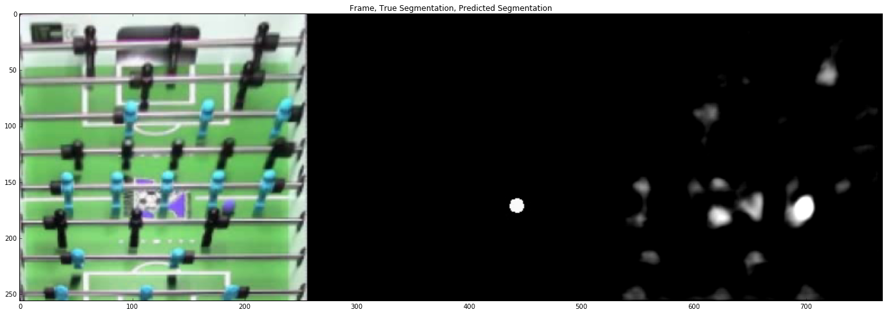


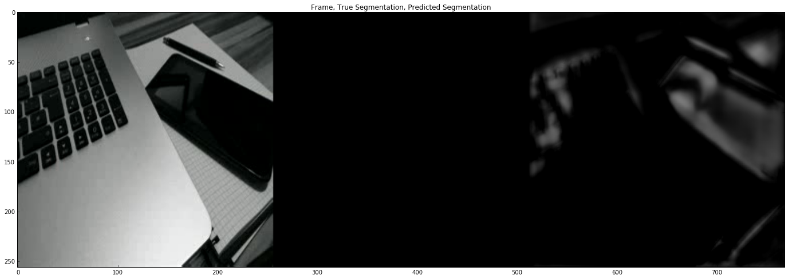


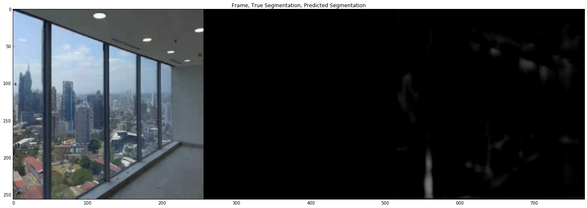


    Wrote model to .\Models\weights_51.hdf
    Epoch 52/52
    

    C:\local\Anaconda3-4.1.1-Windows-x86_64\lib\site-packages\ipykernel\__main__.py:34: UserWarning: Update your `fit_generator` call to the Keras 2 API: `fit_generator(<__main__...., 200, validation_steps=5, verbose=1, class_weight=None, epochs=52, callbacks=None, validation_data=<__main__...., initial_epoch=51, use_multiprocessing=False, max_queue_size=50, workers=50)`
    

    200/200 [==============================] - 227s 1s/step - loss: 3.8173e-04 - balanced_square_error: 3.8173e-04 - mean_squared_error: 0.0222 - val_loss: 8.7005e-05 - val_balanced_square_error: 8.7005e-05 - val_mean_squared_error: 0.0159
    Wrote model to .\Models\weights_52.hdf
    Epoch 53/53
    

    C:\local\Anaconda3-4.1.1-Windows-x86_64\lib\site-packages\ipykernel\__main__.py:34: UserWarning: Update your `fit_generator` call to the Keras 2 API: `fit_generator(<__main__...., 200, validation_steps=5, verbose=1, class_weight=None, epochs=53, callbacks=None, validation_data=<__main__...., initial_epoch=52, use_multiprocessing=False, max_queue_size=50, workers=50)`
    

    200/200 [==============================] - 227s 1s/step - loss: 3.8823e-04 - balanced_square_error: 3.8823e-04 - mean_squared_error: 0.0201 - val_loss: 3.3800e-04 - val_balanced_square_error: 3.3800e-04 - val_mean_squared_error: 0.0837
    Wrote model to .\Models\weights_53.hdf
    Epoch 54/54
    

    C:\local\Anaconda3-4.1.1-Windows-x86_64\lib\site-packages\ipykernel\__main__.py:34: UserWarning: Update your `fit_generator` call to the Keras 2 API: `fit_generator(<__main__...., 200, validation_steps=5, verbose=1, class_weight=None, epochs=54, callbacks=None, validation_data=<__main__...., initial_epoch=53, use_multiprocessing=False, max_queue_size=50, workers=50)`
    

    200/200 [==============================] - 227s 1s/step - loss: 2.6947e-04 - balanced_square_error: 2.6947e-04 - mean_squared_error: 0.0178 - val_loss: 1.4783e-04 - val_balanced_square_error: 1.4783e-04 - val_mean_squared_error: 0.0382
    Wrote model to .\Models\weights_54.hdf
    Epoch 55/55
    

    C:\local\Anaconda3-4.1.1-Windows-x86_64\lib\site-packages\ipykernel\__main__.py:34: UserWarning: Update your `fit_generator` call to the Keras 2 API: `fit_generator(<__main__...., 200, validation_steps=5, verbose=1, class_weight=None, epochs=55, callbacks=None, validation_data=<__main__...., initial_epoch=54, use_multiprocessing=False, max_queue_size=50, workers=50)`
    

    200/200 [==============================] - 229s 1s/step - loss: 4.6504e-04 - balanced_square_error: 4.6504e-04 - mean_squared_error: 0.0201 - val_loss: 6.2566e-05 - val_balanced_square_error: 6.2566e-05 - val_mean_squared_error: 0.0169
    Wrote model to .\Models\weights_55.hdf
    Epoch 56/56
    

    C:\local\Anaconda3-4.1.1-Windows-x86_64\lib\site-packages\ipykernel\__main__.py:34: UserWarning: Update your `fit_generator` call to the Keras 2 API: `fit_generator(<__main__...., 200, validation_steps=5, verbose=1, class_weight=None, epochs=56, callbacks=None, validation_data=<__main__...., initial_epoch=55, use_multiprocessing=False, max_queue_size=50, workers=50)`
    

    200/200 [==============================] - 227s 1s/step - loss: 3.4029e-04 - balanced_square_error: 3.4029e-04 - mean_squared_error: 0.0181 - val_loss: 1.0163e-04 - val_balanced_square_error: 1.0163e-04 - val_mean_squared_error: 0.0096
    


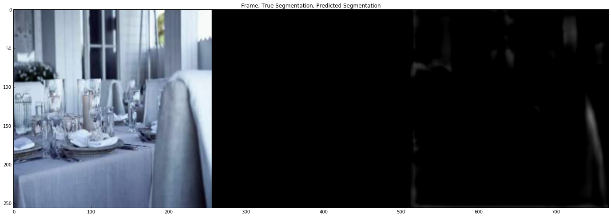


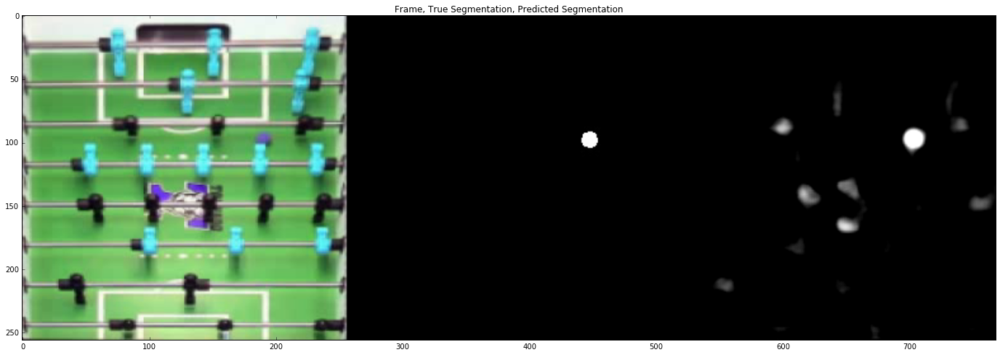


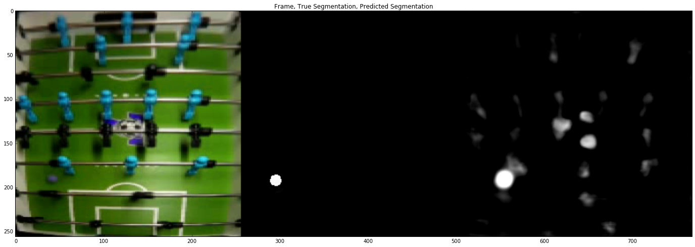


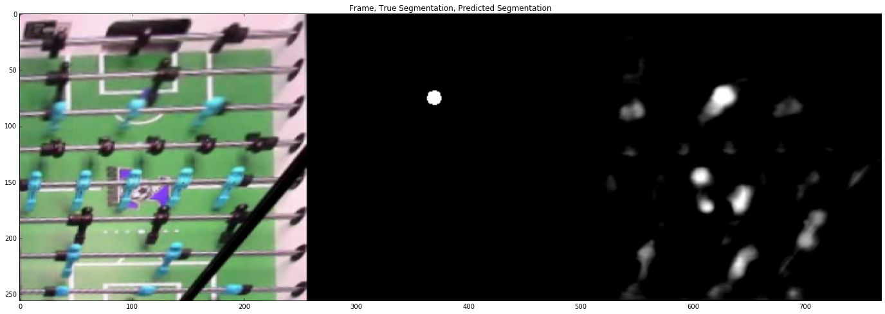


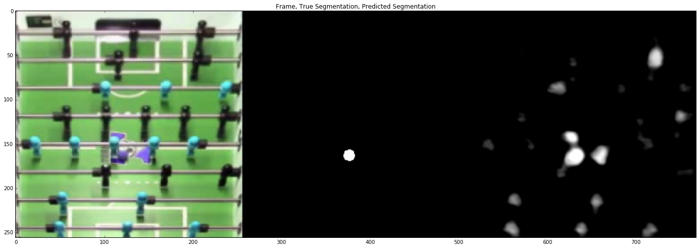


    Wrote model to .\Models\weights_56.hdf
    Epoch 57/57
    

    C:\local\Anaconda3-4.1.1-Windows-x86_64\lib\site-packages\ipykernel\__main__.py:34: UserWarning: Update your `fit_generator` call to the Keras 2 API: `fit_generator(<__main__...., 200, validation_steps=5, verbose=1, class_weight=None, epochs=57, callbacks=None, validation_data=<__main__...., initial_epoch=56, use_multiprocessing=False, max_queue_size=50, workers=50)`
    

    200/200 [==============================] - 227s 1s/step - loss: 3.2655e-04 - balanced_square_error: 3.2655e-04 - mean_squared_error: 0.0188 - val_loss: 8.9801e-05 - val_balanced_square_error: 8.9801e-05 - val_mean_squared_error: 0.0140
    Wrote model to .\Models\weights_57.hdf
    Epoch 58/58
    

    C:\local\Anaconda3-4.1.1-Windows-x86_64\lib\site-packages\ipykernel\__main__.py:34: UserWarning: Update your `fit_generator` call to the Keras 2 API: `fit_generator(<__main__...., 200, validation_steps=5, verbose=1, class_weight=None, epochs=58, callbacks=None, validation_data=<__main__...., initial_epoch=57, use_multiprocessing=False, max_queue_size=50, workers=50)`
    

    200/200 [==============================] - 227s 1s/step - loss: 2.2398e-04 - balanced_square_error: 2.2398e-04 - mean_squared_error: 0.0174 - val_loss: 1.0466e-04 - val_balanced_square_error: 1.0466e-04 - val_mean_squared_error: 0.0094
    Wrote model to .\Models\weights_58.hdf
    Epoch 59/59
    

    C:\local\Anaconda3-4.1.1-Windows-x86_64\lib\site-packages\ipykernel\__main__.py:34: UserWarning: Update your `fit_generator` call to the Keras 2 API: `fit_generator(<__main__...., 200, validation_steps=5, verbose=1, class_weight=None, epochs=59, callbacks=None, validation_data=<__main__...., initial_epoch=58, use_multiprocessing=False, max_queue_size=50, workers=50)`
    

    200/200 [==============================] - 227s 1s/step - loss: 3.2883e-04 - balanced_square_error: 3.2883e-04 - mean_squared_error: 0.0176 - val_loss: 7.4220e-05 - val_balanced_square_error: 7.4220e-05 - val_mean_squared_error: 0.0171
    Wrote model to .\Models\weights_59.hdf
    Epoch 60/60
    

    C:\local\Anaconda3-4.1.1-Windows-x86_64\lib\site-packages\ipykernel\__main__.py:34: UserWarning: Update your `fit_generator` call to the Keras 2 API: `fit_generator(<__main__...., 200, validation_steps=5, verbose=1, class_weight=None, epochs=60, callbacks=None, validation_data=<__main__...., initial_epoch=59, use_multiprocessing=False, max_queue_size=50, workers=50)`
    

    200/200 [==============================] - 226s 1s/step - loss: 1.6118e-04 - balanced_square_error: 1.6118e-04 - mean_squared_error: 0.0160 - val_loss: 5.6091e-05 - val_balanced_square_error: 5.6091e-05 - val_mean_squared_error: 0.0093
    Wrote model to .\Models\weights_60.hdf
    


```python
def balanced_square_error(y_true, y_pred):
    above_loss = 0.03 * K.mean( K.square( K.clip(y_pred - y_true, 0.0, 100000) ) , axis=-1)
    below_loss = K.mean( K.square( K.clip(y_pred - y_true, -100000, 0.0) ) , axis=-1)
    return above_loss + below_loss

#frame_prediction_model = keras.models.load_model(MODELS_FNAME % 16, custom_objects={'balanced_square_error': balanced_square_error})

frame_prediction_model.compile(optimizer=keras.optimizers.RMSprop(lr=0.00001),
              loss=balanced_square_error,
              metrics=[balanced_square_error,mean_squared_error])

# Was ran on the above simple model, not pre-trained Inceptionv3 run.
#epoch = 17
#batches_validation_per_epoch = 50
#batches_training_per_epoch = 400
batch_size = 10
batches_training_per_epoch = 200
batches_validation_per_epoch = 5
print("Batch size %i: %i training batches, %i validation batches" % (batch_size, batches_training_per_epoch, batches_validation_per_epoch) )
WEIGHTS_FNAME = '.\\Models\\weights_%i.hdf'
MODELS_FNAME = '.\\Models\\models_%i.h5'


for i in range(60):
    frame_prediction_model.fit_generator(
        TrainBatchGen(batch_size, training=training),
        batches_training_per_epoch,
        epochs=epoch+1,
        verbose=1,
        callbacks=None,
        class_weight=None,
        max_q_size=50,
        workers=50,
        validation_data=TrainBatchGen(batch_size, validation),
        validation_steps = batches_validation_per_epoch,
        pickle_safe=False,
        initial_epoch=epoch)
    
    epoch += 1
    
    # Plot occasional validation data plot
    if i % 5 == 0:
        plot_validate(TrainBatchGen(batch_size, validation), frame_prediction_model, 50, "Epoch validation results %i" % epoch)
    
    # Save the model
    frame_prediction_model.save_weights(WEIGHTS_FNAME % epoch)
    frame_prediction_model.save(MODELS_FNAME % epoch)
    print(("Wrote model to " + WEIGHTS_FNAME )  % epoch)

```

    Batch size 10: 200 training batches, 5 validation batches
    

    C:\local\Anaconda3-4.1.1-Windows-x86_64\lib\site-packages\ipykernel\__main__.py:37: UserWarning: Update your `fit_generator` call to the Keras 2 API: `fit_generator(<__main__...., 200, validation_steps=5, verbose=1, class_weight=None, epochs=61, callbacks=None, validation_data=<__main__...., initial_epoch=60, use_multiprocessing=False, max_queue_size=50, workers=50)`
    

    Epoch 61/61
    200/200 [==============================] - 224s 1s/step - loss: 5.2426e-04 - balanced_square_error: 5.2426e-04 - mean_squared_error: 0.0041 - val_loss: 1.4559e-04 - val_balanced_square_error: 1.4559e-04 - val_mean_squared_error: 0.0035
    


    Wrote model to .\Models\weights_61.hdf
    Epoch 62/62
    

    C:\local\Anaconda3-4.1.1-Windows-x86_64\lib\site-packages\ipykernel\__main__.py:37: UserWarning: Update your `fit_generator` call to the Keras 2 API: `fit_generator(<__main__...., 200, validation_steps=5, verbose=1, class_weight=None, epochs=62, callbacks=None, validation_data=<__main__...., initial_epoch=61, use_multiprocessing=False, max_queue_size=50, workers=50)`
    

    200/200 [==============================] - 224s 1s/step - loss: 5.5906e-04 - balanced_square_error: 5.5906e-04 - mean_squared_error: 0.0035 - val_loss: 2.2407e-04 - val_balanced_square_error: 2.2407e-04 - val_mean_squared_error: 0.0014
    Wrote model to .\Models\weights_62.hdf
    Epoch 63/63
    

    C:\local\Anaconda3-4.1.1-Windows-x86_64\lib\site-packages\ipykernel\__main__.py:37: UserWarning: Update your `fit_generator` call to the Keras 2 API: `fit_generator(<__main__...., 200, validation_steps=5, verbose=1, class_weight=None, epochs=63, callbacks=None, validation_data=<__main__...., initial_epoch=62, use_multiprocessing=False, max_queue_size=50, workers=50)`
    

    200/200 [==============================] - 223s 1s/step - loss: 4.3203e-04 - balanced_square_error: 4.3203e-04 - mean_squared_error: 0.0034 - val_loss: 0.0020 - val_balanced_square_error: 0.0020 - val_mean_squared_error: 0.0052
    Wrote model to .\Models\weights_63.hdf
    Epoch 64/64
    

    C:\local\Anaconda3-4.1.1-Windows-x86_64\lib\site-packages\ipykernel\__main__.py:37: UserWarning: Update your `fit_generator` call to the Keras 2 API: `fit_generator(<__main__...., 200, validation_steps=5, verbose=1, class_weight=None, epochs=64, callbacks=None, validation_data=<__main__...., initial_epoch=63, use_multiprocessing=False, max_queue_size=50, workers=50)`
    

    200/200 [==============================] - 223s 1s/step - loss: 4.6024e-04 - balanced_square_error: 4.6024e-04 - mean_squared_error: 0.0032 - val_loss: 1.7897e-04 - val_balanced_square_error: 1.7897e-04 - val_mean_squared_error: 0.0027
    Wrote model to .\Models\weights_64.hdf
    Epoch 65/65
    

    C:\local\Anaconda3-4.1.1-Windows-x86_64\lib\site-packages\ipykernel\__main__.py:37: UserWarning: Update your `fit_generator` call to the Keras 2 API: `fit_generator(<__main__...., 200, validation_steps=5, verbose=1, class_weight=None, epochs=65, callbacks=None, validation_data=<__main__...., initial_epoch=64, use_multiprocessing=False, max_queue_size=50, workers=50)`
    

    200/200 [==============================] - 223s 1s/step - loss: 5.7027e-04 - balanced_square_error: 5.7027e-04 - mean_squared_error: 0.0036 - val_loss: 2.2890e-04 - val_balanced_square_error: 2.2890e-04 - val_mean_squared_error: 0.0023
    Wrote model to .\Models\weights_65.hdf
    Epoch 66/66
    

    C:\local\Anaconda3-4.1.1-Windows-x86_64\lib\site-packages\ipykernel\__main__.py:37: UserWarning: Update your `fit_generator` call to the Keras 2 API: `fit_generator(<__main__...., 200, validation_steps=5, verbose=1, class_weight=None, epochs=66, callbacks=None, validation_data=<__main__...., initial_epoch=65, use_multiprocessing=False, max_queue_size=50, workers=50)`
    

    200/200 [==============================] - 223s 1s/step - loss: 4.0873e-04 - balanced_square_error: 4.0873e-04 - mean_squared_error: 0.0032 - val_loss: 1.4181e-04 - val_balanced_square_error: 1.4181e-04 - val_mean_squared_error: 0.0016
    


    Wrote model to .\Models\weights_66.hdf
    Epoch 67/67
    

    C:\local\Anaconda3-4.1.1-Windows-x86_64\lib\site-packages\ipykernel\__main__.py:37: UserWarning: Update your `fit_generator` call to the Keras 2 API: `fit_generator(<__main__...., 200, validation_steps=5, verbose=1, class_weight=None, epochs=67, callbacks=None, validation_data=<__main__...., initial_epoch=66, use_multiprocessing=False, max_queue_size=50, workers=50)`
    

    200/200 [==============================] - 223s 1s/step - loss: 3.5609e-04 - balanced_square_error: 3.5609e-04 - mean_squared_error: 0.0031 - val_loss: 3.3231e-04 - val_balanced_square_error: 3.3231e-04 - val_mean_squared_error: 0.0028
    Wrote model to .\Models\weights_67.hdf
    Epoch 68/68
    

    C:\local\Anaconda3-4.1.1-Windows-x86_64\lib\site-packages\ipykernel\__main__.py:37: UserWarning: Update your `fit_generator` call to the Keras 2 API: `fit_generator(<__main__...., 200, validation_steps=5, verbose=1, class_weight=None, epochs=68, callbacks=None, validation_data=<__main__...., initial_epoch=67, use_multiprocessing=False, max_queue_size=50, workers=50)`
    

    200/200 [==============================] - 222s 1s/step - loss: 2.9936e-04 - balanced_square_error: 2.9936e-04 - mean_squared_error: 0.0028 - val_loss: 1.6969e-04 - val_balanced_square_error: 1.6969e-04 - val_mean_squared_error: 0.0024
    Wrote model to .\Models\weights_68.hdf
    Epoch 69/69
    

    C:\local\Anaconda3-4.1.1-Windows-x86_64\lib\site-packages\ipykernel\__main__.py:37: UserWarning: Update your `fit_generator` call to the Keras 2 API: `fit_generator(<__main__...., 200, validation_steps=5, verbose=1, class_weight=None, epochs=69, callbacks=None, validation_data=<__main__...., initial_epoch=68, use_multiprocessing=False, max_queue_size=50, workers=50)`
    

    200/200 [==============================] - 223s 1s/step - loss: 5.7773e-04 - balanced_square_error: 5.7773e-04 - mean_squared_error: 0.0034 - val_loss: 1.9389e-04 - val_balanced_square_error: 1.9389e-04 - val_mean_squared_error: 0.0017
    Wrote model to .\Models\weights_69.hdf
    Epoch 70/70
    

    C:\local\Anaconda3-4.1.1-Windows-x86_64\lib\site-packages\ipykernel\__main__.py:37: UserWarning: Update your `fit_generator` call to the Keras 2 API: `fit_generator(<__main__...., 200, validation_steps=5, verbose=1, class_weight=None, epochs=70, callbacks=None, validation_data=<__main__...., initial_epoch=69, use_multiprocessing=False, max_queue_size=50, workers=50)`
    

    200/200 [==============================] - 223s 1s/step - loss: 4.1744e-04 - balanced_square_error: 4.1744e-04 - mean_squared_error: 0.0029 - val_loss: 1.1308e-04 - val_balanced_square_error: 1.1308e-04 - val_mean_squared_error: 0.0017
    Wrote model to .\Models\weights_70.hdf
    Epoch 71/71
    

    C:\local\Anaconda3-4.1.1-Windows-x86_64\lib\site-packages\ipykernel\__main__.py:37: UserWarning: Update your `fit_generator` call to the Keras 2 API: `fit_generator(<__main__...., 200, validation_steps=5, verbose=1, class_weight=None, epochs=71, callbacks=None, validation_data=<__main__...., initial_epoch=70, use_multiprocessing=False, max_queue_size=50, workers=50)`
    

    200/200 [==============================] - 223s 1s/step - loss: 4.2117e-04 - balanced_square_error: 4.2117e-04 - mean_squared_error: 0.0029 - val_loss: 2.5030e-04 - val_balanced_square_error: 2.5030e-04 - val_mean_squared_error: 0.0022
    


    Wrote model to .\Models\weights_71.hdf
    Epoch 72/72
    

    C:\local\Anaconda3-4.1.1-Windows-x86_64\lib\site-packages\ipykernel\__main__.py:37: UserWarning: Update your `fit_generator` call to the Keras 2 API: `fit_generator(<__main__...., 200, validation_steps=5, verbose=1, class_weight=None, epochs=72, callbacks=None, validation_data=<__main__...., initial_epoch=71, use_multiprocessing=False, max_queue_size=50, workers=50)`
    

    200/200 [==============================] - 223s 1s/step - loss: 3.6179e-04 - balanced_square_error: 3.6179e-04 - mean_squared_error: 0.0027 - val_loss: 2.4483e-04 - val_balanced_square_error: 2.4483e-04 - val_mean_squared_error: 0.0015
    Wrote model to .\Models\weights_72.hdf
    Epoch 73/73
    

    C:\local\Anaconda3-4.1.1-Windows-x86_64\lib\site-packages\ipykernel\__main__.py:37: UserWarning: Update your `fit_generator` call to the Keras 2 API: `fit_generator(<__main__...., 200, validation_steps=5, verbose=1, class_weight=None, epochs=73, callbacks=None, validation_data=<__main__...., initial_epoch=72, use_multiprocessing=False, max_queue_size=50, workers=50)`
    

    200/200 [==============================] - 223s 1s/step - loss: 4.0139e-04 - balanced_square_error: 4.0139e-04 - mean_squared_error: 0.0029 - val_loss: 1.8528e-04 - val_balanced_square_error: 1.8528e-04 - val_mean_squared_error: 0.0043
    Wrote model to .\Models\weights_73.hdf
    Epoch 74/74
    

    C:\local\Anaconda3-4.1.1-Windows-x86_64\lib\site-packages\ipykernel\__main__.py:37: UserWarning: Update your `fit_generator` call to the Keras 2 API: `fit_generator(<__main__...., 200, validation_steps=5, verbose=1, class_weight=None, epochs=74, callbacks=None, validation_data=<__main__...., initial_epoch=73, use_multiprocessing=False, max_queue_size=50, workers=50)`
    

    200/200 [==============================] - 223s 1s/step - loss: 4.6361e-04 - balanced_square_error: 4.6361e-04 - mean_squared_error: 0.0029 - val_loss: 2.5141e-04 - val_balanced_square_error: 2.5141e-04 - val_mean_squared_error: 0.0017
    Wrote model to .\Models\weights_74.hdf
    Epoch 75/75
    

    C:\local\Anaconda3-4.1.1-Windows-x86_64\lib\site-packages\ipykernel\__main__.py:37: UserWarning: Update your `fit_generator` call to the Keras 2 API: `fit_generator(<__main__...., 200, validation_steps=5, verbose=1, class_weight=None, epochs=75, callbacks=None, validation_data=<__main__...., initial_epoch=74, use_multiprocessing=False, max_queue_size=50, workers=50)`
    

    200/200 [==============================] - 223s 1s/step - loss: 2.2815e-04 - balanced_square_error: 2.2815e-04 - mean_squared_error: 0.0025 - val_loss: 1.8794e-04 - val_balanced_square_error: 1.8794e-04 - val_mean_squared_error: 0.0014
    Wrote model to .\Models\weights_75.hdf
    Epoch 76/76
    

    C:\local\Anaconda3-4.1.1-Windows-x86_64\lib\site-packages\ipykernel\__main__.py:37: UserWarning: Update your `fit_generator` call to the Keras 2 API: `fit_generator(<__main__...., 200, validation_steps=5, verbose=1, class_weight=None, epochs=76, callbacks=None, validation_data=<__main__...., initial_epoch=75, use_multiprocessing=False, max_queue_size=50, workers=50)`
    

    200/200 [==============================] - 223s 1s/step - loss: 5.0354e-04 - balanced_square_error: 5.0354e-04 - mean_squared_error: 0.0028 - val_loss: 1.0495e-04 - val_balanced_square_error: 1.0495e-04 - val_mean_squared_error: 0.0026
    


    Wrote model to .\Models\weights_76.hdf
    Epoch 77/77
    

    C:\local\Anaconda3-4.1.1-Windows-x86_64\lib\site-packages\ipykernel\__main__.py:37: UserWarning: Update your `fit_generator` call to the Keras 2 API: `fit_generator(<__main__...., 200, validation_steps=5, verbose=1, class_weight=None, epochs=77, callbacks=None, validation_data=<__main__...., initial_epoch=76, use_multiprocessing=False, max_queue_size=50, workers=50)`
    

    200/200 [==============================] - 222s 1s/step - loss: 4.8421e-04 - balanced_square_error: 4.8421e-04 - mean_squared_error: 0.0028 - val_loss: 2.7085e-04 - val_balanced_square_error: 2.7085e-04 - val_mean_squared_error: 0.0044
    Wrote model to .\Models\weights_77.hdf
    Epoch 78/78
    

    C:\local\Anaconda3-4.1.1-Windows-x86_64\lib\site-packages\ipykernel\__main__.py:37: UserWarning: Update your `fit_generator` call to the Keras 2 API: `fit_generator(<__main__...., 200, validation_steps=5, verbose=1, class_weight=None, epochs=78, callbacks=None, validation_data=<__main__...., initial_epoch=77, use_multiprocessing=False, max_queue_size=50, workers=50)`
    

    200/200 [==============================] - 223s 1s/step - loss: 3.0924e-04 - balanced_square_error: 3.0924e-04 - mean_squared_error: 0.0026 - val_loss: 1.9354e-04 - val_balanced_square_error: 1.9354e-04 - val_mean_squared_error: 0.0020
    Wrote model to .\Models\weights_78.hdf
    Epoch 79/79
    

    C:\local\Anaconda3-4.1.1-Windows-x86_64\lib\site-packages\ipykernel\__main__.py:37: UserWarning: Update your `fit_generator` call to the Keras 2 API: `fit_generator(<__main__...., 200, validation_steps=5, verbose=1, class_weight=None, epochs=79, callbacks=None, validation_data=<__main__...., initial_epoch=78, use_multiprocessing=False, max_queue_size=50, workers=50)`
    

    200/200 [==============================] - 222s 1s/step - loss: 3.5677e-04 - balanced_square_error: 3.5677e-04 - mean_squared_error: 0.0026 - val_loss: 2.5963e-04 - val_balanced_square_error: 2.5963e-04 - val_mean_squared_error: 0.0014
    Wrote model to .\Models\weights_79.hdf
    Epoch 80/80
    

    C:\local\Anaconda3-4.1.1-Windows-x86_64\lib\site-packages\ipykernel\__main__.py:37: UserWarning: Update your `fit_generator` call to the Keras 2 API: `fit_generator(<__main__...., 200, validation_steps=5, verbose=1, class_weight=None, epochs=80, callbacks=None, validation_data=<__main__...., initial_epoch=79, use_multiprocessing=False, max_queue_size=50, workers=50)`
    

    200/200 [==============================] - 223s 1s/step - loss: 3.8101e-04 - balanced_square_error: 3.8101e-04 - mean_squared_error: 0.0026 - val_loss: 4.4295e-04 - val_balanced_square_error: 4.4295e-04 - val_mean_squared_error: 0.0030
    Wrote model to .\Models\weights_80.hdf
    Epoch 81/81
    

    C:\local\Anaconda3-4.1.1-Windows-x86_64\lib\site-packages\ipykernel\__main__.py:37: UserWarning: Update your `fit_generator` call to the Keras 2 API: `fit_generator(<__main__...., 200, validation_steps=5, verbose=1, class_weight=None, epochs=81, callbacks=None, validation_data=<__main__...., initial_epoch=80, use_multiprocessing=False, max_queue_size=50, workers=50)`
    

    200/200 [==============================] - 222s 1s/step - loss: 4.2072e-04 - balanced_square_error: 4.2072e-04 - mean_squared_error: 0.0027 - val_loss: 1.3117e-04 - val_balanced_square_error: 1.3117e-04 - val_mean_squared_error: 0.0036
    


    Wrote model to .\Models\weights_81.hdf
    Epoch 82/82
    

    C:\local\Anaconda3-4.1.1-Windows-x86_64\lib\site-packages\ipykernel\__main__.py:37: UserWarning: Update your `fit_generator` call to the Keras 2 API: `fit_generator(<__main__...., 200, validation_steps=5, verbose=1, class_weight=None, epochs=82, callbacks=None, validation_data=<__main__...., initial_epoch=81, use_multiprocessing=False, max_queue_size=50, workers=50)`
    

    200/200 [==============================] - 223s 1s/step - loss: 2.9807e-04 - balanced_square_error: 2.9807e-04 - mean_squared_error: 0.0024 - val_loss: 1.5316e-04 - val_balanced_square_error: 1.5316e-04 - val_mean_squared_error: 0.0012
    Wrote model to .\Models\weights_82.hdf
    Epoch 83/83
    

    C:\local\Anaconda3-4.1.1-Windows-x86_64\lib\site-packages\ipykernel\__main__.py:37: UserWarning: Update your `fit_generator` call to the Keras 2 API: `fit_generator(<__main__...., 200, validation_steps=5, verbose=1, class_weight=None, epochs=83, callbacks=None, validation_data=<__main__...., initial_epoch=82, use_multiprocessing=False, max_queue_size=50, workers=50)`
    

    200/200 [==============================] - 223s 1s/step - loss: 5.2062e-04 - balanced_square_error: 5.2062e-04 - mean_squared_error: 0.0027 - val_loss: 0.0062 - val_balanced_square_error: 0.0062 - val_mean_squared_error: 0.0088
    Wrote model to .\Models\weights_83.hdf
    Epoch 84/84
    

    C:\local\Anaconda3-4.1.1-Windows-x86_64\lib\site-packages\ipykernel\__main__.py:37: UserWarning: Update your `fit_generator` call to the Keras 2 API: `fit_generator(<__main__...., 200, validation_steps=5, verbose=1, class_weight=None, epochs=84, callbacks=None, validation_data=<__main__...., initial_epoch=83, use_multiprocessing=False, max_queue_size=50, workers=50)`
    

    200/200 [==============================] - 223s 1s/step - loss: 5.5396e-04 - balanced_square_error: 5.5396e-04 - mean_squared_error: 0.0027 - val_loss: 1.6258e-04 - val_balanced_square_error: 1.6258e-04 - val_mean_squared_error: 0.0034
    Wrote model to .\Models\weights_84.hdf
    Epoch 85/85
    

    C:\local\Anaconda3-4.1.1-Windows-x86_64\lib\site-packages\ipykernel\__main__.py:37: UserWarning: Update your `fit_generator` call to the Keras 2 API: `fit_generator(<__main__...., 200, validation_steps=5, verbose=1, class_weight=None, epochs=85, callbacks=None, validation_data=<__main__...., initial_epoch=84, use_multiprocessing=False, max_queue_size=50, workers=50)`
    

    200/200 [==============================] - 223s 1s/step - loss: 5.0675e-04 - balanced_square_error: 5.0675e-04 - mean_squared_error: 0.0025 - val_loss: 1.4117e-04 - val_balanced_square_error: 1.4117e-04 - val_mean_squared_error: 0.0027
    Wrote model to .\Models\weights_85.hdf
    Epoch 86/86
    

    C:\local\Anaconda3-4.1.1-Windows-x86_64\lib\site-packages\ipykernel\__main__.py:37: UserWarning: Update your `fit_generator` call to the Keras 2 API: `fit_generator(<__main__...., 200, validation_steps=5, verbose=1, class_weight=None, epochs=86, callbacks=None, validation_data=<__main__...., initial_epoch=85, use_multiprocessing=False, max_queue_size=50, workers=50)`
    

    200/200 [==============================] - 223s 1s/step - loss: 2.0633e-04 - balanced_square_error: 2.0633e-04 - mean_squared_error: 0.0022 - val_loss: 1.1546e-04 - val_balanced_square_error: 1.1546e-04 - val_mean_squared_error: 0.0019
    


    Wrote model to .\Models\weights_86.hdf
    Epoch 87/87
    

    C:\local\Anaconda3-4.1.1-Windows-x86_64\lib\site-packages\ipykernel\__main__.py:37: UserWarning: Update your `fit_generator` call to the Keras 2 API: `fit_generator(<__main__...., 200, validation_steps=5, verbose=1, class_weight=None, epochs=87, callbacks=None, validation_data=<__main__...., initial_epoch=86, use_multiprocessing=False, max_queue_size=50, workers=50)`
    

    200/200 [==============================] - 222s 1s/step - loss: 5.4275e-04 - balanced_square_error: 5.4275e-04 - mean_squared_error: 0.0025 - val_loss: 8.5275e-05 - val_balanced_square_error: 8.5275e-05 - val_mean_squared_error: 9.1953e-04
    Wrote model to .\Models\weights_87.hdf
    Epoch 88/88
    

    C:\local\Anaconda3-4.1.1-Windows-x86_64\lib\site-packages\ipykernel\__main__.py:37: UserWarning: Update your `fit_generator` call to the Keras 2 API: `fit_generator(<__main__...., 200, validation_steps=5, verbose=1, class_weight=None, epochs=88, callbacks=None, validation_data=<__main__...., initial_epoch=87, use_multiprocessing=False, max_queue_size=50, workers=50)`
    

    200/200 [==============================] - 222s 1s/step - loss: 3.8637e-04 - balanced_square_error: 3.8637e-04 - mean_squared_error: 0.0024 - val_loss: 1.2387e-04 - val_balanced_square_error: 1.2387e-04 - val_mean_squared_error: 0.0023
    Wrote model to .\Models\weights_88.hdf
    Epoch 89/89
    

    C:\local\Anaconda3-4.1.1-Windows-x86_64\lib\site-packages\ipykernel\__main__.py:37: UserWarning: Update your `fit_generator` call to the Keras 2 API: `fit_generator(<__main__...., 200, validation_steps=5, verbose=1, class_weight=None, epochs=89, callbacks=None, validation_data=<__main__...., initial_epoch=88, use_multiprocessing=False, max_queue_size=50, workers=50)`
    

    200/200 [==============================] - 223s 1s/step - loss: 1.9546e-04 - balanced_square_error: 1.9546e-04 - mean_squared_error: 0.0021 - val_loss: 1.1829e-04 - val_balanced_square_error: 1.1829e-04 - val_mean_squared_error: 0.0019
    Wrote model to .\Models\weights_89.hdf
    Epoch 90/90
    

    C:\local\Anaconda3-4.1.1-Windows-x86_64\lib\site-packages\ipykernel\__main__.py:37: UserWarning: Update your `fit_generator` call to the Keras 2 API: `fit_generator(<__main__...., 200, validation_steps=5, verbose=1, class_weight=None, epochs=90, callbacks=None, validation_data=<__main__...., initial_epoch=89, use_multiprocessing=False, max_queue_size=50, workers=50)`
    

    200/200 [==============================] - 223s 1s/step - loss: 5.5688e-04 - balanced_square_error: 5.5688e-04 - mean_squared_error: 0.0025 - val_loss: 0.0010 - val_balanced_square_error: 0.0010 - val_mean_squared_error: 0.0024
    Wrote model to .\Models\weights_90.hdf
    Epoch 91/91
    

    C:\local\Anaconda3-4.1.1-Windows-x86_64\lib\site-packages\ipykernel\__main__.py:37: UserWarning: Update your `fit_generator` call to the Keras 2 API: `fit_generator(<__main__...., 200, validation_steps=5, verbose=1, class_weight=None, epochs=91, callbacks=None, validation_data=<__main__...., initial_epoch=90, use_multiprocessing=False, max_queue_size=50, workers=50)`
    

    200/200 [==============================] - 223s 1s/step - loss: 4.3091e-04 - balanced_square_error: 4.3091e-04 - mean_squared_error: 0.0024 - val_loss: 6.1743e-04 - val_balanced_square_error: 6.1743e-04 - val_mean_squared_error: 0.0014
    


    Wrote model to .\Models\weights_91.hdf
    Epoch 92/92
    

    C:\local\Anaconda3-4.1.1-Windows-x86_64\lib\site-packages\ipykernel\__main__.py:37: UserWarning: Update your `fit_generator` call to the Keras 2 API: `fit_generator(<__main__...., 200, validation_steps=5, verbose=1, class_weight=None, epochs=92, callbacks=None, validation_data=<__main__...., initial_epoch=91, use_multiprocessing=False, max_queue_size=50, workers=50)`
    

    200/200 [==============================] - 223s 1s/step - loss: 2.5413e-04 - balanced_square_error: 2.5413e-04 - mean_squared_error: 0.0021 - val_loss: 1.0305e-04 - val_balanced_square_error: 1.0305e-04 - val_mean_squared_error: 0.0011
    Wrote model to .\Models\weights_92.hdf
    Epoch 93/93
    

    C:\local\Anaconda3-4.1.1-Windows-x86_64\lib\site-packages\ipykernel\__main__.py:37: UserWarning: Update your `fit_generator` call to the Keras 2 API: `fit_generator(<__main__...., 200, validation_steps=5, verbose=1, class_weight=None, epochs=93, callbacks=None, validation_data=<__main__...., initial_epoch=92, use_multiprocessing=False, max_queue_size=50, workers=50)`
    

    200/200 [==============================] - 223s 1s/step - loss: 2.2246e-04 - balanced_square_error: 2.2246e-04 - mean_squared_error: 0.0021 - val_loss: 1.0354e-04 - val_balanced_square_error: 1.0354e-04 - val_mean_squared_error: 0.0011
    Wrote model to .\Models\weights_93.hdf
    Epoch 94/94
    

    C:\local\Anaconda3-4.1.1-Windows-x86_64\lib\site-packages\ipykernel\__main__.py:37: UserWarning: Update your `fit_generator` call to the Keras 2 API: `fit_generator(<__main__...., 200, validation_steps=5, verbose=1, class_weight=None, epochs=94, callbacks=None, validation_data=<__main__...., initial_epoch=93, use_multiprocessing=False, max_queue_size=50, workers=50)`
    

    200/200 [==============================] - 223s 1s/step - loss: 4.3503e-04 - balanced_square_error: 4.3503e-04 - mean_squared_error: 0.0023 - val_loss: 1.0015e-04 - val_balanced_square_error: 1.0015e-04 - val_mean_squared_error: 0.0013
    Wrote model to .\Models\weights_94.hdf
    Epoch 95/95
    

    C:\local\Anaconda3-4.1.1-Windows-x86_64\lib\site-packages\ipykernel\__main__.py:37: UserWarning: Update your `fit_generator` call to the Keras 2 API: `fit_generator(<__main__...., 200, validation_steps=5, verbose=1, class_weight=None, epochs=95, callbacks=None, validation_data=<__main__...., initial_epoch=94, use_multiprocessing=False, max_queue_size=50, workers=50)`
    

    200/200 [==============================] - 222s 1s/step - loss: 3.1424e-04 - balanced_square_error: 3.1424e-04 - mean_squared_error: 0.0022 - val_loss: 1.4526e-04 - val_balanced_square_error: 1.4526e-04 - val_mean_squared_error: 0.0032
    Wrote model to .\Models\weights_95.hdf
    Epoch 96/96
    

    C:\local\Anaconda3-4.1.1-Windows-x86_64\lib\site-packages\ipykernel\__main__.py:37: UserWarning: Update your `fit_generator` call to the Keras 2 API: `fit_generator(<__main__...., 200, validation_steps=5, verbose=1, class_weight=None, epochs=96, callbacks=None, validation_data=<__main__...., initial_epoch=95, use_multiprocessing=False, max_queue_size=50, workers=50)`
    

    200/200 [==============================] - 223s 1s/step - loss: 4.6284e-04 - balanced_square_error: 4.6284e-04 - mean_squared_error: 0.0023 - val_loss: 2.9532e-04 - val_balanced_square_error: 2.9532e-04 - val_mean_squared_error: 0.0089
    


    Wrote model to .\Models\weights_96.hdf
    Epoch 97/97
    

    C:\local\Anaconda3-4.1.1-Windows-x86_64\lib\site-packages\ipykernel\__main__.py:37: UserWarning: Update your `fit_generator` call to the Keras 2 API: `fit_generator(<__main__...., 200, validation_steps=5, verbose=1, class_weight=None, epochs=97, callbacks=None, validation_data=<__main__...., initial_epoch=96, use_multiprocessing=False, max_queue_size=50, workers=50)`
    

    200/200 [==============================] - 222s 1s/step - loss: 3.3090e-04 - balanced_square_error: 3.3090e-04 - mean_squared_error: 0.0022 - val_loss: 1.1597e-04 - val_balanced_square_error: 1.1597e-04 - val_mean_squared_error: 0.0028
    Wrote model to .\Models\weights_97.hdf
    Epoch 98/98
    

    C:\local\Anaconda3-4.1.1-Windows-x86_64\lib\site-packages\ipykernel\__main__.py:37: UserWarning: Update your `fit_generator` call to the Keras 2 API: `fit_generator(<__main__...., 200, validation_steps=5, verbose=1, class_weight=None, epochs=98, callbacks=None, validation_data=<__main__...., initial_epoch=97, use_multiprocessing=False, max_queue_size=50, workers=50)`
    

    200/200 [==============================] - 223s 1s/step - loss: 5.0436e-04 - balanced_square_error: 5.0436e-04 - mean_squared_error: 0.0024 - val_loss: 7.3348e-05 - val_balanced_square_error: 7.3348e-05 - val_mean_squared_error: 0.0020
    Wrote model to .\Models\weights_98.hdf
    Epoch 99/99
    

    C:\local\Anaconda3-4.1.1-Windows-x86_64\lib\site-packages\ipykernel\__main__.py:37: UserWarning: Update your `fit_generator` call to the Keras 2 API: `fit_generator(<__main__...., 200, validation_steps=5, verbose=1, class_weight=None, epochs=99, callbacks=None, validation_data=<__main__...., initial_epoch=98, use_multiprocessing=False, max_queue_size=50, workers=50)`
    

    200/200 [==============================] - 223s 1s/step - loss: 2.8356e-04 - balanced_square_error: 2.8356e-04 - mean_squared_error: 0.0022 - val_loss: 1.3047e-04 - val_balanced_square_error: 1.3047e-04 - val_mean_squared_error: 0.0010
    Wrote model to .\Models\weights_99.hdf
    Epoch 100/100
    

    C:\local\Anaconda3-4.1.1-Windows-x86_64\lib\site-packages\ipykernel\__main__.py:37: UserWarning: Update your `fit_generator` call to the Keras 2 API: `fit_generator(<__main__...., 200, validation_steps=5, verbose=1, class_weight=None, epochs=100, callbacks=None, validation_data=<__main__...., initial_epoch=99, use_multiprocessing=False, max_queue_size=50, workers=50)`
    

    200/200 [==============================] - 223s 1s/step - loss: 2.1361e-04 - balanced_square_error: 2.1361e-04 - mean_squared_error: 0.0020 - val_loss: 1.9609e-04 - val_balanced_square_error: 1.9609e-04 - val_mean_squared_error: 0.0055
    Wrote model to .\Models\weights_100.hdf
    Epoch 101/101
    

    C:\local\Anaconda3-4.1.1-Windows-x86_64\lib\site-packages\ipykernel\__main__.py:37: UserWarning: Update your `fit_generator` call to the Keras 2 API: `fit_generator(<__main__...., 200, validation_steps=5, verbose=1, class_weight=None, epochs=101, callbacks=None, validation_data=<__main__...., initial_epoch=100, use_multiprocessing=False, max_queue_size=50, workers=50)`
    

    200/200 [==============================] - 222s 1s/step - loss: 5.3919e-04 - balanced_square_error: 5.3919e-04 - mean_squared_error: 0.0023 - val_loss: 5.2677e-05 - val_balanced_square_error: 5.2677e-05 - val_mean_squared_error: 0.0012
    


    Wrote model to .\Models\weights_101.hdf
    Epoch 102/102
    

    C:\local\Anaconda3-4.1.1-Windows-x86_64\lib\site-packages\ipykernel\__main__.py:37: UserWarning: Update your `fit_generator` call to the Keras 2 API: `fit_generator(<__main__...., 200, validation_steps=5, verbose=1, class_weight=None, epochs=102, callbacks=None, validation_data=<__main__...., initial_epoch=101, use_multiprocessing=False, max_queue_size=50, workers=50)`
    

    200/200 [==============================] - 222s 1s/step - loss: 2.7436e-04 - balanced_square_error: 2.7436e-04 - mean_squared_error: 0.0020 - val_loss: 7.1343e-05 - val_balanced_square_error: 7.1343e-05 - val_mean_squared_error: 0.0012
    Wrote model to .\Models\weights_102.hdf
    Epoch 103/103
    

    C:\local\Anaconda3-4.1.1-Windows-x86_64\lib\site-packages\ipykernel\__main__.py:37: UserWarning: Update your `fit_generator` call to the Keras 2 API: `fit_generator(<__main__...., 200, validation_steps=5, verbose=1, class_weight=None, epochs=103, callbacks=None, validation_data=<__main__...., initial_epoch=102, use_multiprocessing=False, max_queue_size=50, workers=50)`
    

    200/200 [==============================] - 223s 1s/step - loss: 4.5023e-04 - balanced_square_error: 4.5023e-04 - mean_squared_error: 0.0022 - val_loss: 1.2793e-04 - val_balanced_square_error: 1.2793e-04 - val_mean_squared_error: 0.0017
    Wrote model to .\Models\weights_103.hdf
    Epoch 104/104
    

    C:\local\Anaconda3-4.1.1-Windows-x86_64\lib\site-packages\ipykernel\__main__.py:37: UserWarning: Update your `fit_generator` call to the Keras 2 API: `fit_generator(<__main__...., 200, validation_steps=5, verbose=1, class_weight=None, epochs=104, callbacks=None, validation_data=<__main__...., initial_epoch=103, use_multiprocessing=False, max_queue_size=50, workers=50)`
    

    200/200 [==============================] - 223s 1s/step - loss: 3.8084e-04 - balanced_square_error: 3.8084e-04 - mean_squared_error: 0.0021 - val_loss: 1.0063e-04 - val_balanced_square_error: 1.0063e-04 - val_mean_squared_error: 0.0012
    Wrote model to .\Models\weights_104.hdf
    Epoch 105/105
    

    C:\local\Anaconda3-4.1.1-Windows-x86_64\lib\site-packages\ipykernel\__main__.py:37: UserWarning: Update your `fit_generator` call to the Keras 2 API: `fit_generator(<__main__...., 200, validation_steps=5, verbose=1, class_weight=None, epochs=105, callbacks=None, validation_data=<__main__...., initial_epoch=104, use_multiprocessing=False, max_queue_size=50, workers=50)`
    

    200/200 [==============================] - 222s 1s/step - loss: 3.4611e-04 - balanced_square_error: 3.4611e-04 - mean_squared_error: 0.0021 - val_loss: 2.3992e-04 - val_balanced_square_error: 2.3992e-04 - val_mean_squared_error: 0.0038
    Wrote model to .\Models\weights_105.hdf
    Epoch 106/106
    

    C:\local\Anaconda3-4.1.1-Windows-x86_64\lib\site-packages\ipykernel\__main__.py:37: UserWarning: Update your `fit_generator` call to the Keras 2 API: `fit_generator(<__main__...., 200, validation_steps=5, verbose=1, class_weight=None, epochs=106, callbacks=None, validation_data=<__main__...., initial_epoch=105, use_multiprocessing=False, max_queue_size=50, workers=50)`
    

    200/200 [==============================] - 223s 1s/step - loss: 2.2599e-04 - balanced_square_error: 2.2599e-04 - mean_squared_error: 0.0020 - val_loss: 0.0067 - val_balanced_square_error: 0.0067 - val_mean_squared_error: 0.0082
    


    Wrote model to .\Models\weights_106.hdf
    Epoch 107/107
    

    C:\local\Anaconda3-4.1.1-Windows-x86_64\lib\site-packages\ipykernel\__main__.py:37: UserWarning: Update your `fit_generator` call to the Keras 2 API: `fit_generator(<__main__...., 200, validation_steps=5, verbose=1, class_weight=None, epochs=107, callbacks=None, validation_data=<__main__...., initial_epoch=106, use_multiprocessing=False, max_queue_size=50, workers=50)`
    

    200/200 [==============================] - 223s 1s/step - loss: 1.9041e-04 - balanced_square_error: 1.9041e-04 - mean_squared_error: 0.0018 - val_loss: 7.8635e-05 - val_balanced_square_error: 7.8635e-05 - val_mean_squared_error: 0.0021
    Wrote model to .\Models\weights_107.hdf
    Epoch 108/108
    

    C:\local\Anaconda3-4.1.1-Windows-x86_64\lib\site-packages\ipykernel\__main__.py:37: UserWarning: Update your `fit_generator` call to the Keras 2 API: `fit_generator(<__main__...., 200, validation_steps=5, verbose=1, class_weight=None, epochs=108, callbacks=None, validation_data=<__main__...., initial_epoch=107, use_multiprocessing=False, max_queue_size=50, workers=50)`
    

    200/200 [==============================] - 222s 1s/step - loss: 3.6539e-04 - balanced_square_error: 3.6539e-04 - mean_squared_error: 0.0021 - val_loss: 8.2098e-05 - val_balanced_square_error: 8.2098e-05 - val_mean_squared_error: 0.0015
    Wrote model to .\Models\weights_108.hdf
    Epoch 109/109
    

    C:\local\Anaconda3-4.1.1-Windows-x86_64\lib\site-packages\ipykernel\__main__.py:37: UserWarning: Update your `fit_generator` call to the Keras 2 API: `fit_generator(<__main__...., 200, validation_steps=5, verbose=1, class_weight=None, epochs=109, callbacks=None, validation_data=<__main__...., initial_epoch=108, use_multiprocessing=False, max_queue_size=50, workers=50)`
    

    200/200 [==============================] - 222s 1s/step - loss: 3.9314e-04 - balanced_square_error: 3.9314e-04 - mean_squared_error: 0.0021 - val_loss: 7.9678e-05 - val_balanced_square_error: 7.9678e-05 - val_mean_squared_error: 0.0016
    Wrote model to .\Models\weights_109.hdf
    Epoch 110/110
    

    C:\local\Anaconda3-4.1.1-Windows-x86_64\lib\site-packages\ipykernel\__main__.py:37: UserWarning: Update your `fit_generator` call to the Keras 2 API: `fit_generator(<__main__...., 200, validation_steps=5, verbose=1, class_weight=None, epochs=110, callbacks=None, validation_data=<__main__...., initial_epoch=109, use_multiprocessing=False, max_queue_size=50, workers=50)`
    

    200/200 [==============================] - 223s 1s/step - loss: 3.0270e-04 - balanced_square_error: 3.0270e-04 - mean_squared_error: 0.0020 - val_loss: 7.5276e-05 - val_balanced_square_error: 7.5276e-05 - val_mean_squared_error: 0.0013
    Wrote model to .\Models\weights_110.hdf
    Epoch 111/111
    

    C:\local\Anaconda3-4.1.1-Windows-x86_64\lib\site-packages\ipykernel\__main__.py:37: UserWarning: Update your `fit_generator` call to the Keras 2 API: `fit_generator(<__main__...., 200, validation_steps=5, verbose=1, class_weight=None, epochs=111, callbacks=None, validation_data=<__main__...., initial_epoch=110, use_multiprocessing=False, max_queue_size=50, workers=50)`
    

    200/200 [==============================] - 223s 1s/step - loss: 2.9640e-04 - balanced_square_error: 2.9640e-04 - mean_squared_error: 0.0019 - val_loss: 8.0524e-05 - val_balanced_square_error: 8.0524e-05 - val_mean_squared_error: 0.0013
    


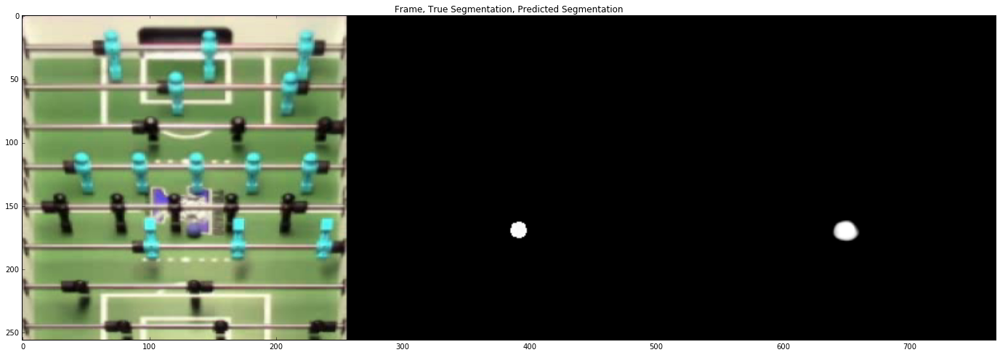


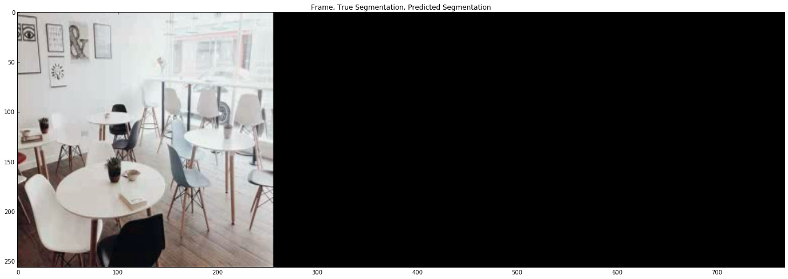


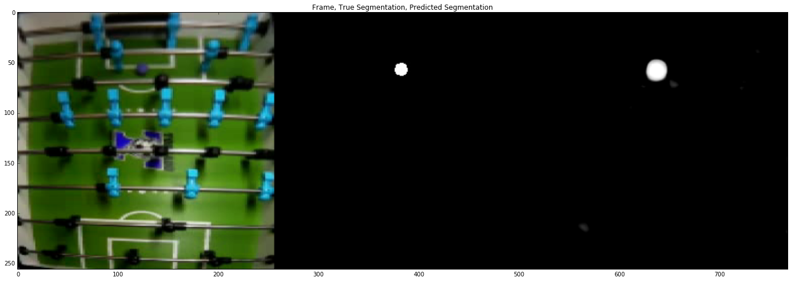


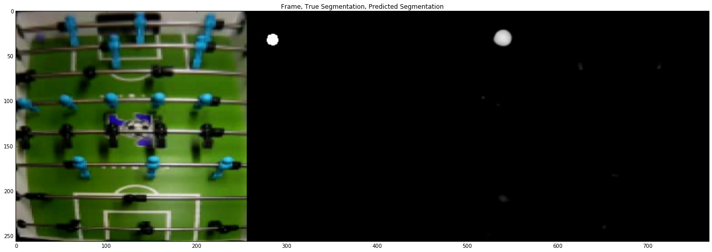


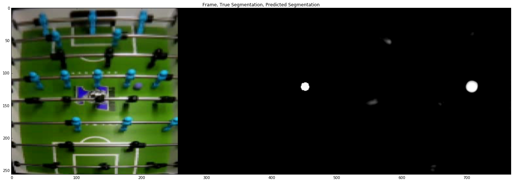


    Wrote model to .\Models\weights_111.hdf
    Epoch 112/112
    

    C:\local\Anaconda3-4.1.1-Windows-x86_64\lib\site-packages\ipykernel\__main__.py:37: UserWarning: Update your `fit_generator` call to the Keras 2 API: `fit_generator(<__main__...., 200, validation_steps=5, verbose=1, class_weight=None, epochs=112, callbacks=None, validation_data=<__main__...., initial_epoch=111, use_multiprocessing=False, max_queue_size=50, workers=50)`
    

    200/200 [==============================] - 223s 1s/step - loss: 2.8705e-04 - balanced_square_error: 2.8705e-04 - mean_squared_error: 0.0019 - val_loss: 1.1758e-04 - val_balanced_square_error: 1.1758e-04 - val_mean_squared_error: 0.0010
    Wrote model to .\Models\weights_112.hdf
    Epoch 113/113
    

    C:\local\Anaconda3-4.1.1-Windows-x86_64\lib\site-packages\ipykernel\__main__.py:37: UserWarning: Update your `fit_generator` call to the Keras 2 API: `fit_generator(<__main__...., 200, validation_steps=5, verbose=1, class_weight=None, epochs=113, callbacks=None, validation_data=<__main__...., initial_epoch=112, use_multiprocessing=False, max_queue_size=50, workers=50)`
    

    200/200 [==============================] - 223s 1s/step - loss: 2.8200e-04 - balanced_square_error: 2.8200e-04 - mean_squared_error: 0.0020 - val_loss: 1.0316e-04 - val_balanced_square_error: 1.0316e-04 - val_mean_squared_error: 6.8468e-04
    Wrote model to .\Models\weights_113.hdf
    Epoch 114/114
    

    C:\local\Anaconda3-4.1.1-Windows-x86_64\lib\site-packages\ipykernel\__main__.py:37: UserWarning: Update your `fit_generator` call to the Keras 2 API: `fit_generator(<__main__...., 200, validation_steps=5, verbose=1, class_weight=None, epochs=114, callbacks=None, validation_data=<__main__...., initial_epoch=113, use_multiprocessing=False, max_queue_size=50, workers=50)`
    

    200/200 [==============================] - 222s 1s/step - loss: 5.6109e-04 - balanced_square_error: 5.6109e-04 - mean_squared_error: 0.0022 - val_loss: 0.0029 - val_balanced_square_error: 0.0029 - val_mean_squared_error: 0.0045
    Wrote model to .\Models\weights_114.hdf
    Epoch 115/115
    

    C:\local\Anaconda3-4.1.1-Windows-x86_64\lib\site-packages\ipykernel\__main__.py:37: UserWarning: Update your `fit_generator` call to the Keras 2 API: `fit_generator(<__main__...., 200, validation_steps=5, verbose=1, class_weight=None, epochs=115, callbacks=None, validation_data=<__main__...., initial_epoch=114, use_multiprocessing=False, max_queue_size=50, workers=50)`
    

    200/200 [==============================] - 223s 1s/step - loss: 4.0180e-04 - balanced_square_error: 4.0180e-04 - mean_squared_error: 0.0020 - val_loss: 7.1725e-05 - val_balanced_square_error: 7.1725e-05 - val_mean_squared_error: 0.0022
    Wrote model to .\Models\weights_115.hdf
    Epoch 116/116
    

    C:\local\Anaconda3-4.1.1-Windows-x86_64\lib\site-packages\ipykernel\__main__.py:37: UserWarning: Update your `fit_generator` call to the Keras 2 API: `fit_generator(<__main__...., 200, validation_steps=5, verbose=1, class_weight=None, epochs=116, callbacks=None, validation_data=<__main__...., initial_epoch=115, use_multiprocessing=False, max_queue_size=50, workers=50)`
    

    200/200 [==============================] - 223s 1s/step - loss: 2.3678e-04 - balanced_square_error: 2.3678e-04 - mean_squared_error: 0.0019 - val_loss: 1.0649e-04 - val_balanced_square_error: 1.0649e-04 - val_mean_squared_error: 0.0010
    


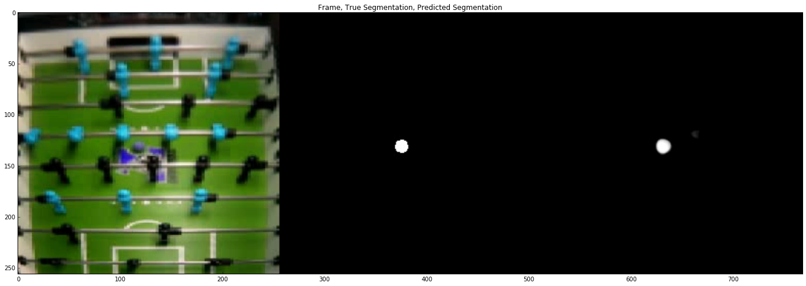


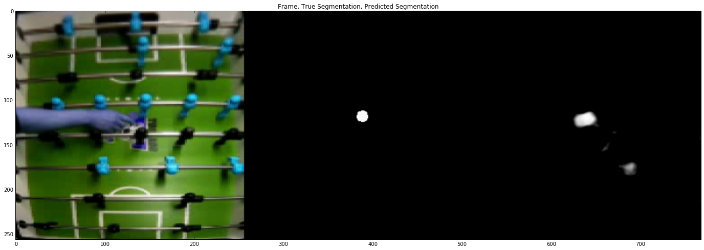


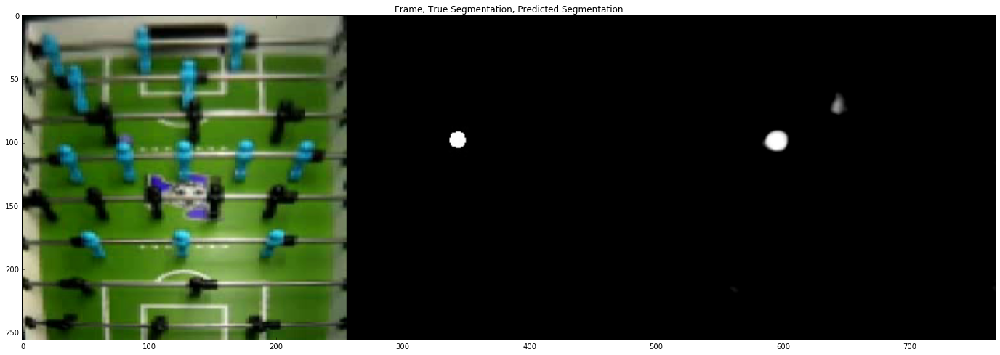


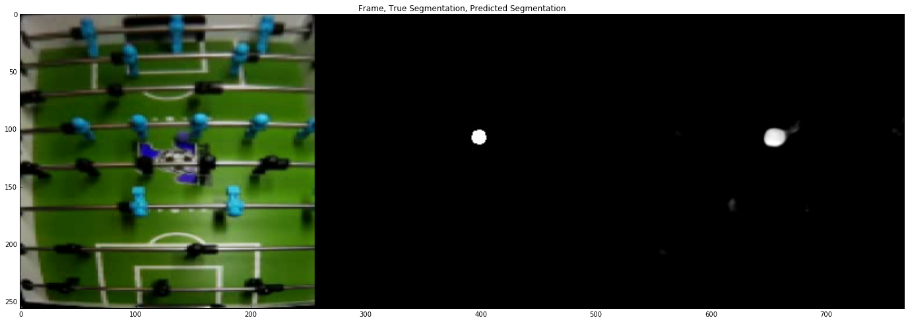


    Wrote model to .\Models\weights_116.hdf
    Epoch 117/117
    

    C:\local\Anaconda3-4.1.1-Windows-x86_64\lib\site-packages\ipykernel\__main__.py:37: UserWarning: Update your `fit_generator` call to the Keras 2 API: `fit_generator(<__main__...., 200, validation_steps=5, verbose=1, class_weight=None, epochs=117, callbacks=None, validation_data=<__main__...., initial_epoch=116, use_multiprocessing=False, max_queue_size=50, workers=50)`
    

    200/200 [==============================] - 222s 1s/step - loss: 4.0578e-04 - balanced_square_error: 4.0578e-04 - mean_squared_error: 0.0020 - val_loss: 9.1320e-05 - val_balanced_square_error: 9.1320e-05 - val_mean_squared_error: 0.0014
    Wrote model to .\Models\weights_117.hdf
    Epoch 118/118
    

    C:\local\Anaconda3-4.1.1-Windows-x86_64\lib\site-packages\ipykernel\__main__.py:37: UserWarning: Update your `fit_generator` call to the Keras 2 API: `fit_generator(<__main__...., 200, validation_steps=5, verbose=1, class_weight=None, epochs=118, callbacks=None, validation_data=<__main__...., initial_epoch=117, use_multiprocessing=False, max_queue_size=50, workers=50)`
    

    200/200 [==============================] - 223s 1s/step - loss: 2.6681e-04 - balanced_square_error: 2.6681e-04 - mean_squared_error: 0.0019 - val_loss: 1.2245e-04 - val_balanced_square_error: 1.2245e-04 - val_mean_squared_error: 9.6501e-04
    Wrote model to .\Models\weights_118.hdf
    Epoch 119/119
    

    C:\local\Anaconda3-4.1.1-Windows-x86_64\lib\site-packages\ipykernel\__main__.py:37: UserWarning: Update your `fit_generator` call to the Keras 2 API: `fit_generator(<__main__...., 200, validation_steps=5, verbose=1, class_weight=None, epochs=119, callbacks=None, validation_data=<__main__...., initial_epoch=118, use_multiprocessing=False, max_queue_size=50, workers=50)`
    

    200/200 [==============================] - 223s 1s/step - loss: 3.9880e-04 - balanced_square_error: 3.9880e-04 - mean_squared_error: 0.0020 - val_loss: 5.7001e-05 - val_balanced_square_error: 5.7001e-05 - val_mean_squared_error: 0.0010
    Wrote model to .\Models\weights_119.hdf
    Epoch 120/120
    

    C:\local\Anaconda3-4.1.1-Windows-x86_64\lib\site-packages\ipykernel\__main__.py:37: UserWarning: Update your `fit_generator` call to the Keras 2 API: `fit_generator(<__main__...., 200, validation_steps=5, verbose=1, class_weight=None, epochs=120, callbacks=None, validation_data=<__main__...., initial_epoch=119, use_multiprocessing=False, max_queue_size=50, workers=50)`
    

    200/200 [==============================] - 222s 1s/step - loss: 2.1978e-04 - balanced_square_error: 2.1978e-04 - mean_squared_error: 0.0017 - val_loss: 8.9454e-05 - val_balanced_square_error: 8.9454e-05 - val_mean_squared_error: 0.0026
    Wrote model to .\Models\weights_120.hdf
    


```python
def balanced_square_error(y_true, y_pred):
    above_loss = 0.1 * K.mean( K.square( K.clip(y_pred - y_true, 0.0, 100000) ) , axis=-1)
    below_loss = K.mean( K.square( K.clip(y_pred - y_true, -100000, 0.0) ) , axis=-1)
    return above_loss + below_loss

frame_prediction_model.compile(optimizer=keras.optimizers.RMSprop(lr=0.00001),
#model.compile(optimizer=keras.optimizers.adam(),
              loss=balanced_square_error,
              metrics=[balanced_square_error,mean_squared_error])

# Was ran on the above simple model, not pre-trained Inceptionv3 run.
#epoch = 125
#batches_validation_per_epoch = 50
#batches_training_per_epoch = 400
batch_size = 10
batches_training_per_epoch = 200
batches_validation_per_epoch = 5
print("Batch size %i: %i training batches, %i validation batches" % (batch_size, batches_training_per_epoch, batches_validation_per_epoch) )
WEIGHTS_FNAME = '.\\Models\\weights_%i.hdf'
MODELS_FNAME = '.\\Models\\models_%i.h5'


for i in range(60):
    frame_prediction_model.fit_generator(
        TrainBatchGen(batch_size, training=training),
        batches_training_per_epoch,
        epochs=epoch+1,
        verbose=1,
        callbacks=None,
        class_weight=None,
        max_q_size=50,
        workers=50,
        validation_data=TrainBatchGen(batch_size, validation),
        validation_steps = batches_validation_per_epoch,
        pickle_safe=False,
        initial_epoch=epoch)
    
    epoch += 1
    
    # Plot occasional validation data plot
    if i % 5 == 0:
        plot_validate(TrainBatchGen(batch_size, validation), frame_prediction_model, 50, "Epoch validation results %i" % epoch)
    
    # Save the model
    frame_prediction_model.save_weights(WEIGHTS_FNAME % epoch)
    frame_prediction_model.save(MODELS_FNAME % epoch)
    print(("Wrote model to " + WEIGHTS_FNAME )  % epoch)

```

    Batch size 10: 200 training batches, 5 validation batches
    

    C:\local\Anaconda3-4.1.1-Windows-x86_64\lib\site-packages\ipykernel\__main__.py:36: UserWarning: Update your `fit_generator` call to the Keras 2 API: `fit_generator(<__main__...., 200, validation_steps=5, verbose=1, class_weight=None, epochs=121, callbacks=None, validation_data=<__main__...., initial_epoch=120, use_multiprocessing=False, max_queue_size=50, workers=50)`
    

    Epoch 121/121
    200/200 [==============================] - 223s 1s/step - loss: 5.7139e-04 - balanced_square_error: 5.7139e-04 - mean_squared_error: 0.0014 - val_loss: 1.8849e-04 - val_balanced_square_error: 1.8849e-04 - val_mean_squared_error: 0.0017
    


    Wrote model to .\Models\weights_121.hdf
    Epoch 122/122
    

    C:\local\Anaconda3-4.1.1-Windows-x86_64\lib\site-packages\ipykernel\__main__.py:36: UserWarning: Update your `fit_generator` call to the Keras 2 API: `fit_generator(<__main__...., 200, validation_steps=5, verbose=1, class_weight=None, epochs=122, callbacks=None, validation_data=<__main__...., initial_epoch=121, use_multiprocessing=False, max_queue_size=50, workers=50)`
    

    200/200 [==============================] - 223s 1s/step - loss: 7.1940e-04 - balanced_square_error: 7.1940e-04 - mean_squared_error: 0.0015 - val_loss: 2.0725e-04 - val_balanced_square_error: 2.0725e-04 - val_mean_squared_error: 6.6364e-04
    Wrote model to .\Models\weights_122.hdf
    Epoch 123/123
    

    C:\local\Anaconda3-4.1.1-Windows-x86_64\lib\site-packages\ipykernel\__main__.py:36: UserWarning: Update your `fit_generator` call to the Keras 2 API: `fit_generator(<__main__...., 200, validation_steps=5, verbose=1, class_weight=None, epochs=123, callbacks=None, validation_data=<__main__...., initial_epoch=122, use_multiprocessing=False, max_queue_size=50, workers=50)`
    

    200/200 [==============================] - 223s 1s/step - loss: 5.0940e-04 - balanced_square_error: 5.0940e-04 - mean_squared_error: 0.0013 - val_loss: 2.6509e-04 - val_balanced_square_error: 2.6509e-04 - val_mean_squared_error: 0.0025
    Wrote model to .\Models\weights_123.hdf
    Epoch 124/124
    

    C:\local\Anaconda3-4.1.1-Windows-x86_64\lib\site-packages\ipykernel\__main__.py:36: UserWarning: Update your `fit_generator` call to the Keras 2 API: `fit_generator(<__main__...., 200, validation_steps=5, verbose=1, class_weight=None, epochs=124, callbacks=None, validation_data=<__main__...., initial_epoch=123, use_multiprocessing=False, max_queue_size=50, workers=50)`
    

    200/200 [==============================] - 222s 1s/step - loss: 5.1165e-04 - balanced_square_error: 5.1165e-04 - mean_squared_error: 0.0013 - val_loss: 1.4270e-04 - val_balanced_square_error: 1.4270e-04 - val_mean_squared_error: 6.8484e-04
    Wrote model to .\Models\weights_124.hdf
    Epoch 125/125
    

    C:\local\Anaconda3-4.1.1-Windows-x86_64\lib\site-packages\ipykernel\__main__.py:36: UserWarning: Update your `fit_generator` call to the Keras 2 API: `fit_generator(<__main__...., 200, validation_steps=5, verbose=1, class_weight=None, epochs=125, callbacks=None, validation_data=<__main__...., initial_epoch=124, use_multiprocessing=False, max_queue_size=50, workers=50)`
    

    200/200 [==============================] - 223s 1s/step - loss: 3.1842e-04 - balanced_square_error: 3.1842e-04 - mean_squared_error: 0.0011 - val_loss: 1.8847e-04 - val_balanced_square_error: 1.8847e-04 - val_mean_squared_error: 7.4809e-04
    Wrote model to .\Models\weights_125.hdf
    Epoch 126/126
    

    C:\local\Anaconda3-4.1.1-Windows-x86_64\lib\site-packages\ipykernel\__main__.py:36: UserWarning: Update your `fit_generator` call to the Keras 2 API: `fit_generator(<__main__...., 200, validation_steps=5, verbose=1, class_weight=None, epochs=126, callbacks=None, validation_data=<__main__...., initial_epoch=125, use_multiprocessing=False, max_queue_size=50, workers=50)`
    

    200/200 [==============================] - 222s 1s/step - loss: 2.8252e-04 - balanced_square_error: 2.8252e-04 - mean_squared_error: 0.0011 - val_loss: 4.1195e-04 - val_balanced_square_error: 4.1195e-04 - val_mean_squared_error: 0.0010
    


    Wrote model to .\Models\weights_126.hdf
    Epoch 127/127
    

    C:\local\Anaconda3-4.1.1-Windows-x86_64\lib\site-packages\ipykernel\__main__.py:36: UserWarning: Update your `fit_generator` call to the Keras 2 API: `fit_generator(<__main__...., 200, validation_steps=5, verbose=1, class_weight=None, epochs=127, callbacks=None, validation_data=<__main__...., initial_epoch=126, use_multiprocessing=False, max_queue_size=50, workers=50)`
    

    200/200 [==============================] - 222s 1s/step - loss: 3.1134e-04 - balanced_square_error: 3.1134e-04 - mean_squared_error: 0.0011 - val_loss: 0.0028 - val_balanced_square_error: 0.0028 - val_mean_squared_error: 0.0031
    Wrote model to .\Models\weights_127.hdf
    Epoch 128/128
    

    C:\local\Anaconda3-4.1.1-Windows-x86_64\lib\site-packages\ipykernel\__main__.py:36: UserWarning: Update your `fit_generator` call to the Keras 2 API: `fit_generator(<__main__...., 200, validation_steps=5, verbose=1, class_weight=None, epochs=128, callbacks=None, validation_data=<__main__...., initial_epoch=127, use_multiprocessing=False, max_queue_size=50, workers=50)`
    

    200/200 [==============================] - 222s 1s/step - loss: 3.9932e-04 - balanced_square_error: 3.9932e-04 - mean_squared_error: 0.0011 - val_loss: 9.3573e-05 - val_balanced_square_error: 9.3573e-05 - val_mean_squared_error: 5.6265e-04
    Wrote model to .\Models\weights_128.hdf
    Epoch 129/129
    

    C:\local\Anaconda3-4.1.1-Windows-x86_64\lib\site-packages\ipykernel\__main__.py:36: UserWarning: Update your `fit_generator` call to the Keras 2 API: `fit_generator(<__main__...., 200, validation_steps=5, verbose=1, class_weight=None, epochs=129, callbacks=None, validation_data=<__main__...., initial_epoch=128, use_multiprocessing=False, max_queue_size=50, workers=50)`
    

    200/200 [==============================] - 222s 1s/step - loss: 5.3480e-04 - balanced_square_error: 5.3480e-04 - mean_squared_error: 0.0013 - val_loss: 1.1853e-04 - val_balanced_square_error: 1.1853e-04 - val_mean_squared_error: 8.5019e-04
    Wrote model to .\Models\weights_129.hdf
    Epoch 130/130
    

    C:\local\Anaconda3-4.1.1-Windows-x86_64\lib\site-packages\ipykernel\__main__.py:36: UserWarning: Update your `fit_generator` call to the Keras 2 API: `fit_generator(<__main__...., 200, validation_steps=5, verbose=1, class_weight=None, epochs=130, callbacks=None, validation_data=<__main__...., initial_epoch=129, use_multiprocessing=False, max_queue_size=50, workers=50)`
    

    200/200 [==============================] - 223s 1s/step - loss: 3.5418e-04 - balanced_square_error: 3.5418e-04 - mean_squared_error: 0.0011 - val_loss: 1.3579e-04 - val_balanced_square_error: 1.3579e-04 - val_mean_squared_error: 8.1481e-04
    Wrote model to .\Models\weights_130.hdf
    Epoch 131/131
    

    C:\local\Anaconda3-4.1.1-Windows-x86_64\lib\site-packages\ipykernel\__main__.py:36: UserWarning: Update your `fit_generator` call to the Keras 2 API: `fit_generator(<__main__...., 200, validation_steps=5, verbose=1, class_weight=None, epochs=131, callbacks=None, validation_data=<__main__...., initial_epoch=130, use_multiprocessing=False, max_queue_size=50, workers=50)`
    

    200/200 [==============================] - 222s 1s/step - loss: 2.4165e-04 - balanced_square_error: 2.4165e-04 - mean_squared_error: 9.8287e-04 - val_loss: 1.2769e-04 - val_balanced_square_error: 1.2769e-04 - val_mean_squared_error: 6.6865e-04
    


    Wrote model to .\Models\weights_131.hdf
    Epoch 132/132
    

    C:\local\Anaconda3-4.1.1-Windows-x86_64\lib\site-packages\ipykernel\__main__.py:36: UserWarning: Update your `fit_generator` call to the Keras 2 API: `fit_generator(<__main__...., 200, validation_steps=5, verbose=1, class_weight=None, epochs=132, callbacks=None, validation_data=<__main__...., initial_epoch=131, use_multiprocessing=False, max_queue_size=50, workers=50)`
    

    200/200 [==============================] - 222s 1s/step - loss: 3.7531e-04 - balanced_square_error: 3.7531e-04 - mean_squared_error: 0.0011 - val_loss: 1.1395e-04 - val_balanced_square_error: 1.1395e-04 - val_mean_squared_error: 7.9182e-04
    Wrote model to .\Models\weights_132.hdf
    Epoch 133/133
    

    C:\local\Anaconda3-4.1.1-Windows-x86_64\lib\site-packages\ipykernel\__main__.py:36: UserWarning: Update your `fit_generator` call to the Keras 2 API: `fit_generator(<__main__...., 200, validation_steps=5, verbose=1, class_weight=None, epochs=133, callbacks=None, validation_data=<__main__...., initial_epoch=132, use_multiprocessing=False, max_queue_size=50, workers=50)`
    

    200/200 [==============================] - 222s 1s/step - loss: 2.3681e-04 - balanced_square_error: 2.3681e-04 - mean_squared_error: 9.6712e-04 - val_loss: 1.4692e-04 - val_balanced_square_error: 1.4692e-04 - val_mean_squared_error: 8.4546e-04
    Wrote model to .\Models\weights_133.hdf
    Epoch 134/134
    

    C:\local\Anaconda3-4.1.1-Windows-x86_64\lib\site-packages\ipykernel\__main__.py:36: UserWarning: Update your `fit_generator` call to the Keras 2 API: `fit_generator(<__main__...., 200, validation_steps=5, verbose=1, class_weight=None, epochs=134, callbacks=None, validation_data=<__main__...., initial_epoch=133, use_multiprocessing=False, max_queue_size=50, workers=50)`
    

    200/200 [==============================] - 222s 1s/step - loss: 6.6798e-04 - balanced_square_error: 6.6798e-04 - mean_squared_error: 0.0014 - val_loss: 2.3179e-04 - val_balanced_square_error: 2.3179e-04 - val_mean_squared_error: 7.8472e-04
    Wrote model to .\Models\weights_134.hdf
    Epoch 135/135
    

    C:\local\Anaconda3-4.1.1-Windows-x86_64\lib\site-packages\ipykernel\__main__.py:36: UserWarning: Update your `fit_generator` call to the Keras 2 API: `fit_generator(<__main__...., 200, validation_steps=5, verbose=1, class_weight=None, epochs=135, callbacks=None, validation_data=<__main__...., initial_epoch=134, use_multiprocessing=False, max_queue_size=50, workers=50)`
    

    200/200 [==============================] - 223s 1s/step - loss: 4.0673e-04 - balanced_square_error: 4.0673e-04 - mean_squared_error: 0.0011 - val_loss: 1.4258e-04 - val_balanced_square_error: 1.4258e-04 - val_mean_squared_error: 7.6913e-04
    Wrote model to .\Models\weights_135.hdf
    Epoch 136/136
    

    C:\local\Anaconda3-4.1.1-Windows-x86_64\lib\site-packages\ipykernel\__main__.py:36: UserWarning: Update your `fit_generator` call to the Keras 2 API: `fit_generator(<__main__...., 200, validation_steps=5, verbose=1, class_weight=None, epochs=136, callbacks=None, validation_data=<__main__...., initial_epoch=135, use_multiprocessing=False, max_queue_size=50, workers=50)`
    

    200/200 [==============================] - 223s 1s/step - loss: 5.2590e-04 - balanced_square_error: 5.2590e-04 - mean_squared_error: 0.0012 - val_loss: 1.3827e-04 - val_balanced_square_error: 1.3827e-04 - val_mean_squared_error: 5.7845e-04
    


    Wrote model to .\Models\weights_136.hdf
    Epoch 137/137
    

    C:\local\Anaconda3-4.1.1-Windows-x86_64\lib\site-packages\ipykernel\__main__.py:36: UserWarning: Update your `fit_generator` call to the Keras 2 API: `fit_generator(<__main__...., 200, validation_steps=5, verbose=1, class_weight=None, epochs=137, callbacks=None, validation_data=<__main__...., initial_epoch=136, use_multiprocessing=False, max_queue_size=50, workers=50)`
    

    200/200 [==============================] - 222s 1s/step - loss: 2.9801e-04 - balanced_square_error: 2.9801e-04 - mean_squared_error: 9.9451e-04 - val_loss: 1.1142e-04 - val_balanced_square_error: 1.1142e-04 - val_mean_squared_error: 6.0602e-04
    Wrote model to .\Models\weights_137.hdf
    Epoch 138/138
    

    C:\local\Anaconda3-4.1.1-Windows-x86_64\lib\site-packages\ipykernel\__main__.py:36: UserWarning: Update your `fit_generator` call to the Keras 2 API: `fit_generator(<__main__...., 200, validation_steps=5, verbose=1, class_weight=None, epochs=138, callbacks=None, validation_data=<__main__...., initial_epoch=137, use_multiprocessing=False, max_queue_size=50, workers=50)`
    

    200/200 [==============================] - 222s 1s/step - loss: 2.5278e-04 - balanced_square_error: 2.5278e-04 - mean_squared_error: 9.3676e-04 - val_loss: 1.3767e-04 - val_balanced_square_error: 1.3767e-04 - val_mean_squared_error: 0.0011
    Wrote model to .\Models\weights_138.hdf
    Epoch 139/139
    

    C:\local\Anaconda3-4.1.1-Windows-x86_64\lib\site-packages\ipykernel\__main__.py:36: UserWarning: Update your `fit_generator` call to the Keras 2 API: `fit_generator(<__main__...., 200, validation_steps=5, verbose=1, class_weight=None, epochs=139, callbacks=None, validation_data=<__main__...., initial_epoch=138, use_multiprocessing=False, max_queue_size=50, workers=50)`
    

    200/200 [==============================] - 222s 1s/step - loss: 2.2649e-04 - balanced_square_error: 2.2649e-04 - mean_squared_error: 9.3740e-04 - val_loss: 9.5325e-05 - val_balanced_square_error: 9.5325e-05 - val_mean_squared_error: 4.1936e-04
    Wrote model to .\Models\weights_139.hdf
    Epoch 140/140
    

    C:\local\Anaconda3-4.1.1-Windows-x86_64\lib\site-packages\ipykernel\__main__.py:36: UserWarning: Update your `fit_generator` call to the Keras 2 API: `fit_generator(<__main__...., 200, validation_steps=5, verbose=1, class_weight=None, epochs=140, callbacks=None, validation_data=<__main__...., initial_epoch=139, use_multiprocessing=False, max_queue_size=50, workers=50)`
    

    200/200 [==============================] - 222s 1s/step - loss: 5.4122e-04 - balanced_square_error: 5.4122e-04 - mean_squared_error: 0.0013 - val_loss: 1.5783e-04 - val_balanced_square_error: 1.5783e-04 - val_mean_squared_error: 6.8434e-04
    Wrote model to .\Models\weights_140.hdf
    Epoch 141/141
    

    C:\local\Anaconda3-4.1.1-Windows-x86_64\lib\site-packages\ipykernel\__main__.py:36: UserWarning: Update your `fit_generator` call to the Keras 2 API: `fit_generator(<__main__...., 200, validation_steps=5, verbose=1, class_weight=None, epochs=141, callbacks=None, validation_data=<__main__...., initial_epoch=140, use_multiprocessing=False, max_queue_size=50, workers=50)`
    

    200/200 [==============================] - 223s 1s/step - loss: 3.9842e-04 - balanced_square_error: 3.9842e-04 - mean_squared_error: 0.0011 - val_loss: 6.0960e-04 - val_balanced_square_error: 6.0960e-04 - val_mean_squared_error: 0.0011
    


    Wrote model to .\Models\weights_141.hdf
    Epoch 142/142
    

    C:\local\Anaconda3-4.1.1-Windows-x86_64\lib\site-packages\ipykernel\__main__.py:36: UserWarning: Update your `fit_generator` call to the Keras 2 API: `fit_generator(<__main__...., 200, validation_steps=5, verbose=1, class_weight=None, epochs=142, callbacks=None, validation_data=<__main__...., initial_epoch=141, use_multiprocessing=False, max_queue_size=50, workers=50)`
    

    200/200 [==============================] - 222s 1s/step - loss: 3.2164e-04 - balanced_square_error: 3.2164e-04 - mean_squared_error: 0.0010 - val_loss: 0.0014 - val_balanced_square_error: 0.0014 - val_mean_squared_error: 0.0021
    Wrote model to .\Models\weights_142.hdf
    Epoch 143/143
    

    C:\local\Anaconda3-4.1.1-Windows-x86_64\lib\site-packages\ipykernel\__main__.py:36: UserWarning: Update your `fit_generator` call to the Keras 2 API: `fit_generator(<__main__...., 200, validation_steps=5, verbose=1, class_weight=None, epochs=143, callbacks=None, validation_data=<__main__...., initial_epoch=142, use_multiprocessing=False, max_queue_size=50, workers=50)`
    

    200/200 [==============================] - 222s 1s/step - loss: 4.8885e-04 - balanced_square_error: 4.8885e-04 - mean_squared_error: 0.0012 - val_loss: 1.2743e-04 - val_balanced_square_error: 1.2743e-04 - val_mean_squared_error: 6.1224e-04
    Wrote model to .\Models\weights_143.hdf
    Epoch 144/144
    

    C:\local\Anaconda3-4.1.1-Windows-x86_64\lib\site-packages\ipykernel\__main__.py:36: UserWarning: Update your `fit_generator` call to the Keras 2 API: `fit_generator(<__main__...., 200, validation_steps=5, verbose=1, class_weight=None, epochs=144, callbacks=None, validation_data=<__main__...., initial_epoch=143, use_multiprocessing=False, max_queue_size=50, workers=50)`
    

    200/200 [==============================] - 222s 1s/step - loss: 3.2383e-04 - balanced_square_error: 3.2383e-04 - mean_squared_error: 0.0010 - val_loss: 1.1896e-04 - val_balanced_square_error: 1.1896e-04 - val_mean_squared_error: 6.0782e-04
    Wrote model to .\Models\weights_144.hdf
    Epoch 145/145
    

    C:\local\Anaconda3-4.1.1-Windows-x86_64\lib\site-packages\ipykernel\__main__.py:36: UserWarning: Update your `fit_generator` call to the Keras 2 API: `fit_generator(<__main__...., 200, validation_steps=5, verbose=1, class_weight=None, epochs=145, callbacks=None, validation_data=<__main__...., initial_epoch=144, use_multiprocessing=False, max_queue_size=50, workers=50)`
    

    200/200 [==============================] - 222s 1s/step - loss: 3.0343e-04 - balanced_square_error: 3.0343e-04 - mean_squared_error: 9.7474e-04 - val_loss: 1.4370e-04 - val_balanced_square_error: 1.4370e-04 - val_mean_squared_error: 6.9193e-04
    Wrote model to .\Models\weights_145.hdf
    Epoch 146/146
    

    C:\local\Anaconda3-4.1.1-Windows-x86_64\lib\site-packages\ipykernel\__main__.py:36: UserWarning: Update your `fit_generator` call to the Keras 2 API: `fit_generator(<__main__...., 200, validation_steps=5, verbose=1, class_weight=None, epochs=146, callbacks=None, validation_data=<__main__...., initial_epoch=145, use_multiprocessing=False, max_queue_size=50, workers=50)`
    

    200/200 [==============================] - 222s 1s/step - loss: 4.4106e-04 - balanced_square_error: 4.4106e-04 - mean_squared_error: 0.0011 - val_loss: 1.1480e-04 - val_balanced_square_error: 1.1480e-04 - val_mean_squared_error: 5.6775e-04
    


    Wrote model to .\Models\weights_146.hdf
    Epoch 147/147
    

    C:\local\Anaconda3-4.1.1-Windows-x86_64\lib\site-packages\ipykernel\__main__.py:36: UserWarning: Update your `fit_generator` call to the Keras 2 API: `fit_generator(<__main__...., 200, validation_steps=5, verbose=1, class_weight=None, epochs=147, callbacks=None, validation_data=<__main__...., initial_epoch=146, use_multiprocessing=False, max_queue_size=50, workers=50)`
    

    200/200 [==============================] - 223s 1s/step - loss: 6.0533e-04 - balanced_square_error: 6.0533e-04 - mean_squared_error: 0.0013 - val_loss: 2.0174e-04 - val_balanced_square_error: 2.0174e-04 - val_mean_squared_error: 5.3623e-04
    Wrote model to .\Models\weights_147.hdf
    Epoch 148/148
    

    C:\local\Anaconda3-4.1.1-Windows-x86_64\lib\site-packages\ipykernel\__main__.py:36: UserWarning: Update your `fit_generator` call to the Keras 2 API: `fit_generator(<__main__...., 200, validation_steps=5, verbose=1, class_weight=None, epochs=148, callbacks=None, validation_data=<__main__...., initial_epoch=147, use_multiprocessing=False, max_queue_size=50, workers=50)`
    

    200/200 [==============================] - 222s 1s/step - loss: 2.9010e-04 - balanced_square_error: 2.9010e-04 - mean_squared_error: 9.7824e-04 - val_loss: 1.2180e-04 - val_balanced_square_error: 1.2180e-04 - val_mean_squared_error: 8.9105e-04
    Wrote model to .\Models\weights_148.hdf
    Epoch 149/149
    

    C:\local\Anaconda3-4.1.1-Windows-x86_64\lib\site-packages\ipykernel\__main__.py:36: UserWarning: Update your `fit_generator` call to the Keras 2 API: `fit_generator(<__main__...., 200, validation_steps=5, verbose=1, class_weight=None, epochs=149, callbacks=None, validation_data=<__main__...., initial_epoch=148, use_multiprocessing=False, max_queue_size=50, workers=50)`
    

    200/200 [==============================] - 222s 1s/step - loss: 1.5934e-04 - balanced_square_error: 1.5934e-04 - mean_squared_error: 8.2641e-04 - val_loss: 1.8036e-04 - val_balanced_square_error: 1.8036e-04 - val_mean_squared_error: 9.7688e-04
    Wrote model to .\Models\weights_149.hdf
    Epoch 150/150
    

    C:\local\Anaconda3-4.1.1-Windows-x86_64\lib\site-packages\ipykernel\__main__.py:36: UserWarning: Update your `fit_generator` call to the Keras 2 API: `fit_generator(<__main__...., 200, validation_steps=5, verbose=1, class_weight=None, epochs=150, callbacks=None, validation_data=<__main__...., initial_epoch=149, use_multiprocessing=False, max_queue_size=50, workers=50)`
    

    200/200 [==============================] - 222s 1s/step - loss: 4.3734e-04 - balanced_square_error: 4.3734e-04 - mean_squared_error: 0.0011 - val_loss: 5.4874e-04 - val_balanced_square_error: 5.4874e-04 - val_mean_squared_error: 0.0015
    Wrote model to .\Models\weights_150.hdf
    Epoch 151/151
    

    C:\local\Anaconda3-4.1.1-Windows-x86_64\lib\site-packages\ipykernel\__main__.py:36: UserWarning: Update your `fit_generator` call to the Keras 2 API: `fit_generator(<__main__...., 200, validation_steps=5, verbose=1, class_weight=None, epochs=151, callbacks=None, validation_data=<__main__...., initial_epoch=150, use_multiprocessing=False, max_queue_size=50, workers=50)`
    

    200/200 [==============================] - 222s 1s/step - loss: 3.7281e-04 - balanced_square_error: 3.7281e-04 - mean_squared_error: 0.0010 - val_loss: 1.1518e-04 - val_balanced_square_error: 1.1518e-04 - val_mean_squared_error: 7.3086e-04
    


    Wrote model to .\Models\weights_151.hdf
    Epoch 152/152
    

    C:\local\Anaconda3-4.1.1-Windows-x86_64\lib\site-packages\ipykernel\__main__.py:36: UserWarning: Update your `fit_generator` call to the Keras 2 API: `fit_generator(<__main__...., 200, validation_steps=5, verbose=1, class_weight=None, epochs=152, callbacks=None, validation_data=<__main__...., initial_epoch=151, use_multiprocessing=False, max_queue_size=50, workers=50)`
    

    200/200 [==============================] - 222s 1s/step - loss: 3.2964e-04 - balanced_square_error: 3.2964e-04 - mean_squared_error: 9.5465e-04 - val_loss: 8.4440e-05 - val_balanced_square_error: 8.4440e-05 - val_mean_squared_error: 5.8008e-04
    Wrote model to .\Models\weights_152.hdf
    Epoch 153/153
    

    C:\local\Anaconda3-4.1.1-Windows-x86_64\lib\site-packages\ipykernel\__main__.py:36: UserWarning: Update your `fit_generator` call to the Keras 2 API: `fit_generator(<__main__...., 200, validation_steps=5, verbose=1, class_weight=None, epochs=153, callbacks=None, validation_data=<__main__...., initial_epoch=152, use_multiprocessing=False, max_queue_size=50, workers=50)`
    

    200/200 [==============================] - 222s 1s/step - loss: 4.4431e-04 - balanced_square_error: 4.4431e-04 - mean_squared_error: 0.0011 - val_loss: 1.1589e-04 - val_balanced_square_error: 1.1589e-04 - val_mean_squared_error: 8.5121e-04
    Wrote model to .\Models\weights_153.hdf
    Epoch 154/154
    

    C:\local\Anaconda3-4.1.1-Windows-x86_64\lib\site-packages\ipykernel\__main__.py:36: UserWarning: Update your `fit_generator` call to the Keras 2 API: `fit_generator(<__main__...., 200, validation_steps=5, verbose=1, class_weight=None, epochs=154, callbacks=None, validation_data=<__main__...., initial_epoch=153, use_multiprocessing=False, max_queue_size=50, workers=50)`
    

    200/200 [==============================] - 222s 1s/step - loss: 2.0502e-04 - balanced_square_error: 2.0502e-04 - mean_squared_error: 8.5098e-04 - val_loss: 3.1184e-04 - val_balanced_square_error: 3.1184e-04 - val_mean_squared_error: 9.8078e-04
    Wrote model to .\Models\weights_154.hdf
    Epoch 155/155
    

    C:\local\Anaconda3-4.1.1-Windows-x86_64\lib\site-packages\ipykernel\__main__.py:36: UserWarning: Update your `fit_generator` call to the Keras 2 API: `fit_generator(<__main__...., 200, validation_steps=5, verbose=1, class_weight=None, epochs=155, callbacks=None, validation_data=<__main__...., initial_epoch=154, use_multiprocessing=False, max_queue_size=50, workers=50)`
    

    200/200 [==============================] - 222s 1s/step - loss: 3.8652e-04 - balanced_square_error: 3.8652e-04 - mean_squared_error: 0.0010 - val_loss: 1.2756e-04 - val_balanced_square_error: 1.2756e-04 - val_mean_squared_error: 5.5479e-04
    Wrote model to .\Models\weights_155.hdf
    Epoch 156/156
    

    C:\local\Anaconda3-4.1.1-Windows-x86_64\lib\site-packages\ipykernel\__main__.py:36: UserWarning: Update your `fit_generator` call to the Keras 2 API: `fit_generator(<__main__...., 200, validation_steps=5, verbose=1, class_weight=None, epochs=156, callbacks=None, validation_data=<__main__...., initial_epoch=155, use_multiprocessing=False, max_queue_size=50, workers=50)`
    

    200/200 [==============================] - 222s 1s/step - loss: 5.0354e-04 - balanced_square_error: 5.0354e-04 - mean_squared_error: 0.0011 - val_loss: 0.0011 - val_balanced_square_error: 0.0011 - val_mean_squared_error: 0.0021
    


    Wrote model to .\Models\weights_156.hdf
    Epoch 157/157
    

    C:\local\Anaconda3-4.1.1-Windows-x86_64\lib\site-packages\ipykernel\__main__.py:36: UserWarning: Update your `fit_generator` call to the Keras 2 API: `fit_generator(<__main__...., 200, validation_steps=5, verbose=1, class_weight=None, epochs=157, callbacks=None, validation_data=<__main__...., initial_epoch=156, use_multiprocessing=False, max_queue_size=50, workers=50)`
    

    200/200 [==============================] - 222s 1s/step - loss: 4.9586e-04 - balanced_square_error: 4.9586e-04 - mean_squared_error: 0.0011 - val_loss: 1.6972e-04 - val_balanced_square_error: 1.6972e-04 - val_mean_squared_error: 5.7657e-04
    Wrote model to .\Models\weights_157.hdf
    Epoch 158/158
    

    C:\local\Anaconda3-4.1.1-Windows-x86_64\lib\site-packages\ipykernel\__main__.py:36: UserWarning: Update your `fit_generator` call to the Keras 2 API: `fit_generator(<__main__...., 200, validation_steps=5, verbose=1, class_weight=None, epochs=158, callbacks=None, validation_data=<__main__...., initial_epoch=157, use_multiprocessing=False, max_queue_size=50, workers=50)`
    

    200/200 [==============================] - 222s 1s/step - loss: 2.2897e-04 - balanced_square_error: 2.2897e-04 - mean_squared_error: 8.5731e-04 - val_loss: 9.8807e-05 - val_balanced_square_error: 9.8807e-05 - val_mean_squared_error: 7.3532e-04
    Wrote model to .\Models\weights_158.hdf
    Epoch 159/159
    

    C:\local\Anaconda3-4.1.1-Windows-x86_64\lib\site-packages\ipykernel\__main__.py:36: UserWarning: Update your `fit_generator` call to the Keras 2 API: `fit_generator(<__main__...., 200, validation_steps=5, verbose=1, class_weight=None, epochs=159, callbacks=None, validation_data=<__main__...., initial_epoch=158, use_multiprocessing=False, max_queue_size=50, workers=50)`
    

    200/200 [==============================] - 223s 1s/step - loss: 2.2468e-04 - balanced_square_error: 2.2468e-04 - mean_squared_error: 8.4030e-04 - val_loss: 3.2540e-04 - val_balanced_square_error: 3.2540e-04 - val_mean_squared_error: 7.7534e-04
    Wrote model to .\Models\weights_159.hdf
    Epoch 160/160
    

    C:\local\Anaconda3-4.1.1-Windows-x86_64\lib\site-packages\ipykernel\__main__.py:36: UserWarning: Update your `fit_generator` call to the Keras 2 API: `fit_generator(<__main__...., 200, validation_steps=5, verbose=1, class_weight=None, epochs=160, callbacks=None, validation_data=<__main__...., initial_epoch=159, use_multiprocessing=False, max_queue_size=50, workers=50)`
    

    200/200 [==============================] - 222s 1s/step - loss: 6.8780e-04 - balanced_square_error: 6.8780e-04 - mean_squared_error: 0.0013 - val_loss: 1.2362e-04 - val_balanced_square_error: 1.2362e-04 - val_mean_squared_error: 5.3086e-04
    Wrote model to .\Models\weights_160.hdf
    Epoch 161/161
    

    C:\local\Anaconda3-4.1.1-Windows-x86_64\lib\site-packages\ipykernel\__main__.py:36: UserWarning: Update your `fit_generator` call to the Keras 2 API: `fit_generator(<__main__...., 200, validation_steps=5, verbose=1, class_weight=None, epochs=161, callbacks=None, validation_data=<__main__...., initial_epoch=160, use_multiprocessing=False, max_queue_size=50, workers=50)`
    

    200/200 [==============================] - 222s 1s/step - loss: 3.2221e-04 - balanced_square_error: 3.2221e-04 - mean_squared_error: 9.5213e-04 - val_loss: 1.9561e-04 - val_balanced_square_error: 1.9561e-04 - val_mean_squared_error: 4.4703e-04
    


    Wrote model to .\Models\weights_161.hdf
    Epoch 162/162
    

    C:\local\Anaconda3-4.1.1-Windows-x86_64\lib\site-packages\ipykernel\__main__.py:36: UserWarning: Update your `fit_generator` call to the Keras 2 API: `fit_generator(<__main__...., 200, validation_steps=5, verbose=1, class_weight=None, epochs=162, callbacks=None, validation_data=<__main__...., initial_epoch=161, use_multiprocessing=False, max_queue_size=50, workers=50)`
    

    200/200 [==============================] - 222s 1s/step - loss: 3.5763e-04 - balanced_square_error: 3.5763e-04 - mean_squared_error: 9.6235e-04 - val_loss: 1.0240e-04 - val_balanced_square_error: 1.0240e-04 - val_mean_squared_error: 8.7539e-04
    Wrote model to .\Models\weights_162.hdf
    Epoch 163/163
    

    C:\local\Anaconda3-4.1.1-Windows-x86_64\lib\site-packages\ipykernel\__main__.py:36: UserWarning: Update your `fit_generator` call to the Keras 2 API: `fit_generator(<__main__...., 200, validation_steps=5, verbose=1, class_weight=None, epochs=163, callbacks=None, validation_data=<__main__...., initial_epoch=162, use_multiprocessing=False, max_queue_size=50, workers=50)`
    

    200/200 [==============================] - 223s 1s/step - loss: 1.8539e-04 - balanced_square_error: 1.8539e-04 - mean_squared_error: 8.0007e-04 - val_loss: 1.0227e-04 - val_balanced_square_error: 1.0227e-04 - val_mean_squared_error: 8.1882e-04
    Wrote model to .\Models\weights_163.hdf
    Epoch 164/164
    

    C:\local\Anaconda3-4.1.1-Windows-x86_64\lib\site-packages\ipykernel\__main__.py:36: UserWarning: Update your `fit_generator` call to the Keras 2 API: `fit_generator(<__main__...., 200, validation_steps=5, verbose=1, class_weight=None, epochs=164, callbacks=None, validation_data=<__main__...., initial_epoch=163, use_multiprocessing=False, max_queue_size=50, workers=50)`
    

    200/200 [==============================] - 222s 1s/step - loss: 2.8404e-04 - balanced_square_error: 2.8404e-04 - mean_squared_error: 8.9997e-04 - val_loss: 9.6662e-05 - val_balanced_square_error: 9.6662e-05 - val_mean_squared_error: 5.5136e-04
    Wrote model to .\Models\weights_164.hdf
    Epoch 165/165
    

    C:\local\Anaconda3-4.1.1-Windows-x86_64\lib\site-packages\ipykernel\__main__.py:36: UserWarning: Update your `fit_generator` call to the Keras 2 API: `fit_generator(<__main__...., 200, validation_steps=5, verbose=1, class_weight=None, epochs=165, callbacks=None, validation_data=<__main__...., initial_epoch=164, use_multiprocessing=False, max_queue_size=50, workers=50)`
    

    200/200 [==============================] - 222s 1s/step - loss: 2.5186e-04 - balanced_square_error: 2.5186e-04 - mean_squared_error: 8.6083e-04 - val_loss: 0.0017 - val_balanced_square_error: 0.0017 - val_mean_squared_error: 0.0021
    Wrote model to .\Models\weights_165.hdf
    Epoch 166/166
    

    C:\local\Anaconda3-4.1.1-Windows-x86_64\lib\site-packages\ipykernel\__main__.py:36: UserWarning: Update your `fit_generator` call to the Keras 2 API: `fit_generator(<__main__...., 200, validation_steps=5, verbose=1, class_weight=None, epochs=166, callbacks=None, validation_data=<__main__...., initial_epoch=165, use_multiprocessing=False, max_queue_size=50, workers=50)`
    

    200/200 [==============================] - 223s 1s/step - loss: 3.0231e-04 - balanced_square_error: 3.0231e-04 - mean_squared_error: 9.0864e-04 - val_loss: 9.7293e-05 - val_balanced_square_error: 9.7293e-05 - val_mean_squared_error: 5.1634e-04
    


    Wrote model to .\Models\weights_166.hdf
    Epoch 167/167
    

    C:\local\Anaconda3-4.1.1-Windows-x86_64\lib\site-packages\ipykernel\__main__.py:36: UserWarning: Update your `fit_generator` call to the Keras 2 API: `fit_generator(<__main__...., 200, validation_steps=5, verbose=1, class_weight=None, epochs=167, callbacks=None, validation_data=<__main__...., initial_epoch=166, use_multiprocessing=False, max_queue_size=50, workers=50)`
    

    200/200 [==============================] - 223s 1s/step - loss: 5.9052e-04 - balanced_square_error: 5.9052e-04 - mean_squared_error: 0.0012 - val_loss: 8.8841e-05 - val_balanced_square_error: 8.8841e-05 - val_mean_squared_error: 5.6626e-04
    Wrote model to .\Models\weights_167.hdf
    Epoch 168/168
    

    C:\local\Anaconda3-4.1.1-Windows-x86_64\lib\site-packages\ipykernel\__main__.py:36: UserWarning: Update your `fit_generator` call to the Keras 2 API: `fit_generator(<__main__...., 200, validation_steps=5, verbose=1, class_weight=None, epochs=168, callbacks=None, validation_data=<__main__...., initial_epoch=167, use_multiprocessing=False, max_queue_size=50, workers=50)`
    

    200/200 [==============================] - 223s 1s/step - loss: 4.2861e-04 - balanced_square_error: 4.2861e-04 - mean_squared_error: 0.0011 - val_loss: 3.3453e-04 - val_balanced_square_error: 3.3453e-04 - val_mean_squared_error: 5.7573e-04
    Wrote model to .\Models\weights_168.hdf
    Epoch 169/169
    

    C:\local\Anaconda3-4.1.1-Windows-x86_64\lib\site-packages\ipykernel\__main__.py:36: UserWarning: Update your `fit_generator` call to the Keras 2 API: `fit_generator(<__main__...., 200, validation_steps=5, verbose=1, class_weight=None, epochs=169, callbacks=None, validation_data=<__main__...., initial_epoch=168, use_multiprocessing=False, max_queue_size=50, workers=50)`
    

    200/200 [==============================] - 222s 1s/step - loss: 3.0079e-04 - balanced_square_error: 3.0079e-04 - mean_squared_error: 8.9242e-04 - val_loss: 9.4728e-05 - val_balanced_square_error: 9.4728e-05 - val_mean_squared_error: 6.5912e-04
    Wrote model to .\Models\weights_169.hdf
    Epoch 170/170
    

    C:\local\Anaconda3-4.1.1-Windows-x86_64\lib\site-packages\ipykernel\__main__.py:36: UserWarning: Update your `fit_generator` call to the Keras 2 API: `fit_generator(<__main__...., 200, validation_steps=5, verbose=1, class_weight=None, epochs=170, callbacks=None, validation_data=<__main__...., initial_epoch=169, use_multiprocessing=False, max_queue_size=50, workers=50)`
    

    200/200 [==============================] - 222s 1s/step - loss: 2.9186e-04 - balanced_square_error: 2.9186e-04 - mean_squared_error: 8.9839e-04 - val_loss: 0.0016 - val_balanced_square_error: 0.0016 - val_mean_squared_error: 0.0021
    Wrote model to .\Models\weights_170.hdf
    Epoch 171/171
    

    C:\local\Anaconda3-4.1.1-Windows-x86_64\lib\site-packages\ipykernel\__main__.py:36: UserWarning: Update your `fit_generator` call to the Keras 2 API: `fit_generator(<__main__...., 200, validation_steps=5, verbose=1, class_weight=None, epochs=171, callbacks=None, validation_data=<__main__...., initial_epoch=170, use_multiprocessing=False, max_queue_size=50, workers=50)`
    

    200/200 [==============================] - 223s 1s/step - loss: 3.8105e-04 - balanced_square_error: 3.8105e-04 - mean_squared_error: 9.6270e-04 - val_loss: 3.9086e-04 - val_balanced_square_error: 3.9086e-04 - val_mean_squared_error: 8.8183e-04
    


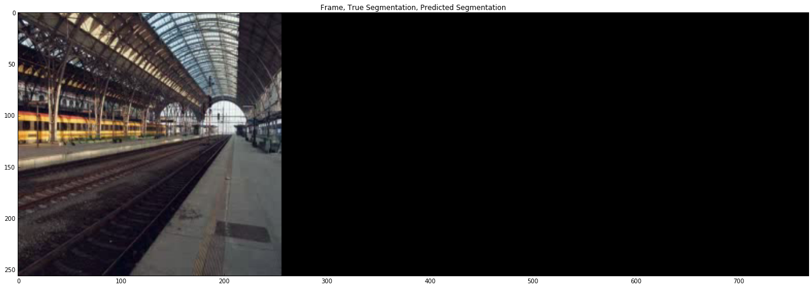


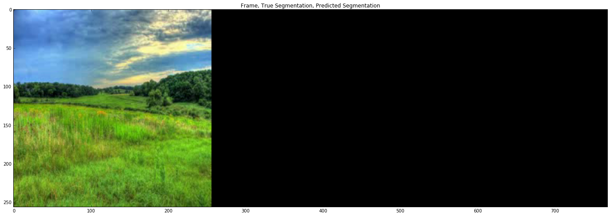


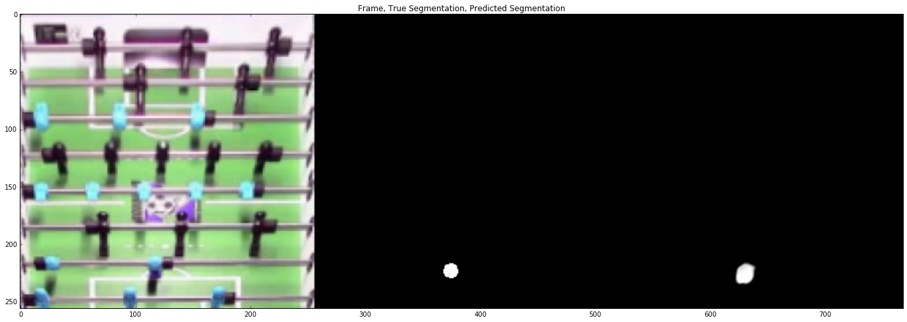


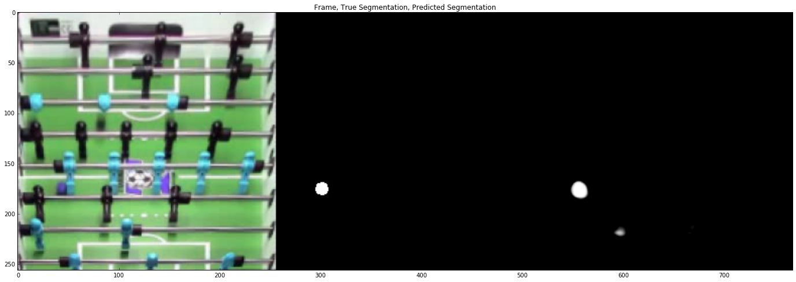


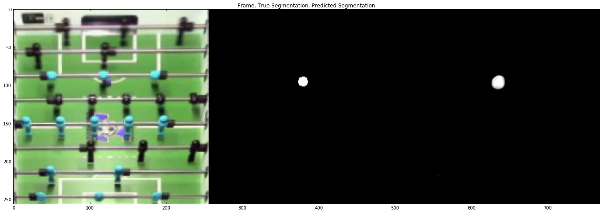


    Wrote model to .\Models\weights_171.hdf
    Epoch 172/172
    

    C:\local\Anaconda3-4.1.1-Windows-x86_64\lib\site-packages\ipykernel\__main__.py:36: UserWarning: Update your `fit_generator` call to the Keras 2 API: `fit_generator(<__main__...., 200, validation_steps=5, verbose=1, class_weight=None, epochs=172, callbacks=None, validation_data=<__main__...., initial_epoch=171, use_multiprocessing=False, max_queue_size=50, workers=50)`
    

    200/200 [==============================] - 223s 1s/step - loss: 5.4474e-04 - balanced_square_error: 5.4474e-04 - mean_squared_error: 0.0012 - val_loss: 0.0038 - val_balanced_square_error: 0.0038 - val_mean_squared_error: 0.0042
    Wrote model to .\Models\weights_172.hdf
    Epoch 173/173
    

    C:\local\Anaconda3-4.1.1-Windows-x86_64\lib\site-packages\ipykernel\__main__.py:36: UserWarning: Update your `fit_generator` call to the Keras 2 API: `fit_generator(<__main__...., 200, validation_steps=5, verbose=1, class_weight=None, epochs=173, callbacks=None, validation_data=<__main__...., initial_epoch=172, use_multiprocessing=False, max_queue_size=50, workers=50)`
    

    200/200 [==============================] - 222s 1s/step - loss: 2.3368e-04 - balanced_square_error: 2.3368e-04 - mean_squared_error: 8.3796e-04 - val_loss: 9.8095e-05 - val_balanced_square_error: 9.8095e-05 - val_mean_squared_error: 4.7931e-04
    Wrote model to .\Models\weights_173.hdf
    Epoch 174/174
    

    C:\local\Anaconda3-4.1.1-Windows-x86_64\lib\site-packages\ipykernel\__main__.py:36: UserWarning: Update your `fit_generator` call to the Keras 2 API: `fit_generator(<__main__...., 200, validation_steps=5, verbose=1, class_weight=None, epochs=174, callbacks=None, validation_data=<__main__...., initial_epoch=173, use_multiprocessing=False, max_queue_size=50, workers=50)`
    

    200/200 [==============================] - 222s 1s/step - loss: 3.5946e-04 - balanced_square_error: 3.5946e-04 - mean_squared_error: 9.7197e-04 - val_loss: 1.4256e-04 - val_balanced_square_error: 1.4256e-04 - val_mean_squared_error: 6.5979e-04
    Wrote model to .\Models\weights_174.hdf
    Epoch 175/175
    

    C:\local\Anaconda3-4.1.1-Windows-x86_64\lib\site-packages\ipykernel\__main__.py:36: UserWarning: Update your `fit_generator` call to the Keras 2 API: `fit_generator(<__main__...., 200, validation_steps=5, verbose=1, class_weight=None, epochs=175, callbacks=None, validation_data=<__main__...., initial_epoch=174, use_multiprocessing=False, max_queue_size=50, workers=50)`
    

    200/200 [==============================] - 222s 1s/step - loss: 2.2473e-04 - balanced_square_error: 2.2473e-04 - mean_squared_error: 7.9049e-04 - val_loss: 1.5270e-04 - val_balanced_square_error: 1.5270e-04 - val_mean_squared_error: 4.4709e-04
    Wrote model to .\Models\weights_175.hdf
    Epoch 176/176
    

    C:\local\Anaconda3-4.1.1-Windows-x86_64\lib\site-packages\ipykernel\__main__.py:36: UserWarning: Update your `fit_generator` call to the Keras 2 API: `fit_generator(<__main__...., 200, validation_steps=5, verbose=1, class_weight=None, epochs=176, callbacks=None, validation_data=<__main__...., initial_epoch=175, use_multiprocessing=False, max_queue_size=50, workers=50)`
    

    200/200 [==============================] - 222s 1s/step - loss: 3.2008e-04 - balanced_square_error: 3.2008e-04 - mean_squared_error: 9.0910e-04 - val_loss: 9.0545e-05 - val_balanced_square_error: 9.0545e-05 - val_mean_squared_error: 6.5984e-04
    


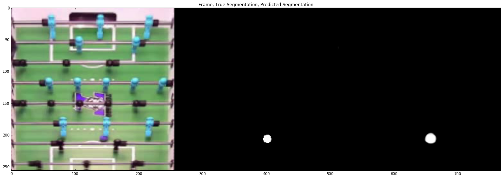


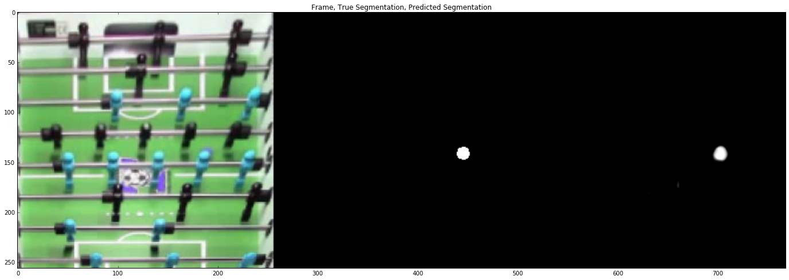


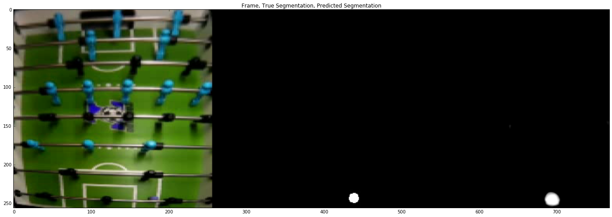


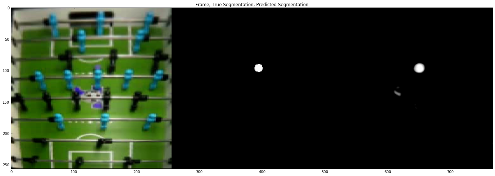


    Wrote model to .\Models\weights_176.hdf
    Epoch 177/177
    

    C:\local\Anaconda3-4.1.1-Windows-x86_64\lib\site-packages\ipykernel\__main__.py:36: UserWarning: Update your `fit_generator` call to the Keras 2 API: `fit_generator(<__main__...., 200, validation_steps=5, verbose=1, class_weight=None, epochs=177, callbacks=None, validation_data=<__main__...., initial_epoch=176, use_multiprocessing=False, max_queue_size=50, workers=50)`
    

    200/200 [==============================] - 222s 1s/step - loss: 6.3188e-04 - balanced_square_error: 6.3188e-04 - mean_squared_error: 0.0012 - val_loss: 8.6864e-05 - val_balanced_square_error: 8.6864e-05 - val_mean_squared_error: 5.7596e-04
    Wrote model to .\Models\weights_177.hdf
    Epoch 178/178
    

    C:\local\Anaconda3-4.1.1-Windows-x86_64\lib\site-packages\ipykernel\__main__.py:36: UserWarning: Update your `fit_generator` call to the Keras 2 API: `fit_generator(<__main__...., 200, validation_steps=5, verbose=1, class_weight=None, epochs=178, callbacks=None, validation_data=<__main__...., initial_epoch=177, use_multiprocessing=False, max_queue_size=50, workers=50)`
    

    200/200 [==============================] - 222s 1s/step - loss: 2.0901e-04 - balanced_square_error: 2.0901e-04 - mean_squared_error: 7.8826e-04 - val_loss: 2.7422e-04 - val_balanced_square_error: 2.7422e-04 - val_mean_squared_error: 8.6041e-04
    Wrote model to .\Models\weights_178.hdf
    Epoch 179/179
    

    C:\local\Anaconda3-4.1.1-Windows-x86_64\lib\site-packages\ipykernel\__main__.py:36: UserWarning: Update your `fit_generator` call to the Keras 2 API: `fit_generator(<__main__...., 200, validation_steps=5, verbose=1, class_weight=None, epochs=179, callbacks=None, validation_data=<__main__...., initial_epoch=178, use_multiprocessing=False, max_queue_size=50, workers=50)`
    

    200/200 [==============================] - 353s 2s/step - loss: 2.1061e-04 - balanced_square_error: 2.1061e-04 - mean_squared_error: 7.9749e-04 - val_loss: 9.9604e-05 - val_balanced_square_error: 9.9604e-05 - val_mean_squared_error: 8.5768e-04
    Wrote model to .\Models\weights_179.hdf
    Epoch 180/180
    

    C:\local\Anaconda3-4.1.1-Windows-x86_64\lib\site-packages\ipykernel\__main__.py:36: UserWarning: Update your `fit_generator` call to the Keras 2 API: `fit_generator(<__main__...., 200, validation_steps=5, verbose=1, class_weight=None, epochs=180, callbacks=None, validation_data=<__main__...., initial_epoch=179, use_multiprocessing=False, max_queue_size=50, workers=50)`
    

    200/200 [==============================] - 564s 3s/step - loss: 5.1003e-04 - balanced_square_error: 5.1003e-04 - mean_squared_error: 0.0011 - val_loss: 9.4589e-05 - val_balanced_square_error: 9.4589e-05 - val_mean_squared_error: 8.4115e-04
    Wrote model to .\Models\weights_180.hdf
    


```python
def balanced_square_error(y_true, y_pred):
    above_loss = 0.2 * K.mean( K.square( K.clip(y_pred - y_true, 0.0, 100000) ) , axis=-1)
    below_loss = K.mean( K.square( K.clip(y_pred - y_true, -100000, 0.0) ) , axis=-1)
    return above_loss + below_loss

frame_prediction_model.compile(optimizer=keras.optimizers.RMSprop(lr=0.00001),
#model.compile(optimizer=keras.optimizers.adam(),
              loss=balanced_square_error,
              metrics=[balanced_square_error,mean_squared_error])

# Was ran on the above simple model, not pre-trained Inceptionv3 run.
#epoch = 125
#batches_validation_per_epoch = 50
#batches_training_per_epoch = 400
batch_size = 10
batches_training_per_epoch = 200
batches_validation_per_epoch = 5
print("Batch size %i: %i training batches, %i validation batches" % (batch_size, batches_training_per_epoch, batches_validation_per_epoch) )
WEIGHTS_FNAME = '.\\Models\\weights_%i.hdf'
MODELS_FNAME = '.\\Models\\models_%i.h5'


for i in range(60):
    frame_prediction_model.fit_generator(
        TrainBatchGen(batch_size, training=training),
        batches_training_per_epoch,
        epochs=epoch+1,
        verbose=1,
        callbacks=None,
        class_weight=None,
        max_q_size=50,
        workers=50,
        validation_data=TrainBatchGen(batch_size, validation),
        validation_steps = batches_validation_per_epoch,
        pickle_safe=False,
        initial_epoch=epoch)
    
    epoch += 1
    
    # Plot occasional validation data plot
    if i % 5 == 0:
        plot_validate(TrainBatchGen(batch_size, validation), frame_prediction_model, 50, "Epoch validation results %i" % epoch)
    
    # Save the model
    frame_prediction_model.save_weights(WEIGHTS_FNAME % epoch)
    frame_prediction_model.save(MODELS_FNAME % epoch)
    print(("Wrote model to " + WEIGHTS_FNAME )  % epoch)


```

    Batch size 10: 200 training batches, 5 validation batches
    

    C:\local\Anaconda3-4.1.1-Windows-x86_64\lib\site-packages\ipykernel\__main__.py:36: UserWarning: Update your `fit_generator` call to the Keras 2 API: `fit_generator(<__main__...., 200, validation_steps=5, verbose=1, class_weight=None, epochs=181, callbacks=None, validation_data=<__main__...., initial_epoch=180, use_multiprocessing=False, max_queue_size=50, workers=50)`
    

    Epoch 181/181
    200/200 [==============================] - 494s 2s/step - loss: 4.0500e-04 - balanced_square_error: 4.0500e-04 - mean_squared_error: 7.8539e-04 - val_loss: 1.4030e-04 - val_balanced_square_error: 1.4030e-04 - val_mean_squared_error: 4.3013e-04
    


    Wrote model to .\Models\weights_181.hdf
    Epoch 182/182
    

    C:\local\Anaconda3-4.1.1-Windows-x86_64\lib\site-packages\ipykernel\__main__.py:36: UserWarning: Update your `fit_generator` call to the Keras 2 API: `fit_generator(<__main__...., 200, validation_steps=5, verbose=1, class_weight=None, epochs=182, callbacks=None, validation_data=<__main__...., initial_epoch=181, use_multiprocessing=False, max_queue_size=50, workers=50)`
    

    200/200 [==============================] - 485s 2s/step - loss: 4.8430e-04 - balanced_square_error: 4.8430e-04 - mean_squared_error: 8.6755e-04 - val_loss: 3.9558e-04 - val_balanced_square_error: 3.9558e-04 - val_mean_squared_error: 7.5117e-04
    Wrote model to .\Models\weights_182.hdf
    Epoch 183/183
    

    C:\local\Anaconda3-4.1.1-Windows-x86_64\lib\site-packages\ipykernel\__main__.py:36: UserWarning: Update your `fit_generator` call to the Keras 2 API: `fit_generator(<__main__...., 200, validation_steps=5, verbose=1, class_weight=None, epochs=183, callbacks=None, validation_data=<__main__...., initial_epoch=182, use_multiprocessing=False, max_queue_size=50, workers=50)`
    

    200/200 [==============================] - 486s 2s/step - loss: 2.9971e-04 - balanced_square_error: 2.9971e-04 - mean_squared_error: 6.6501e-04 - val_loss: 1.4433e-04 - val_balanced_square_error: 1.4433e-04 - val_mean_squared_error: 5.8630e-04
    Wrote model to .\Models\weights_183.hdf
    Epoch 184/184
    

    C:\local\Anaconda3-4.1.1-Windows-x86_64\lib\site-packages\ipykernel\__main__.py:36: UserWarning: Update your `fit_generator` call to the Keras 2 API: `fit_generator(<__main__...., 200, validation_steps=5, verbose=1, class_weight=None, epochs=184, callbacks=None, validation_data=<__main__...., initial_epoch=183, use_multiprocessing=False, max_queue_size=50, workers=50)`
    

    200/200 [==============================] - 486s 2s/step - loss: 2.3319e-04 - balanced_square_error: 2.3319e-04 - mean_squared_error: 6.0380e-04 - val_loss: 1.4472e-04 - val_balanced_square_error: 1.4472e-04 - val_mean_squared_error: 5.7002e-04
    Wrote model to .\Models\weights_184.hdf
    Epoch 185/185
    

    C:\local\Anaconda3-4.1.1-Windows-x86_64\lib\site-packages\ipykernel\__main__.py:36: UserWarning: Update your `fit_generator` call to the Keras 2 API: `fit_generator(<__main__...., 200, validation_steps=5, verbose=1, class_weight=None, epochs=185, callbacks=None, validation_data=<__main__...., initial_epoch=184, use_multiprocessing=False, max_queue_size=50, workers=50)`
    

    200/200 [==============================] - 489s 2s/step - loss: 3.9056e-04 - balanced_square_error: 3.9056e-04 - mean_squared_error: 7.5019e-04 - val_loss: 1.4756e-04 - val_balanced_square_error: 1.4756e-04 - val_mean_squared_error: 5.8244e-04
    Wrote model to .\Models\weights_185.hdf
    Epoch 186/186
    

    C:\local\Anaconda3-4.1.1-Windows-x86_64\lib\site-packages\ipykernel\__main__.py:36: UserWarning: Update your `fit_generator` call to the Keras 2 API: `fit_generator(<__main__...., 200, validation_steps=5, verbose=1, class_weight=None, epochs=186, callbacks=None, validation_data=<__main__...., initial_epoch=185, use_multiprocessing=False, max_queue_size=50, workers=50)`
    

    200/200 [==============================] - 495s 2s/step - loss: 7.7069e-04 - balanced_square_error: 7.7069e-04 - mean_squared_error: 0.0011 - val_loss: 1.6070e-04 - val_balanced_square_error: 1.6070e-04 - val_mean_squared_error: 5.4656e-04
    


    Wrote model to .\Models\weights_186.hdf
    Epoch 187/187
    

    C:\local\Anaconda3-4.1.1-Windows-x86_64\lib\site-packages\ipykernel\__main__.py:36: UserWarning: Update your `fit_generator` call to the Keras 2 API: `fit_generator(<__main__...., 200, validation_steps=5, verbose=1, class_weight=None, epochs=187, callbacks=None, validation_data=<__main__...., initial_epoch=186, use_multiprocessing=False, max_queue_size=50, workers=50)`
    

    200/200 [==============================] - 489s 2s/step - loss: 3.2062e-04 - balanced_square_error: 3.2062e-04 - mean_squared_error: 6.7555e-04 - val_loss: 1.2957e-04 - val_balanced_square_error: 1.2957e-04 - val_mean_squared_error: 4.8076e-04
    Wrote model to .\Models\weights_187.hdf
    Epoch 188/188
    

    C:\local\Anaconda3-4.1.1-Windows-x86_64\lib\site-packages\ipykernel\__main__.py:36: UserWarning: Update your `fit_generator` call to the Keras 2 API: `fit_generator(<__main__...., 200, validation_steps=5, verbose=1, class_weight=None, epochs=188, callbacks=None, validation_data=<__main__...., initial_epoch=187, use_multiprocessing=False, max_queue_size=50, workers=50)`
    

    200/200 [==============================] - 481s 2s/step - loss: 6.1851e-04 - balanced_square_error: 6.1851e-04 - mean_squared_error: 9.6967e-04 - val_loss: 0.0017 - val_balanced_square_error: 0.0017 - val_mean_squared_error: 0.0021
    Wrote model to .\Models\weights_188.hdf
    Epoch 189/189
    

    C:\local\Anaconda3-4.1.1-Windows-x86_64\lib\site-packages\ipykernel\__main__.py:36: UserWarning: Update your `fit_generator` call to the Keras 2 API: `fit_generator(<__main__...., 200, validation_steps=5, verbose=1, class_weight=None, epochs=189, callbacks=None, validation_data=<__main__...., initial_epoch=188, use_multiprocessing=False, max_queue_size=50, workers=50)`
    

    200/200 [==============================] - 487s 2s/step - loss: 4.7346e-04 - balanced_square_error: 4.7346e-04 - mean_squared_error: 8.2952e-04 - val_loss: 0.0011 - val_balanced_square_error: 0.0011 - val_mean_squared_error: 0.0012
    Wrote model to .\Models\weights_189.hdf
    Epoch 190/190
    

    C:\local\Anaconda3-4.1.1-Windows-x86_64\lib\site-packages\ipykernel\__main__.py:36: UserWarning: Update your `fit_generator` call to the Keras 2 API: `fit_generator(<__main__...., 200, validation_steps=5, verbose=1, class_weight=None, epochs=190, callbacks=None, validation_data=<__main__...., initial_epoch=189, use_multiprocessing=False, max_queue_size=50, workers=50)`
    

    200/200 [==============================] - 494s 2s/step - loss: 2.8139e-04 - balanced_square_error: 2.8139e-04 - mean_squared_error: 6.3678e-04 - val_loss: 9.2639e-04 - val_balanced_square_error: 9.2639e-04 - val_mean_squared_error: 0.0012
    Wrote model to .\Models\weights_190.hdf
    Epoch 191/191
    

    C:\local\Anaconda3-4.1.1-Windows-x86_64\lib\site-packages\ipykernel\__main__.py:36: UserWarning: Update your `fit_generator` call to the Keras 2 API: `fit_generator(<__main__...., 200, validation_steps=5, verbose=1, class_weight=None, epochs=191, callbacks=None, validation_data=<__main__...., initial_epoch=190, use_multiprocessing=False, max_queue_size=50, workers=50)`
    

    200/200 [==============================] - 496s 2s/step - loss: 5.1436e-04 - balanced_square_error: 5.1436e-04 - mean_squared_error: 8.5976e-04 - val_loss: 2.0304e-04 - val_balanced_square_error: 2.0304e-04 - val_mean_squared_error: 8.9770e-04
    


    Wrote model to .\Models\weights_191.hdf
    Epoch 192/192
    

    C:\local\Anaconda3-4.1.1-Windows-x86_64\lib\site-packages\ipykernel\__main__.py:36: UserWarning: Update your `fit_generator` call to the Keras 2 API: `fit_generator(<__main__...., 200, validation_steps=5, verbose=1, class_weight=None, epochs=192, callbacks=None, validation_data=<__main__...., initial_epoch=191, use_multiprocessing=False, max_queue_size=50, workers=50)`
    

    200/200 [==============================] - 484s 2s/step - loss: 4.1807e-04 - balanced_square_error: 4.1807e-04 - mean_squared_error: 7.7232e-04 - val_loss: 1.5510e-04 - val_balanced_square_error: 1.5510e-04 - val_mean_squared_error: 4.5616e-04
    Wrote model to .\Models\weights_192.hdf
    Epoch 193/193
    

    C:\local\Anaconda3-4.1.1-Windows-x86_64\lib\site-packages\ipykernel\__main__.py:36: UserWarning: Update your `fit_generator` call to the Keras 2 API: `fit_generator(<__main__...., 200, validation_steps=5, verbose=1, class_weight=None, epochs=193, callbacks=None, validation_data=<__main__...., initial_epoch=192, use_multiprocessing=False, max_queue_size=50, workers=50)`
    

    200/200 [==============================] - 487s 2s/step - loss: 3.1505e-04 - balanced_square_error: 3.1505e-04 - mean_squared_error: 6.5479e-04 - val_loss: 3.0478e-04 - val_balanced_square_error: 3.0478e-04 - val_mean_squared_error: 0.0015
    Wrote model to .\Models\weights_193.hdf
    Epoch 194/194
    

    C:\local\Anaconda3-4.1.1-Windows-x86_64\lib\site-packages\ipykernel\__main__.py:36: UserWarning: Update your `fit_generator` call to the Keras 2 API: `fit_generator(<__main__...., 200, validation_steps=5, verbose=1, class_weight=None, epochs=194, callbacks=None, validation_data=<__main__...., initial_epoch=193, use_multiprocessing=False, max_queue_size=50, workers=50)`
    

    200/200 [==============================] - 486s 2s/step - loss: 3.3370e-04 - balanced_square_error: 3.3371e-04 - mean_squared_error: 6.9474e-04 - val_loss: 4.4020e-04 - val_balanced_square_error: 4.4020e-04 - val_mean_squared_error: 6.8780e-04
    Wrote model to .\Models\weights_194.hdf
    Epoch 195/195
    

    C:\local\Anaconda3-4.1.1-Windows-x86_64\lib\site-packages\ipykernel\__main__.py:36: UserWarning: Update your `fit_generator` call to the Keras 2 API: `fit_generator(<__main__...., 200, validation_steps=5, verbose=1, class_weight=None, epochs=195, callbacks=None, validation_data=<__main__...., initial_epoch=194, use_multiprocessing=False, max_queue_size=50, workers=50)`
    

    200/200 [==============================] - 491s 2s/step - loss: 2.7504e-04 - balanced_square_error: 2.7504e-04 - mean_squared_error: 6.2669e-04 - val_loss: 1.4429e-04 - val_balanced_square_error: 1.4429e-04 - val_mean_squared_error: 4.9482e-04
    Wrote model to .\Models\weights_195.hdf
    Epoch 196/196
    

    C:\local\Anaconda3-4.1.1-Windows-x86_64\lib\site-packages\ipykernel\__main__.py:36: UserWarning: Update your `fit_generator` call to the Keras 2 API: `fit_generator(<__main__...., 200, validation_steps=5, verbose=1, class_weight=None, epochs=196, callbacks=None, validation_data=<__main__...., initial_epoch=195, use_multiprocessing=False, max_queue_size=50, workers=50)`
    

    200/200 [==============================] - 598s 3s/step - loss: 6.3520e-04 - balanced_square_error: 6.3520e-04 - mean_squared_error: 9.8051e-04 - val_loss: 1.3909e-04 - val_balanced_square_error: 1.3909e-04 - val_mean_squared_error: 4.2924e-04
    


    Wrote model to .\Models\weights_196.hdf
    Epoch 197/197
    

    C:\local\Anaconda3-4.1.1-Windows-x86_64\lib\site-packages\ipykernel\__main__.py:36: UserWarning: Update your `fit_generator` call to the Keras 2 API: `fit_generator(<__main__...., 200, validation_steps=5, verbose=1, class_weight=None, epochs=197, callbacks=None, validation_data=<__main__...., initial_epoch=196, use_multiprocessing=False, max_queue_size=50, workers=50)`
    

     73/200 [=========>....................] - ETA: 6:10 - loss: 1.6427e-04 - balanced_square_error: 1.6427e-04 - mean_squared_error: 5.1526e-04


    ---------------------------------------------------------------------------

    ResourceExhaustedError                    Traceback (most recent call last)

    C:\local\Anaconda3-4.1.1-Windows-x86_64\lib\site-packages\tensorflow\python\client\session.py in _do_call(self, fn, *args)
       1038     try:
    -> 1039       return fn(*args)
       1040     except errors.OpError as e:
    

    C:\local\Anaconda3-4.1.1-Windows-x86_64\lib\site-packages\tensorflow\python\client\session.py in _run_fn(session, feed_dict, fetch_list, target_list, options, run_metadata)
       1020                                  feed_dict, fetch_list, target_list,
    -> 1021                                  status, run_metadata)
       1022 
    

    C:\local\Anaconda3-4.1.1-Windows-x86_64\lib\contextlib.py in __exit__(self, type, value, traceback)
         65             try:
    ---> 66                 next(self.gen)
         67             except StopIteration:
    

    C:\local\Anaconda3-4.1.1-Windows-x86_64\lib\site-packages\tensorflow\python\framework\errors_impl.py in raise_exception_on_not_ok_status()
        465           compat.as_text(pywrap_tensorflow.TF_Message(status)),
    --> 466           pywrap_tensorflow.TF_GetCode(status))
        467   finally:
    

    ResourceExhaustedError: OOM when allocating tensor with shape[10,80,256,256]
    	 [[Node: training_3/RMSprop/gradients/conv2d_25/convolution_grad/Conv2DBackpropInput = Conv2DBackpropInput[T=DT_FLOAT, _class=["loc:@conv2d_25/convolution"], data_format="NHWC", padding="SAME", strides=[1, 1, 1, 1], use_cudnn_on_gpu=true, _device="/job:localhost/replica:0/task:0/gpu:0"](training_3/RMSprop/gradients/conv2d_25/convolution_grad/Shape, conv2d_25/kernel/read, training_3/RMSprop/gradients/conv2d_25/Relu_grad/ReluGrad)]]

    
    During handling of the above exception, another exception occurred:
    

    ResourceExhaustedError                    Traceback (most recent call last)

    <ipython-input-12-3e22b3fba652> in <module>()
         34         validation_steps = batches_validation_per_epoch,
         35         pickle_safe=False,
    ---> 36         initial_epoch=epoch)
         37 
         38     epoch += 1
    

    C:\local\Anaconda3-4.1.1-Windows-x86_64\lib\site-packages\keras\legacy\interfaces.py in wrapper(*args, **kwargs)
         89                 warnings.warn('Update your `' + object_name +
         90                               '` call to the Keras 2 API: ' + signature, stacklevel=2)
    ---> 91             return func(*args, **kwargs)
         92         wrapper._original_function = func
         93         return wrapper
    

    C:\local\Anaconda3-4.1.1-Windows-x86_64\lib\site-packages\keras\engine\training.py in fit_generator(self, generator, steps_per_epoch, epochs, verbose, callbacks, validation_data, validation_steps, class_weight, max_queue_size, workers, use_multiprocessing, shuffle, initial_epoch)
       1424             use_multiprocessing=use_multiprocessing,
       1425             shuffle=shuffle,
    -> 1426             initial_epoch=initial_epoch)
       1427 
       1428     @interfaces.legacy_generator_methods_support
    

    C:\local\Anaconda3-4.1.1-Windows-x86_64\lib\site-packages\keras\engine\training_generator.py in fit_generator(model, generator, steps_per_epoch, epochs, verbose, callbacks, validation_data, validation_steps, class_weight, max_queue_size, workers, use_multiprocessing, shuffle, initial_epoch)
        189                 outs = model.train_on_batch(x, y,
        190                                             sample_weight=sample_weight,
    --> 191                                             class_weight=class_weight)
        192 
        193                 if not isinstance(outs, list):
    

    C:\local\Anaconda3-4.1.1-Windows-x86_64\lib\site-packages\keras\engine\training.py in train_on_batch(self, x, y, sample_weight, class_weight)
       1218             ins = x + y + sample_weights
       1219         self._make_train_function()
    -> 1220         outputs = self.train_function(ins)
       1221         if len(outputs) == 1:
       1222             return outputs[0]
    

    C:\local\Anaconda3-4.1.1-Windows-x86_64\lib\site-packages\keras\backend\tensorflow_backend.py in __call__(self, inputs)
       2665                     'In order to feed symbolic tensors to a Keras model '
       2666                     'in TensorFlow, you need tensorflow 1.8 or higher.')
    -> 2667             return self._legacy_call(inputs)
       2668 
       2669 
    

    C:\local\Anaconda3-4.1.1-Windows-x86_64\lib\site-packages\keras\backend\tensorflow_backend.py in _legacy_call(self, inputs)
       2647         session = get_session()
       2648         updated = session.run(fetches=fetches, feed_dict=feed_dict,
    -> 2649                               **self.session_kwargs)
       2650         return updated[:len(self.outputs)]
       2651 
    

    C:\local\Anaconda3-4.1.1-Windows-x86_64\lib\site-packages\tensorflow\python\client\session.py in run(self, fetches, feed_dict, options, run_metadata)
        776     try:
        777       result = self._run(None, fetches, feed_dict, options_ptr,
    --> 778                          run_metadata_ptr)
        779       if run_metadata:
        780         proto_data = tf_session.TF_GetBuffer(run_metadata_ptr)
    

    C:\local\Anaconda3-4.1.1-Windows-x86_64\lib\site-packages\tensorflow\python\client\session.py in _run(self, handle, fetches, feed_dict, options, run_metadata)
        980     if final_fetches or final_targets:
        981       results = self._do_run(handle, final_targets, final_fetches,
    --> 982                              feed_dict_string, options, run_metadata)
        983     else:
        984       results = []
    

    C:\local\Anaconda3-4.1.1-Windows-x86_64\lib\site-packages\tensorflow\python\client\session.py in _do_run(self, handle, target_list, fetch_list, feed_dict, options, run_metadata)
       1030     if handle is None:
       1031       return self._do_call(_run_fn, self._session, feed_dict, fetch_list,
    -> 1032                            target_list, options, run_metadata)
       1033     else:
       1034       return self._do_call(_prun_fn, self._session, handle, feed_dict,
    

    C:\local\Anaconda3-4.1.1-Windows-x86_64\lib\site-packages\tensorflow\python\client\session.py in _do_call(self, fn, *args)
       1050         except KeyError:
       1051           pass
    -> 1052       raise type(e)(node_def, op, message)
       1053 
       1054   def _extend_graph(self):
    

    ResourceExhaustedError: OOM when allocating tensor with shape[10,80,256,256]
    	 [[Node: training_3/RMSprop/gradients/conv2d_25/convolution_grad/Conv2DBackpropInput = Conv2DBackpropInput[T=DT_FLOAT, _class=["loc:@conv2d_25/convolution"], data_format="NHWC", padding="SAME", strides=[1, 1, 1, 1], use_cudnn_on_gpu=true, _device="/job:localhost/replica:0/task:0/gpu:0"](training_3/RMSprop/gradients/conv2d_25/convolution_grad/Shape, conv2d_25/kernel/read, training_3/RMSprop/gradients/conv2d_25/Relu_grad/ReluGrad)]]
    
    Caused by op 'training_3/RMSprop/gradients/conv2d_25/convolution_grad/Conv2DBackpropInput', defined at:
      File "C:\local\Anaconda3-4.1.1-Windows-x86_64\lib\runpy.py", line 184, in _run_module_as_main
        "__main__", mod_spec)
      File "C:\local\Anaconda3-4.1.1-Windows-x86_64\lib\runpy.py", line 85, in _run_code
        exec(code, run_globals)
      File "C:\local\Anaconda3-4.1.1-Windows-x86_64\lib\site-packages\ipykernel\__main__.py", line 3, in <module>
        app.launch_new_instance()
      File "C:\local\Anaconda3-4.1.1-Windows-x86_64\lib\site-packages\traitlets\config\application.py", line 596, in launch_instance
        app.start()
      File "C:\local\Anaconda3-4.1.1-Windows-x86_64\lib\site-packages\ipykernel\kernelapp.py", line 442, in start
        ioloop.IOLoop.instance().start()
      File "C:\local\Anaconda3-4.1.1-Windows-x86_64\lib\site-packages\zmq\eventloop\ioloop.py", line 162, in start
        super(ZMQIOLoop, self).start()
      File "C:\local\Anaconda3-4.1.1-Windows-x86_64\lib\site-packages\tornado\ioloop.py", line 883, in start
        handler_func(fd_obj, events)
      File "C:\local\Anaconda3-4.1.1-Windows-x86_64\lib\site-packages\tornado\stack_context.py", line 275, in null_wrapper
        return fn(*args, **kwargs)
      File "C:\local\Anaconda3-4.1.1-Windows-x86_64\lib\site-packages\zmq\eventloop\zmqstream.py", line 440, in _handle_events
        self._handle_recv()
      File "C:\local\Anaconda3-4.1.1-Windows-x86_64\lib\site-packages\zmq\eventloop\zmqstream.py", line 472, in _handle_recv
        self._run_callback(callback, msg)
      File "C:\local\Anaconda3-4.1.1-Windows-x86_64\lib\site-packages\zmq\eventloop\zmqstream.py", line 414, in _run_callback
        callback(*args, **kwargs)
      File "C:\local\Anaconda3-4.1.1-Windows-x86_64\lib\site-packages\tornado\stack_context.py", line 275, in null_wrapper
        return fn(*args, **kwargs)
      File "C:\local\Anaconda3-4.1.1-Windows-x86_64\lib\site-packages\ipykernel\kernelbase.py", line 276, in dispatcher
        return self.dispatch_shell(stream, msg)
      File "C:\local\Anaconda3-4.1.1-Windows-x86_64\lib\site-packages\ipykernel\kernelbase.py", line 228, in dispatch_shell
        handler(stream, idents, msg)
      File "C:\local\Anaconda3-4.1.1-Windows-x86_64\lib\site-packages\ipykernel\kernelbase.py", line 391, in execute_request
        user_expressions, allow_stdin)
      File "C:\local\Anaconda3-4.1.1-Windows-x86_64\lib\site-packages\ipykernel\ipkernel.py", line 199, in do_execute
        shell.run_cell(code, store_history=store_history, silent=silent)
      File "C:\local\Anaconda3-4.1.1-Windows-x86_64\lib\site-packages\IPython\core\interactiveshell.py", line 2723, in run_cell
        interactivity=interactivity, compiler=compiler, result=result)
      File "C:\local\Anaconda3-4.1.1-Windows-x86_64\lib\site-packages\IPython\core\interactiveshell.py", line 2825, in run_ast_nodes
        if self.run_code(code, result):
      File "C:\local\Anaconda3-4.1.1-Windows-x86_64\lib\site-packages\IPython\core\interactiveshell.py", line 2885, in run_code
        exec(code_obj, self.user_global_ns, self.user_ns)
      File "<ipython-input-12-3e22b3fba652>", line 36, in <module>
        initial_epoch=epoch)
      File "C:\local\Anaconda3-4.1.1-Windows-x86_64\lib\site-packages\keras\legacy\interfaces.py", line 91, in wrapper
        return func(*args, **kwargs)
      File "C:\local\Anaconda3-4.1.1-Windows-x86_64\lib\site-packages\keras\engine\training.py", line 1426, in fit_generator
        initial_epoch=initial_epoch)
      File "C:\local\Anaconda3-4.1.1-Windows-x86_64\lib\site-packages\keras\engine\training_generator.py", line 37, in fit_generator
        model._make_train_function()
      File "C:\local\Anaconda3-4.1.1-Windows-x86_64\lib\site-packages\keras\engine\training.py", line 497, in _make_train_function
        loss=self.total_loss)
      File "C:\local\Anaconda3-4.1.1-Windows-x86_64\lib\site-packages\keras\legacy\interfaces.py", line 91, in wrapper
        return func(*args, **kwargs)
      File "C:\local\Anaconda3-4.1.1-Windows-x86_64\lib\site-packages\keras\optimizers.py", line 244, in get_updates
        grads = self.get_gradients(loss, params)
      File "C:\local\Anaconda3-4.1.1-Windows-x86_64\lib\site-packages\keras\optimizers.py", line 78, in get_gradients
        grads = K.gradients(loss, params)
      File "C:\local\Anaconda3-4.1.1-Windows-x86_64\lib\site-packages\keras\backend\tensorflow_backend.py", line 2703, in gradients
        return tf.gradients(loss, variables, colocate_gradients_with_ops=True)
      File "C:\local\Anaconda3-4.1.1-Windows-x86_64\lib\site-packages\tensorflow\python\ops\gradients_impl.py", line 560, in gradients
        grad_scope, op, func_call, lambda: grad_fn(op, *out_grads))
      File "C:\local\Anaconda3-4.1.1-Windows-x86_64\lib\site-packages\tensorflow\python\ops\gradients_impl.py", line 368, in _MaybeCompile
        return grad_fn()  # Exit early
      File "C:\local\Anaconda3-4.1.1-Windows-x86_64\lib\site-packages\tensorflow\python\ops\gradients_impl.py", line 560, in <lambda>
        grad_scope, op, func_call, lambda: grad_fn(op, *out_grads))
      File "C:\local\Anaconda3-4.1.1-Windows-x86_64\lib\site-packages\tensorflow\python\ops\nn_grad.py", line 368, in _Conv2DGrad
        op.get_attr("data_format")),
      File "C:\local\Anaconda3-4.1.1-Windows-x86_64\lib\site-packages\tensorflow\python\ops\gen_nn_ops.py", line 496, in conv2d_backprop_input
        data_format=data_format, name=name)
      File "C:\local\Anaconda3-4.1.1-Windows-x86_64\lib\site-packages\tensorflow\python\framework\op_def_library.py", line 774, in apply_op
        op_def=op_def)
      File "C:\local\Anaconda3-4.1.1-Windows-x86_64\lib\site-packages\tensorflow\python\framework\ops.py", line 2336, in create_op
        original_op=self._default_original_op, op_def=op_def)
      File "C:\local\Anaconda3-4.1.1-Windows-x86_64\lib\site-packages\tensorflow\python\framework\ops.py", line 1228, in __init__
        self._traceback = _extract_stack()
    
    ...which was originally created as op 'conv2d_25/convolution', defined at:
      File "C:\local\Anaconda3-4.1.1-Windows-x86_64\lib\runpy.py", line 184, in _run_module_as_main
        "__main__", mod_spec)
    [elided 17 identical lines from previous traceback]
      File "C:\local\Anaconda3-4.1.1-Windows-x86_64\lib\site-packages\IPython\core\interactiveshell.py", line 2885, in run_code
        exec(code_obj, self.user_global_ns, self.user_ns)
      File "<ipython-input-8-8736c1bef6c9>", line 171, in <module>
        activation = "relu",)(x)
      File "C:\local\Anaconda3-4.1.1-Windows-x86_64\lib\site-packages\keras\engine\base_layer.py", line 460, in __call__
        output = self.call(inputs, **kwargs)
      File "C:\local\Anaconda3-4.1.1-Windows-x86_64\lib\site-packages\keras\layers\convolutional.py", line 168, in call
        dilation_rate=self.dilation_rate)
      File "C:\local\Anaconda3-4.1.1-Windows-x86_64\lib\site-packages\keras\backend\tensorflow_backend.py", line 3566, in conv2d
        data_format=tf_data_format)
      File "C:\local\Anaconda3-4.1.1-Windows-x86_64\lib\site-packages\tensorflow\python\ops\nn_ops.py", line 661, in convolution
        op=op)
      File "C:\local\Anaconda3-4.1.1-Windows-x86_64\lib\site-packages\tensorflow\python\ops\nn_ops.py", line 331, in with_space_to_batch
        return op(input, num_spatial_dims, padding)
      File "C:\local\Anaconda3-4.1.1-Windows-x86_64\lib\site-packages\tensorflow\python\ops\nn_ops.py", line 653, in op
        name=name)
      File "C:\local\Anaconda3-4.1.1-Windows-x86_64\lib\site-packages\tensorflow\python\ops\nn_ops.py", line 129, in _non_atrous_convolution
        name=name)
      File "C:\local\Anaconda3-4.1.1-Windows-x86_64\lib\site-packages\tensorflow\python\ops\gen_nn_ops.py", line 403, in conv2d
        data_format=data_format, name=name)
      File "C:\local\Anaconda3-4.1.1-Windows-x86_64\lib\site-packages\tensorflow\python\framework\op_def_library.py", line 774, in apply_op
        op_def=op_def)
      File "C:\local\Anaconda3-4.1.1-Windows-x86_64\lib\site-packages\tensorflow\python\framework\ops.py", line 2336, in create_op
        original_op=self._default_original_op, op_def=op_def)
      File "C:\local\Anaconda3-4.1.1-Windows-x86_64\lib\site-packages\tensorflow\python\framework\ops.py", line 1228, in __init__
        self._traceback = _extract_stack()
    
    ResourceExhaustedError (see above for traceback): OOM when allocating tensor with shape[10,80,256,256]
    	 [[Node: training_3/RMSprop/gradients/conv2d_25/convolution_grad/Conv2DBackpropInput = Conv2DBackpropInput[T=DT_FLOAT, _class=["loc:@conv2d_25/convolution"], data_format="NHWC", padding="SAME", strides=[1, 1, 1, 1], use_cudnn_on_gpu=true, _device="/job:localhost/replica:0/task:0/gpu:0"](training_3/RMSprop/gradients/conv2d_25/convolution_grad/Shape, conv2d_25/kernel/read, training_3/RMSprop/gradients/conv2d_25/Relu_grad/ReluGrad)]]
    


```python
def balanced_square_error(y_true, y_pred):
    above_loss = 0.2 * K.mean( K.square( K.clip(y_pred - y_true, 0.0, 100000) ) , axis=-1)
    below_loss = K.mean( K.square( K.clip(y_pred - y_true, -100000, 0.0) ) , axis=-1)
    return above_loss + below_loss

frame_prediction_model.compile(optimizer=keras.optimizers.RMSprop(lr=0.000001),
#model.compile(optimizer=keras.optimizers.adam(),
              loss=balanced_square_error,
              metrics=[balanced_square_error,mean_squared_error])

# Was ran on the above simple model, not pre-trained Inceptionv3 run.
#epoch = 125
#batches_validation_per_epoch = 50
#batches_training_per_epoch = 400
batch_size = 10
batches_training_per_epoch = 200
batches_validation_per_epoch = 5
print("Batch size %i: %i training batches, %i validation batches" % (batch_size, batches_training_per_epoch, batches_validation_per_epoch) )
WEIGHTS_FNAME = '.\\Models\\weights_%i.hdf'
MODELS_FNAME = '.\\Models\\models_%i.h5'


for i in range(60):
    frame_prediction_model.fit_generator(
        TrainBatchGen(batch_size, training=training),
        batches_training_per_epoch,
        epochs=epoch+1,
        verbose=1,
        callbacks=None,
        class_weight=None,
        max_q_size=50,
        workers=50,
        validation_data=TrainBatchGen(batch_size, validation),
        validation_steps = batches_validation_per_epoch,
        pickle_safe=False,
        initial_epoch=epoch)
    
    epoch += 1
    
    # Plot occasional validation data plot
    if i % 5 == 0:
        plot_validate(TrainBatchGen(batch_size, validation), frame_prediction_model, 50, "Epoch validation results %i" % epoch)
    
    # Save the model
    frame_prediction_model.save_weights(WEIGHTS_FNAME % epoch)
    frame_prediction_model.save(MODELS_FNAME % epoch)
    print(("Wrote model to " + WEIGHTS_FNAME )  % epoch)


```

    Batch size 10: 200 training batches, 5 validation batches
    

    C:\local\Anaconda3-4.1.1-Windows-x86_64\lib\site-packages\ipykernel\__main__.py:36: UserWarning: Update your `fit_generator` call to the Keras 2 API: `fit_generator(<__main__...., 200, validation_steps=5, verbose=1, class_weight=None, epochs=197, callbacks=None, validation_data=<__main__...., initial_epoch=196, use_multiprocessing=False, max_queue_size=50, workers=50)`
    

    Epoch 197/197
    200/200 [==============================] - 264s 1s/step - loss: 2.5811e-04 - balanced_square_error: 2.5811e-04 - mean_squared_error: 5.8197e-04 - val_loss: 0.0017 - val_balanced_square_error: 0.0017 - val_mean_squared_error: 0.0020
    


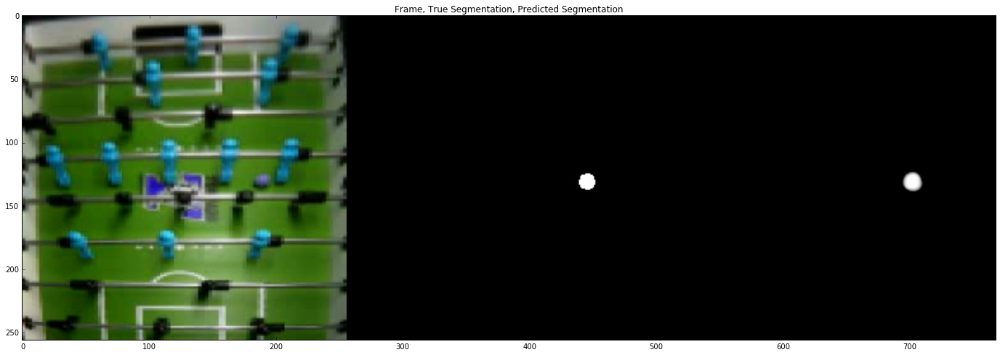


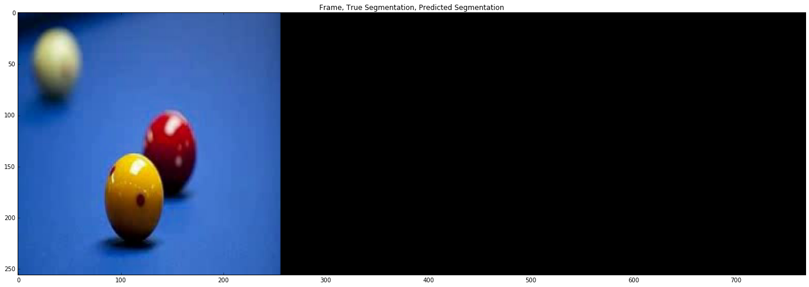


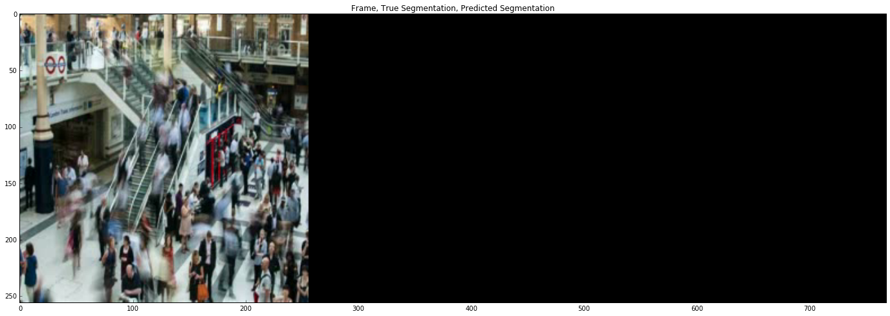


    Wrote model to .\Models\weights_197.hdf
    Epoch 198/198
    

    C:\local\Anaconda3-4.1.1-Windows-x86_64\lib\site-packages\ipykernel\__main__.py:36: UserWarning: Update your `fit_generator` call to the Keras 2 API: `fit_generator(<__main__...., 200, validation_steps=5, verbose=1, class_weight=None, epochs=198, callbacks=None, validation_data=<__main__...., initial_epoch=197, use_multiprocessing=False, max_queue_size=50, workers=50)`
    

    200/200 [==============================] - 236s 1s/step - loss: 2.2609e-04 - balanced_square_error: 2.2609e-04 - mean_squared_error: 5.4168e-04 - val_loss: 1.0772e-04 - val_balanced_square_error: 1.0772e-04 - val_mean_squared_error: 3.9147e-04
    Wrote model to .\Models\weights_198.hdf
    Epoch 199/199
    

    C:\local\Anaconda3-4.1.1-Windows-x86_64\lib\site-packages\ipykernel\__main__.py:36: UserWarning: Update your `fit_generator` call to the Keras 2 API: `fit_generator(<__main__...., 200, validation_steps=5, verbose=1, class_weight=None, epochs=199, callbacks=None, validation_data=<__main__...., initial_epoch=198, use_multiprocessing=False, max_queue_size=50, workers=50)`
    

    200/200 [==============================] - 236s 1s/step - loss: 5.3381e-04 - balanced_square_error: 5.3381e-04 - mean_squared_error: 8.5396e-04 - val_loss: 1.1701e-04 - val_balanced_square_error: 1.1701e-04 - val_mean_squared_error: 4.4985e-04
    Wrote model to .\Models\weights_199.hdf
    Epoch 200/200
    

    C:\local\Anaconda3-4.1.1-Windows-x86_64\lib\site-packages\ipykernel\__main__.py:36: UserWarning: Update your `fit_generator` call to the Keras 2 API: `fit_generator(<__main__...., 200, validation_steps=5, verbose=1, class_weight=None, epochs=200, callbacks=None, validation_data=<__main__...., initial_epoch=199, use_multiprocessing=False, max_queue_size=50, workers=50)`
    

    200/200 [==============================] - 236s 1s/step - loss: 3.6899e-04 - balanced_square_error: 3.6899e-04 - mean_squared_error: 6.8755e-04 - val_loss: 1.0833e-04 - val_balanced_square_error: 1.0833e-04 - val_mean_squared_error: 3.7241e-04
    Wrote model to .\Models\weights_200.hdf
    Epoch 201/201
    

    C:\local\Anaconda3-4.1.1-Windows-x86_64\lib\site-packages\ipykernel\__main__.py:36: UserWarning: Update your `fit_generator` call to the Keras 2 API: `fit_generator(<__main__...., 200, validation_steps=5, verbose=1, class_weight=None, epochs=201, callbacks=None, validation_data=<__main__...., initial_epoch=200, use_multiprocessing=False, max_queue_size=50, workers=50)`
    

    200/200 [==============================] - 231s 1s/step - loss: 4.7762e-04 - balanced_square_error: 4.7762e-04 - mean_squared_error: 7.9221e-04 - val_loss: 1.2128e-04 - val_balanced_square_error: 1.2128e-04 - val_mean_squared_error: 4.6547e-04
    Wrote model to .\Models\weights_201.hdf
    Epoch 202/202
    

    C:\local\Anaconda3-4.1.1-Windows-x86_64\lib\site-packages\ipykernel\__main__.py:36: UserWarning: Update your `fit_generator` call to the Keras 2 API: `fit_generator(<__main__...., 200, validation_steps=5, verbose=1, class_weight=None, epochs=202, callbacks=None, validation_data=<__main__...., initial_epoch=201, use_multiprocessing=False, max_queue_size=50, workers=50)`
    

    200/200 [==============================] - 239s 1s/step - loss: 4.8035e-04 - balanced_square_error: 4.8035e-04 - mean_squared_error: 7.9682e-04 - val_loss: 2.4963e-04 - val_balanced_square_error: 2.4963e-04 - val_mean_squared_error: 5.4882e-04
    


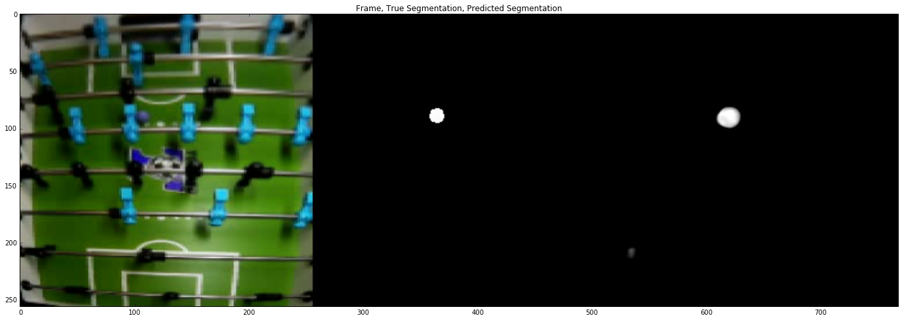


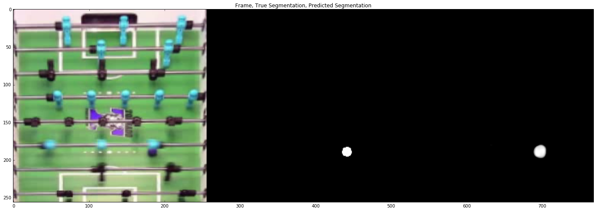


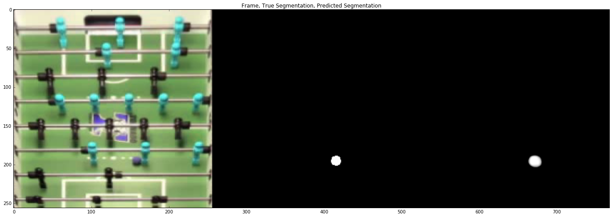


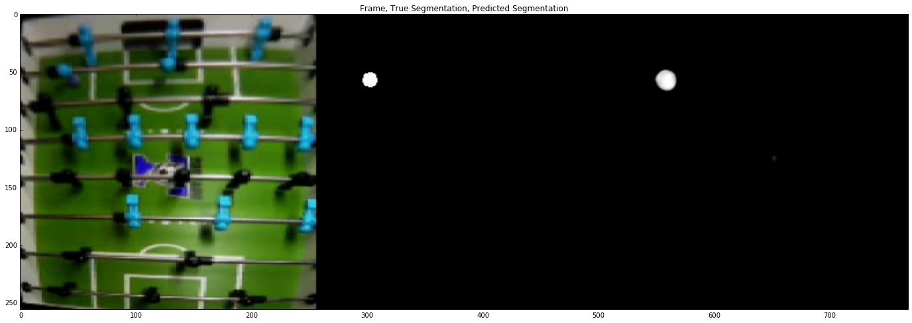


    Wrote model to .\Models\weights_202.hdf
    Epoch 203/203
    

    C:\local\Anaconda3-4.1.1-Windows-x86_64\lib\site-packages\ipykernel\__main__.py:36: UserWarning: Update your `fit_generator` call to the Keras 2 API: `fit_generator(<__main__...., 200, validation_steps=5, verbose=1, class_weight=None, epochs=203, callbacks=None, validation_data=<__main__...., initial_epoch=202, use_multiprocessing=False, max_queue_size=50, workers=50)`
    

    200/200 [==============================] - 236s 1s/step - loss: 3.1983e-04 - balanced_square_error: 3.1983e-04 - mean_squared_error: 6.2830e-04 - val_loss: 1.2556e-04 - val_balanced_square_error: 1.2556e-04 - val_mean_squared_error: 4.8905e-04
    Wrote model to .\Models\weights_203.hdf
    Epoch 204/204
    

    C:\local\Anaconda3-4.1.1-Windows-x86_64\lib\site-packages\ipykernel\__main__.py:36: UserWarning: Update your `fit_generator` call to the Keras 2 API: `fit_generator(<__main__...., 200, validation_steps=5, verbose=1, class_weight=None, epochs=204, callbacks=None, validation_data=<__main__...., initial_epoch=203, use_multiprocessing=False, max_queue_size=50, workers=50)`
    

    200/200 [==============================] - 235s 1s/step - loss: 6.7720e-04 - balanced_square_error: 6.7720e-04 - mean_squared_error: 9.8943e-04 - val_loss: 1.5023e-04 - val_balanced_square_error: 1.5023e-04 - val_mean_squared_error: 5.4680e-04
    Wrote model to .\Models\weights_204.hdf
    Epoch 205/205
    

    C:\local\Anaconda3-4.1.1-Windows-x86_64\lib\site-packages\ipykernel\__main__.py:36: UserWarning: Update your `fit_generator` call to the Keras 2 API: `fit_generator(<__main__...., 200, validation_steps=5, verbose=1, class_weight=None, epochs=205, callbacks=None, validation_data=<__main__...., initial_epoch=204, use_multiprocessing=False, max_queue_size=50, workers=50)`
    

    200/200 [==============================] - 235s 1s/step - loss: 3.4766e-04 - balanced_square_error: 3.4766e-04 - mean_squared_error: 6.5937e-04 - val_loss: 1.3406e-04 - val_balanced_square_error: 1.3406e-04 - val_mean_squared_error: 4.5628e-04
    Wrote model to .\Models\weights_205.hdf
    Epoch 206/206
    

    C:\local\Anaconda3-4.1.1-Windows-x86_64\lib\site-packages\ipykernel\__main__.py:36: UserWarning: Update your `fit_generator` call to the Keras 2 API: `fit_generator(<__main__...., 200, validation_steps=5, verbose=1, class_weight=None, epochs=206, callbacks=None, validation_data=<__main__...., initial_epoch=205, use_multiprocessing=False, max_queue_size=50, workers=50)`
    

    200/200 [==============================] - 238s 1s/step - loss: 2.9118e-04 - balanced_square_error: 2.9118e-04 - mean_squared_error: 6.0322e-04 - val_loss: 1.0863e-04 - val_balanced_square_error: 1.0863e-04 - val_mean_squared_error: 3.8831e-04
    Wrote model to .\Models\weights_206.hdf
    Epoch 207/207
    

    C:\local\Anaconda3-4.1.1-Windows-x86_64\lib\site-packages\ipykernel\__main__.py:36: UserWarning: Update your `fit_generator` call to the Keras 2 API: `fit_generator(<__main__...., 200, validation_steps=5, verbose=1, class_weight=None, epochs=207, callbacks=None, validation_data=<__main__...., initial_epoch=206, use_multiprocessing=False, max_queue_size=50, workers=50)`
    

    200/200 [==============================] - 239s 1s/step - loss: 2.6371e-04 - balanced_square_error: 2.6371e-04 - mean_squared_error: 5.7738e-04 - val_loss: 1.0758e-04 - val_balanced_square_error: 1.0758e-04 - val_mean_squared_error: 3.7044e-04
    


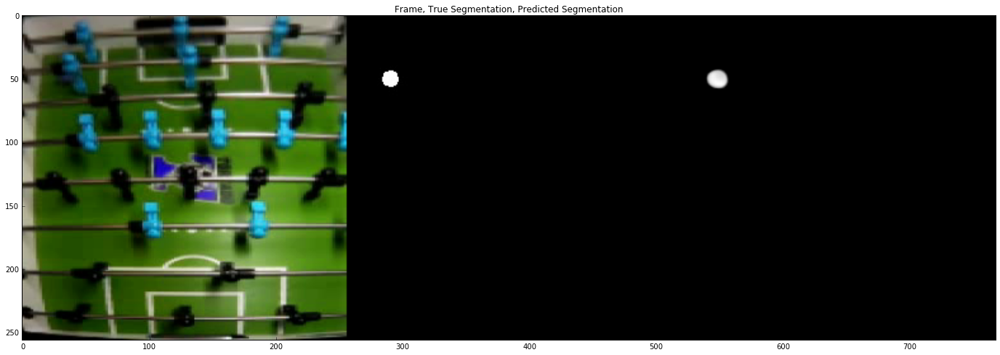


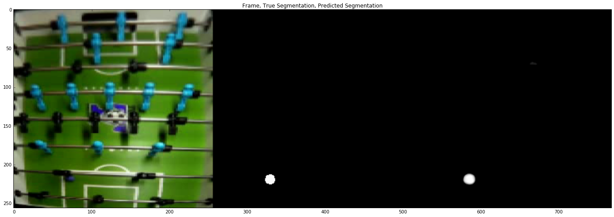


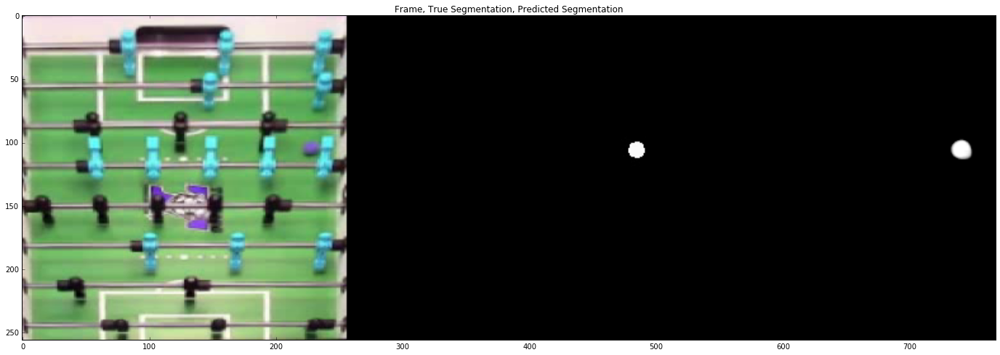


    Wrote model to .\Models\weights_207.hdf
    Epoch 208/208
    

    C:\local\Anaconda3-4.1.1-Windows-x86_64\lib\site-packages\ipykernel\__main__.py:36: UserWarning: Update your `fit_generator` call to the Keras 2 API: `fit_generator(<__main__...., 200, validation_steps=5, verbose=1, class_weight=None, epochs=208, callbacks=None, validation_data=<__main__...., initial_epoch=207, use_multiprocessing=False, max_queue_size=50, workers=50)`
    

    200/200 [==============================] - 238s 1s/step - loss: 4.5491e-04 - balanced_square_error: 4.5491e-04 - mean_squared_error: 7.6484e-04 - val_loss: 1.1660e-04 - val_balanced_square_error: 1.1660e-04 - val_mean_squared_error: 4.0296e-04
    Wrote model to .\Models\weights_208.hdf
    Epoch 209/209
    

    C:\local\Anaconda3-4.1.1-Windows-x86_64\lib\site-packages\ipykernel\__main__.py:36: UserWarning: Update your `fit_generator` call to the Keras 2 API: `fit_generator(<__main__...., 200, validation_steps=5, verbose=1, class_weight=None, epochs=209, callbacks=None, validation_data=<__main__...., initial_epoch=208, use_multiprocessing=False, max_queue_size=50, workers=50)`
    

    200/200 [==============================] - 233s 1s/step - loss: 3.8912e-04 - balanced_square_error: 3.8912e-04 - mean_squared_error: 6.9736e-04 - val_loss: 0.0021 - val_balanced_square_error: 0.0021 - val_mean_squared_error: 0.0024
    Wrote model to .\Models\weights_209.hdf
    Epoch 210/210
    

    C:\local\Anaconda3-4.1.1-Windows-x86_64\lib\site-packages\ipykernel\__main__.py:36: UserWarning: Update your `fit_generator` call to the Keras 2 API: `fit_generator(<__main__...., 200, validation_steps=5, verbose=1, class_weight=None, epochs=210, callbacks=None, validation_data=<__main__...., initial_epoch=209, use_multiprocessing=False, max_queue_size=50, workers=50)`
    

    200/200 [==============================] - 240s 1s/step - loss: 2.5094e-04 - balanced_square_error: 2.5094e-04 - mean_squared_error: 5.6334e-04 - val_loss: 1.2502e-04 - val_balanced_square_error: 1.2502e-04 - val_mean_squared_error: 3.9093e-04
    Wrote model to .\Models\weights_210.hdf
    Epoch 211/211
    

    C:\local\Anaconda3-4.1.1-Windows-x86_64\lib\site-packages\ipykernel\__main__.py:36: UserWarning: Update your `fit_generator` call to the Keras 2 API: `fit_generator(<__main__...., 200, validation_steps=5, verbose=1, class_weight=None, epochs=211, callbacks=None, validation_data=<__main__...., initial_epoch=210, use_multiprocessing=False, max_queue_size=50, workers=50)`
    

    200/200 [==============================] - 238s 1s/step - loss: 6.8444e-04 - balanced_square_error: 6.8444e-04 - mean_squared_error: 9.9830e-04 - val_loss: 1.4500e-04 - val_balanced_square_error: 1.4500e-04 - val_mean_squared_error: 4.9842e-04
    Wrote model to .\Models\weights_211.hdf
    Epoch 212/212
    

    C:\local\Anaconda3-4.1.1-Windows-x86_64\lib\site-packages\ipykernel\__main__.py:36: UserWarning: Update your `fit_generator` call to the Keras 2 API: `fit_generator(<__main__...., 200, validation_steps=5, verbose=1, class_weight=None, epochs=212, callbacks=None, validation_data=<__main__...., initial_epoch=211, use_multiprocessing=False, max_queue_size=50, workers=50)`
    

    200/200 [==============================] - 235s 1s/step - loss: 2.1029e-04 - balanced_square_error: 2.1029e-04 - mean_squared_error: 5.1953e-04 - val_loss: 1.2347e-04 - val_balanced_square_error: 1.2347e-04 - val_mean_squared_error: 4.3813e-04
    


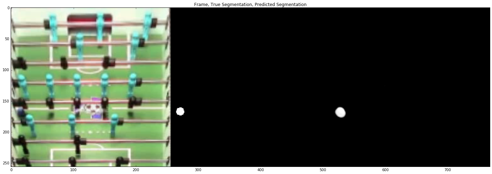


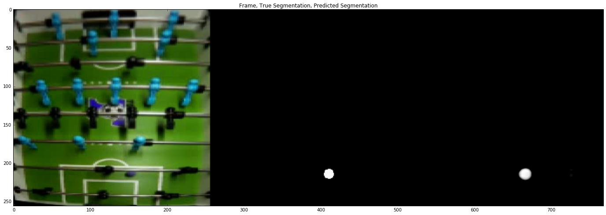


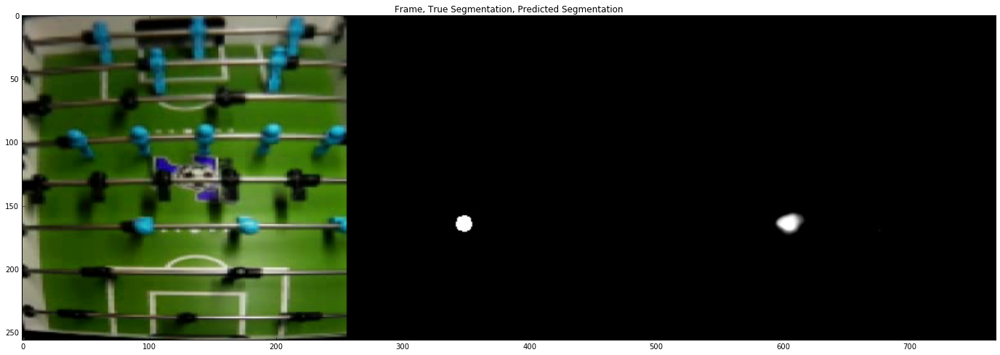


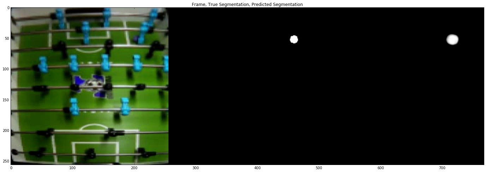


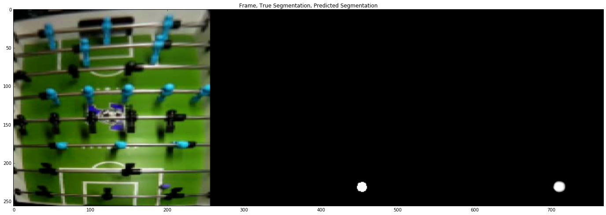


    Wrote model to .\Models\weights_212.hdf
    Epoch 213/213
    

    C:\local\Anaconda3-4.1.1-Windows-x86_64\lib\site-packages\ipykernel\__main__.py:36: UserWarning: Update your `fit_generator` call to the Keras 2 API: `fit_generator(<__main__...., 200, validation_steps=5, verbose=1, class_weight=None, epochs=213, callbacks=None, validation_data=<__main__...., initial_epoch=212, use_multiprocessing=False, max_queue_size=50, workers=50)`
    

    200/200 [==============================] - 242s 1s/step - loss: 4.2762e-04 - balanced_square_error: 4.2762e-04 - mean_squared_error: 7.3353e-04 - val_loss: 1.3802e-04 - val_balanced_square_error: 1.3802e-04 - val_mean_squared_error: 4.1702e-04
    Wrote model to .\Models\weights_213.hdf
    Epoch 214/214
    

    C:\local\Anaconda3-4.1.1-Windows-x86_64\lib\site-packages\ipykernel\__main__.py:36: UserWarning: Update your `fit_generator` call to the Keras 2 API: `fit_generator(<__main__...., 200, validation_steps=5, verbose=1, class_weight=None, epochs=214, callbacks=None, validation_data=<__main__...., initial_epoch=213, use_multiprocessing=False, max_queue_size=50, workers=50)`
    

    200/200 [==============================] - 237s 1s/step - loss: 3.5154e-04 - balanced_square_error: 3.5154e-04 - mean_squared_error: 6.6411e-04 - val_loss: 1.3273e-04 - val_balanced_square_error: 1.3273e-04 - val_mean_squared_error: 4.6278e-04
    Wrote model to .\Models\weights_214.hdf
    Epoch 215/215
    

    C:\local\Anaconda3-4.1.1-Windows-x86_64\lib\site-packages\ipykernel\__main__.py:36: UserWarning: Update your `fit_generator` call to the Keras 2 API: `fit_generator(<__main__...., 200, validation_steps=5, verbose=1, class_weight=None, epochs=215, callbacks=None, validation_data=<__main__...., initial_epoch=214, use_multiprocessing=False, max_queue_size=50, workers=50)`
    

    200/200 [==============================] - 236s 1s/step - loss: 4.8120e-04 - balanced_square_error: 4.8120e-04 - mean_squared_error: 7.9177e-04 - val_loss: 1.1307e-04 - val_balanced_square_error: 1.1307e-04 - val_mean_squared_error: 3.9867e-04
    Wrote model to .\Models\weights_215.hdf
    Epoch 216/216
    

    C:\local\Anaconda3-4.1.1-Windows-x86_64\lib\site-packages\ipykernel\__main__.py:36: UserWarning: Update your `fit_generator` call to the Keras 2 API: `fit_generator(<__main__...., 200, validation_steps=5, verbose=1, class_weight=None, epochs=216, callbacks=None, validation_data=<__main__...., initial_epoch=215, use_multiprocessing=False, max_queue_size=50, workers=50)`
    

    200/200 [==============================] - 240s 1s/step - loss: 4.8670e-04 - balanced_square_error: 4.8670e-04 - mean_squared_error: 7.9012e-04 - val_loss: 0.0010 - val_balanced_square_error: 0.0010 - val_mean_squared_error: 0.0013
    Wrote model to .\Models\weights_216.hdf
    Epoch 217/217
    

    C:\local\Anaconda3-4.1.1-Windows-x86_64\lib\site-packages\ipykernel\__main__.py:36: UserWarning: Update your `fit_generator` call to the Keras 2 API: `fit_generator(<__main__...., 200, validation_steps=5, verbose=1, class_weight=None, epochs=217, callbacks=None, validation_data=<__main__...., initial_epoch=216, use_multiprocessing=False, max_queue_size=50, workers=50)`
    

    200/200 [==============================] - 239s 1s/step - loss: 3.1453e-04 - balanced_square_error: 3.1453e-04 - mean_squared_error: 6.3183e-04 - val_loss: 1.0505e-04 - val_balanced_square_error: 1.0505e-04 - val_mean_squared_error: 3.6417e-04
    


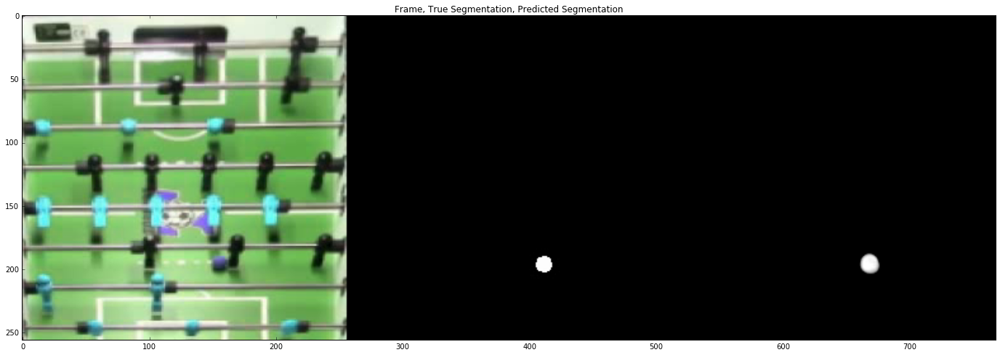


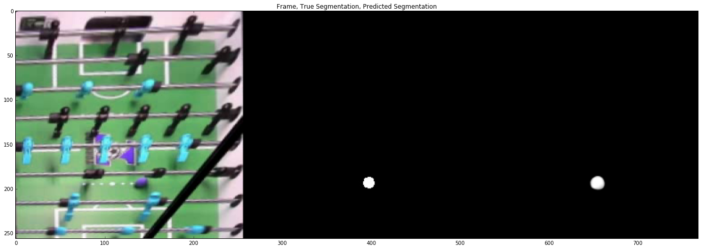


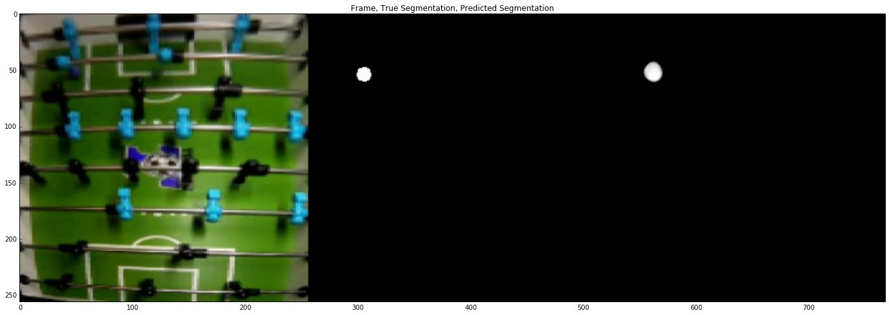


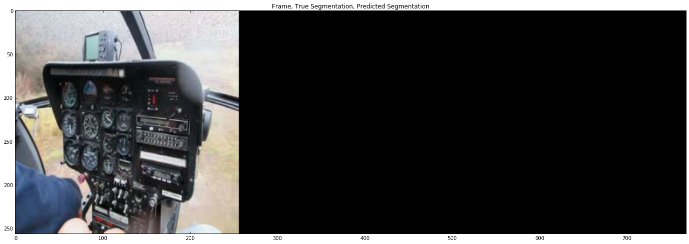


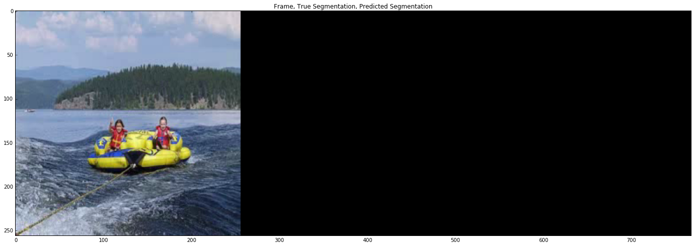


    Wrote model to .\Models\weights_217.hdf
    Epoch 218/218
    

    C:\local\Anaconda3-4.1.1-Windows-x86_64\lib\site-packages\ipykernel\__main__.py:36: UserWarning: Update your `fit_generator` call to the Keras 2 API: `fit_generator(<__main__...., 200, validation_steps=5, verbose=1, class_weight=None, epochs=218, callbacks=None, validation_data=<__main__...., initial_epoch=217, use_multiprocessing=False, max_queue_size=50, workers=50)`
    

    200/200 [==============================] - 239s 1s/step - loss: 2.8598e-04 - balanced_square_error: 2.8598e-04 - mean_squared_error: 6.0760e-04 - val_loss: 1.3714e-04 - val_balanced_square_error: 1.3714e-04 - val_mean_squared_error: 4.4828e-04
    Wrote model to .\Models\weights_218.hdf
    Epoch 219/219
    

    C:\local\Anaconda3-4.1.1-Windows-x86_64\lib\site-packages\ipykernel\__main__.py:36: UserWarning: Update your `fit_generator` call to the Keras 2 API: `fit_generator(<__main__...., 200, validation_steps=5, verbose=1, class_weight=None, epochs=219, callbacks=None, validation_data=<__main__...., initial_epoch=218, use_multiprocessing=False, max_queue_size=50, workers=50)`
    

    200/200 [==============================] - 239s 1s/step - loss: 2.2484e-04 - balanced_square_error: 2.2484e-04 - mean_squared_error: 5.3012e-04 - val_loss: 1.2308e-04 - val_balanced_square_error: 1.2308e-04 - val_mean_squared_error: 4.4095e-04
    Wrote model to .\Models\weights_219.hdf
    Epoch 220/220
    

    C:\local\Anaconda3-4.1.1-Windows-x86_64\lib\site-packages\ipykernel\__main__.py:36: UserWarning: Update your `fit_generator` call to the Keras 2 API: `fit_generator(<__main__...., 200, validation_steps=5, verbose=1, class_weight=None, epochs=220, callbacks=None, validation_data=<__main__...., initial_epoch=219, use_multiprocessing=False, max_queue_size=50, workers=50)`
    

    200/200 [==============================] - 236s 1s/step - loss: 4.0891e-04 - balanced_square_error: 4.0891e-04 - mean_squared_error: 7.2099e-04 - val_loss: 0.0011 - val_balanced_square_error: 0.0011 - val_mean_squared_error: 0.0014
    Wrote model to .\Models\weights_220.hdf
    Epoch 221/221
    

    C:\local\Anaconda3-4.1.1-Windows-x86_64\lib\site-packages\ipykernel\__main__.py:36: UserWarning: Update your `fit_generator` call to the Keras 2 API: `fit_generator(<__main__...., 200, validation_steps=5, verbose=1, class_weight=None, epochs=221, callbacks=None, validation_data=<__main__...., initial_epoch=220, use_multiprocessing=False, max_queue_size=50, workers=50)`
    

    200/200 [==============================] - 235s 1s/step - loss: 5.4870e-04 - balanced_square_error: 5.4870e-04 - mean_squared_error: 8.5316e-04 - val_loss: 1.3634e-04 - val_balanced_square_error: 1.3634e-04 - val_mean_squared_error: 4.9549e-04
    Wrote model to .\Models\weights_221.hdf
    Epoch 222/222
    

    C:\local\Anaconda3-4.1.1-Windows-x86_64\lib\site-packages\ipykernel\__main__.py:36: UserWarning: Update your `fit_generator` call to the Keras 2 API: `fit_generator(<__main__...., 200, validation_steps=5, verbose=1, class_weight=None, epochs=222, callbacks=None, validation_data=<__main__...., initial_epoch=221, use_multiprocessing=False, max_queue_size=50, workers=50)`
    

    200/200 [==============================] - 235s 1s/step - loss: 4.3566e-04 - balanced_square_error: 4.3566e-04 - mean_squared_error: 7.3972e-04 - val_loss: 1.3195e-04 - val_balanced_square_error: 1.3195e-04 - val_mean_squared_error: 4.3429e-04
    


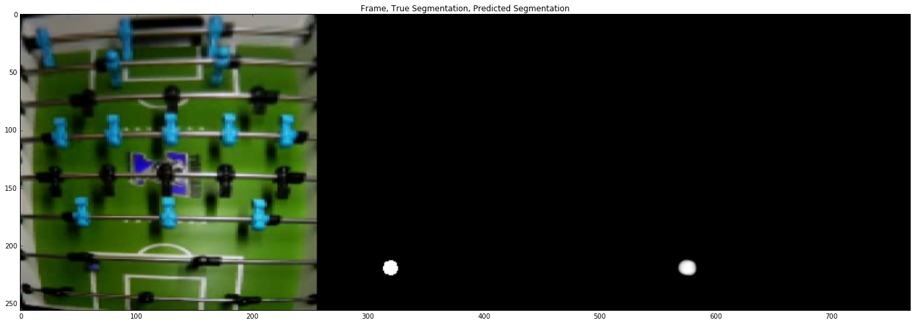


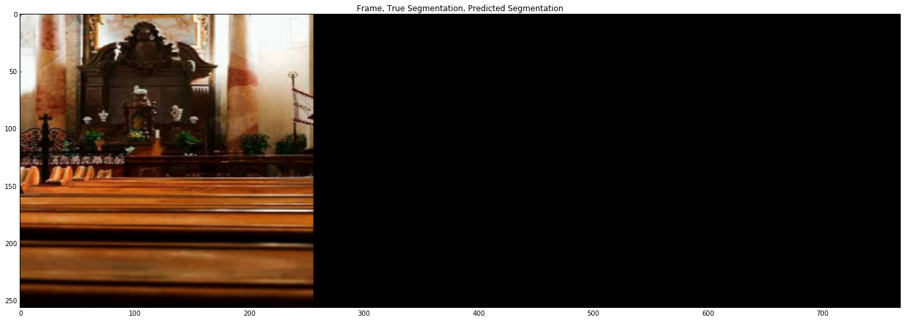


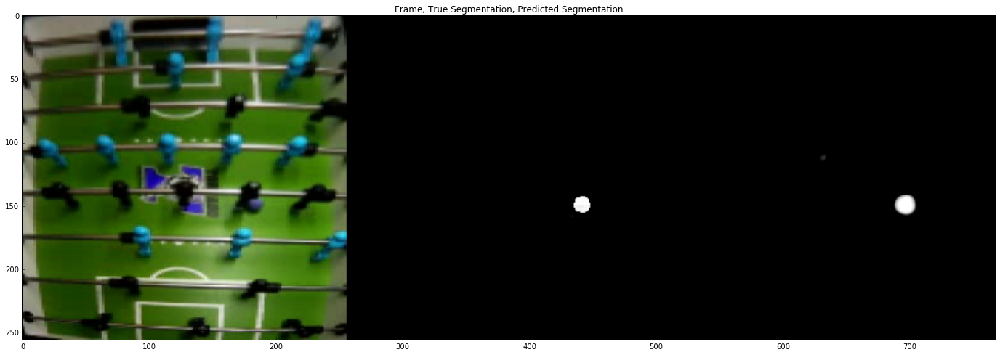


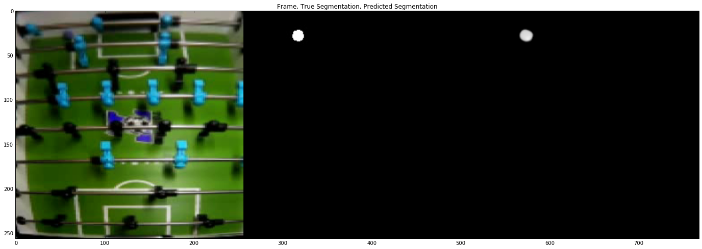


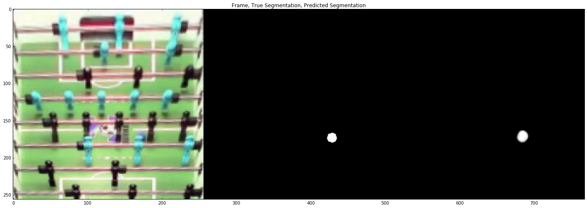


    Wrote model to .\Models\weights_222.hdf
    Epoch 223/223
    

    C:\local\Anaconda3-4.1.1-Windows-x86_64\lib\site-packages\ipykernel\__main__.py:36: UserWarning: Update your `fit_generator` call to the Keras 2 API: `fit_generator(<__main__...., 200, validation_steps=5, verbose=1, class_weight=None, epochs=223, callbacks=None, validation_data=<__main__...., initial_epoch=222, use_multiprocessing=False, max_queue_size=50, workers=50)`
    

    200/200 [==============================] - 238s 1s/step - loss: 2.8201e-04 - balanced_square_error: 2.8201e-04 - mean_squared_error: 5.8575e-04 - val_loss: 1.2417e-04 - val_balanced_square_error: 1.2417e-04 - val_mean_squared_error: 4.3196e-04
    Wrote model to .\Models\weights_223.hdf
    Epoch 224/224
    

    C:\local\Anaconda3-4.1.1-Windows-x86_64\lib\site-packages\ipykernel\__main__.py:36: UserWarning: Update your `fit_generator` call to the Keras 2 API: `fit_generator(<__main__...., 200, validation_steps=5, verbose=1, class_weight=None, epochs=224, callbacks=None, validation_data=<__main__...., initial_epoch=223, use_multiprocessing=False, max_queue_size=50, workers=50)`
    

    200/200 [==============================] - 238s 1s/step - loss: 2.0701e-04 - balanced_square_error: 2.0701e-04 - mean_squared_error: 5.2937e-04 - val_loss: 4.5892e-04 - val_balanced_square_error: 4.5892e-04 - val_mean_squared_error: 8.0019e-04
    Wrote model to .\Models\weights_224.hdf
    Epoch 225/225
    

    C:\local\Anaconda3-4.1.1-Windows-x86_64\lib\site-packages\ipykernel\__main__.py:36: UserWarning: Update your `fit_generator` call to the Keras 2 API: `fit_generator(<__main__...., 200, validation_steps=5, verbose=1, class_weight=None, epochs=225, callbacks=None, validation_data=<__main__...., initial_epoch=224, use_multiprocessing=False, max_queue_size=50, workers=50)`
    

    200/200 [==============================] - 234s 1s/step - loss: 6.7957e-04 - balanced_square_error: 6.7957e-04 - mean_squared_error: 9.9145e-04 - val_loss: 1.0077e-04 - val_balanced_square_error: 1.0077e-04 - val_mean_squared_error: 3.5561e-04
    Wrote model to .\Models\weights_225.hdf
    Epoch 226/226
    

    C:\local\Anaconda3-4.1.1-Windows-x86_64\lib\site-packages\ipykernel\__main__.py:36: UserWarning: Update your `fit_generator` call to the Keras 2 API: `fit_generator(<__main__...., 200, validation_steps=5, verbose=1, class_weight=None, epochs=226, callbacks=None, validation_data=<__main__...., initial_epoch=225, use_multiprocessing=False, max_queue_size=50, workers=50)`
    

    200/200 [==============================] - 236s 1s/step - loss: 2.0356e-04 - balanced_square_error: 2.0356e-04 - mean_squared_error: 5.0212e-04 - val_loss: 1.1233e-04 - val_balanced_square_error: 1.1233e-04 - val_mean_squared_error: 4.1565e-04
    Wrote model to .\Models\weights_226.hdf
    Epoch 227/227
    

    C:\local\Anaconda3-4.1.1-Windows-x86_64\lib\site-packages\ipykernel\__main__.py:36: UserWarning: Update your `fit_generator` call to the Keras 2 API: `fit_generator(<__main__...., 200, validation_steps=5, verbose=1, class_weight=None, epochs=227, callbacks=None, validation_data=<__main__...., initial_epoch=226, use_multiprocessing=False, max_queue_size=50, workers=50)`
    

    200/200 [==============================] - 240s 1s/step - loss: 2.3990e-04 - balanced_square_error: 2.3990e-04 - mean_squared_error: 5.5385e-04 - val_loss: 1.3311e-04 - val_balanced_square_error: 1.3311e-04 - val_mean_squared_error: 4.6100e-04
    


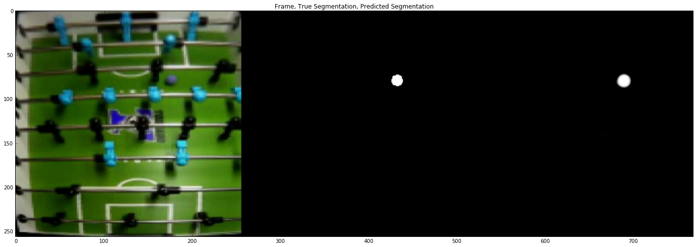


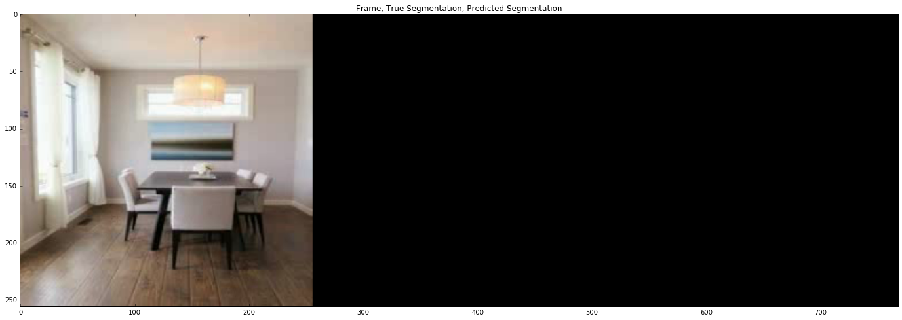


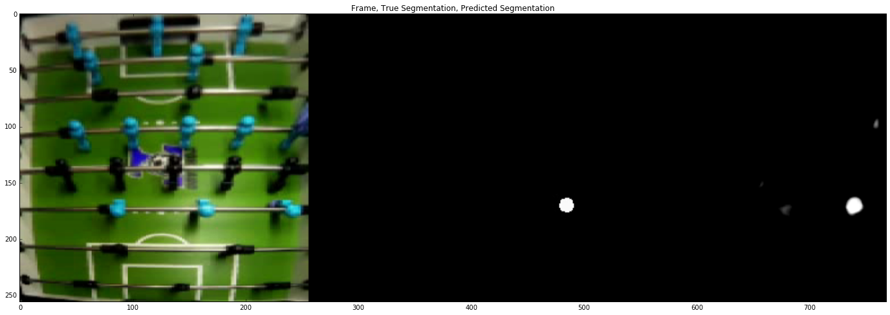


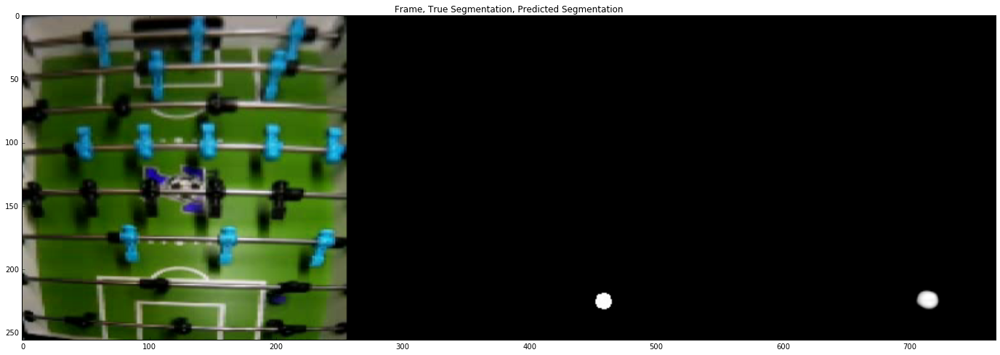


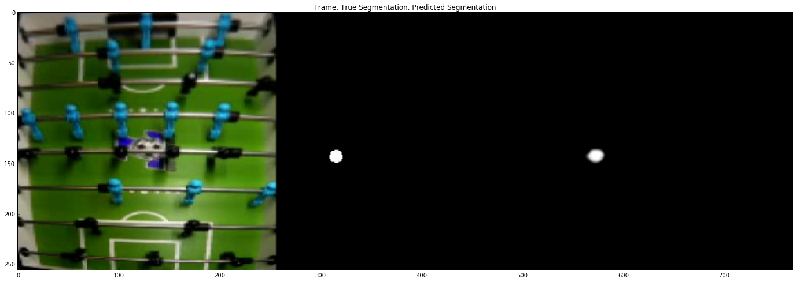


    Wrote model to .\Models\weights_227.hdf
    Epoch 228/228
    

    C:\local\Anaconda3-4.1.1-Windows-x86_64\lib\site-packages\ipykernel\__main__.py:36: UserWarning: Update your `fit_generator` call to the Keras 2 API: `fit_generator(<__main__...., 200, validation_steps=5, verbose=1, class_weight=None, epochs=228, callbacks=None, validation_data=<__main__...., initial_epoch=227, use_multiprocessing=False, max_queue_size=50, workers=50)`
    

    200/200 [==============================] - 239s 1s/step - loss: 2.7498e-04 - balanced_square_error: 2.7498e-04 - mean_squared_error: 5.7897e-04 - val_loss: 1.1384e-04 - val_balanced_square_error: 1.1384e-04 - val_mean_squared_error: 3.9972e-04
    Wrote model to .\Models\weights_228.hdf
    Epoch 229/229
    

    C:\local\Anaconda3-4.1.1-Windows-x86_64\lib\site-packages\ipykernel\__main__.py:36: UserWarning: Update your `fit_generator` call to the Keras 2 API: `fit_generator(<__main__...., 200, validation_steps=5, verbose=1, class_weight=None, epochs=229, callbacks=None, validation_data=<__main__...., initial_epoch=228, use_multiprocessing=False, max_queue_size=50, workers=50)`
    

    200/200 [==============================] - 236s 1s/step - loss: 2.7866e-04 - balanced_square_error: 2.7866e-04 - mean_squared_error: 5.8885e-04 - val_loss: 1.2125e-04 - val_balanced_square_error: 1.2125e-04 - val_mean_squared_error: 3.9828e-04
    Wrote model to .\Models\weights_229.hdf
    Epoch 230/230
    

    C:\local\Anaconda3-4.1.1-Windows-x86_64\lib\site-packages\ipykernel\__main__.py:36: UserWarning: Update your `fit_generator` call to the Keras 2 API: `fit_generator(<__main__...., 200, validation_steps=5, verbose=1, class_weight=None, epochs=230, callbacks=None, validation_data=<__main__...., initial_epoch=229, use_multiprocessing=False, max_queue_size=50, workers=50)`
    

    200/200 [==============================] - 237s 1s/step - loss: 5.6977e-04 - balanced_square_error: 5.6977e-04 - mean_squared_error: 8.6959e-04 - val_loss: 5.9943e-04 - val_balanced_square_error: 5.9943e-04 - val_mean_squared_error: 9.2055e-04
    Wrote model to .\Models\weights_230.hdf
    Epoch 231/231
    

    C:\local\Anaconda3-4.1.1-Windows-x86_64\lib\site-packages\ipykernel\__main__.py:36: UserWarning: Update your `fit_generator` call to the Keras 2 API: `fit_generator(<__main__...., 200, validation_steps=5, verbose=1, class_weight=None, epochs=231, callbacks=None, validation_data=<__main__...., initial_epoch=230, use_multiprocessing=False, max_queue_size=50, workers=50)`
    

    200/200 [==============================] - 242s 1s/step - loss: 2.4725e-04 - balanced_square_error: 2.4725e-04 - mean_squared_error: 5.4741e-04 - val_loss: 1.9984e-04 - val_balanced_square_error: 1.9984e-04 - val_mean_squared_error: 4.7560e-04
    Wrote model to .\Models\weights_231.hdf
    Epoch 232/232
    

    C:\local\Anaconda3-4.1.1-Windows-x86_64\lib\site-packages\ipykernel\__main__.py:36: UserWarning: Update your `fit_generator` call to the Keras 2 API: `fit_generator(<__main__...., 200, validation_steps=5, verbose=1, class_weight=None, epochs=232, callbacks=None, validation_data=<__main__...., initial_epoch=231, use_multiprocessing=False, max_queue_size=50, workers=50)`
    

    200/200 [==============================] - 240s 1s/step - loss: 2.0483e-04 - balanced_square_error: 2.0483e-04 - mean_squared_error: 5.0831e-04 - val_loss: 1.1071e-04 - val_balanced_square_error: 1.1071e-04 - val_mean_squared_error: 4.0480e-04
    


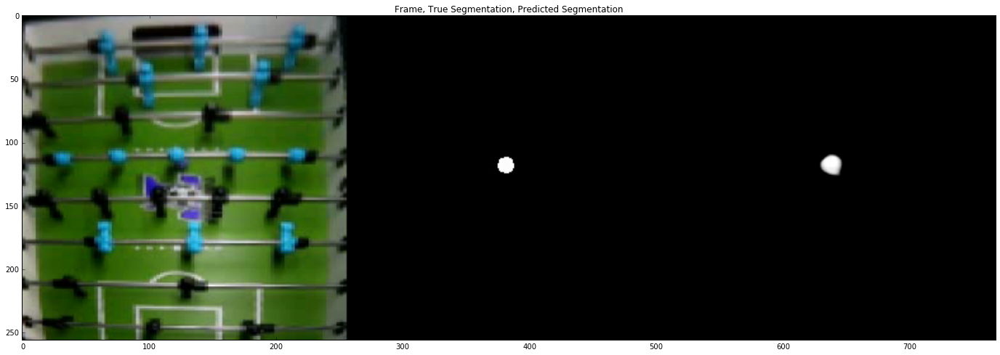


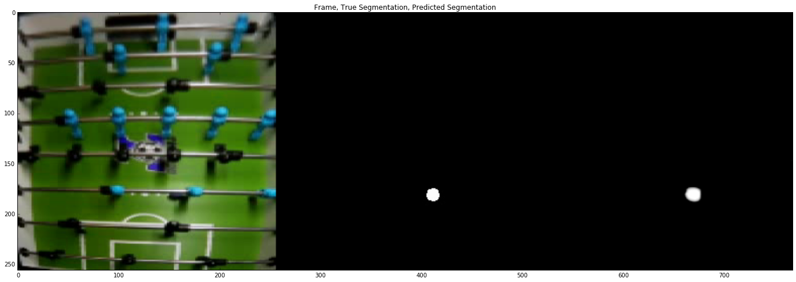


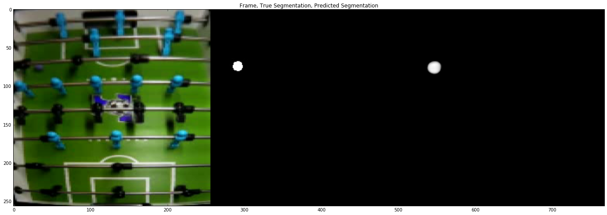


    Wrote model to .\Models\weights_232.hdf
    Epoch 233/233
    

    C:\local\Anaconda3-4.1.1-Windows-x86_64\lib\site-packages\ipykernel\__main__.py:36: UserWarning: Update your `fit_generator` call to the Keras 2 API: `fit_generator(<__main__...., 200, validation_steps=5, verbose=1, class_weight=None, epochs=233, callbacks=None, validation_data=<__main__...., initial_epoch=232, use_multiprocessing=False, max_queue_size=50, workers=50)`
    

    200/200 [==============================] - 240s 1s/step - loss: 3.5525e-04 - balanced_square_error: 3.5525e-04 - mean_squared_error: 6.5679e-04 - val_loss: 1.1467e-04 - val_balanced_square_error: 1.1467e-04 - val_mean_squared_error: 4.3802e-04
    Wrote model to .\Models\weights_233.hdf
    Epoch 234/234
    

    C:\local\Anaconda3-4.1.1-Windows-x86_64\lib\site-packages\ipykernel\__main__.py:36: UserWarning: Update your `fit_generator` call to the Keras 2 API: `fit_generator(<__main__...., 200, validation_steps=5, verbose=1, class_weight=None, epochs=234, callbacks=None, validation_data=<__main__...., initial_epoch=233, use_multiprocessing=False, max_queue_size=50, workers=50)`
    

    200/200 [==============================] - 238s 1s/step - loss: 3.3669e-04 - balanced_square_error: 3.3669e-04 - mean_squared_error: 6.4993e-04 - val_loss: 1.1299e-04 - val_balanced_square_error: 1.1299e-04 - val_mean_squared_error: 4.1571e-04
    Wrote model to .\Models\weights_234.hdf
    Epoch 235/235
    

    C:\local\Anaconda3-4.1.1-Windows-x86_64\lib\site-packages\ipykernel\__main__.py:36: UserWarning: Update your `fit_generator` call to the Keras 2 API: `fit_generator(<__main__...., 200, validation_steps=5, verbose=1, class_weight=None, epochs=235, callbacks=None, validation_data=<__main__...., initial_epoch=234, use_multiprocessing=False, max_queue_size=50, workers=50)`
    

    200/200 [==============================] - 237s 1s/step - loss: 4.3836e-04 - balanced_square_error: 4.3836e-04 - mean_squared_error: 7.4457e-04 - val_loss: 1.1286e-04 - val_balanced_square_error: 1.1286e-04 - val_mean_squared_error: 3.8811e-04
    Wrote model to .\Models\weights_235.hdf
    Epoch 236/236
    

    C:\local\Anaconda3-4.1.1-Windows-x86_64\lib\site-packages\ipykernel\__main__.py:36: UserWarning: Update your `fit_generator` call to the Keras 2 API: `fit_generator(<__main__...., 200, validation_steps=5, verbose=1, class_weight=None, epochs=236, callbacks=None, validation_data=<__main__...., initial_epoch=235, use_multiprocessing=False, max_queue_size=50, workers=50)`
    

    200/200 [==============================] - 235s 1s/step - loss: 4.9924e-04 - balanced_square_error: 4.9924e-04 - mean_squared_error: 8.0152e-04 - val_loss: 1.2158e-04 - val_balanced_square_error: 1.2158e-04 - val_mean_squared_error: 4.4791e-04
    Wrote model to .\Models\weights_236.hdf
    Epoch 237/237
    

    C:\local\Anaconda3-4.1.1-Windows-x86_64\lib\site-packages\ipykernel\__main__.py:36: UserWarning: Update your `fit_generator` call to the Keras 2 API: `fit_generator(<__main__...., 200, validation_steps=5, verbose=1, class_weight=None, epochs=237, callbacks=None, validation_data=<__main__...., initial_epoch=236, use_multiprocessing=False, max_queue_size=50, workers=50)`
    

    200/200 [==============================] - 237s 1s/step - loss: 3.5159e-04 - balanced_square_error: 3.5159e-04 - mean_squared_error: 6.4970e-04 - val_loss: 1.2017e-04 - val_balanced_square_error: 1.2017e-04 - val_mean_squared_error: 4.0589e-04
    


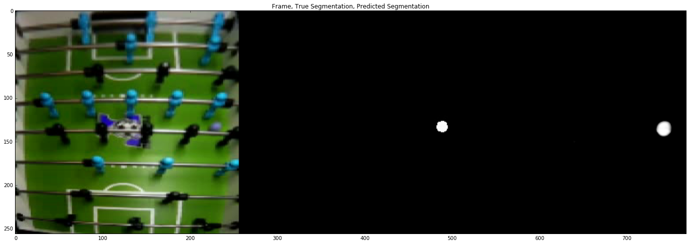


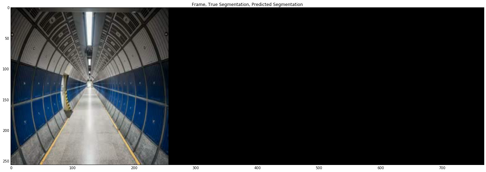


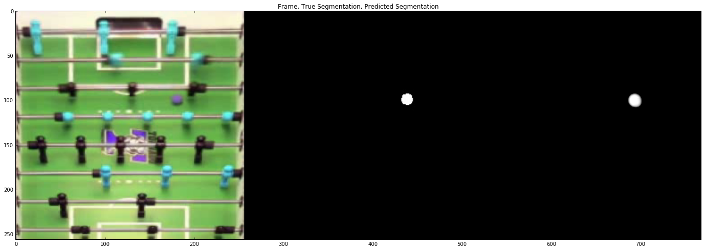


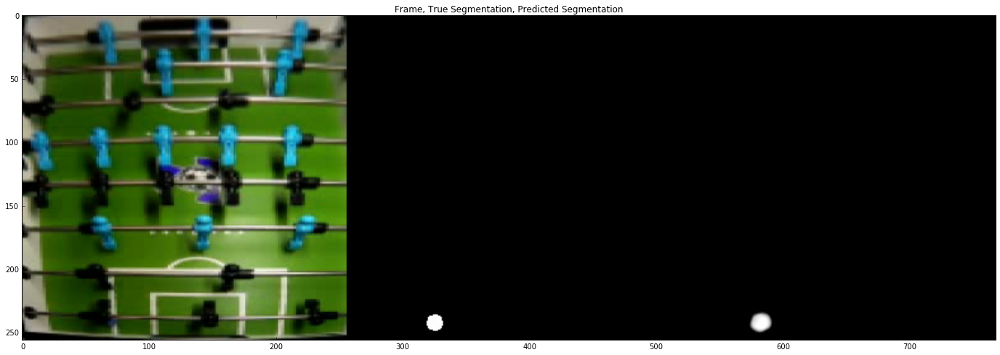


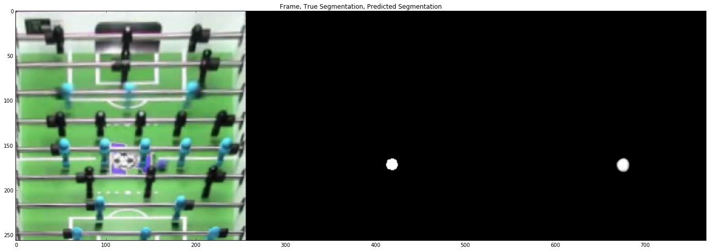


    Wrote model to .\Models\weights_237.hdf
    Epoch 238/238
    

    C:\local\Anaconda3-4.1.1-Windows-x86_64\lib\site-packages\ipykernel\__main__.py:36: UserWarning: Update your `fit_generator` call to the Keras 2 API: `fit_generator(<__main__...., 200, validation_steps=5, verbose=1, class_weight=None, epochs=238, callbacks=None, validation_data=<__main__...., initial_epoch=237, use_multiprocessing=False, max_queue_size=50, workers=50)`
    

    200/200 [==============================] - 236s 1s/step - loss: 4.1543e-04 - balanced_square_error: 4.1543e-04 - mean_squared_error: 7.1475e-04 - val_loss: 1.1773e-04 - val_balanced_square_error: 1.1773e-04 - val_mean_squared_error: 4.0235e-04
    Wrote model to .\Models\weights_238.hdf
    Epoch 239/239
    

    C:\local\Anaconda3-4.1.1-Windows-x86_64\lib\site-packages\ipykernel\__main__.py:36: UserWarning: Update your `fit_generator` call to the Keras 2 API: `fit_generator(<__main__...., 200, validation_steps=5, verbose=1, class_weight=None, epochs=239, callbacks=None, validation_data=<__main__...., initial_epoch=238, use_multiprocessing=False, max_queue_size=50, workers=50)`
    

    200/200 [==============================] - 236s 1s/step - loss: 4.3730e-04 - balanced_square_error: 4.3730e-04 - mean_squared_error: 7.3658e-04 - val_loss: 0.0020 - val_balanced_square_error: 0.0020 - val_mean_squared_error: 0.0024
    Wrote model to .\Models\weights_239.hdf
    Epoch 240/240
    

    C:\local\Anaconda3-4.1.1-Windows-x86_64\lib\site-packages\ipykernel\__main__.py:36: UserWarning: Update your `fit_generator` call to the Keras 2 API: `fit_generator(<__main__...., 200, validation_steps=5, verbose=1, class_weight=None, epochs=240, callbacks=None, validation_data=<__main__...., initial_epoch=239, use_multiprocessing=False, max_queue_size=50, workers=50)`
    

    200/200 [==============================] - 233s 1s/step - loss: 5.2370e-04 - balanced_square_error: 5.2370e-04 - mean_squared_error: 8.2777e-04 - val_loss: 1.1782e-04 - val_balanced_square_error: 1.1782e-04 - val_mean_squared_error: 4.1194e-04
    Wrote model to .\Models\weights_240.hdf
    Epoch 241/241
    

    C:\local\Anaconda3-4.1.1-Windows-x86_64\lib\site-packages\ipykernel\__main__.py:36: UserWarning: Update your `fit_generator` call to the Keras 2 API: `fit_generator(<__main__...., 200, validation_steps=5, verbose=1, class_weight=None, epochs=241, callbacks=None, validation_data=<__main__...., initial_epoch=240, use_multiprocessing=False, max_queue_size=50, workers=50)`
    

    200/200 [==============================] - 238s 1s/step - loss: 2.4723e-04 - balanced_square_error: 2.4723e-04 - mean_squared_error: 5.4900e-04 - val_loss: 1.3869e-04 - val_balanced_square_error: 1.3869e-04 - val_mean_squared_error: 4.7933e-04
    Wrote model to .\Models\weights_241.hdf
    Epoch 242/242
    

    C:\local\Anaconda3-4.1.1-Windows-x86_64\lib\site-packages\ipykernel\__main__.py:36: UserWarning: Update your `fit_generator` call to the Keras 2 API: `fit_generator(<__main__...., 200, validation_steps=5, verbose=1, class_weight=None, epochs=242, callbacks=None, validation_data=<__main__...., initial_epoch=241, use_multiprocessing=False, max_queue_size=50, workers=50)`
    

    200/200 [==============================] - 244s 1s/step - loss: 5.0183e-04 - balanced_square_error: 5.0183e-04 - mean_squared_error: 8.0069e-04 - val_loss: 1.2371e-04 - val_balanced_square_error: 1.2371e-04 - val_mean_squared_error: 4.7033e-04
    


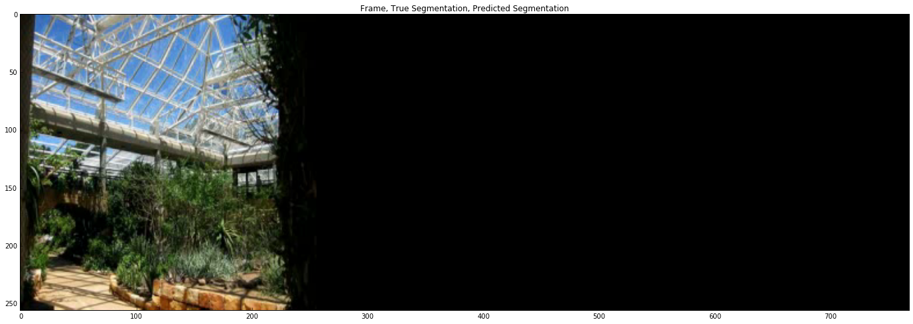


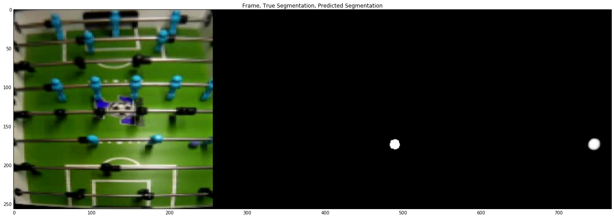


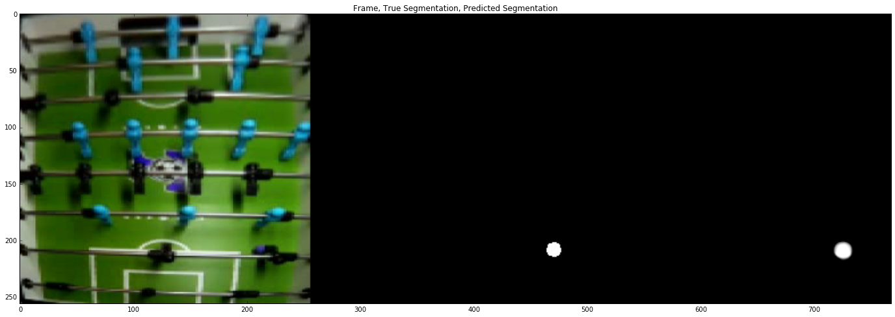


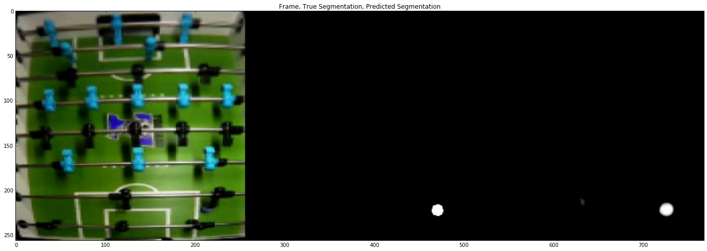


    Wrote model to .\Models\weights_242.hdf
    Epoch 243/243
    

    C:\local\Anaconda3-4.1.1-Windows-x86_64\lib\site-packages\ipykernel\__main__.py:36: UserWarning: Update your `fit_generator` call to the Keras 2 API: `fit_generator(<__main__...., 200, validation_steps=5, verbose=1, class_weight=None, epochs=243, callbacks=None, validation_data=<__main__...., initial_epoch=242, use_multiprocessing=False, max_queue_size=50, workers=50)`
    

    200/200 [==============================] - 246s 1s/step - loss: 1.9220e-04 - balanced_square_error: 1.9220e-04 - mean_squared_error: 5.0506e-04 - val_loss: 1.9140e-04 - val_balanced_square_error: 1.9140e-04 - val_mean_squared_error: 4.4602e-04
    Wrote model to .\Models\weights_243.hdf
    Epoch 244/244
    

    C:\local\Anaconda3-4.1.1-Windows-x86_64\lib\site-packages\ipykernel\__main__.py:36: UserWarning: Update your `fit_generator` call to the Keras 2 API: `fit_generator(<__main__...., 200, validation_steps=5, verbose=1, class_weight=None, epochs=244, callbacks=None, validation_data=<__main__...., initial_epoch=243, use_multiprocessing=False, max_queue_size=50, workers=50)`
    

    200/200 [==============================] - 234s 1s/step - loss: 2.9854e-04 - balanced_square_error: 2.9854e-04 - mean_squared_error: 6.0095e-04 - val_loss: 1.1355e-04 - val_balanced_square_error: 1.1355e-04 - val_mean_squared_error: 4.2434e-04
    Wrote model to .\Models\weights_244.hdf
    Epoch 245/245
    

    C:\local\Anaconda3-4.1.1-Windows-x86_64\lib\site-packages\ipykernel\__main__.py:36: UserWarning: Update your `fit_generator` call to the Keras 2 API: `fit_generator(<__main__...., 200, validation_steps=5, verbose=1, class_weight=None, epochs=245, callbacks=None, validation_data=<__main__...., initial_epoch=244, use_multiprocessing=False, max_queue_size=50, workers=50)`
    

    200/200 [==============================] - 238s 1s/step - loss: 3.3124e-04 - balanced_square_error: 3.3124e-04 - mean_squared_error: 6.3847e-04 - val_loss: 1.1616e-04 - val_balanced_square_error: 1.1616e-04 - val_mean_squared_error: 4.5498e-04
    Wrote model to .\Models\weights_245.hdf
    Epoch 246/246
    

    C:\local\Anaconda3-4.1.1-Windows-x86_64\lib\site-packages\ipykernel\__main__.py:36: UserWarning: Update your `fit_generator` call to the Keras 2 API: `fit_generator(<__main__...., 200, validation_steps=5, verbose=1, class_weight=None, epochs=246, callbacks=None, validation_data=<__main__...., initial_epoch=245, use_multiprocessing=False, max_queue_size=50, workers=50)`
    

    200/200 [==============================] - 237s 1s/step - loss: 6.1744e-04 - balanced_square_error: 6.1744e-04 - mean_squared_error: 9.1712e-04 - val_loss: 8.6111e-05 - val_balanced_square_error: 8.6111e-05 - val_mean_squared_error: 3.3052e-04
    Wrote model to .\Models\weights_246.hdf
    Epoch 247/247
    

    C:\local\Anaconda3-4.1.1-Windows-x86_64\lib\site-packages\ipykernel\__main__.py:36: UserWarning: Update your `fit_generator` call to the Keras 2 API: `fit_generator(<__main__...., 200, validation_steps=5, verbose=1, class_weight=None, epochs=247, callbacks=None, validation_data=<__main__...., initial_epoch=246, use_multiprocessing=False, max_queue_size=50, workers=50)`
    

    200/200 [==============================] - 242s 1s/step - loss: 5.2896e-04 - balanced_square_error: 5.2896e-04 - mean_squared_error: 8.3488e-04 - val_loss: 1.0316e-04 - val_balanced_square_error: 1.0316e-04 - val_mean_squared_error: 3.6759e-04
    


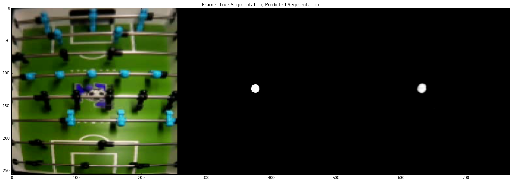


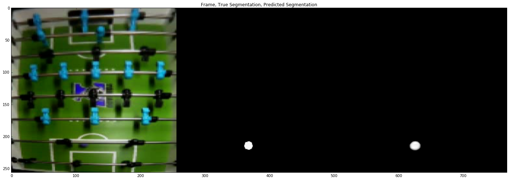


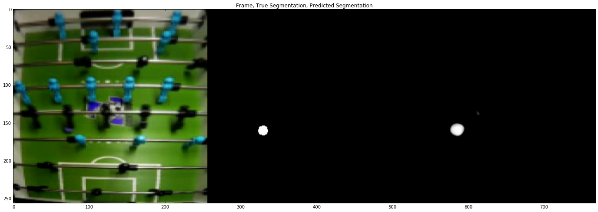


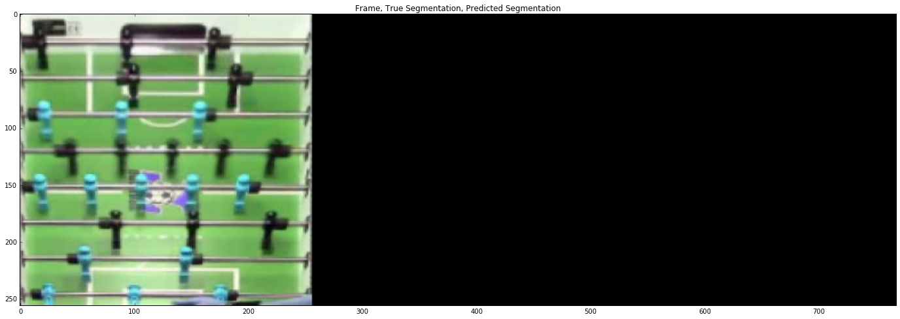


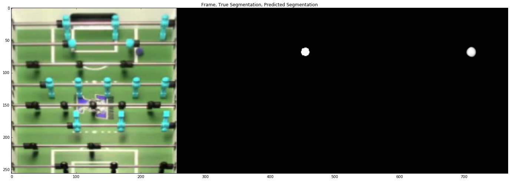


    Wrote model to .\Models\weights_247.hdf
    Epoch 248/248
    

    C:\local\Anaconda3-4.1.1-Windows-x86_64\lib\site-packages\ipykernel\__main__.py:36: UserWarning: Update your `fit_generator` call to the Keras 2 API: `fit_generator(<__main__...., 200, validation_steps=5, verbose=1, class_weight=None, epochs=248, callbacks=None, validation_data=<__main__...., initial_epoch=247, use_multiprocessing=False, max_queue_size=50, workers=50)`
    

    200/200 [==============================] - 237s 1s/step - loss: 3.2465e-04 - balanced_square_error: 3.2465e-04 - mean_squared_error: 6.2356e-04 - val_loss: 1.1646e-04 - val_balanced_square_error: 1.1646e-04 - val_mean_squared_error: 4.6759e-04
    Wrote model to .\Models\weights_248.hdf
    Epoch 249/249
    

    C:\local\Anaconda3-4.1.1-Windows-x86_64\lib\site-packages\ipykernel\__main__.py:36: UserWarning: Update your `fit_generator` call to the Keras 2 API: `fit_generator(<__main__...., 200, validation_steps=5, verbose=1, class_weight=None, epochs=249, callbacks=None, validation_data=<__main__...., initial_epoch=248, use_multiprocessing=False, max_queue_size=50, workers=50)`
    

    200/200 [==============================] - 236s 1s/step - loss: 2.6727e-04 - balanced_square_error: 2.6727e-04 - mean_squared_error: 5.5537e-04 - val_loss: 0.0023 - val_balanced_square_error: 0.0023 - val_mean_squared_error: 0.0026
    Wrote model to .\Models\weights_249.hdf
    Epoch 250/250
    

    C:\local\Anaconda3-4.1.1-Windows-x86_64\lib\site-packages\ipykernel\__main__.py:36: UserWarning: Update your `fit_generator` call to the Keras 2 API: `fit_generator(<__main__...., 200, validation_steps=5, verbose=1, class_weight=None, epochs=250, callbacks=None, validation_data=<__main__...., initial_epoch=249, use_multiprocessing=False, max_queue_size=50, workers=50)`
    

    200/200 [==============================] - 236s 1s/step - loss: 1.9779e-04 - balanced_square_error: 1.9779e-04 - mean_squared_error: 5.0074e-04 - val_loss: 1.2486e-04 - val_balanced_square_error: 1.2486e-04 - val_mean_squared_error: 4.5834e-04
    Wrote model to .\Models\weights_250.hdf
    Epoch 251/251
    

    C:\local\Anaconda3-4.1.1-Windows-x86_64\lib\site-packages\ipykernel\__main__.py:36: UserWarning: Update your `fit_generator` call to the Keras 2 API: `fit_generator(<__main__...., 200, validation_steps=5, verbose=1, class_weight=None, epochs=251, callbacks=None, validation_data=<__main__...., initial_epoch=250, use_multiprocessing=False, max_queue_size=50, workers=50)`
    

    200/200 [==============================] - 239s 1s/step - loss: 6.8104e-04 - balanced_square_error: 6.8104e-04 - mean_squared_error: 9.7839e-04 - val_loss: 1.4641e-04 - val_balanced_square_error: 1.4641e-04 - val_mean_squared_error: 3.9357e-04
    Wrote model to .\Models\weights_251.hdf
    Epoch 252/252
    

    C:\local\Anaconda3-4.1.1-Windows-x86_64\lib\site-packages\ipykernel\__main__.py:36: UserWarning: Update your `fit_generator` call to the Keras 2 API: `fit_generator(<__main__...., 200, validation_steps=5, verbose=1, class_weight=None, epochs=252, callbacks=None, validation_data=<__main__...., initial_epoch=251, use_multiprocessing=False, max_queue_size=50, workers=50)`
    

    200/200 [==============================] - 239s 1s/step - loss: 5.8342e-04 - balanced_square_error: 5.8342e-04 - mean_squared_error: 8.8585e-04 - val_loss: 1.3347e-04 - val_balanced_square_error: 1.3347e-04 - val_mean_squared_error: 4.5065e-04
    


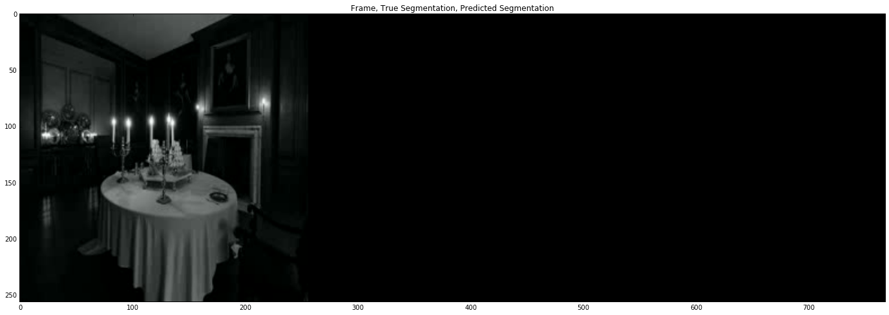


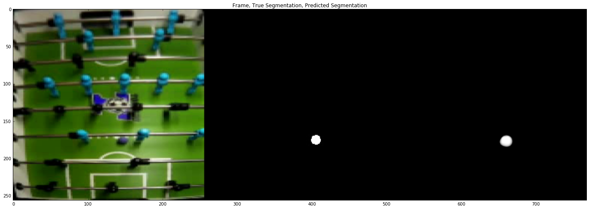


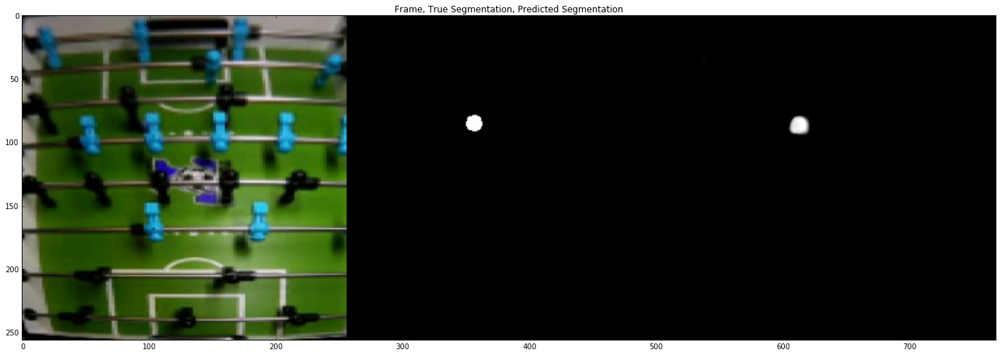


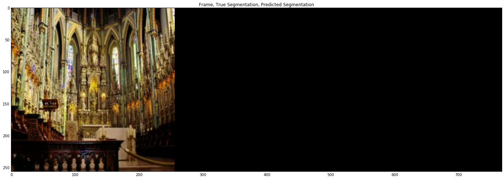


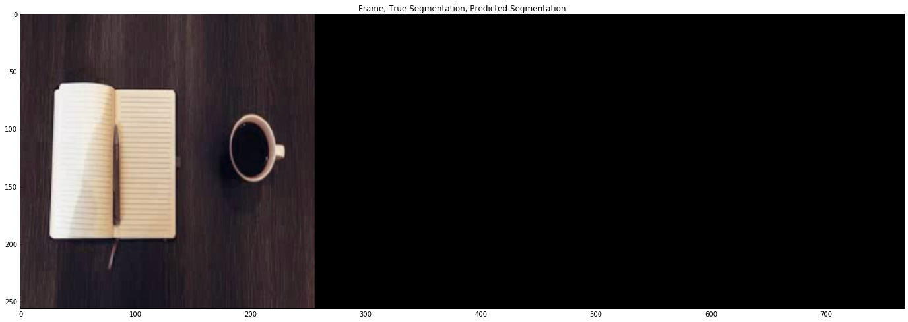


    Wrote model to .\Models\weights_252.hdf
    Epoch 253/253
    

    C:\local\Anaconda3-4.1.1-Windows-x86_64\lib\site-packages\ipykernel\__main__.py:36: UserWarning: Update your `fit_generator` call to the Keras 2 API: `fit_generator(<__main__...., 200, validation_steps=5, verbose=1, class_weight=None, epochs=253, callbacks=None, validation_data=<__main__...., initial_epoch=252, use_multiprocessing=False, max_queue_size=50, workers=50)`
    

    200/200 [==============================] - 240s 1s/step - loss: 2.0330e-04 - balanced_square_error: 2.0330e-04 - mean_squared_error: 5.0167e-04 - val_loss: 1.3058e-04 - val_balanced_square_error: 1.3058e-04 - val_mean_squared_error: 4.3059e-04
    Wrote model to .\Models\weights_253.hdf
    Epoch 254/254
    

    C:\local\Anaconda3-4.1.1-Windows-x86_64\lib\site-packages\ipykernel\__main__.py:36: UserWarning: Update your `fit_generator` call to the Keras 2 API: `fit_generator(<__main__...., 200, validation_steps=5, verbose=1, class_weight=None, epochs=254, callbacks=None, validation_data=<__main__...., initial_epoch=253, use_multiprocessing=False, max_queue_size=50, workers=50)`
    

    200/200 [==============================] - 241s 1s/step - loss: 2.3530e-04 - balanced_square_error: 2.3530e-04 - mean_squared_error: 5.4330e-04 - val_loss: 1.1177e-04 - val_balanced_square_error: 1.1177e-04 - val_mean_squared_error: 3.8688e-04
    Wrote model to .\Models\weights_254.hdf
    Epoch 255/255
    

    C:\local\Anaconda3-4.1.1-Windows-x86_64\lib\site-packages\ipykernel\__main__.py:36: UserWarning: Update your `fit_generator` call to the Keras 2 API: `fit_generator(<__main__...., 200, validation_steps=5, verbose=1, class_weight=None, epochs=255, callbacks=None, validation_data=<__main__...., initial_epoch=254, use_multiprocessing=False, max_queue_size=50, workers=50)`
    

    200/200 [==============================] - 239s 1s/step - loss: 3.1168e-04 - balanced_square_error: 3.1168e-04 - mean_squared_error: 6.0851e-04 - val_loss: 1.1791e-04 - val_balanced_square_error: 1.1791e-04 - val_mean_squared_error: 4.0462e-04
    Wrote model to .\Models\weights_255.hdf
    Epoch 256/256
    

    C:\local\Anaconda3-4.1.1-Windows-x86_64\lib\site-packages\ipykernel\__main__.py:36: UserWarning: Update your `fit_generator` call to the Keras 2 API: `fit_generator(<__main__...., 200, validation_steps=5, verbose=1, class_weight=None, epochs=256, callbacks=None, validation_data=<__main__...., initial_epoch=255, use_multiprocessing=False, max_queue_size=50, workers=50)`
    

    200/200 [==============================] - 235s 1s/step - loss: 3.4300e-04 - balanced_square_error: 3.4300e-04 - mean_squared_error: 6.4345e-04 - val_loss: 9.7173e-05 - val_balanced_square_error: 9.7173e-05 - val_mean_squared_error: 3.6442e-04
    Wrote model to .\Models\weights_256.hdf
    
