```python
#!pip install keras
#!pip install numpy
#!pip install imageio
#!pip install matplotlib
#!pip install opencv-python
#!pip install pydot
#!pip install graphviz
#!pip install azure-cognitiveservices-search-imagesearch
# Note: restart kernel after installing the above.
#!pip freeze

import threading
import sys
import cv2
import sys
import os
import csv
import itertools
import numpy as np
from PIL import Image
import imageio
import itertools as it
import tensorflow as tf
import keras
import pprint as pp
print("Keras version %s" % keras.__version__)
from keras.models import Sequential
from keras.layers import Dense, Dropout
from keras import backend as K

print("Tensorflow version %s" % tf.__version__)

import pprint
pp = pprint.PrettyPrinter(depth=6)
```

    Keras version 2.2.0
    Tensorflow version 1.1.0
    


```python
# Add the standard include path for FoosMetrics
sys.path.insert(0, './../../Code')

import importlib
import process
importlib.reload(process)
```


    <module 'process' from './../../Code\\process.py'>


```python
# Prep the training data
#preprocess = process.Processor("balltracking_prep.json")
#preprocess.process_all()
#process_all = None
```


```python
# Load the data and frames, and add the normalizer
training = process.Processor("balltracking_loader.json")
validation = process.Processor("balltracking_loader.json")
```

    -------- Load random frames ---------
    Creating transform: random_video_loader
    Adding folder '.'
    '.\balltracking_0.avi': 912 frames found.
    '.\balltracking_0.avi': Repeating 20.000000 times.
    '.\random_images_0.avi': 6080 frames found.
    Loaded 12160 frames in loader.
    Distribution:
    {'balltracking_.avi': 18240, 'random_images_.avi': 6080}
    Creating transform: require
    Creating transform: require
    -------- Randomize the frame and segmentation map the exact same way --------
    Creating transform: add_random_number
    -------- Normalize both images on range 0.0 to 1.0 per channel --------
    Creating transform: normalize_channels
    Creating transform: normalize_channels
    -------- 'frame' has input, 'segmentation' has output --------
    -------- Load random frames ---------
    Creating transform: random_video_loader
    Adding folder '.'
    '.\balltracking_0.avi': 912 frames found.
    '.\balltracking_0.avi': Repeating 20.000000 times.
    '.\random_images_0.avi': 6080 frames found.
    Loaded 12160 frames in loader.
    Distribution:
    {'balltracking_.avi': 18240, 'random_images_.avi': 6080}
    Creating transform: require
    Creating transform: require
    -------- Randomize the frame and segmentation map the exact same way --------
    Creating transform: add_random_number
    -------- Normalize both images on range 0.0 to 1.0 per channel --------
    Creating transform: normalize_channels
    Creating transform: normalize_channels
    -------- 'frame' has input, 'segmentation' has output --------
    


```python
import matplotlib
import matplotlib.image as mpimg
import matplotlib.pyplot as plt
%matplotlib inline

def threshold(data, minimum=0.0, maximum=1.0):
    mask = data > maximum
    data[mask] = maximum

    mask = data < minimum
    data[mask] = minimum
    return data

# View the first few frames
for k in range(10):
    data = training.get_next_frame()
    print(data["frame"].shape)
    frames = np.concatenate((data["frame"],data["segmentation"]),1)
    print(frames.shape)
    fig, ax = plt.subplots(figsize=(24, 5))
    plt.imshow(threshold(frames))
    plt.show()
```

    (256, 256, 3)
    (256, 512, 3)
    


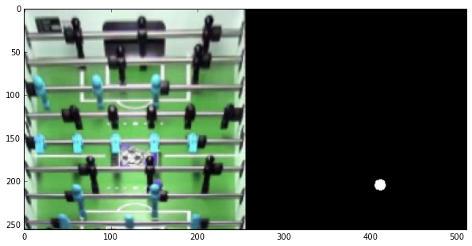


    (256, 256, 3)
    (256, 512, 3)
    


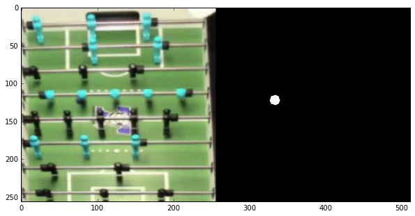


    (256, 256, 3)
    (256, 512, 3)
    


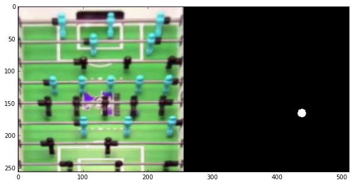


    (256, 256, 3)
    (256, 512, 3)
    


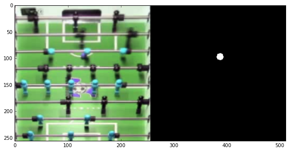


    (256, 256, 3)
    (256, 512, 3)
    


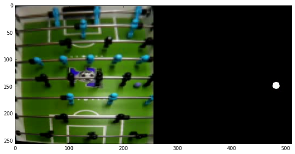


    (256, 256, 3)
    (256, 512, 3)
    


    (256, 256, 3)
    (256, 512, 3)
    


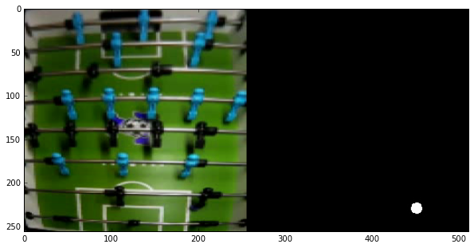


    (256, 256, 3)
    (256, 512, 3)
    


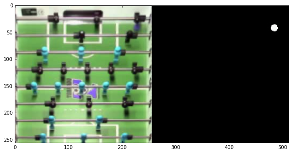


    (256, 256, 3)
    (256, 512, 3)
    


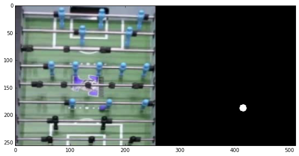


    (256, 256, 3)
    (256, 512, 3)
    


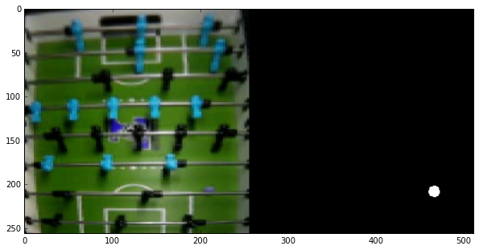


```python
# https://stanford.edu/~shervine/blog/keras-generator-multiprocessing.html
class threadsafe_iter(object):
  """
    Takes an iterator/generator and makes it thread-safe by
    serializing call to the `next` method of given iterator/generator.
    """
  def __init__(self, it):
      self.it = it
      self.lock = threading.Lock()

  def __iter__(self):
      return self

  def __next__(self):
      with self.lock:
          return self.it.__next__()

# https://stanford.edu/~shervine/blog/keras-generator-multiprocessing.html
def threadsafe_generator(f):
  """
    A decorator that takes a generator function and makes it thread-safe.
    """
  def g(*a, **kw):
      return threadsafe_iter(f(*a, **kw))
  return g


# Define our training and validation iterators
@threadsafe_generator
def TrainGen(training):
    while True:
        data = training.get_next_frame()
        if data is not None:
            frame = data["frame"]
            segmentation = data["segmentation"]
            
            while frame is not None:
                yield (frame, segmentation)
                data = training.get_next_frame()
                if data is not None:
                    frame = data["frame"]
                    segmentation = data["segmentation"]
                else:
                    frame = None
                    segmentation = None
                
             
# Generators for training the position
@threadsafe_generator
def TrainBatchGen(batch_size, training):
    gen = TrainGen(training)
    while True:
        # Build the next batch
        batch_frames = np.zeros(shape=(batch_size, 256, 256, 3), dtype=np.float32)
        batch_segmentations = np.zeros(shape=(batch_size, 256, 256, 1), dtype=np.float32)
        for i in range(batch_size):
            (frame, segmentation) = next(gen)
            batch_frames[i,:,:,:] = frame
            batch_segmentations[i,:,:,0] = segmentation[:,:,0]
            
        yield (batch_frames, batch_segmentations)

```


```python
from keras.losses import mean_squared_error


# Utilities for plotting the result and training
def plot_validate(generator, model, count, name):   
    (frames, outputs_true) = next(generator)
    outputs_predicted = model.predict(frames, batch_size=frames[0].shape[0], verbose=0)

    for i in range(5):
        # View the first set
        outputs_predicted_cat = np.concatenate((outputs_predicted[i],outputs_predicted[i],outputs_predicted[i]),2)
        outputs_true_cat = np.concatenate((outputs_true[i],outputs_true[i],outputs_true[i]),2)
        inputs = np.concatenate((frames[i], outputs_true_cat, outputs_predicted_cat),1)

        fig, ax = plt.subplots(figsize=(45, 8))
        h = plt.imshow(threshold(inputs))
        plt.title( 'Frame, True Segmentation, Predicted Segmentation' )
        plt.show()
    


#plot_validate(TrainBatchGen(batch_size, validation), frame_prediction_model, 5, "Epoch validation results %i" % epoch)
```


```python
from keras.models import Sequential
from keras.layers import *
from keras.models import Model
from keras.utils import plot_model
#from IPython.display import SVG, display
#from keras.utils.vis_utils import model_to_dot

import gc
K.clear_session()
gc.collect()


image_height       = 256
image_width        = 256
image_channels     = 3

# Model options
batch_size = 10
lstm_output_size = 300
cnn_kernel_count = 40

# Build an hourglass model. Notes on the model structure:
# Two camera frames as input.
# frame0 -> Conv and pooling until embedding (shared convoluations to both frame0 and frame1)
# frame1 -> Conv and pooling until embedding
# Conv both paths together
# Residual upsampling of frame1 until original size
# Pixel-wise error to frame2 as loss

pp.pprint("Input shape without batches:")
pp.pprint((image_height, image_width, image_channels))

# Used to give fixed names to the layers for transferring the model
conv_num = 0 
pool_num = 0
dense_num = 0


# Create the embedding module, the same model runs both frames
frame_in = Input(shape=(image_height, image_width, image_channels,))
x = Conv2D(cnn_kernel_count, (3, 3),
           padding = "same",
           activation = "relu",)(frame_in)
x = Conv2D(cnn_kernel_count, (3, 3),
           padding = "same",
           activation = "relu",)(x)
res0 = x

x = MaxPooling2D((2, 2))(x)

x = Conv2D(cnn_kernel_count, (3, 3),
           padding = "same",
           activation = "relu",)(x)
x = Conv2D(cnn_kernel_count, (3, 3),
           padding = "same",
           activation = "relu",)(x)
res1 = x

x = MaxPooling2D((2, 2))(x)


x = Conv2D(cnn_kernel_count, (3, 3),
           padding = "same",
           activation = "relu",)(x)
x = Conv2D(cnn_kernel_count, (3, 3),
           padding = "same",
           activation = "relu",)(x)
res2 = x
x = MaxPooling2D((2, 2))(x)


x = Conv2D(cnn_kernel_count, (3, 3),
           padding = "same",
           activation = "relu",)(x)
x = Conv2D(cnn_kernel_count, (3, 3),
           padding = "same",
           activation = "relu",)(x)
res3 = x
x = MaxPooling2D((2, 2))(x)


x = Conv2D(cnn_kernel_count, (3, 3),
           padding = "same",
           activation = "relu",)(x)
x = Conv2D(cnn_kernel_count, (3, 3),
           padding = "same",
           activation = "relu",)(x)
res4 = x
x = MaxPooling2D((2, 2))(x)


x = Conv2D(cnn_kernel_count, (3, 3),
           padding = "same",
           activation = "relu",)(x)
x = Conv2D(cnn_kernel_count, (3, 3),
           padding = "same",
           activation = "relu",)(x)
res5 = x
x = MaxPooling2D((2, 2))(x)


# Start the upsampling and residual joining

x = Conv2D(cnn_kernel_count, (3, 3),
           padding = "same",
           activation = "relu",)(x)
x = Conv2D(cnn_kernel_count, (3, 3),
           padding = "same",
           activation = "relu",)(x)

# Create the upsampling stages, feeding residual from frame1
x = UpSampling2D(size=(2, 2), data_format=None)(x)
#res5 = Cropping2D(cropping=(((0, 0), (1, 0))), data_format=None)(res4_b)
x = keras.layers.concatenate([x, res5])
x = Conv2D(cnn_kernel_count, (3, 3),
           padding = "same",
           activation = "relu",)(x)
x = Conv2D(cnn_kernel_count, (3, 3),
           padding = "same",
           activation = "relu",)(x)

x = UpSampling2D(size=(2, 2), data_format=None)(x)
#res5 = Cropping2D(cropping=(((0, 0), (1, 0))), data_format=None)(res4_b)
x = keras.layers.concatenate([x, res4])
x = Conv2D(cnn_kernel_count, (3, 3),
           padding = "same",
           activation = "relu",)(x)
x = Conv2D(cnn_kernel_count, (3, 3),
           padding = "same",
           activation = "relu",)(x)

x = UpSampling2D(size=(2, 2), data_format=None)(x)
#res5 = Cropping2D(cropping=(((0, 0), (1, 0))), data_format=None)(res4_b)
x = keras.layers.concatenate([x, res3])
x = Conv2D(cnn_kernel_count, (3, 3),
           padding = "same",
           activation = "relu",)(x)
x = Conv2D(cnn_kernel_count, (3, 3),
           padding = "same",
           activation = "relu",)(x)

x = UpSampling2D(size=(2, 2), data_format=None)(x)
#res5 = Cropping2D(cropping=(((0, 0), (1, 0))), data_format=None)(res4_b)
x = keras.layers.concatenate([x, res2])
x = Conv2D(cnn_kernel_count, (3, 3),
           padding = "same",
           activation = "relu",)(x)
x = Conv2D(cnn_kernel_count, (3, 3),
           padding = "same",
           activation = "relu",)(x)

x = UpSampling2D(size=(2, 2), data_format=None)(x)
#res5 = Cropping2D(cropping=(((0, 0), (1, 0))), data_format=None)(res4_b)
x = keras.layers.concatenate([x, res1])
x = Conv2D(cnn_kernel_count, (3, 3),
           padding = "same",
           activation = "relu",)(x)
x = Conv2D(cnn_kernel_count, (3, 3),
           padding = "same",
           activation = "relu",)(x)

x = UpSampling2D(size=(2, 2), data_format=None)(x)
#res5 = Cropping2D(cropping=(((0, 0), (1, 0))), data_format=None)(res4_b)
x = keras.layers.concatenate([x, res0])
x = Conv2D(cnn_kernel_count, (3, 3),
           padding = "same",
           activation = "relu",)(x)
x = Conv2D(cnn_kernel_count, (3, 3),
           padding = "same",
           activation = "relu",)(x)


# One channel output
x = Conv2D(1, (1, 1),
           padding = "same",
           activation = "relu",)(x)

frame_prediction_model = Model([frame_in], [x])


frame_prediction_model.compile(optimizer=keras.optimizers.RMSprop(lr=0.00002),
#model.compile(optimizer=keras.optimizers.adam(),
              loss=mean_squared_error,
              metrics=[mean_squared_error])


frame_prediction_model.summary()

#plot_model(frame_prediction_model, to_file='model.png')
#from IPython.display import SVG, display
#from keras.utils.vis_utils import model_to_dot
#display(SVG(model_to_dot(frame_prediction_model).create(prog='dot', format='svg')))

# Train the model to predict the future position. This is the control signal to the robot AI
WEIGHTS_FNAME = '.\\Goalie3Frames\\weights_%i.hdf'
MODELS_FNAME = '.\\Goalie3Frames\\models_%i.h5'
```

    'Input shape without batches:'
    (256, 256, 3)
    __________________________________________________________________________________________________
    Layer (type)                    Output Shape         Param #     Connected to                     
    ==================================================================================================
    input_1 (InputLayer)            (None, 256, 256, 3)  0                                            
    __________________________________________________________________________________________________
    conv2d_1 (Conv2D)               (None, 256, 256, 40) 1120        input_1[0][0]                    
    __________________________________________________________________________________________________
    conv2d_2 (Conv2D)               (None, 256, 256, 40) 14440       conv2d_1[0][0]                   
    __________________________________________________________________________________________________
    max_pooling2d_1 (MaxPooling2D)  (None, 128, 128, 40) 0           conv2d_2[0][0]                   
    __________________________________________________________________________________________________
    conv2d_3 (Conv2D)               (None, 128, 128, 40) 14440       max_pooling2d_1[0][0]            
    __________________________________________________________________________________________________
    conv2d_4 (Conv2D)               (None, 128, 128, 40) 14440       conv2d_3[0][0]                   
    __________________________________________________________________________________________________
    max_pooling2d_2 (MaxPooling2D)  (None, 64, 64, 40)   0           conv2d_4[0][0]                   
    __________________________________________________________________________________________________
    conv2d_5 (Conv2D)               (None, 64, 64, 40)   14440       max_pooling2d_2[0][0]            
    __________________________________________________________________________________________________
    conv2d_6 (Conv2D)               (None, 64, 64, 40)   14440       conv2d_5[0][0]                   
    __________________________________________________________________________________________________
    max_pooling2d_3 (MaxPooling2D)  (None, 32, 32, 40)   0           conv2d_6[0][0]                   
    __________________________________________________________________________________________________
    conv2d_7 (Conv2D)               (None, 32, 32, 40)   14440       max_pooling2d_3[0][0]            
    __________________________________________________________________________________________________
    conv2d_8 (Conv2D)               (None, 32, 32, 40)   14440       conv2d_7[0][0]                   
    __________________________________________________________________________________________________
    max_pooling2d_4 (MaxPooling2D)  (None, 16, 16, 40)   0           conv2d_8[0][0]                   
    __________________________________________________________________________________________________
    conv2d_9 (Conv2D)               (None, 16, 16, 40)   14440       max_pooling2d_4[0][0]            
    __________________________________________________________________________________________________
    conv2d_10 (Conv2D)              (None, 16, 16, 40)   14440       conv2d_9[0][0]                   
    __________________________________________________________________________________________________
    max_pooling2d_5 (MaxPooling2D)  (None, 8, 8, 40)     0           conv2d_10[0][0]                  
    __________________________________________________________________________________________________
    conv2d_11 (Conv2D)              (None, 8, 8, 40)     14440       max_pooling2d_5[0][0]            
    __________________________________________________________________________________________________
    conv2d_12 (Conv2D)              (None, 8, 8, 40)     14440       conv2d_11[0][0]                  
    __________________________________________________________________________________________________
    max_pooling2d_6 (MaxPooling2D)  (None, 4, 4, 40)     0           conv2d_12[0][0]                  
    __________________________________________________________________________________________________
    conv2d_13 (Conv2D)              (None, 4, 4, 40)     14440       max_pooling2d_6[0][0]            
    __________________________________________________________________________________________________
    conv2d_14 (Conv2D)              (None, 4, 4, 40)     14440       conv2d_13[0][0]                  
    __________________________________________________________________________________________________
    up_sampling2d_1 (UpSampling2D)  (None, 8, 8, 40)     0           conv2d_14[0][0]                  
    __________________________________________________________________________________________________
    concatenate_1 (Concatenate)     (None, 8, 8, 80)     0           up_sampling2d_1[0][0]            
                                                                     conv2d_12[0][0]                  
    __________________________________________________________________________________________________
    conv2d_15 (Conv2D)              (None, 8, 8, 40)     28840       concatenate_1[0][0]              
    __________________________________________________________________________________________________
    conv2d_16 (Conv2D)              (None, 8, 8, 40)     14440       conv2d_15[0][0]                  
    __________________________________________________________________________________________________
    up_sampling2d_2 (UpSampling2D)  (None, 16, 16, 40)   0           conv2d_16[0][0]                  
    __________________________________________________________________________________________________
    concatenate_2 (Concatenate)     (None, 16, 16, 80)   0           up_sampling2d_2[0][0]            
                                                                     conv2d_10[0][0]                  
    __________________________________________________________________________________________________
    conv2d_17 (Conv2D)              (None, 16, 16, 40)   28840       concatenate_2[0][0]              
    __________________________________________________________________________________________________
    conv2d_18 (Conv2D)              (None, 16, 16, 40)   14440       conv2d_17[0][0]                  
    __________________________________________________________________________________________________
    up_sampling2d_3 (UpSampling2D)  (None, 32, 32, 40)   0           conv2d_18[0][0]                  
    __________________________________________________________________________________________________
    concatenate_3 (Concatenate)     (None, 32, 32, 80)   0           up_sampling2d_3[0][0]            
                                                                     conv2d_8[0][0]                   
    __________________________________________________________________________________________________
    conv2d_19 (Conv2D)              (None, 32, 32, 40)   28840       concatenate_3[0][0]              
    __________________________________________________________________________________________________
    conv2d_20 (Conv2D)              (None, 32, 32, 40)   14440       conv2d_19[0][0]                  
    __________________________________________________________________________________________________
    up_sampling2d_4 (UpSampling2D)  (None, 64, 64, 40)   0           conv2d_20[0][0]                  
    __________________________________________________________________________________________________
    concatenate_4 (Concatenate)     (None, 64, 64, 80)   0           up_sampling2d_4[0][0]            
                                                                     conv2d_6[0][0]                   
    __________________________________________________________________________________________________
    conv2d_21 (Conv2D)              (None, 64, 64, 40)   28840       concatenate_4[0][0]              
    __________________________________________________________________________________________________
    conv2d_22 (Conv2D)              (None, 64, 64, 40)   14440       conv2d_21[0][0]                  
    __________________________________________________________________________________________________
    up_sampling2d_5 (UpSampling2D)  (None, 128, 128, 40) 0           conv2d_22[0][0]                  
    __________________________________________________________________________________________________
    concatenate_5 (Concatenate)     (None, 128, 128, 80) 0           up_sampling2d_5[0][0]            
                                                                     conv2d_4[0][0]                   
    __________________________________________________________________________________________________
    conv2d_23 (Conv2D)              (None, 128, 128, 40) 28840       concatenate_5[0][0]              
    __________________________________________________________________________________________________
    conv2d_24 (Conv2D)              (None, 128, 128, 40) 14440       conv2d_23[0][0]                  
    __________________________________________________________________________________________________
    up_sampling2d_6 (UpSampling2D)  (None, 256, 256, 40) 0           conv2d_24[0][0]                  
    __________________________________________________________________________________________________
    concatenate_6 (Concatenate)     (None, 256, 256, 80) 0           up_sampling2d_6[0][0]            
                                                                     conv2d_2[0][0]                   
    __________________________________________________________________________________________________
    conv2d_25 (Conv2D)              (None, 256, 256, 40) 28840       concatenate_6[0][0]              
    __________________________________________________________________________________________________
    conv2d_26 (Conv2D)              (None, 256, 256, 40) 14440       conv2d_25[0][0]                  
    __________________________________________________________________________________________________
    conv2d_27 (Conv2D)              (None, 256, 256, 1)  41          conv2d_26[0][0]                  
    ==================================================================================================
    Total params: 448,561
    Trainable params: 448,561
    Non-trainable params: 0
    __________________________________________________________________________________________________
    


```python
def balanced_square_error(y_true, y_pred):
    above_loss = 0.003 * K.mean( K.square( K.clip(y_pred - y_true, 0.0, 100000) ) , axis=-1)
    below_loss = K.mean( K.square( K.clip(y_pred - y_true, -100000, 0.0) ) , axis=-1)
    return above_loss + below_loss

frame_prediction_model.compile(optimizer=keras.optimizers.RMSprop(lr=0.00001),
              loss=balanced_square_error,
              metrics=[balanced_square_error,mean_squared_error])

# Was ran on the above simple model, not pre-trained Inceptionv3 run.
epoch = 0
#batches_validation_per_epoch = 50
#batches_training_per_epoch = 400
batch_size = 10
batches_training_per_epoch = 200
batches_validation_per_epoch = 5
print("Batch size %i: %i training batches, %i validation batches" % (batch_size, batches_training_per_epoch, batches_validation_per_epoch) )
WEIGHTS_FNAME = '.\\Models\\weights_%i.hdf'
MODELS_FNAME = '.\\Models\\models_%i.h5'

for i in range(50):
    frame_prediction_model.fit_generator(
        TrainBatchGen(batch_size, training=training),
        batches_training_per_epoch,
        epochs=epoch+1,
        verbose=1,
        callbacks=None,
        class_weight=None,
        max_q_size=50,
        workers=50,
        validation_data=TrainBatchGen(batch_size, validation),
        validation_steps = batches_validation_per_epoch,
        pickle_safe=False,
        initial_epoch=epoch)
    
    epoch += 1
    
    # Plot occasional validation data plot
    if i % 5 == 0:
        plot_validate(TrainBatchGen(batch_size, validation), frame_prediction_model, 50, "Epoch validation results %i" % epoch)
    
    # Save the model
    frame_prediction_model.save_weights(WEIGHTS_FNAME % epoch)
    frame_prediction_model.save(MODELS_FNAME % epoch)
    print(("Wrote model to " + WEIGHTS_FNAME )  % epoch)


```

    Batch size 10: 200 training batches, 5 validation batches
    

    C:\local\Anaconda3-4.1.1-Windows-x86_64\lib\site-packages\ipykernel\__main__.py:34: UserWarning: Update your `fit_generator` call to the Keras 2 API: `fit_generator(<__main__...., 200, verbose=1, callbacks=None, epochs=1, max_queue_size=50, validation_data=<__main__...., workers=50, use_multiprocessing=False, class_weight=None, validation_steps=5, initial_epoch=0)`
    

    Epoch 1/1
    200/200 [==============================] - 256s 1s/step - loss: 0.0015 - balanced_square_error: 0.0015 - mean_squared_error: 0.0381 - val_loss: 9.9346e-04 - val_balanced_square_error: 9.9346e-04 - val_mean_squared_error: 0.0873
    


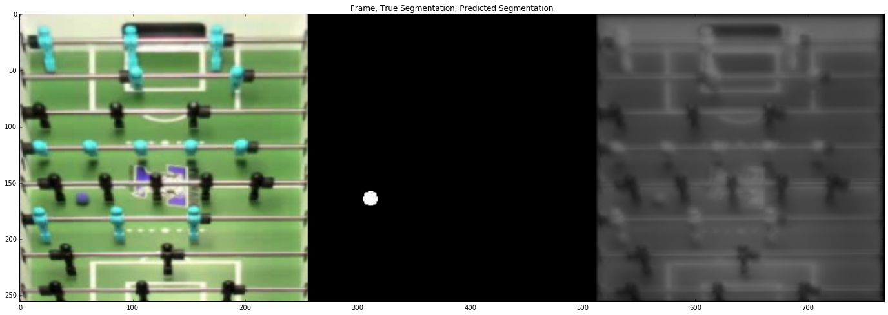


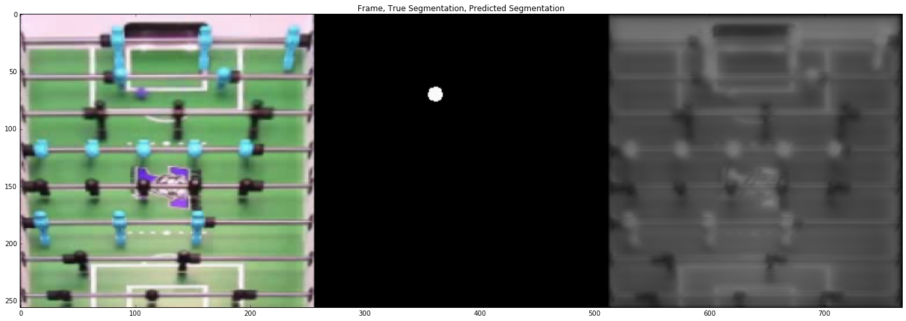


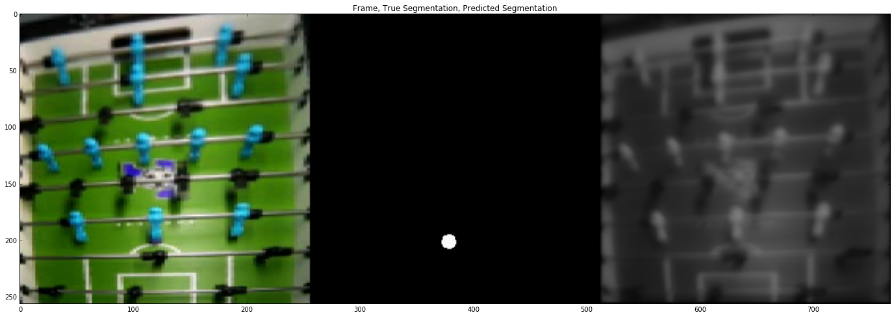


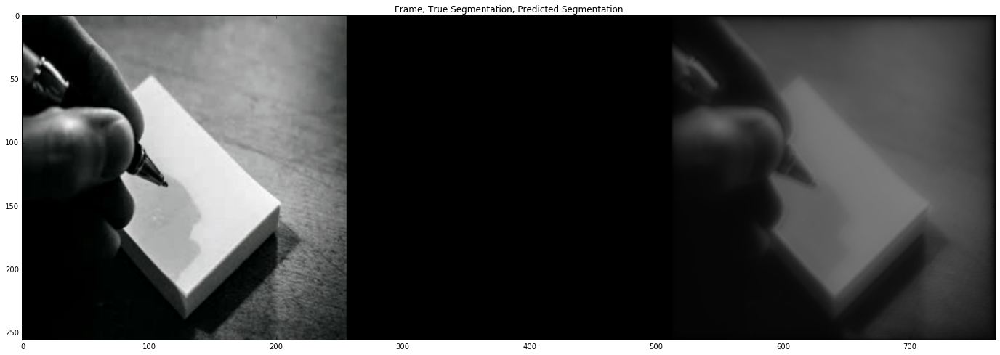


    Wrote model to .\Models\weights_1.hdf
    Epoch 2/2
    

    C:\local\Anaconda3-4.1.1-Windows-x86_64\lib\site-packages\ipykernel\__main__.py:34: UserWarning: Update your `fit_generator` call to the Keras 2 API: `fit_generator(<__main__...., 200, verbose=1, callbacks=None, epochs=2, max_queue_size=50, validation_data=<__main__...., workers=50, use_multiprocessing=False, class_weight=None, validation_steps=5, initial_epoch=1)`
    

    200/200 [==============================] - 226s 1s/step - loss: 9.4421e-04 - balanced_square_error: 9.4421e-04 - mean_squared_error: 0.1030 - val_loss: 7.1832e-04 - val_balanced_square_error: 7.1832e-04 - val_mean_squared_error: 0.0800
    Wrote model to .\Models\weights_2.hdf
    Epoch 3/3
    

    C:\local\Anaconda3-4.1.1-Windows-x86_64\lib\site-packages\ipykernel\__main__.py:34: UserWarning: Update your `fit_generator` call to the Keras 2 API: `fit_generator(<__main__...., 200, verbose=1, callbacks=None, epochs=3, max_queue_size=50, validation_data=<__main__...., workers=50, use_multiprocessing=False, class_weight=None, validation_steps=5, initial_epoch=2)`
    

    200/200 [==============================] - 229s 1s/step - loss: 6.8777e-04 - balanced_square_error: 6.8777e-04 - mean_squared_error: 0.0835 - val_loss: 0.0023 - val_balanced_square_error: 0.0023 - val_mean_squared_error: 0.0762
    Wrote model to .\Models\weights_3.hdf
    Epoch 4/4
    

    C:\local\Anaconda3-4.1.1-Windows-x86_64\lib\site-packages\ipykernel\__main__.py:34: UserWarning: Update your `fit_generator` call to the Keras 2 API: `fit_generator(<__main__...., 200, verbose=1, callbacks=None, epochs=4, max_queue_size=50, validation_data=<__main__...., workers=50, use_multiprocessing=False, class_weight=None, validation_steps=5, initial_epoch=3)`
    

    200/200 [==============================] - 222s 1s/step - loss: 5.9460e-04 - balanced_square_error: 5.9460e-04 - mean_squared_error: 0.0755 - val_loss: 4.7151e-04 - val_balanced_square_error: 4.7151e-04 - val_mean_squared_error: 0.0689
    Wrote model to .\Models\weights_4.hdf
    Epoch 5/5
    

    C:\local\Anaconda3-4.1.1-Windows-x86_64\lib\site-packages\ipykernel\__main__.py:34: UserWarning: Update your `fit_generator` call to the Keras 2 API: `fit_generator(<__main__...., 200, verbose=1, callbacks=None, epochs=5, max_queue_size=50, validation_data=<__main__...., workers=50, use_multiprocessing=False, class_weight=None, validation_steps=5, initial_epoch=4)`
    

    200/200 [==============================] - 217s 1s/step - loss: 5.9102e-04 - balanced_square_error: 5.9102e-04 - mean_squared_error: 0.0743 - val_loss: 0.0013 - val_balanced_square_error: 0.0013 - val_mean_squared_error: 0.0638
    Wrote model to .\Models\weights_5.hdf
    Epoch 6/6
    

    C:\local\Anaconda3-4.1.1-Windows-x86_64\lib\site-packages\ipykernel\__main__.py:34: UserWarning: Update your `fit_generator` call to the Keras 2 API: `fit_generator(<__main__...., 200, verbose=1, callbacks=None, epochs=6, max_queue_size=50, validation_data=<__main__...., workers=50, use_multiprocessing=False, class_weight=None, validation_steps=5, initial_epoch=5)`
    

    200/200 [==============================] - 216s 1s/step - loss: 5.2564e-04 - balanced_square_error: 5.2564e-04 - mean_squared_error: 0.0638 - val_loss: 3.8851e-04 - val_balanced_square_error: 3.8851e-04 - val_mean_squared_error: 0.1120
    


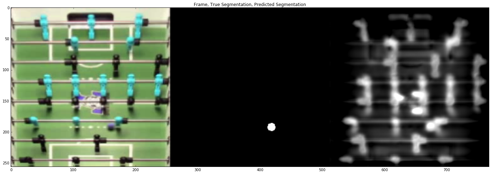


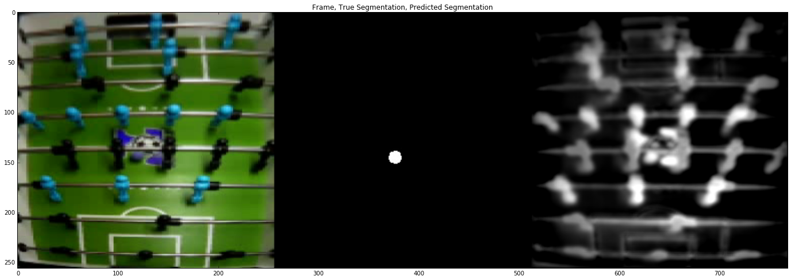


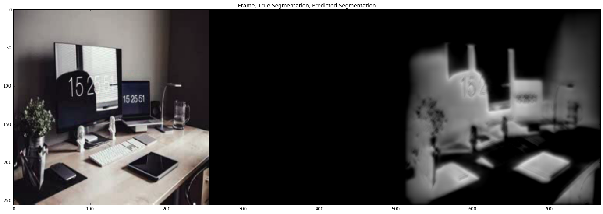


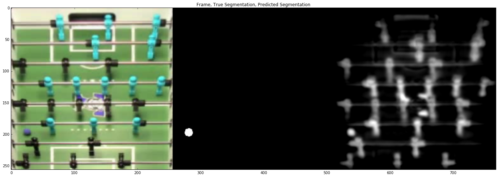


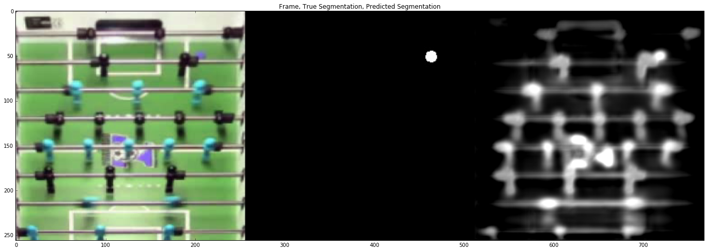


    Wrote model to .\Models\weights_6.hdf
    Epoch 7/7
    

    C:\local\Anaconda3-4.1.1-Windows-x86_64\lib\site-packages\ipykernel\__main__.py:34: UserWarning: Update your `fit_generator` call to the Keras 2 API: `fit_generator(<__main__...., 200, verbose=1, callbacks=None, epochs=7, max_queue_size=50, validation_data=<__main__...., workers=50, use_multiprocessing=False, class_weight=None, validation_steps=5, initial_epoch=6)`
    

    200/200 [==============================] - 221s 1s/step - loss: 5.6103e-04 - balanced_square_error: 5.6103e-04 - mean_squared_error: 0.0624 - val_loss: 2.6411e-04 - val_balanced_square_error: 2.6411e-04 - val_mean_squared_error: 0.0571
    Wrote model to .\Models\weights_7.hdf
    Epoch 8/8
    

    C:\local\Anaconda3-4.1.1-Windows-x86_64\lib\site-packages\ipykernel\__main__.py:34: UserWarning: Update your `fit_generator` call to the Keras 2 API: `fit_generator(<__main__...., 200, verbose=1, callbacks=None, epochs=8, max_queue_size=50, validation_data=<__main__...., workers=50, use_multiprocessing=False, class_weight=None, validation_steps=5, initial_epoch=7)`
    

    200/200 [==============================] - 214s 1s/step - loss: 5.3441e-04 - balanced_square_error: 5.3441e-04 - mean_squared_error: 0.0549 - val_loss: 4.2780e-04 - val_balanced_square_error: 4.2780e-04 - val_mean_squared_error: 0.0476
    Wrote model to .\Models\weights_8.hdf
    Epoch 9/9
    

    C:\local\Anaconda3-4.1.1-Windows-x86_64\lib\site-packages\ipykernel\__main__.py:34: UserWarning: Update your `fit_generator` call to the Keras 2 API: `fit_generator(<__main__...., 200, verbose=1, callbacks=None, epochs=9, max_queue_size=50, validation_data=<__main__...., workers=50, use_multiprocessing=False, class_weight=None, validation_steps=5, initial_epoch=8)`
    

    200/200 [==============================] - 215s 1s/step - loss: 6.5654e-04 - balanced_square_error: 6.5654e-04 - mean_squared_error: 0.0577 - val_loss: 2.6106e-04 - val_balanced_square_error: 2.6106e-04 - val_mean_squared_error: 0.0384
    Wrote model to .\Models\weights_9.hdf
    Epoch 10/10
    

    C:\local\Anaconda3-4.1.1-Windows-x86_64\lib\site-packages\ipykernel\__main__.py:34: UserWarning: Update your `fit_generator` call to the Keras 2 API: `fit_generator(<__main__...., 200, verbose=1, callbacks=None, epochs=10, max_queue_size=50, validation_data=<__main__...., workers=50, use_multiprocessing=False, class_weight=None, validation_steps=5, initial_epoch=9)`
    

    200/200 [==============================] - 219s 1s/step - loss: 3.1114e-04 - balanced_square_error: 3.1114e-04 - mean_squared_error: 0.0416 - val_loss: 2.4264e-04 - val_balanced_square_error: 2.4264e-04 - val_mean_squared_error: 0.0349
    Wrote model to .\Models\weights_10.hdf
    Epoch 11/11
    

    C:\local\Anaconda3-4.1.1-Windows-x86_64\lib\site-packages\ipykernel\__main__.py:34: UserWarning: Update your `fit_generator` call to the Keras 2 API: `fit_generator(<__main__...., 200, verbose=1, callbacks=None, epochs=11, max_queue_size=50, validation_data=<__main__...., workers=50, use_multiprocessing=False, class_weight=None, validation_steps=5, initial_epoch=10)`
    

    200/200 [==============================] - 219s 1s/step - loss: 6.1353e-04 - balanced_square_error: 6.1353e-04 - mean_squared_error: 0.0526 - val_loss: 6.7755e-04 - val_balanced_square_error: 6.7755e-04 - val_mean_squared_error: 0.0335
    


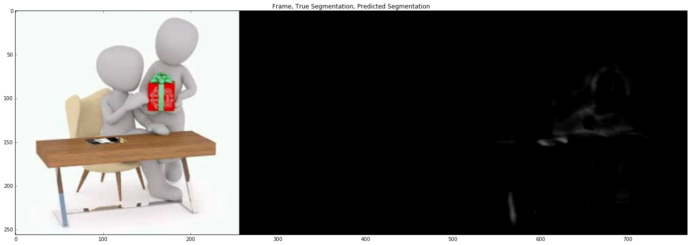


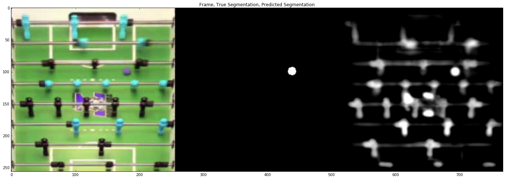


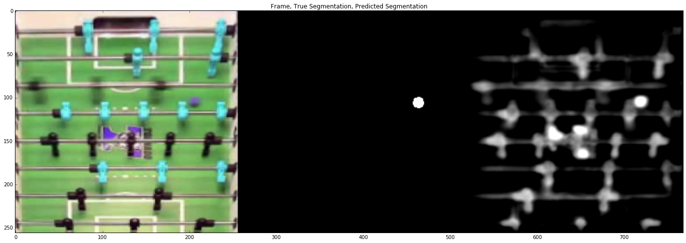


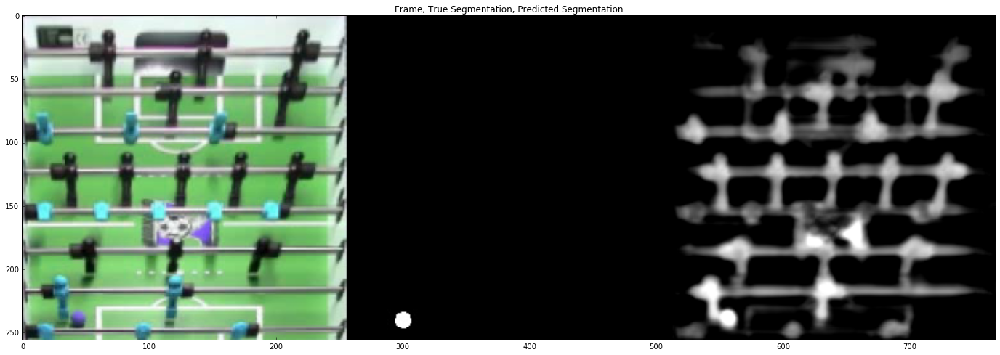


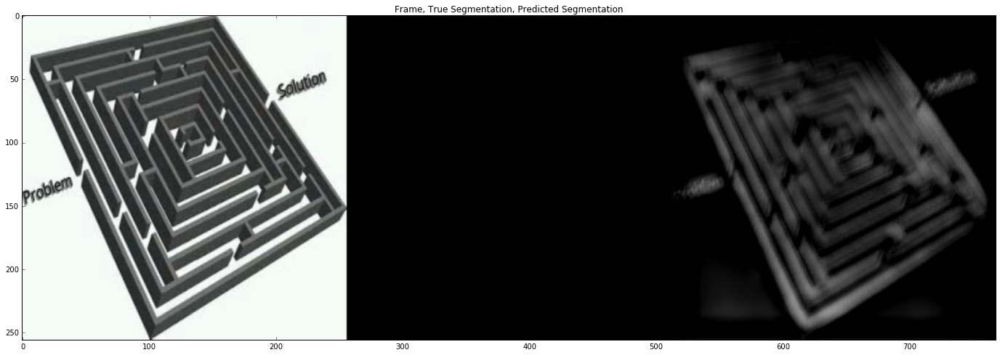


    Wrote model to .\Models\weights_11.hdf
    Epoch 12/12
    

    C:\local\Anaconda3-4.1.1-Windows-x86_64\lib\site-packages\ipykernel\__main__.py:34: UserWarning: Update your `fit_generator` call to the Keras 2 API: `fit_generator(<__main__...., 200, verbose=1, callbacks=None, epochs=12, max_queue_size=50, validation_data=<__main__...., workers=50, use_multiprocessing=False, class_weight=None, validation_steps=5, initial_epoch=11)`
    

    200/200 [==============================] - 214s 1s/step - loss: 3.6770e-04 - balanced_square_error: 3.6770e-04 - mean_squared_error: 0.0395 - val_loss: 1.9405e-04 - val_balanced_square_error: 1.9405e-04 - val_mean_squared_error: 0.0451
    Wrote model to .\Models\weights_12.hdf
    Epoch 13/13
    

    C:\local\Anaconda3-4.1.1-Windows-x86_64\lib\site-packages\ipykernel\__main__.py:34: UserWarning: Update your `fit_generator` call to the Keras 2 API: `fit_generator(<__main__...., 200, verbose=1, callbacks=None, epochs=13, max_queue_size=50, validation_data=<__main__...., workers=50, use_multiprocessing=False, class_weight=None, validation_steps=5, initial_epoch=12)`
    

    200/200 [==============================] - 214s 1s/step - loss: 3.4135e-04 - balanced_square_error: 3.4135e-04 - mean_squared_error: 0.0398 - val_loss: 2.3199e-04 - val_balanced_square_error: 2.3199e-04 - val_mean_squared_error: 0.0289
    Wrote model to .\Models\weights_13.hdf
    Epoch 14/14
    

    C:\local\Anaconda3-4.1.1-Windows-x86_64\lib\site-packages\ipykernel\__main__.py:34: UserWarning: Update your `fit_generator` call to the Keras 2 API: `fit_generator(<__main__...., 200, verbose=1, callbacks=None, epochs=14, max_queue_size=50, validation_data=<__main__...., workers=50, use_multiprocessing=False, class_weight=None, validation_steps=5, initial_epoch=13)`
    

    200/200 [==============================] - 216s 1s/step - loss: 4.1897e-04 - balanced_square_error: 4.1897e-04 - mean_squared_error: 0.0339 - val_loss: 1.5888e-04 - val_balanced_square_error: 1.5888e-04 - val_mean_squared_error: 0.0301
    Wrote model to .\Models\weights_14.hdf
    Epoch 15/15
    

    C:\local\Anaconda3-4.1.1-Windows-x86_64\lib\site-packages\ipykernel\__main__.py:34: UserWarning: Update your `fit_generator` call to the Keras 2 API: `fit_generator(<__main__...., 200, verbose=1, callbacks=None, epochs=15, max_queue_size=50, validation_data=<__main__...., workers=50, use_multiprocessing=False, class_weight=None, validation_steps=5, initial_epoch=14)`
    

    200/200 [==============================] - 216s 1s/step - loss: 4.6234e-04 - balanced_square_error: 4.6234e-04 - mean_squared_error: 0.0386 - val_loss: 1.4782e-04 - val_balanced_square_error: 1.4782e-04 - val_mean_squared_error: 0.0241
    Wrote model to .\Models\weights_15.hdf
    Epoch 16/16
    

    C:\local\Anaconda3-4.1.1-Windows-x86_64\lib\site-packages\ipykernel\__main__.py:34: UserWarning: Update your `fit_generator` call to the Keras 2 API: `fit_generator(<__main__...., 200, verbose=1, callbacks=None, epochs=16, max_queue_size=50, validation_data=<__main__...., workers=50, use_multiprocessing=False, class_weight=None, validation_steps=5, initial_epoch=15)`
    

    200/200 [==============================] - 209s 1s/step - loss: 2.4947e-04 - balanced_square_error: 2.4947e-04 - mean_squared_error: 0.0273 - val_loss: 0.0022 - val_balanced_square_error: 0.0022 - val_mean_squared_error: 0.0228
    


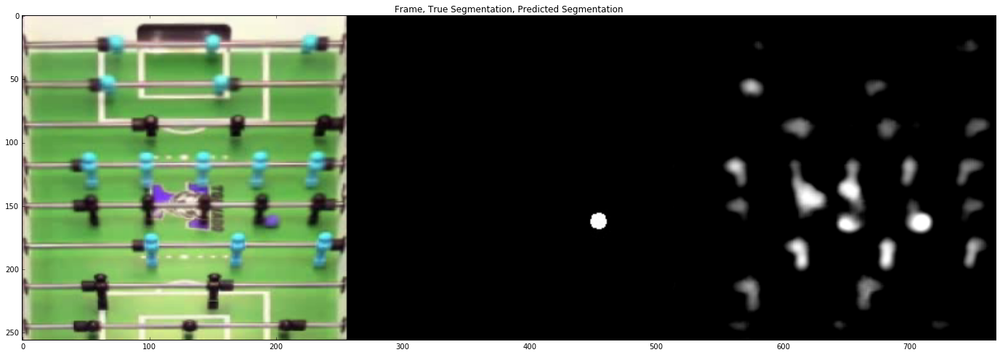


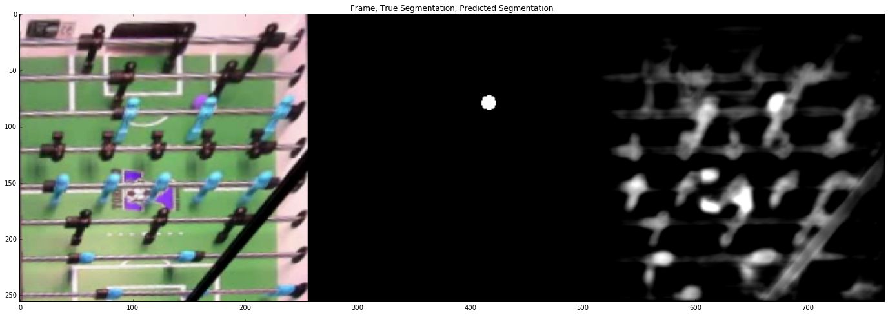


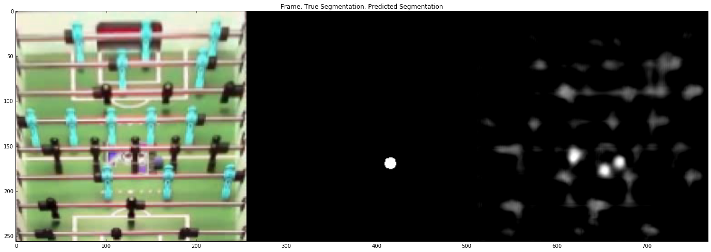


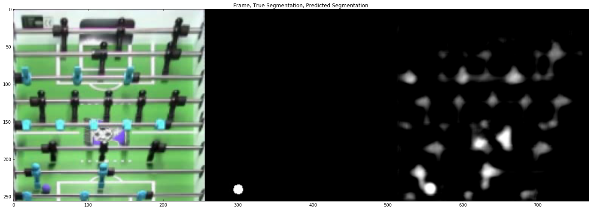


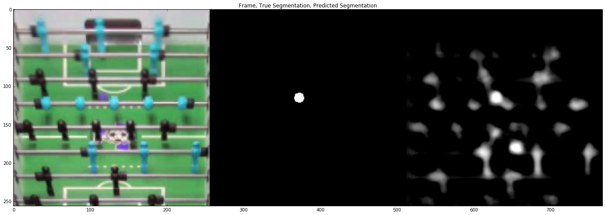


    Wrote model to .\Models\weights_16.hdf
    Epoch 17/17
    

    C:\local\Anaconda3-4.1.1-Windows-x86_64\lib\site-packages\ipykernel\__main__.py:34: UserWarning: Update your `fit_generator` call to the Keras 2 API: `fit_generator(<__main__...., 200, verbose=1, callbacks=None, epochs=17, max_queue_size=50, validation_data=<__main__...., workers=50, use_multiprocessing=False, class_weight=None, validation_steps=5, initial_epoch=16)`
    

    200/200 [==============================] - 215s 1s/step - loss: 4.7131e-04 - balanced_square_error: 4.7131e-04 - mean_squared_error: 0.0332 - val_loss: 9.9662e-05 - val_balanced_square_error: 9.9662e-05 - val_mean_squared_error: 0.0243
    Wrote model to .\Models\weights_17.hdf
    Epoch 18/18
    

    C:\local\Anaconda3-4.1.1-Windows-x86_64\lib\site-packages\ipykernel\__main__.py:34: UserWarning: Update your `fit_generator` call to the Keras 2 API: `fit_generator(<__main__...., 200, verbose=1, callbacks=None, epochs=18, max_queue_size=50, validation_data=<__main__...., workers=50, use_multiprocessing=False, class_weight=None, validation_steps=5, initial_epoch=17)`
    

    200/200 [==============================] - 213s 1s/step - loss: 7.3415e-04 - balanced_square_error: 7.3415e-04 - mean_squared_error: 0.0411 - val_loss: 1.6717e-04 - val_balanced_square_error: 1.6717e-04 - val_mean_squared_error: 0.0487
    Wrote model to .\Models\weights_18.hdf
    Epoch 19/19
    

    C:\local\Anaconda3-4.1.1-Windows-x86_64\lib\site-packages\ipykernel\__main__.py:34: UserWarning: Update your `fit_generator` call to the Keras 2 API: `fit_generator(<__main__...., 200, verbose=1, callbacks=None, epochs=19, max_queue_size=50, validation_data=<__main__...., workers=50, use_multiprocessing=False, class_weight=None, validation_steps=5, initial_epoch=18)`
    

    200/200 [==============================] - 212s 1s/step - loss: 4.2847e-04 - balanced_square_error: 4.2847e-04 - mean_squared_error: 0.0370 - val_loss: 3.6651e-04 - val_balanced_square_error: 3.6651e-04 - val_mean_squared_error: 0.0220
    Wrote model to .\Models\weights_19.hdf
    Epoch 20/20
    

    C:\local\Anaconda3-4.1.1-Windows-x86_64\lib\site-packages\ipykernel\__main__.py:34: UserWarning: Update your `fit_generator` call to the Keras 2 API: `fit_generator(<__main__...., 200, verbose=1, callbacks=None, epochs=20, max_queue_size=50, validation_data=<__main__...., workers=50, use_multiprocessing=False, class_weight=None, validation_steps=5, initial_epoch=19)`
    

    200/200 [==============================] - 218s 1s/step - loss: 4.0937e-04 - balanced_square_error: 4.0937e-04 - mean_squared_error: 0.0311 - val_loss: 0.0024 - val_balanced_square_error: 0.0024 - val_mean_squared_error: 0.0252
    Wrote model to .\Models\weights_20.hdf
    Epoch 21/21
    

    C:\local\Anaconda3-4.1.1-Windows-x86_64\lib\site-packages\ipykernel\__main__.py:34: UserWarning: Update your `fit_generator` call to the Keras 2 API: `fit_generator(<__main__...., 200, verbose=1, callbacks=None, epochs=21, max_queue_size=50, validation_data=<__main__...., workers=50, use_multiprocessing=False, class_weight=None, validation_steps=5, initial_epoch=20)`
    

    200/200 [==============================] - 216s 1s/step - loss: 4.8451e-04 - balanced_square_error: 4.8451e-04 - mean_squared_error: 0.0290 - val_loss: 1.5830e-04 - val_balanced_square_error: 1.5830e-04 - val_mean_squared_error: 0.0212
    


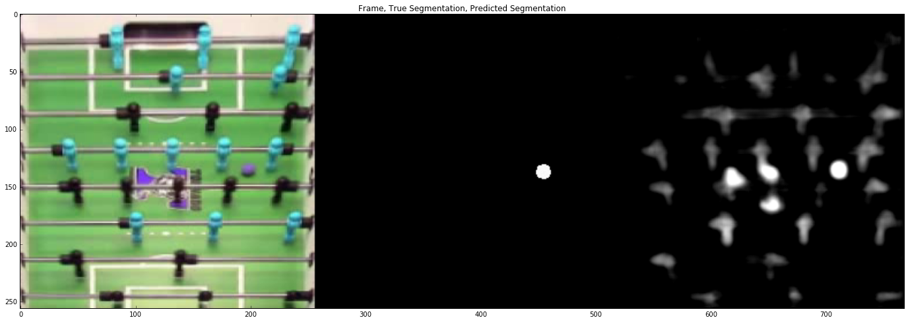


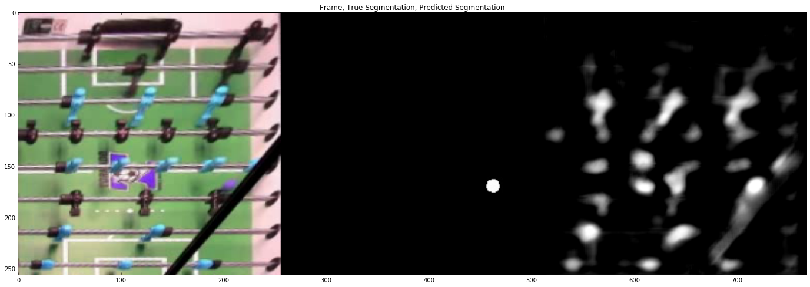


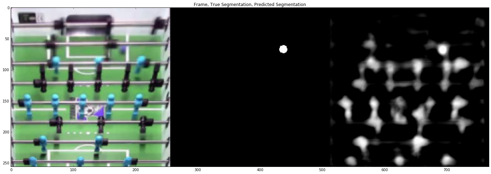


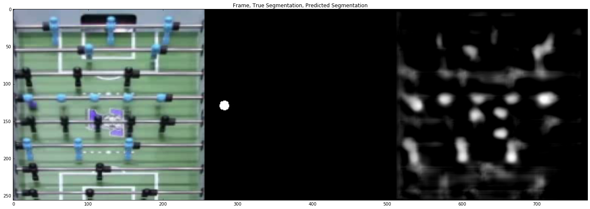


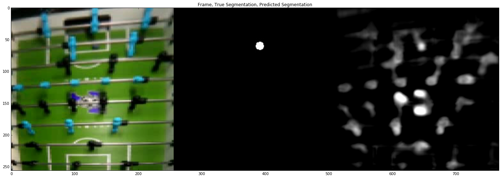


    Wrote model to .\Models\weights_21.hdf
    Epoch 22/22
    

    C:\local\Anaconda3-4.1.1-Windows-x86_64\lib\site-packages\ipykernel\__main__.py:34: UserWarning: Update your `fit_generator` call to the Keras 2 API: `fit_generator(<__main__...., 200, verbose=1, callbacks=None, epochs=22, max_queue_size=50, validation_data=<__main__...., workers=50, use_multiprocessing=False, class_weight=None, validation_steps=5, initial_epoch=21)`
    

    200/200 [==============================] - 211s 1s/step - loss: 2.1693e-04 - balanced_square_error: 2.1693e-04 - mean_squared_error: 0.0227 - val_loss: 1.9555e-04 - val_balanced_square_error: 1.9555e-04 - val_mean_squared_error: 0.0140
    Wrote model to .\Models\weights_22.hdf
    Epoch 23/23
    

    C:\local\Anaconda3-4.1.1-Windows-x86_64\lib\site-packages\ipykernel\__main__.py:34: UserWarning: Update your `fit_generator` call to the Keras 2 API: `fit_generator(<__main__...., 200, verbose=1, callbacks=None, epochs=23, max_queue_size=50, validation_data=<__main__...., workers=50, use_multiprocessing=False, class_weight=None, validation_steps=5, initial_epoch=22)`
    

    200/200 [==============================] - 214s 1s/step - loss: 6.2672e-04 - balanced_square_error: 6.2672e-04 - mean_squared_error: 0.0311 - val_loss: 8.9984e-04 - val_balanced_square_error: 8.9984e-04 - val_mean_squared_error: 0.0303
    Wrote model to .\Models\weights_23.hdf
    Epoch 24/24
    

    C:\local\Anaconda3-4.1.1-Windows-x86_64\lib\site-packages\ipykernel\__main__.py:34: UserWarning: Update your `fit_generator` call to the Keras 2 API: `fit_generator(<__main__...., 200, verbose=1, callbacks=None, epochs=24, max_queue_size=50, validation_data=<__main__...., workers=50, use_multiprocessing=False, class_weight=None, validation_steps=5, initial_epoch=23)`
    

    200/200 [==============================] - 212s 1s/step - loss: 4.4066e-04 - balanced_square_error: 4.4066e-04 - mean_squared_error: 0.0299 - val_loss: 3.9559e-04 - val_balanced_square_error: 3.9559e-04 - val_mean_squared_error: 0.0183
    Wrote model to .\Models\weights_24.hdf
    Epoch 25/25
    

    C:\local\Anaconda3-4.1.1-Windows-x86_64\lib\site-packages\ipykernel\__main__.py:34: UserWarning: Update your `fit_generator` call to the Keras 2 API: `fit_generator(<__main__...., 200, verbose=1, callbacks=None, epochs=25, max_queue_size=50, validation_data=<__main__...., workers=50, use_multiprocessing=False, class_weight=None, validation_steps=5, initial_epoch=24)`
    

    200/200 [==============================] - 213s 1s/step - loss: 3.3232e-04 - balanced_square_error: 3.3232e-04 - mean_squared_error: 0.0291 - val_loss: 1.0381e-04 - val_balanced_square_error: 1.0381e-04 - val_mean_squared_error: 0.0245
    Wrote model to .\Models\weights_25.hdf
    Epoch 26/26
    

    C:\local\Anaconda3-4.1.1-Windows-x86_64\lib\site-packages\ipykernel\__main__.py:34: UserWarning: Update your `fit_generator` call to the Keras 2 API: `fit_generator(<__main__...., 200, verbose=1, callbacks=None, epochs=26, max_queue_size=50, validation_data=<__main__...., workers=50, use_multiprocessing=False, class_weight=None, validation_steps=5, initial_epoch=25)`
    

    200/200 [==============================] - 212s 1s/step - loss: 2.5161e-04 - balanced_square_error: 2.5161e-04 - mean_squared_error: 0.0212 - val_loss: 3.0175e-04 - val_balanced_square_error: 3.0175e-04 - val_mean_squared_error: 0.0144
    


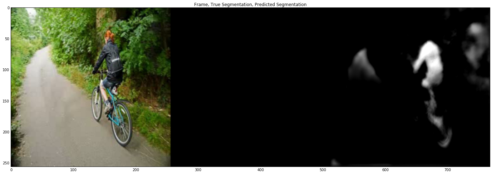


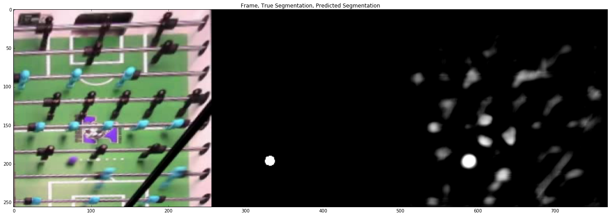


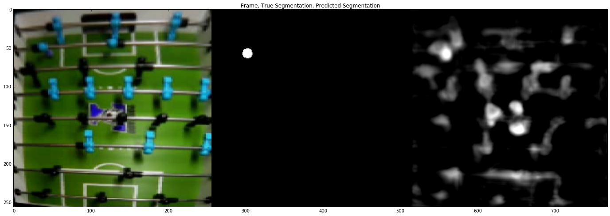


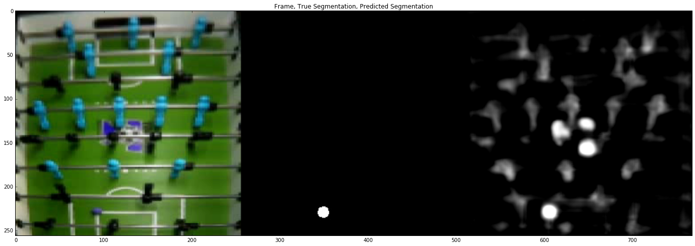


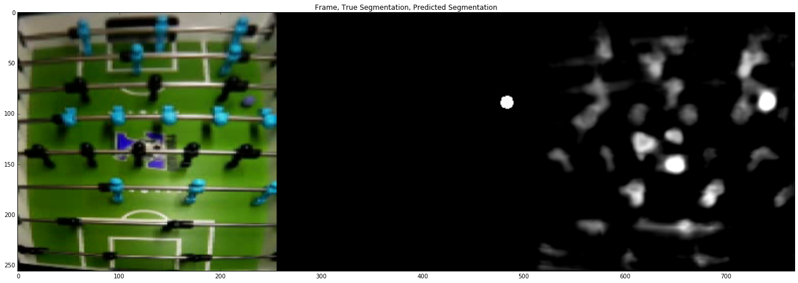


    Wrote model to .\Models\weights_26.hdf
    Epoch 27/27
    

    C:\local\Anaconda3-4.1.1-Windows-x86_64\lib\site-packages\ipykernel\__main__.py:34: UserWarning: Update your `fit_generator` call to the Keras 2 API: `fit_generator(<__main__...., 200, verbose=1, callbacks=None, epochs=27, max_queue_size=50, validation_data=<__main__...., workers=50, use_multiprocessing=False, class_weight=None, validation_steps=5, initial_epoch=26)`
    

    200/200 [==============================] - 213s 1s/step - loss: 3.5482e-04 - balanced_square_error: 3.5482e-04 - mean_squared_error: 0.0254 - val_loss: 9.6041e-05 - val_balanced_square_error: 9.6041e-05 - val_mean_squared_error: 0.0155
    Wrote model to .\Models\weights_27.hdf
    Epoch 28/28
    

    C:\local\Anaconda3-4.1.1-Windows-x86_64\lib\site-packages\ipykernel\__main__.py:34: UserWarning: Update your `fit_generator` call to the Keras 2 API: `fit_generator(<__main__...., 200, verbose=1, callbacks=None, epochs=28, max_queue_size=50, validation_data=<__main__...., workers=50, use_multiprocessing=False, class_weight=None, validation_steps=5, initial_epoch=27)`
    

    200/200 [==============================] - 209s 1s/step - loss: 4.0601e-04 - balanced_square_error: 4.0601e-04 - mean_squared_error: 0.0211 - val_loss: 1.4887e-04 - val_balanced_square_error: 1.4887e-04 - val_mean_squared_error: 0.0150
    Wrote model to .\Models\weights_28.hdf
    Epoch 29/29
    

    C:\local\Anaconda3-4.1.1-Windows-x86_64\lib\site-packages\ipykernel\__main__.py:34: UserWarning: Update your `fit_generator` call to the Keras 2 API: `fit_generator(<__main__...., 200, verbose=1, callbacks=None, epochs=29, max_queue_size=50, validation_data=<__main__...., workers=50, use_multiprocessing=False, class_weight=None, validation_steps=5, initial_epoch=28)`
    

    200/200 [==============================] - 215s 1s/step - loss: 4.5836e-04 - balanced_square_error: 4.5836e-04 - mean_squared_error: 0.0347 - val_loss: 1.3327e-04 - val_balanced_square_error: 1.3327e-04 - val_mean_squared_error: 0.0370
    Wrote model to .\Models\weights_29.hdf
    Epoch 30/30
    

    C:\local\Anaconda3-4.1.1-Windows-x86_64\lib\site-packages\ipykernel\__main__.py:34: UserWarning: Update your `fit_generator` call to the Keras 2 API: `fit_generator(<__main__...., 200, verbose=1, callbacks=None, epochs=30, max_queue_size=50, validation_data=<__main__...., workers=50, use_multiprocessing=False, class_weight=None, validation_steps=5, initial_epoch=29)`
    

    200/200 [==============================] - 217s 1s/step - loss: 6.7654e-04 - balanced_square_error: 6.7654e-04 - mean_squared_error: 0.0334 - val_loss: 1.3449e-04 - val_balanced_square_error: 1.3449e-04 - val_mean_squared_error: 0.0268
    Wrote model to .\Models\weights_30.hdf
    Epoch 31/31
    

    C:\local\Anaconda3-4.1.1-Windows-x86_64\lib\site-packages\ipykernel\__main__.py:34: UserWarning: Update your `fit_generator` call to the Keras 2 API: `fit_generator(<__main__...., 200, verbose=1, callbacks=None, epochs=31, max_queue_size=50, validation_data=<__main__...., workers=50, use_multiprocessing=False, class_weight=None, validation_steps=5, initial_epoch=30)`
    

    200/200 [==============================] - 216s 1s/step - loss: 4.5005e-04 - balanced_square_error: 4.5005e-04 - mean_squared_error: 0.0372 - val_loss: 9.9826e-05 - val_balanced_square_error: 9.9826e-05 - val_mean_squared_error: 0.0149
    


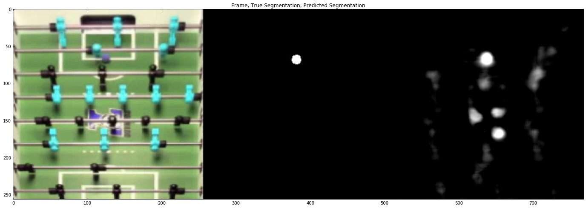


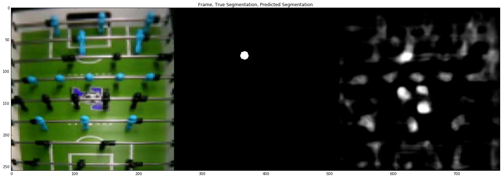


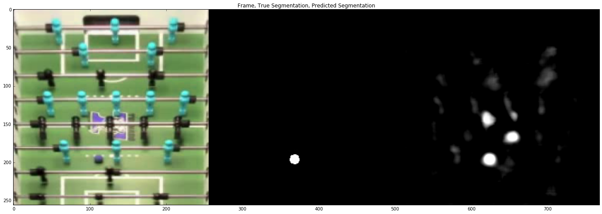


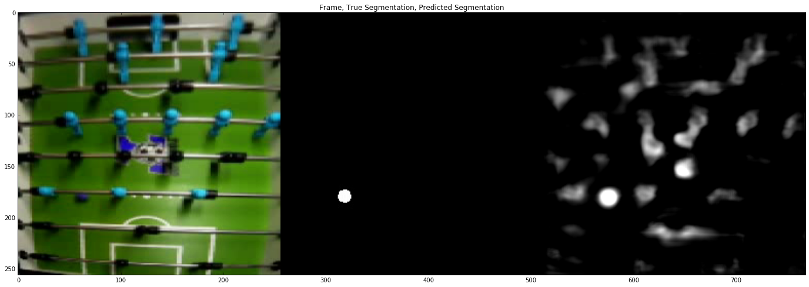


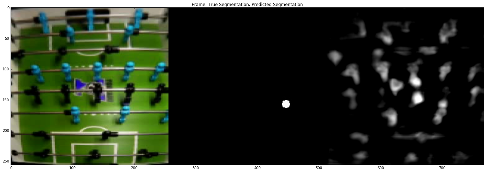


    Wrote model to .\Models\weights_31.hdf
    Epoch 32/32
    

    C:\local\Anaconda3-4.1.1-Windows-x86_64\lib\site-packages\ipykernel\__main__.py:34: UserWarning: Update your `fit_generator` call to the Keras 2 API: `fit_generator(<__main__...., 200, verbose=1, callbacks=None, epochs=32, max_queue_size=50, validation_data=<__main__...., workers=50, use_multiprocessing=False, class_weight=None, validation_steps=5, initial_epoch=31)`
    

    200/200 [==============================] - 213s 1s/step - loss: 2.7764e-04 - balanced_square_error: 2.7764e-04 - mean_squared_error: 0.0200 - val_loss: 1.0978e-04 - val_balanced_square_error: 1.0978e-04 - val_mean_squared_error: 0.0299
    Wrote model to .\Models\weights_32.hdf
    Epoch 33/33
    

    C:\local\Anaconda3-4.1.1-Windows-x86_64\lib\site-packages\ipykernel\__main__.py:34: UserWarning: Update your `fit_generator` call to the Keras 2 API: `fit_generator(<__main__...., 200, verbose=1, callbacks=None, epochs=33, max_queue_size=50, validation_data=<__main__...., workers=50, use_multiprocessing=False, class_weight=None, validation_steps=5, initial_epoch=32)`
    

    200/200 [==============================] - 212s 1s/step - loss: 4.1374e-04 - balanced_square_error: 4.1374e-04 - mean_squared_error: 0.0253 - val_loss: 1.3041e-04 - val_balanced_square_error: 1.3041e-04 - val_mean_squared_error: 0.0110
    Wrote model to .\Models\weights_33.hdf
    Epoch 34/34
    

    C:\local\Anaconda3-4.1.1-Windows-x86_64\lib\site-packages\ipykernel\__main__.py:34: UserWarning: Update your `fit_generator` call to the Keras 2 API: `fit_generator(<__main__...., 200, verbose=1, callbacks=None, epochs=34, max_queue_size=50, validation_data=<__main__...., workers=50, use_multiprocessing=False, class_weight=None, validation_steps=5, initial_epoch=33)`
    

    200/200 [==============================] - 212s 1s/step - loss: 2.0672e-04 - balanced_square_error: 2.0672e-04 - mean_squared_error: 0.0176 - val_loss: 1.4096e-04 - val_balanced_square_error: 1.4096e-04 - val_mean_squared_error: 0.0105
    Wrote model to .\Models\weights_34.hdf
    Epoch 35/35
    

    C:\local\Anaconda3-4.1.1-Windows-x86_64\lib\site-packages\ipykernel\__main__.py:34: UserWarning: Update your `fit_generator` call to the Keras 2 API: `fit_generator(<__main__...., 200, verbose=1, callbacks=None, epochs=35, max_queue_size=50, validation_data=<__main__...., workers=50, use_multiprocessing=False, class_weight=None, validation_steps=5, initial_epoch=34)`
    

    200/200 [==============================] - 213s 1s/step - loss: 3.6775e-04 - balanced_square_error: 3.6775e-04 - mean_squared_error: 0.0209 - val_loss: 7.1314e-05 - val_balanced_square_error: 7.1314e-05 - val_mean_squared_error: 0.0137
    Wrote model to .\Models\weights_35.hdf
    Epoch 36/36
    

    C:\local\Anaconda3-4.1.1-Windows-x86_64\lib\site-packages\ipykernel\__main__.py:34: UserWarning: Update your `fit_generator` call to the Keras 2 API: `fit_generator(<__main__...., 200, verbose=1, callbacks=None, epochs=36, max_queue_size=50, validation_data=<__main__...., workers=50, use_multiprocessing=False, class_weight=None, validation_steps=5, initial_epoch=35)`
    

    200/200 [==============================] - 212s 1s/step - loss: 4.0336e-04 - balanced_square_error: 4.0336e-04 - mean_squared_error: 0.0177 - val_loss: 6.8164e-05 - val_balanced_square_error: 6.8164e-05 - val_mean_squared_error: 0.0124
    


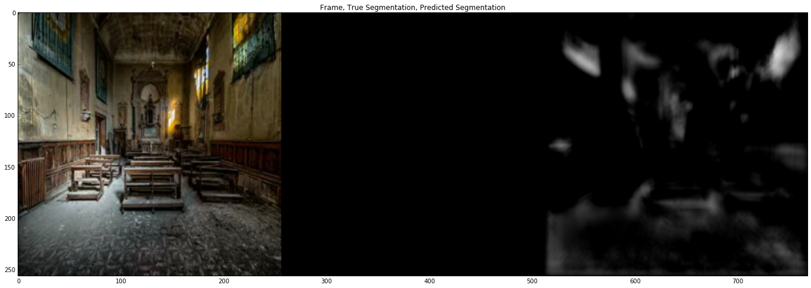


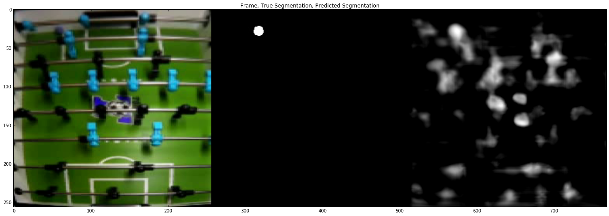


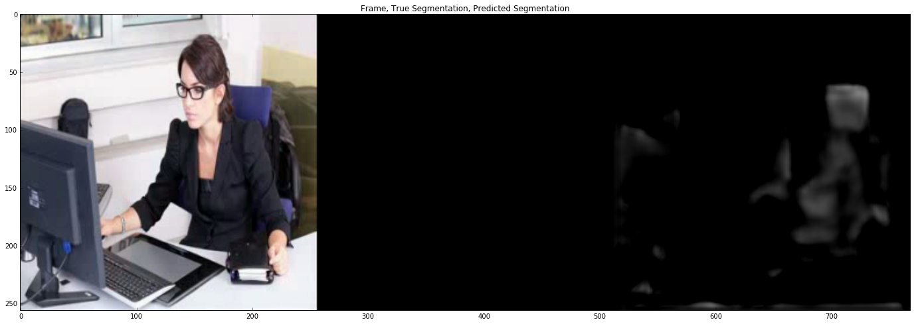


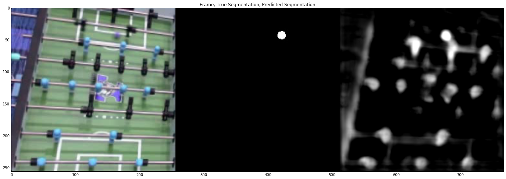


    Wrote model to .\Models\weights_36.hdf
    Epoch 37/37
    

    C:\local\Anaconda3-4.1.1-Windows-x86_64\lib\site-packages\ipykernel\__main__.py:34: UserWarning: Update your `fit_generator` call to the Keras 2 API: `fit_generator(<__main__...., 200, verbose=1, callbacks=None, epochs=37, max_queue_size=50, validation_data=<__main__...., workers=50, use_multiprocessing=False, class_weight=None, validation_steps=5, initial_epoch=36)`
    

    200/200 [==============================] - 212s 1s/step - loss: 3.2225e-04 - balanced_square_error: 3.2225e-04 - mean_squared_error: 0.0201 - val_loss: 1.1104e-04 - val_balanced_square_error: 1.1104e-04 - val_mean_squared_error: 0.0066
    Wrote model to .\Models\weights_37.hdf
    Epoch 38/38
    

    C:\local\Anaconda3-4.1.1-Windows-x86_64\lib\site-packages\ipykernel\__main__.py:34: UserWarning: Update your `fit_generator` call to the Keras 2 API: `fit_generator(<__main__...., 200, verbose=1, callbacks=None, epochs=38, max_queue_size=50, validation_data=<__main__...., workers=50, use_multiprocessing=False, class_weight=None, validation_steps=5, initial_epoch=37)`
    

    200/200 [==============================] - 212s 1s/step - loss: 3.7140e-04 - balanced_square_error: 3.7140e-04 - mean_squared_error: 0.0205 - val_loss: 0.0014 - val_balanced_square_error: 0.0014 - val_mean_squared_error: 0.0182
    Wrote model to .\Models\weights_38.hdf
    Epoch 39/39
    

    C:\local\Anaconda3-4.1.1-Windows-x86_64\lib\site-packages\ipykernel\__main__.py:34: UserWarning: Update your `fit_generator` call to the Keras 2 API: `fit_generator(<__main__...., 200, verbose=1, callbacks=None, epochs=39, max_queue_size=50, validation_data=<__main__...., workers=50, use_multiprocessing=False, class_weight=None, validation_steps=5, initial_epoch=38)`
    

    200/200 [==============================] - 212s 1s/step - loss: 3.7629e-04 - balanced_square_error: 3.7629e-04 - mean_squared_error: 0.0205 - val_loss: 1.1838e-04 - val_balanced_square_error: 1.1838e-04 - val_mean_squared_error: 0.0319
    Wrote model to .\Models\weights_39.hdf
    Epoch 40/40
    

    C:\local\Anaconda3-4.1.1-Windows-x86_64\lib\site-packages\ipykernel\__main__.py:34: UserWarning: Update your `fit_generator` call to the Keras 2 API: `fit_generator(<__main__...., 200, verbose=1, callbacks=None, epochs=40, max_queue_size=50, validation_data=<__main__...., workers=50, use_multiprocessing=False, class_weight=None, validation_steps=5, initial_epoch=39)`
    

    200/200 [==============================] - 213s 1s/step - loss: 4.7542e-04 - balanced_square_error: 4.7542e-04 - mean_squared_error: 0.0307 - val_loss: 8.4804e-05 - val_balanced_square_error: 8.4804e-05 - val_mean_squared_error: 0.0140
    Wrote model to .\Models\weights_40.hdf
    Epoch 41/41
    

    C:\local\Anaconda3-4.1.1-Windows-x86_64\lib\site-packages\ipykernel\__main__.py:34: UserWarning: Update your `fit_generator` call to the Keras 2 API: `fit_generator(<__main__...., 200, verbose=1, callbacks=None, epochs=41, max_queue_size=50, validation_data=<__main__...., workers=50, use_multiprocessing=False, class_weight=None, validation_steps=5, initial_epoch=40)`
    

    200/200 [==============================] - 214s 1s/step - loss: 3.0605e-04 - balanced_square_error: 3.0605e-04 - mean_squared_error: 0.0185 - val_loss: 5.5212e-05 - val_balanced_square_error: 5.5212e-05 - val_mean_squared_error: 0.0132
    


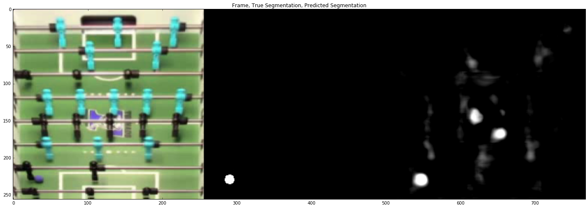


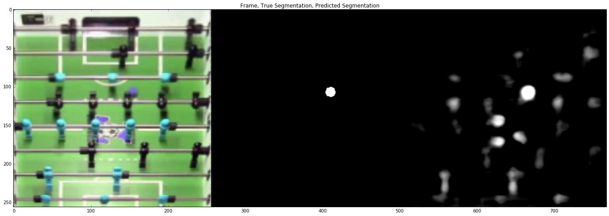


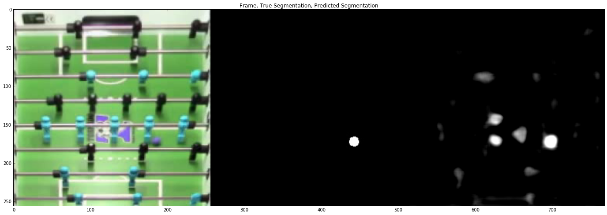


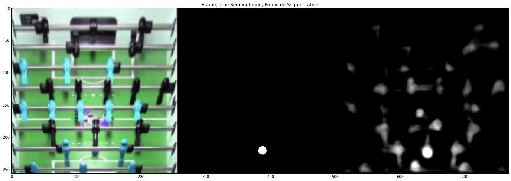


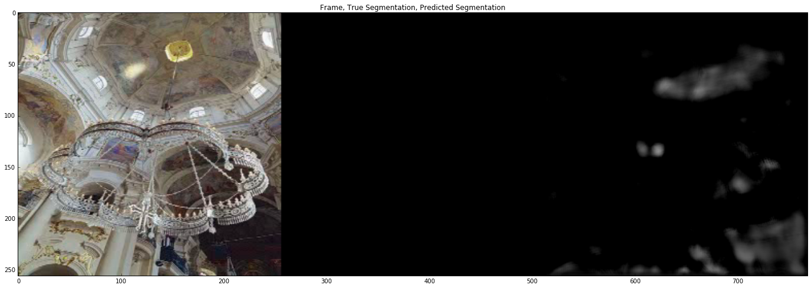


    Wrote model to .\Models\weights_41.hdf
    Epoch 42/42
    

    C:\local\Anaconda3-4.1.1-Windows-x86_64\lib\site-packages\ipykernel\__main__.py:34: UserWarning: Update your `fit_generator` call to the Keras 2 API: `fit_generator(<__main__...., 200, verbose=1, callbacks=None, epochs=42, max_queue_size=50, validation_data=<__main__...., workers=50, use_multiprocessing=False, class_weight=None, validation_steps=5, initial_epoch=41)`
    

    200/200 [==============================] - 213s 1s/step - loss: 3.8052e-04 - balanced_square_error: 3.8052e-04 - mean_squared_error: 0.0185 - val_loss: 0.0012 - val_balanced_square_error: 0.0012 - val_mean_squared_error: 0.0262
    Wrote model to .\Models\weights_42.hdf
    Epoch 43/43
    

    C:\local\Anaconda3-4.1.1-Windows-x86_64\lib\site-packages\ipykernel\__main__.py:34: UserWarning: Update your `fit_generator` call to the Keras 2 API: `fit_generator(<__main__...., 200, verbose=1, callbacks=None, epochs=43, max_queue_size=50, validation_data=<__main__...., workers=50, use_multiprocessing=False, class_weight=None, validation_steps=5, initial_epoch=42)`
    

    200/200 [==============================] - 214s 1s/step - loss: 3.0575e-04 - balanced_square_error: 3.0575e-04 - mean_squared_error: 0.0226 - val_loss: 8.3121e-05 - val_balanced_square_error: 8.3121e-05 - val_mean_squared_error: 0.0238
    Wrote model to .\Models\weights_43.hdf
    Epoch 44/44
    

    C:\local\Anaconda3-4.1.1-Windows-x86_64\lib\site-packages\ipykernel\__main__.py:34: UserWarning: Update your `fit_generator` call to the Keras 2 API: `fit_generator(<__main__...., 200, verbose=1, callbacks=None, epochs=44, max_queue_size=50, validation_data=<__main__...., workers=50, use_multiprocessing=False, class_weight=None, validation_steps=5, initial_epoch=43)`
    

    200/200 [==============================] - 209s 1s/step - loss: 3.8725e-04 - balanced_square_error: 3.8725e-04 - mean_squared_error: 0.0177 - val_loss: 5.1983e-04 - val_balanced_square_error: 5.1983e-04 - val_mean_squared_error: 0.1733
    Wrote model to .\Models\weights_44.hdf
    Epoch 45/45
    

    C:\local\Anaconda3-4.1.1-Windows-x86_64\lib\site-packages\ipykernel\__main__.py:34: UserWarning: Update your `fit_generator` call to the Keras 2 API: `fit_generator(<__main__...., 200, verbose=1, callbacks=None, epochs=45, max_queue_size=50, validation_data=<__main__...., workers=50, use_multiprocessing=False, class_weight=None, validation_steps=5, initial_epoch=44)`
    

    200/200 [==============================] - 211s 1s/step - loss: 2.5723e-04 - balanced_square_error: 2.5723e-04 - mean_squared_error: 0.0180 - val_loss: 1.0891e-04 - val_balanced_square_error: 1.0891e-04 - val_mean_squared_error: 0.0336
    Wrote model to .\Models\weights_45.hdf
    Epoch 46/46
    

    C:\local\Anaconda3-4.1.1-Windows-x86_64\lib\site-packages\ipykernel\__main__.py:34: UserWarning: Update your `fit_generator` call to the Keras 2 API: `fit_generator(<__main__...., 200, verbose=1, callbacks=None, epochs=46, max_queue_size=50, validation_data=<__main__...., workers=50, use_multiprocessing=False, class_weight=None, validation_steps=5, initial_epoch=45)`
    

    200/200 [==============================] - 213s 1s/step - loss: 6.3313e-04 - balanced_square_error: 6.3313e-04 - mean_squared_error: 0.0277 - val_loss: 1.3601e-04 - val_balanced_square_error: 1.3601e-04 - val_mean_squared_error: 0.0168
    


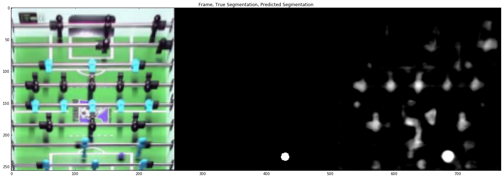


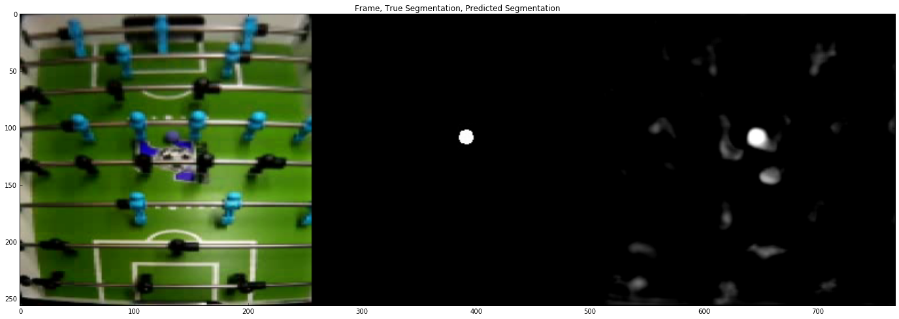


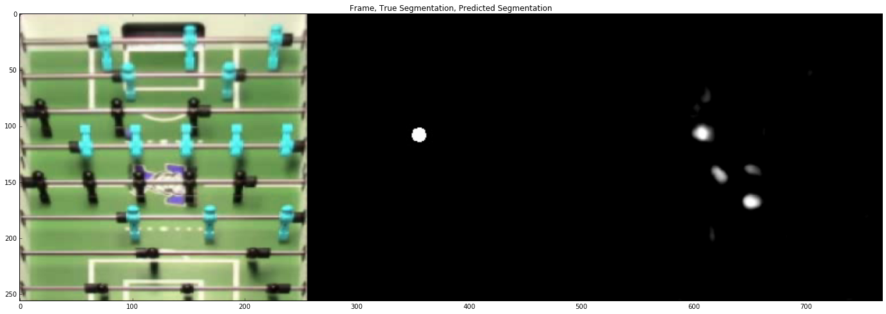


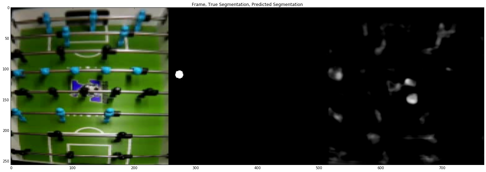


    Wrote model to .\Models\weights_46.hdf
    Epoch 47/47
    

    C:\local\Anaconda3-4.1.1-Windows-x86_64\lib\site-packages\ipykernel\__main__.py:34: UserWarning: Update your `fit_generator` call to the Keras 2 API: `fit_generator(<__main__...., 200, verbose=1, callbacks=None, epochs=47, max_queue_size=50, validation_data=<__main__...., workers=50, use_multiprocessing=False, class_weight=None, validation_steps=5, initial_epoch=46)`
    

    200/200 [==============================] - 216s 1s/step - loss: 4.4279e-04 - balanced_square_error: 4.4279e-04 - mean_squared_error: 0.0228 - val_loss: 0.0011 - val_balanced_square_error: 0.0011 - val_mean_squared_error: 0.0898
    Wrote model to .\Models\weights_47.hdf
    Epoch 48/48
    

    C:\local\Anaconda3-4.1.1-Windows-x86_64\lib\site-packages\ipykernel\__main__.py:34: UserWarning: Update your `fit_generator` call to the Keras 2 API: `fit_generator(<__main__...., 200, verbose=1, callbacks=None, epochs=48, max_queue_size=50, validation_data=<__main__...., workers=50, use_multiprocessing=False, class_weight=None, validation_steps=5, initial_epoch=47)`
    

    200/200 [==============================] - 211s 1s/step - loss: 2.6095e-04 - balanced_square_error: 2.6095e-04 - mean_squared_error: 0.0181 - val_loss: 4.0626e-04 - val_balanced_square_error: 4.0626e-04 - val_mean_squared_error: 0.0807
    Wrote model to .\Models\weights_48.hdf
    Epoch 49/49
    

    C:\local\Anaconda3-4.1.1-Windows-x86_64\lib\site-packages\ipykernel\__main__.py:34: UserWarning: Update your `fit_generator` call to the Keras 2 API: `fit_generator(<__main__...., 200, verbose=1, callbacks=None, epochs=49, max_queue_size=50, validation_data=<__main__...., workers=50, use_multiprocessing=False, class_weight=None, validation_steps=5, initial_epoch=48)`
    

    200/200 [==============================] - 207s 1s/step - loss: 1.4882e-04 - balanced_square_error: 1.4882e-04 - mean_squared_error: 0.0144 - val_loss: 4.6186e-05 - val_balanced_square_error: 4.6186e-05 - val_mean_squared_error: 0.0134
    Wrote model to .\Models\weights_49.hdf
    Epoch 50/50
    

    C:\local\Anaconda3-4.1.1-Windows-x86_64\lib\site-packages\ipykernel\__main__.py:34: UserWarning: Update your `fit_generator` call to the Keras 2 API: `fit_generator(<__main__...., 200, verbose=1, callbacks=None, epochs=50, max_queue_size=50, validation_data=<__main__...., workers=50, use_multiprocessing=False, class_weight=None, validation_steps=5, initial_epoch=49)`
    

    200/200 [==============================] - 218s 1s/step - loss: 4.9236e-04 - balanced_square_error: 4.9236e-04 - mean_squared_error: 0.0201 - val_loss: 9.9092e-05 - val_balanced_square_error: 9.9092e-05 - val_mean_squared_error: 0.0203
    Wrote model to .\Models\weights_50.hdf
    


```python
def balanced_square_error(y_true, y_pred):
    above_loss = 0.03 * K.mean( K.square( K.clip(y_pred - y_true, 0.0, 100000) ) , axis=-1)
    below_loss = K.mean( K.square( K.clip(y_pred - y_true, -100000, 0.0) ) , axis=-1)
    return above_loss + below_loss

#frame_prediction_model = keras.models.load_model(MODELS_FNAME % 16, custom_objects={'balanced_square_error': balanced_square_error})

frame_prediction_model.compile(optimizer=keras.optimizers.RMSprop(lr=0.00001),
              loss=balanced_square_error,
              metrics=[balanced_square_error,mean_squared_error])

# Was ran on the above simple model, not pre-trained Inceptionv3 run.
#epoch = 17
#batches_validation_per_epoch = 50
#batches_training_per_epoch = 400
batch_size = 10
batches_training_per_epoch = 200
batches_validation_per_epoch = 5
print("Batch size %i: %i training batches, %i validation batches" % (batch_size, batches_training_per_epoch, batches_validation_per_epoch) )
WEIGHTS_FNAME = '.\\Models\\weights_%i.hdf'
MODELS_FNAME = '.\\Models\\models_%i.h5'


for i in range(50):
    frame_prediction_model.fit_generator(
        TrainBatchGen(batch_size, training=training),
        batches_training_per_epoch,
        epochs=epoch+1,
        verbose=1,
        callbacks=None,
        class_weight=None,
        max_q_size=50,
        workers=50,
        validation_data=TrainBatchGen(batch_size, validation),
        validation_steps = batches_validation_per_epoch,
        pickle_safe=False,
        initial_epoch=epoch)
    
    epoch += 1
    
    # Plot occasional validation data plot
    if i % 5 == 0:
        plot_validate(TrainBatchGen(batch_size, validation), frame_prediction_model, 50, "Epoch validation results %i" % epoch)
    
    # Save the model
    frame_prediction_model.save_weights(WEIGHTS_FNAME % epoch)
    frame_prediction_model.save(MODELS_FNAME % epoch)
    print(("Wrote model to " + WEIGHTS_FNAME )  % epoch)

```

    Batch size 10: 200 training batches, 5 validation batches
    

    C:\local\Anaconda3-4.1.1-Windows-x86_64\lib\site-packages\ipykernel\__main__.py:37: UserWarning: Update your `fit_generator` call to the Keras 2 API: `fit_generator(<__main__...., 200, verbose=1, callbacks=None, epochs=51, max_queue_size=50, validation_data=<__main__...., workers=50, use_multiprocessing=False, class_weight=None, validation_steps=5, initial_epoch=50)`
    

    Epoch 51/51
    200/200 [==============================] - 208s 1s/step - loss: 3.1889e-04 - balanced_square_error: 3.1889e-04 - mean_squared_error: 0.0034 - val_loss: 1.8507e-04 - val_balanced_square_error: 1.8507e-04 - val_mean_squared_error: 0.0010
    


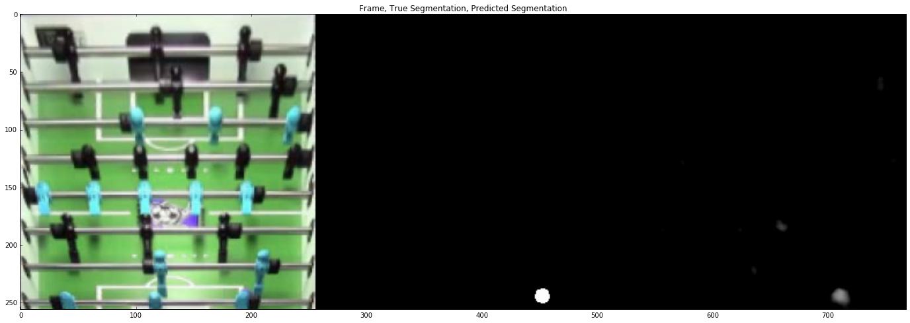


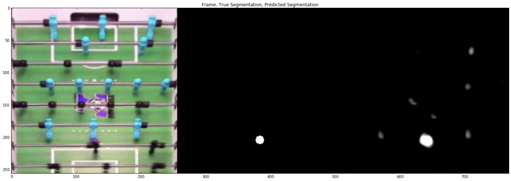


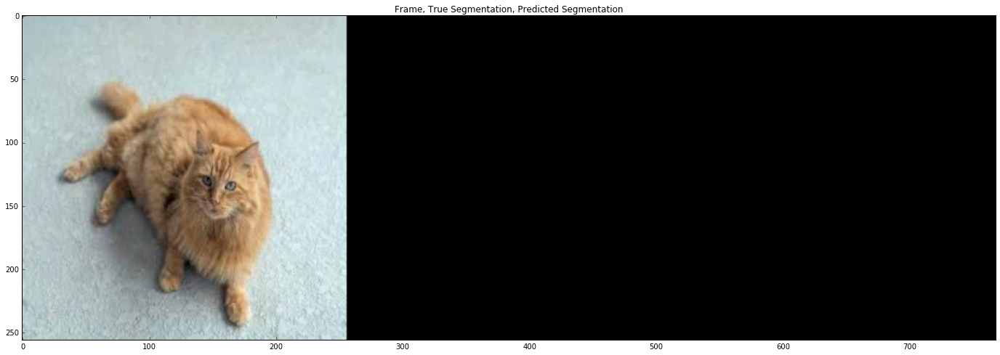


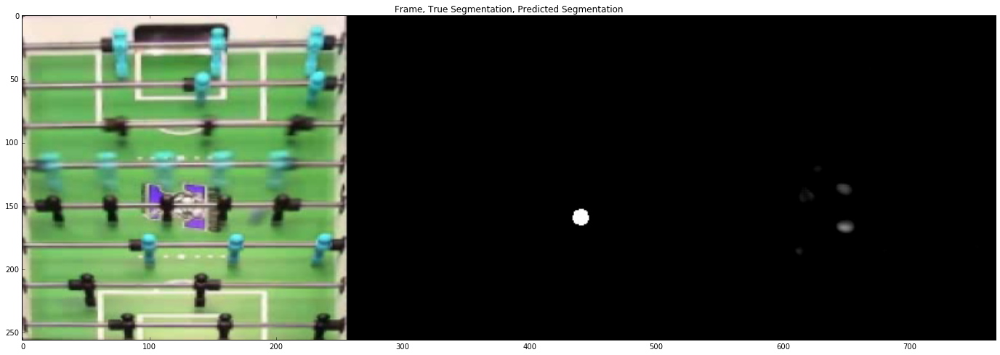


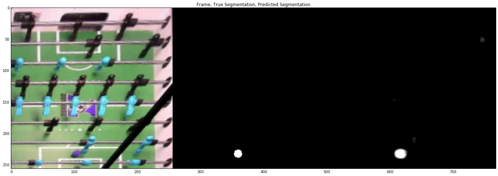


    Wrote model to .\Models\weights_51.hdf
    Epoch 52/52
    

    C:\local\Anaconda3-4.1.1-Windows-x86_64\lib\site-packages\ipykernel\__main__.py:37: UserWarning: Update your `fit_generator` call to the Keras 2 API: `fit_generator(<__main__...., 200, verbose=1, callbacks=None, epochs=52, max_queue_size=50, validation_data=<__main__...., workers=50, use_multiprocessing=False, class_weight=None, validation_steps=5, initial_epoch=51)`
    

    200/200 [==============================] - 209s 1s/step - loss: 4.8955e-04 - balanced_square_error: 4.8955e-04 - mean_squared_error: 0.0031 - val_loss: 1.8080e-04 - val_balanced_square_error: 1.8080e-04 - val_mean_squared_error: 7.2267e-04
    Wrote model to .\Models\weights_52.hdf
    Epoch 53/53
    

    C:\local\Anaconda3-4.1.1-Windows-x86_64\lib\site-packages\ipykernel\__main__.py:37: UserWarning: Update your `fit_generator` call to the Keras 2 API: `fit_generator(<__main__...., 200, verbose=1, callbacks=None, epochs=53, max_queue_size=50, validation_data=<__main__...., workers=50, use_multiprocessing=False, class_weight=None, validation_steps=5, initial_epoch=52)`
    

    200/200 [==============================] - 204s 1s/step - loss: 3.9421e-04 - balanced_square_error: 3.9421e-04 - mean_squared_error: 0.0030 - val_loss: 8.8913e-04 - val_balanced_square_error: 8.8913e-04 - val_mean_squared_error: 0.0023
    Wrote model to .\Models\weights_53.hdf
    Epoch 54/54
    

    C:\local\Anaconda3-4.1.1-Windows-x86_64\lib\site-packages\ipykernel\__main__.py:37: UserWarning: Update your `fit_generator` call to the Keras 2 API: `fit_generator(<__main__...., 200, verbose=1, callbacks=None, epochs=54, max_queue_size=50, validation_data=<__main__...., workers=50, use_multiprocessing=False, class_weight=None, validation_steps=5, initial_epoch=53)`
    

    200/200 [==============================] - 205s 1s/step - loss: 4.7523e-04 - balanced_square_error: 4.7523e-04 - mean_squared_error: 0.0031 - val_loss: 3.7575e-04 - val_balanced_square_error: 3.7575e-04 - val_mean_squared_error: 0.0027
    Wrote model to .\Models\weights_54.hdf
    Epoch 55/55
    

    C:\local\Anaconda3-4.1.1-Windows-x86_64\lib\site-packages\ipykernel\__main__.py:37: UserWarning: Update your `fit_generator` call to the Keras 2 API: `fit_generator(<__main__...., 200, verbose=1, callbacks=None, epochs=55, max_queue_size=50, validation_data=<__main__...., workers=50, use_multiprocessing=False, class_weight=None, validation_steps=5, initial_epoch=54)`
    

    200/200 [==============================] - 202s 1s/step - loss: 2.8701e-04 - balanced_square_error: 2.8701e-04 - mean_squared_error: 0.0025 - val_loss: 1.2887e-04 - val_balanced_square_error: 1.2887e-04 - val_mean_squared_error: 0.0019
    Wrote model to .\Models\weights_55.hdf
    Epoch 56/56
    

    C:\local\Anaconda3-4.1.1-Windows-x86_64\lib\site-packages\ipykernel\__main__.py:37: UserWarning: Update your `fit_generator` call to the Keras 2 API: `fit_generator(<__main__...., 200, verbose=1, callbacks=None, epochs=56, max_queue_size=50, validation_data=<__main__...., workers=50, use_multiprocessing=False, class_weight=None, validation_steps=5, initial_epoch=55)`
    

    200/200 [==============================] - 206s 1s/step - loss: 5.0782e-04 - balanced_square_error: 5.0782e-04 - mean_squared_error: 0.0027 - val_loss: 1.4125e-04 - val_balanced_square_error: 1.4125e-04 - val_mean_squared_error: 0.0028
    


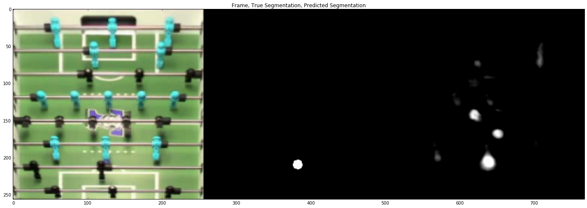


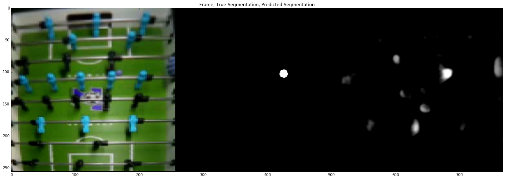


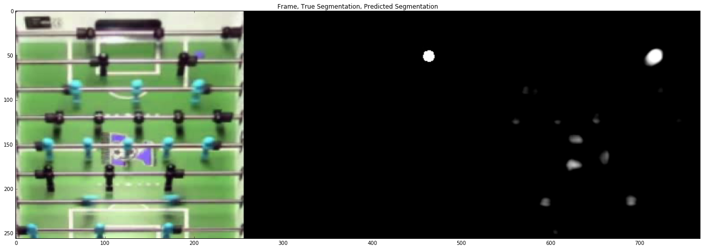


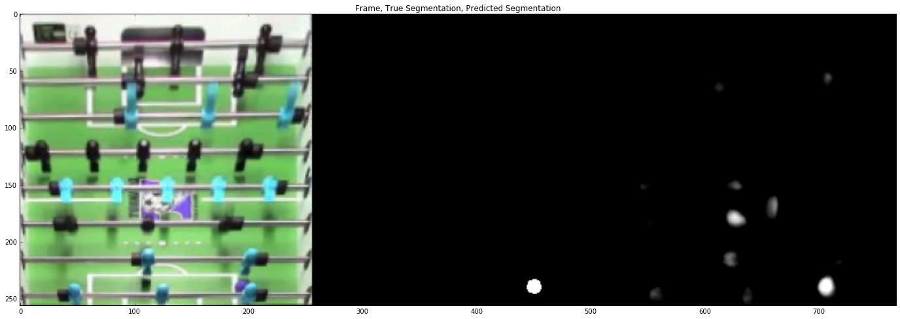


    Wrote model to .\Models\weights_56.hdf
    Epoch 57/57
    

    C:\local\Anaconda3-4.1.1-Windows-x86_64\lib\site-packages\ipykernel\__main__.py:37: UserWarning: Update your `fit_generator` call to the Keras 2 API: `fit_generator(<__main__...., 200, verbose=1, callbacks=None, epochs=57, max_queue_size=50, validation_data=<__main__...., workers=50, use_multiprocessing=False, class_weight=None, validation_steps=5, initial_epoch=56)`
    

    200/200 [==============================] - 206s 1s/step - loss: 4.9374e-04 - balanced_square_error: 4.9374e-04 - mean_squared_error: 0.0026 - val_loss: 1.3875e-04 - val_balanced_square_error: 1.3875e-04 - val_mean_squared_error: 0.0018
    Wrote model to .\Models\weights_57.hdf
    Epoch 58/58
    

    C:\local\Anaconda3-4.1.1-Windows-x86_64\lib\site-packages\ipykernel\__main__.py:37: UserWarning: Update your `fit_generator` call to the Keras 2 API: `fit_generator(<__main__...., 200, verbose=1, callbacks=None, epochs=58, max_queue_size=50, validation_data=<__main__...., workers=50, use_multiprocessing=False, class_weight=None, validation_steps=5, initial_epoch=57)`
    

    200/200 [==============================] - 205s 1s/step - loss: 3.9605e-04 - balanced_square_error: 3.9605e-04 - mean_squared_error: 0.0024 - val_loss: 2.1742e-04 - val_balanced_square_error: 2.1742e-04 - val_mean_squared_error: 0.0071
    Wrote model to .\Models\weights_58.hdf
    Epoch 59/59
    

    C:\local\Anaconda3-4.1.1-Windows-x86_64\lib\site-packages\ipykernel\__main__.py:37: UserWarning: Update your `fit_generator` call to the Keras 2 API: `fit_generator(<__main__...., 200, verbose=1, callbacks=None, epochs=59, max_queue_size=50, validation_data=<__main__...., workers=50, use_multiprocessing=False, class_weight=None, validation_steps=5, initial_epoch=58)`
    

    200/200 [==============================] - 202s 1s/step - loss: 6.0210e-04 - balanced_square_error: 6.0210e-04 - mean_squared_error: 0.0028 - val_loss: 6.0793e-04 - val_balanced_square_error: 6.0793e-04 - val_mean_squared_error: 0.0018
    Wrote model to .\Models\weights_59.hdf
    Epoch 60/60
    

    C:\local\Anaconda3-4.1.1-Windows-x86_64\lib\site-packages\ipykernel\__main__.py:37: UserWarning: Update your `fit_generator` call to the Keras 2 API: `fit_generator(<__main__...., 200, verbose=1, callbacks=None, epochs=60, max_queue_size=50, validation_data=<__main__...., workers=50, use_multiprocessing=False, class_weight=None, validation_steps=5, initial_epoch=59)`
    

    200/200 [==============================] - 202s 1s/step - loss: 2.6488e-04 - balanced_square_error: 2.6488e-04 - mean_squared_error: 0.0022 - val_loss: 1.4202e-04 - val_balanced_square_error: 1.4202e-04 - val_mean_squared_error: 0.0014
    Wrote model to .\Models\weights_60.hdf
    Epoch 61/61
    

    C:\local\Anaconda3-4.1.1-Windows-x86_64\lib\site-packages\ipykernel\__main__.py:37: UserWarning: Update your `fit_generator` call to the Keras 2 API: `fit_generator(<__main__...., 200, verbose=1, callbacks=None, epochs=61, max_queue_size=50, validation_data=<__main__...., workers=50, use_multiprocessing=False, class_weight=None, validation_steps=5, initial_epoch=60)`
    

    200/200 [==============================] - 208s 1s/step - loss: 3.3432e-04 - balanced_square_error: 3.3432e-04 - mean_squared_error: 0.0022 - val_loss: 8.3928e-05 - val_balanced_square_error: 8.3928e-05 - val_mean_squared_error: 0.0018
    


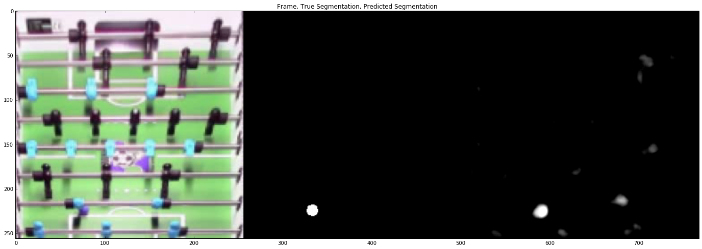


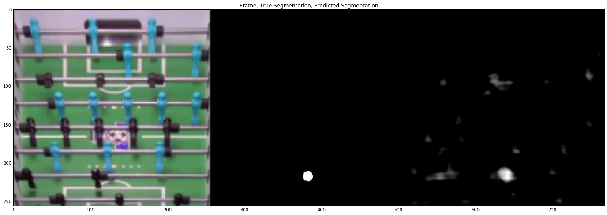


    Wrote model to .\Models\weights_61.hdf
    Epoch 62/62
    

    C:\local\Anaconda3-4.1.1-Windows-x86_64\lib\site-packages\ipykernel\__main__.py:37: UserWarning: Update your `fit_generator` call to the Keras 2 API: `fit_generator(<__main__...., 200, verbose=1, callbacks=None, epochs=62, max_queue_size=50, validation_data=<__main__...., workers=50, use_multiprocessing=False, class_weight=None, validation_steps=5, initial_epoch=61)`
    

    200/200 [==============================] - 204s 1s/step - loss: 5.2175e-04 - balanced_square_error: 5.2175e-04 - mean_squared_error: 0.0026 - val_loss: 1.0833e-04 - val_balanced_square_error: 1.0833e-04 - val_mean_squared_error: 0.0022
    Wrote model to .\Models\weights_62.hdf
    Epoch 63/63
    

    C:\local\Anaconda3-4.1.1-Windows-x86_64\lib\site-packages\ipykernel\__main__.py:37: UserWarning: Update your `fit_generator` call to the Keras 2 API: `fit_generator(<__main__...., 200, verbose=1, callbacks=None, epochs=63, max_queue_size=50, validation_data=<__main__...., workers=50, use_multiprocessing=False, class_weight=None, validation_steps=5, initial_epoch=62)`
    

    200/200 [==============================] - 205s 1s/step - loss: 3.5344e-04 - balanced_square_error: 3.5344e-04 - mean_squared_error: 0.0022 - val_loss: 1.5307e-04 - val_balanced_square_error: 1.5307e-04 - val_mean_squared_error: 0.0019
    Wrote model to .\Models\weights_63.hdf
    Epoch 64/64
    

    C:\local\Anaconda3-4.1.1-Windows-x86_64\lib\site-packages\ipykernel\__main__.py:37: UserWarning: Update your `fit_generator` call to the Keras 2 API: `fit_generator(<__main__...., 200, verbose=1, callbacks=None, epochs=64, max_queue_size=50, validation_data=<__main__...., workers=50, use_multiprocessing=False, class_weight=None, validation_steps=5, initial_epoch=63)`
    

    200/200 [==============================] - 203s 1s/step - loss: 4.6716e-04 - balanced_square_error: 4.6716e-04 - mean_squared_error: 0.0022 - val_loss: 7.5134e-05 - val_balanced_square_error: 7.5134e-05 - val_mean_squared_error: 0.0011
    Wrote model to .\Models\weights_64.hdf
    Epoch 65/65
    

    C:\local\Anaconda3-4.1.1-Windows-x86_64\lib\site-packages\ipykernel\__main__.py:37: UserWarning: Update your `fit_generator` call to the Keras 2 API: `fit_generator(<__main__...., 200, verbose=1, callbacks=None, epochs=65, max_queue_size=50, validation_data=<__main__...., workers=50, use_multiprocessing=False, class_weight=None, validation_steps=5, initial_epoch=64)`
    

    200/200 [==============================] - 207s 1s/step - loss: 3.6087e-04 - balanced_square_error: 3.6087e-04 - mean_squared_error: 0.0021 - val_loss: 7.2474e-05 - val_balanced_square_error: 7.2474e-05 - val_mean_squared_error: 0.0019
    Wrote model to .\Models\weights_65.hdf
    Epoch 66/66
    

    C:\local\Anaconda3-4.1.1-Windows-x86_64\lib\site-packages\ipykernel\__main__.py:37: UserWarning: Update your `fit_generator` call to the Keras 2 API: `fit_generator(<__main__...., 200, verbose=1, callbacks=None, epochs=66, max_queue_size=50, validation_data=<__main__...., workers=50, use_multiprocessing=False, class_weight=None, validation_steps=5, initial_epoch=65)`
    

    200/200 [==============================] - 206s 1s/step - loss: 3.2378e-04 - balanced_square_error: 3.2378e-04 - mean_squared_error: 0.0020 - val_loss: 0.0017 - val_balanced_square_error: 0.0017 - val_mean_squared_error: 0.0050
    


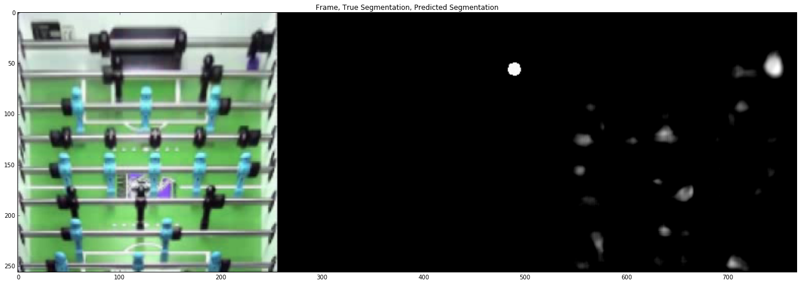


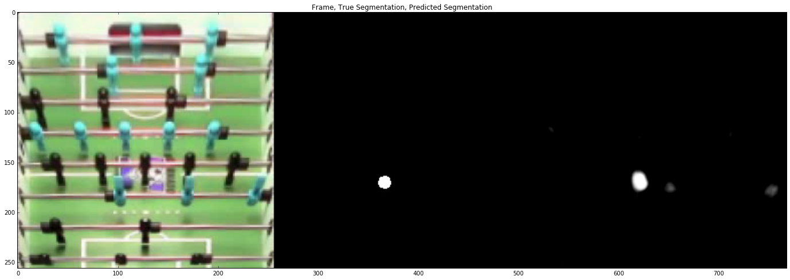


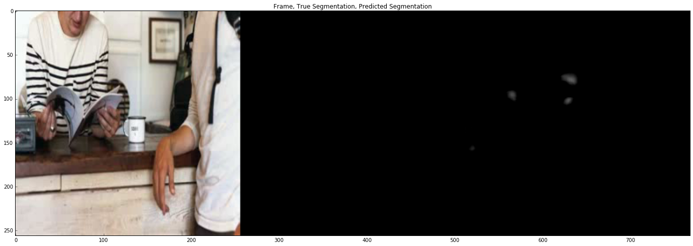


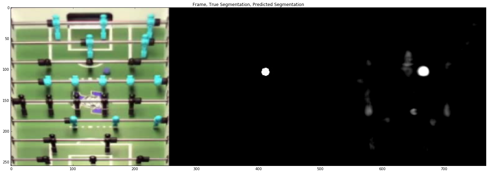


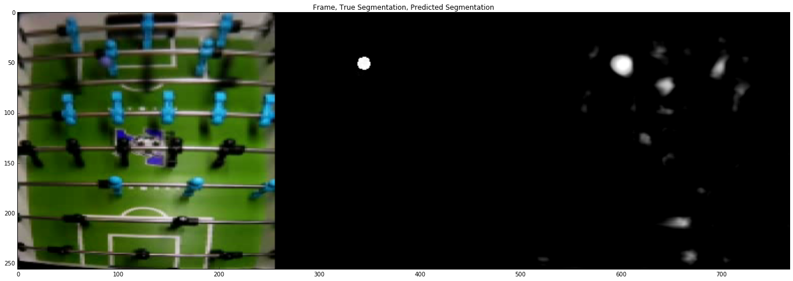


    Wrote model to .\Models\weights_66.hdf
    Epoch 67/67
    

    C:\local\Anaconda3-4.1.1-Windows-x86_64\lib\site-packages\ipykernel\__main__.py:37: UserWarning: Update your `fit_generator` call to the Keras 2 API: `fit_generator(<__main__...., 200, verbose=1, callbacks=None, epochs=67, max_queue_size=50, validation_data=<__main__...., workers=50, use_multiprocessing=False, class_weight=None, validation_steps=5, initial_epoch=66)`
    

    200/200 [==============================] - 207s 1s/step - loss: 5.9354e-04 - balanced_square_error: 5.9354e-04 - mean_squared_error: 0.0025 - val_loss: 9.3349e-05 - val_balanced_square_error: 9.3349e-05 - val_mean_squared_error: 0.0029
    Wrote model to .\Models\weights_67.hdf
    Epoch 68/68
    

    C:\local\Anaconda3-4.1.1-Windows-x86_64\lib\site-packages\ipykernel\__main__.py:37: UserWarning: Update your `fit_generator` call to the Keras 2 API: `fit_generator(<__main__...., 200, verbose=1, callbacks=None, epochs=68, max_queue_size=50, validation_data=<__main__...., workers=50, use_multiprocessing=False, class_weight=None, validation_steps=5, initial_epoch=67)`
    

    200/200 [==============================] - 204s 1s/step - loss: 3.1329e-04 - balanced_square_error: 3.1329e-04 - mean_squared_error: 0.0020 - val_loss: 1.3395e-04 - val_balanced_square_error: 1.3395e-04 - val_mean_squared_error: 6.8594e-04
    Wrote model to .\Models\weights_68.hdf
    Epoch 69/69
    

    C:\local\Anaconda3-4.1.1-Windows-x86_64\lib\site-packages\ipykernel\__main__.py:37: UserWarning: Update your `fit_generator` call to the Keras 2 API: `fit_generator(<__main__...., 200, verbose=1, callbacks=None, epochs=69, max_queue_size=50, validation_data=<__main__...., workers=50, use_multiprocessing=False, class_weight=None, validation_steps=5, initial_epoch=68)`
    

    200/200 [==============================] - 203s 1s/step - loss: 3.0180e-04 - balanced_square_error: 3.0180e-04 - mean_squared_error: 0.0019 - val_loss: 1.3495e-04 - val_balanced_square_error: 1.3495e-04 - val_mean_squared_error: 0.0040
    Wrote model to .\Models\weights_69.hdf
    Epoch 70/70
    

    C:\local\Anaconda3-4.1.1-Windows-x86_64\lib\site-packages\ipykernel\__main__.py:37: UserWarning: Update your `fit_generator` call to the Keras 2 API: `fit_generator(<__main__...., 200, verbose=1, callbacks=None, epochs=70, max_queue_size=50, validation_data=<__main__...., workers=50, use_multiprocessing=False, class_weight=None, validation_steps=5, initial_epoch=69)`
    

    200/200 [==============================] - 203s 1s/step - loss: 2.2746e-04 - balanced_square_error: 2.2746e-04 - mean_squared_error: 0.0018 - val_loss: 0.0012 - val_balanced_square_error: 0.0012 - val_mean_squared_error: 0.0021
    Wrote model to .\Models\weights_70.hdf
    Epoch 71/71
    

    C:\local\Anaconda3-4.1.1-Windows-x86_64\lib\site-packages\ipykernel\__main__.py:37: UserWarning: Update your `fit_generator` call to the Keras 2 API: `fit_generator(<__main__...., 200, verbose=1, callbacks=None, epochs=71, max_queue_size=50, validation_data=<__main__...., workers=50, use_multiprocessing=False, class_weight=None, validation_steps=5, initial_epoch=70)`
    

    200/200 [==============================] - 201s 1s/step - loss: 3.0245e-04 - balanced_square_error: 3.0245e-04 - mean_squared_error: 0.0018 - val_loss: 9.7861e-05 - val_balanced_square_error: 9.7861e-05 - val_mean_squared_error: 7.0128e-04
    


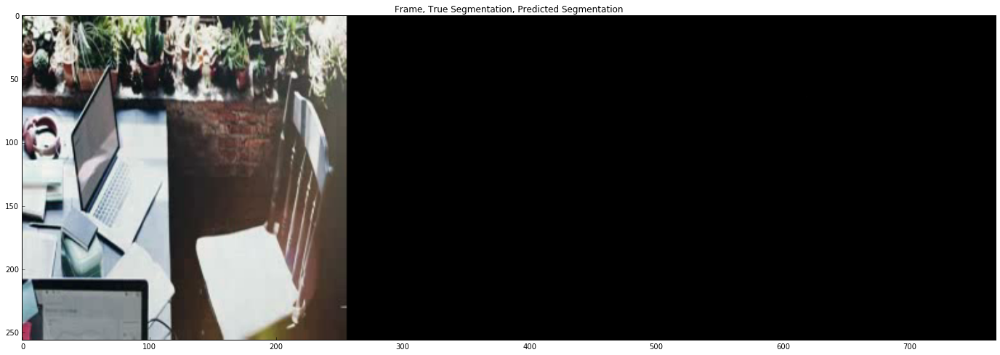


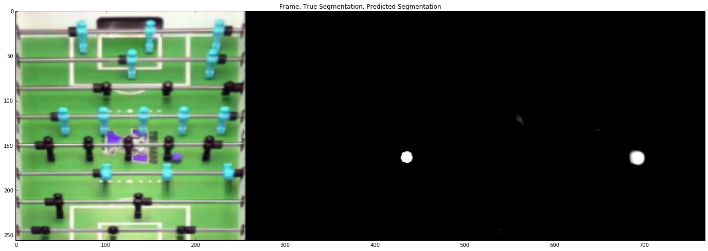


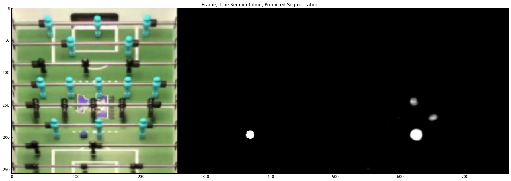


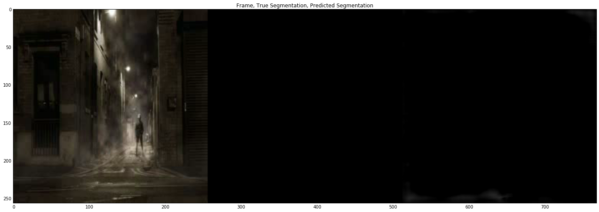


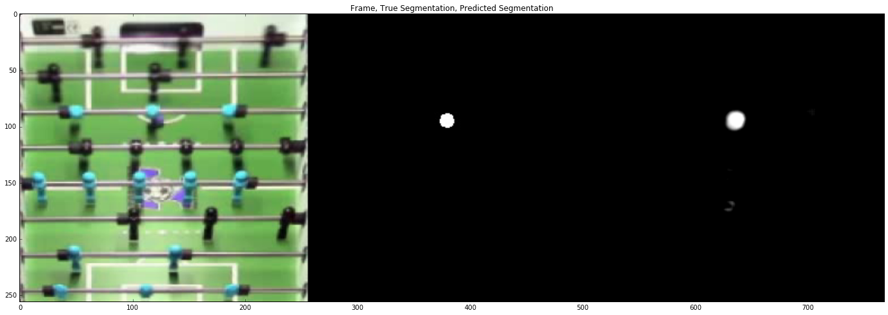


    Wrote model to .\Models\weights_71.hdf
    Epoch 72/72
    

    C:\local\Anaconda3-4.1.1-Windows-x86_64\lib\site-packages\ipykernel\__main__.py:37: UserWarning: Update your `fit_generator` call to the Keras 2 API: `fit_generator(<__main__...., 200, verbose=1, callbacks=None, epochs=72, max_queue_size=50, validation_data=<__main__...., workers=50, use_multiprocessing=False, class_weight=None, validation_steps=5, initial_epoch=71)`
    

    200/200 [==============================] - 201s 1s/step - loss: 3.1065e-04 - balanced_square_error: 3.1065e-04 - mean_squared_error: 0.0018 - val_loss: 1.2093e-04 - val_balanced_square_error: 1.2093e-04 - val_mean_squared_error: 7.1909e-04
    Wrote model to .\Models\weights_72.hdf
    Epoch 73/73
    

    C:\local\Anaconda3-4.1.1-Windows-x86_64\lib\site-packages\ipykernel\__main__.py:37: UserWarning: Update your `fit_generator` call to the Keras 2 API: `fit_generator(<__main__...., 200, verbose=1, callbacks=None, epochs=73, max_queue_size=50, validation_data=<__main__...., workers=50, use_multiprocessing=False, class_weight=None, validation_steps=5, initial_epoch=72)`
    

    200/200 [==============================] - 205s 1s/step - loss: 5.3812e-04 - balanced_square_error: 5.3812e-04 - mean_squared_error: 0.0021 - val_loss: 9.2820e-05 - val_balanced_square_error: 9.2820e-05 - val_mean_squared_error: 0.0012
    Wrote model to .\Models\weights_73.hdf
    Epoch 74/74
    

    C:\local\Anaconda3-4.1.1-Windows-x86_64\lib\site-packages\ipykernel\__main__.py:37: UserWarning: Update your `fit_generator` call to the Keras 2 API: `fit_generator(<__main__...., 200, verbose=1, callbacks=None, epochs=74, max_queue_size=50, validation_data=<__main__...., workers=50, use_multiprocessing=False, class_weight=None, validation_steps=5, initial_epoch=73)`
    

    200/200 [==============================] - 204s 1s/step - loss: 5.0579e-04 - balanced_square_error: 5.0579e-04 - mean_squared_error: 0.0019 - val_loss: 1.0835e-04 - val_balanced_square_error: 1.0835e-04 - val_mean_squared_error: 0.0035
    Wrote model to .\Models\weights_74.hdf
    Epoch 75/75
    

    C:\local\Anaconda3-4.1.1-Windows-x86_64\lib\site-packages\ipykernel\__main__.py:37: UserWarning: Update your `fit_generator` call to the Keras 2 API: `fit_generator(<__main__...., 200, verbose=1, callbacks=None, epochs=75, max_queue_size=50, validation_data=<__main__...., workers=50, use_multiprocessing=False, class_weight=None, validation_steps=5, initial_epoch=74)`
    

    200/200 [==============================] - 203s 1s/step - loss: 7.0575e-04 - balanced_square_error: 7.0575e-04 - mean_squared_error: 0.0023 - val_loss: 7.5441e-05 - val_balanced_square_error: 7.5441e-05 - val_mean_squared_error: 0.0011
    Wrote model to .\Models\weights_75.hdf
    Epoch 76/76
    

    C:\local\Anaconda3-4.1.1-Windows-x86_64\lib\site-packages\ipykernel\__main__.py:37: UserWarning: Update your `fit_generator` call to the Keras 2 API: `fit_generator(<__main__...., 200, verbose=1, callbacks=None, epochs=76, max_queue_size=50, validation_data=<__main__...., workers=50, use_multiprocessing=False, class_weight=None, validation_steps=5, initial_epoch=75)`
    

    200/200 [==============================] - 203s 1s/step - loss: 3.6006e-04 - balanced_square_error: 3.6006e-04 - mean_squared_error: 0.0019 - val_loss: 6.9822e-05 - val_balanced_square_error: 6.9822e-05 - val_mean_squared_error: 5.6666e-04
    


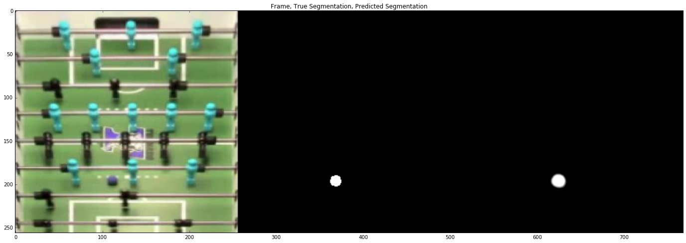


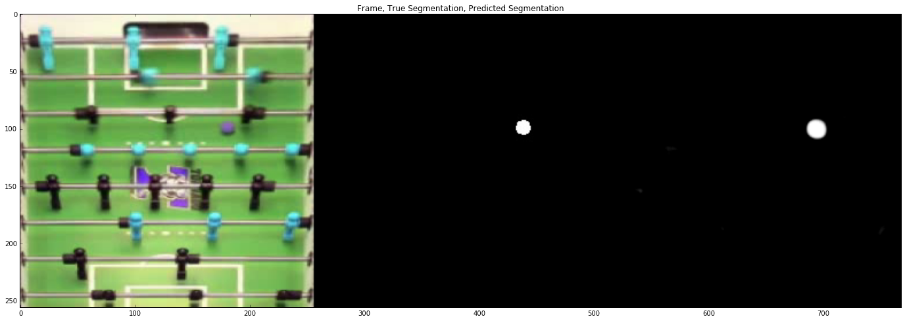


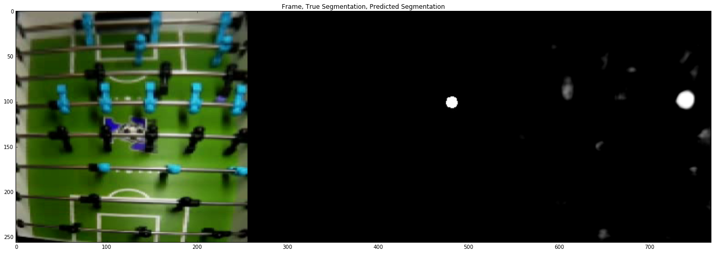


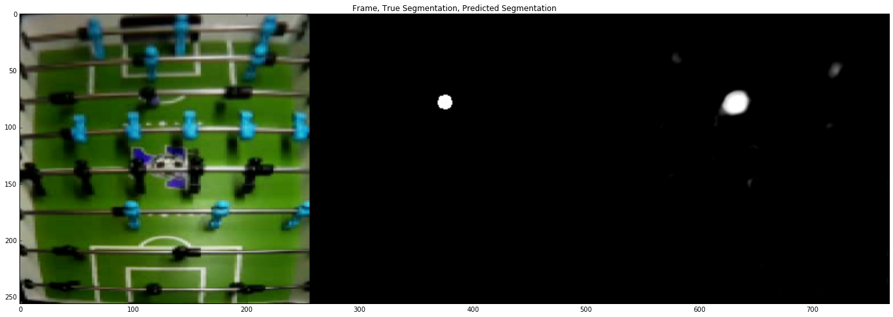


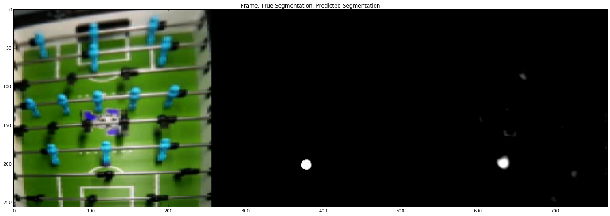


    Wrote model to .\Models\weights_76.hdf
    Epoch 77/77
    

    C:\local\Anaconda3-4.1.1-Windows-x86_64\lib\site-packages\ipykernel\__main__.py:37: UserWarning: Update your `fit_generator` call to the Keras 2 API: `fit_generator(<__main__...., 200, verbose=1, callbacks=None, epochs=77, max_queue_size=50, validation_data=<__main__...., workers=50, use_multiprocessing=False, class_weight=None, validation_steps=5, initial_epoch=76)`
    

    200/200 [==============================] - 206s 1s/step - loss: 2.8509e-04 - balanced_square_error: 2.8509e-04 - mean_squared_error: 0.0016 - val_loss: 5.9685e-05 - val_balanced_square_error: 5.9685e-05 - val_mean_squared_error: 0.0015
    Wrote model to .\Models\weights_77.hdf
    Epoch 78/78
    

    C:\local\Anaconda3-4.1.1-Windows-x86_64\lib\site-packages\ipykernel\__main__.py:37: UserWarning: Update your `fit_generator` call to the Keras 2 API: `fit_generator(<__main__...., 200, verbose=1, callbacks=None, epochs=78, max_queue_size=50, validation_data=<__main__...., workers=50, use_multiprocessing=False, class_weight=None, validation_steps=5, initial_epoch=77)`
    

    200/200 [==============================] - 205s 1s/step - loss: 2.1578e-04 - balanced_square_error: 2.1578e-04 - mean_squared_error: 0.0015 - val_loss: 4.1656e-05 - val_balanced_square_error: 4.1656e-05 - val_mean_squared_error: 5.3966e-04
    Wrote model to .\Models\weights_78.hdf
    Epoch 79/79
    

    C:\local\Anaconda3-4.1.1-Windows-x86_64\lib\site-packages\ipykernel\__main__.py:37: UserWarning: Update your `fit_generator` call to the Keras 2 API: `fit_generator(<__main__...., 200, verbose=1, callbacks=None, epochs=79, max_queue_size=50, validation_data=<__main__...., workers=50, use_multiprocessing=False, class_weight=None, validation_steps=5, initial_epoch=78)`
    

    200/200 [==============================] - 206s 1s/step - loss: 3.8011e-04 - balanced_square_error: 3.8011e-04 - mean_squared_error: 0.0016 - val_loss: 1.5531e-04 - val_balanced_square_error: 1.5531e-04 - val_mean_squared_error: 9.6221e-04
    Wrote model to .\Models\weights_79.hdf
    Epoch 80/80
    

    C:\local\Anaconda3-4.1.1-Windows-x86_64\lib\site-packages\ipykernel\__main__.py:37: UserWarning: Update your `fit_generator` call to the Keras 2 API: `fit_generator(<__main__...., 200, verbose=1, callbacks=None, epochs=80, max_queue_size=50, validation_data=<__main__...., workers=50, use_multiprocessing=False, class_weight=None, validation_steps=5, initial_epoch=79)`
    

    200/200 [==============================] - 202s 1s/step - loss: 4.8032e-04 - balanced_square_error: 4.8032e-04 - mean_squared_error: 0.0017 - val_loss: 4.7456e-05 - val_balanced_square_error: 4.7456e-05 - val_mean_squared_error: 9.5729e-04
    Wrote model to .\Models\weights_80.hdf
    Epoch 81/81
    

    C:\local\Anaconda3-4.1.1-Windows-x86_64\lib\site-packages\ipykernel\__main__.py:37: UserWarning: Update your `fit_generator` call to the Keras 2 API: `fit_generator(<__main__...., 200, verbose=1, callbacks=None, epochs=81, max_queue_size=50, validation_data=<__main__...., workers=50, use_multiprocessing=False, class_weight=None, validation_steps=5, initial_epoch=80)`
    

    200/200 [==============================] - 204s 1s/step - loss: 1.5670e-04 - balanced_square_error: 1.5670e-04 - mean_squared_error: 0.0014 - val_loss: 6.0438e-05 - val_balanced_square_error: 6.0438e-05 - val_mean_squared_error: 0.0013
    


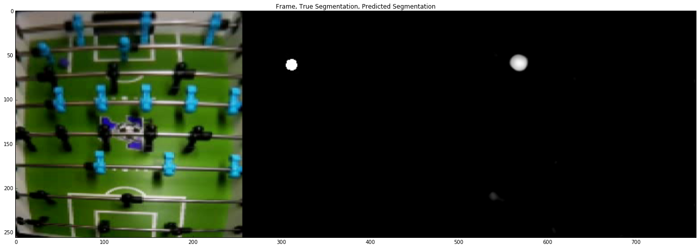


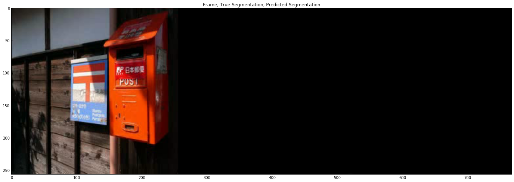


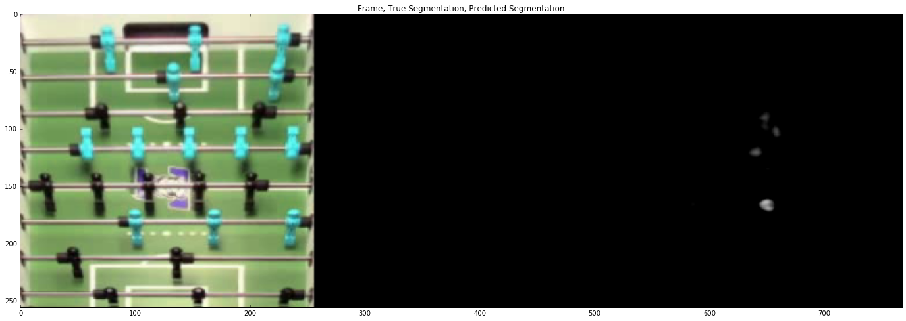


    Wrote model to .\Models\weights_81.hdf
    Epoch 82/82
    

    C:\local\Anaconda3-4.1.1-Windows-x86_64\lib\site-packages\ipykernel\__main__.py:37: UserWarning: Update your `fit_generator` call to the Keras 2 API: `fit_generator(<__main__...., 200, verbose=1, callbacks=None, epochs=82, max_queue_size=50, validation_data=<__main__...., workers=50, use_multiprocessing=False, class_weight=None, validation_steps=5, initial_epoch=81)`
    

    200/200 [==============================] - 208s 1s/step - loss: 1.6000e-04 - balanced_square_error: 1.6000e-04 - mean_squared_error: 0.0014 - val_loss: 3.7100e-05 - val_balanced_square_error: 3.7100e-05 - val_mean_squared_error: 5.6242e-04
    Wrote model to .\Models\weights_82.hdf
    Epoch 83/83
    

    C:\local\Anaconda3-4.1.1-Windows-x86_64\lib\site-packages\ipykernel\__main__.py:37: UserWarning: Update your `fit_generator` call to the Keras 2 API: `fit_generator(<__main__...., 200, verbose=1, callbacks=None, epochs=83, max_queue_size=50, validation_data=<__main__...., workers=50, use_multiprocessing=False, class_weight=None, validation_steps=5, initial_epoch=82)`
    

    200/200 [==============================] - 207s 1s/step - loss: 7.2484e-04 - balanced_square_error: 7.2484e-04 - mean_squared_error: 0.0020 - val_loss: 5.7934e-05 - val_balanced_square_error: 5.7934e-05 - val_mean_squared_error: 0.0016
    Wrote model to .\Models\weights_83.hdf
    Epoch 84/84
    

    C:\local\Anaconda3-4.1.1-Windows-x86_64\lib\site-packages\ipykernel\__main__.py:37: UserWarning: Update your `fit_generator` call to the Keras 2 API: `fit_generator(<__main__...., 200, verbose=1, callbacks=None, epochs=84, max_queue_size=50, validation_data=<__main__...., workers=50, use_multiprocessing=False, class_weight=None, validation_steps=5, initial_epoch=83)`
    

    200/200 [==============================] - 204s 1s/step - loss: 6.3904e-04 - balanced_square_error: 6.3904e-04 - mean_squared_error: 0.0020 - val_loss: 4.3486e-05 - val_balanced_square_error: 4.3486e-05 - val_mean_squared_error: 0.0010
    Wrote model to .\Models\weights_84.hdf
    Epoch 85/85
    

    C:\local\Anaconda3-4.1.1-Windows-x86_64\lib\site-packages\ipykernel\__main__.py:37: UserWarning: Update your `fit_generator` call to the Keras 2 API: `fit_generator(<__main__...., 200, verbose=1, callbacks=None, epochs=85, max_queue_size=50, validation_data=<__main__...., workers=50, use_multiprocessing=False, class_weight=None, validation_steps=5, initial_epoch=84)`
    

    200/200 [==============================] - 203s 1s/step - loss: 2.7694e-04 - balanced_square_error: 2.7694e-04 - mean_squared_error: 0.0014 - val_loss: 5.7657e-04 - val_balanced_square_error: 5.7657e-04 - val_mean_squared_error: 0.0023
    Wrote model to .\Models\weights_85.hdf
    Epoch 86/86
    

    C:\local\Anaconda3-4.1.1-Windows-x86_64\lib\site-packages\ipykernel\__main__.py:37: UserWarning: Update your `fit_generator` call to the Keras 2 API: `fit_generator(<__main__...., 200, verbose=1, callbacks=None, epochs=86, max_queue_size=50, validation_data=<__main__...., workers=50, use_multiprocessing=False, class_weight=None, validation_steps=5, initial_epoch=85)`
    

    200/200 [==============================] - 204s 1s/step - loss: 1.8074e-04 - balanced_square_error: 1.8074e-04 - mean_squared_error: 0.0013 - val_loss: 3.6313e-05 - val_balanced_square_error: 3.6313e-05 - val_mean_squared_error: 5.7712e-04
    


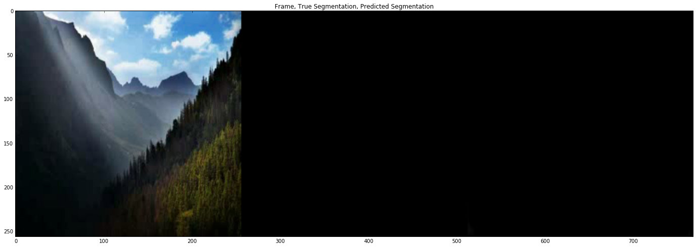


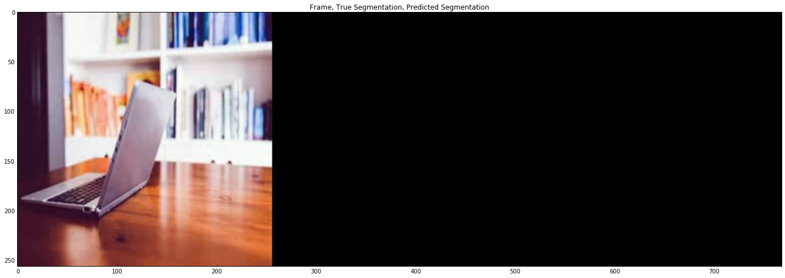


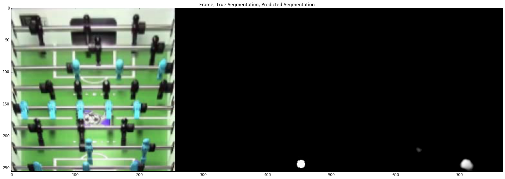


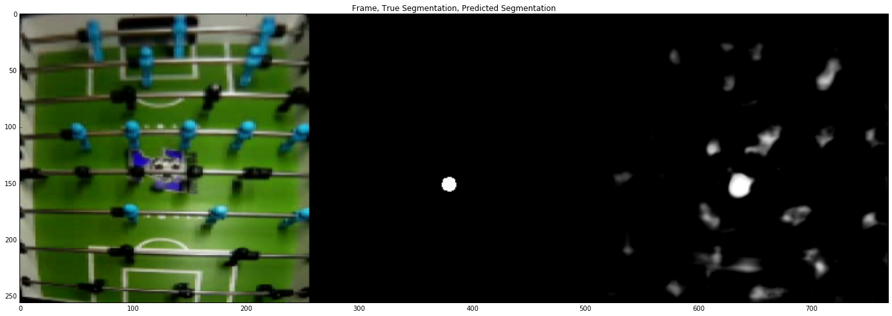


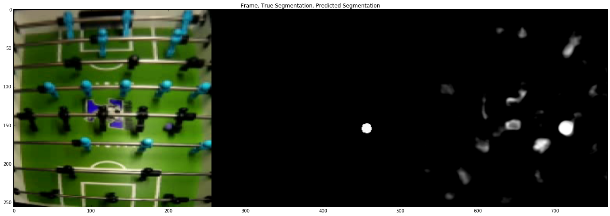


    Wrote model to .\Models\weights_86.hdf
    Epoch 87/87
    

    C:\local\Anaconda3-4.1.1-Windows-x86_64\lib\site-packages\ipykernel\__main__.py:37: UserWarning: Update your `fit_generator` call to the Keras 2 API: `fit_generator(<__main__...., 200, verbose=1, callbacks=None, epochs=87, max_queue_size=50, validation_data=<__main__...., workers=50, use_multiprocessing=False, class_weight=None, validation_steps=5, initial_epoch=86)`
    

    200/200 [==============================] - 204s 1s/step - loss: 1.6469e-04 - balanced_square_error: 1.6469e-04 - mean_squared_error: 0.0013 - val_loss: 0.0015 - val_balanced_square_error: 0.0015 - val_mean_squared_error: 0.0022
    Wrote model to .\Models\weights_87.hdf
    Epoch 88/88
    

    C:\local\Anaconda3-4.1.1-Windows-x86_64\lib\site-packages\ipykernel\__main__.py:37: UserWarning: Update your `fit_generator` call to the Keras 2 API: `fit_generator(<__main__...., 200, verbose=1, callbacks=None, epochs=88, max_queue_size=50, validation_data=<__main__...., workers=50, use_multiprocessing=False, class_weight=None, validation_steps=5, initial_epoch=87)`
    

    200/200 [==============================] - 204s 1s/step - loss: 4.2272e-04 - balanced_square_error: 4.2272e-04 - mean_squared_error: 0.0015 - val_loss: 5.2294e-05 - val_balanced_square_error: 5.2294e-05 - val_mean_squared_error: 7.4636e-04
    Wrote model to .\Models\weights_88.hdf
    Epoch 89/89
    

    C:\local\Anaconda3-4.1.1-Windows-x86_64\lib\site-packages\ipykernel\__main__.py:37: UserWarning: Update your `fit_generator` call to the Keras 2 API: `fit_generator(<__main__...., 200, verbose=1, callbacks=None, epochs=89, max_queue_size=50, validation_data=<__main__...., workers=50, use_multiprocessing=False, class_weight=None, validation_steps=5, initial_epoch=88)`
    

    200/200 [==============================] - 202s 1s/step - loss: 2.2328e-04 - balanced_square_error: 2.2328e-04 - mean_squared_error: 0.0013 - val_loss: 4.1361e-05 - val_balanced_square_error: 4.1361e-05 - val_mean_squared_error: 0.0011
    Wrote model to .\Models\weights_89.hdf
    Epoch 90/90
    

    C:\local\Anaconda3-4.1.1-Windows-x86_64\lib\site-packages\ipykernel\__main__.py:37: UserWarning: Update your `fit_generator` call to the Keras 2 API: `fit_generator(<__main__...., 200, verbose=1, callbacks=None, epochs=90, max_queue_size=50, validation_data=<__main__...., workers=50, use_multiprocessing=False, class_weight=None, validation_steps=5, initial_epoch=89)`
    

    200/200 [==============================] - 202s 1s/step - loss: 1.7764e-04 - balanced_square_error: 1.7764e-04 - mean_squared_error: 0.0013 - val_loss: 1.0449e-04 - val_balanced_square_error: 1.0449e-04 - val_mean_squared_error: 0.0035
    Wrote model to .\Models\weights_90.hdf
    Epoch 91/91
    

    C:\local\Anaconda3-4.1.1-Windows-x86_64\lib\site-packages\ipykernel\__main__.py:37: UserWarning: Update your `fit_generator` call to the Keras 2 API: `fit_generator(<__main__...., 200, verbose=1, callbacks=None, epochs=91, max_queue_size=50, validation_data=<__main__...., workers=50, use_multiprocessing=False, class_weight=None, validation_steps=5, initial_epoch=90)`
    

    200/200 [==============================] - 206s 1s/step - loss: 4.8496e-04 - balanced_square_error: 4.8496e-04 - mean_squared_error: 0.0015 - val_loss: 1.0711e-04 - val_balanced_square_error: 1.0711e-04 - val_mean_squared_error: 3.7240e-04
    


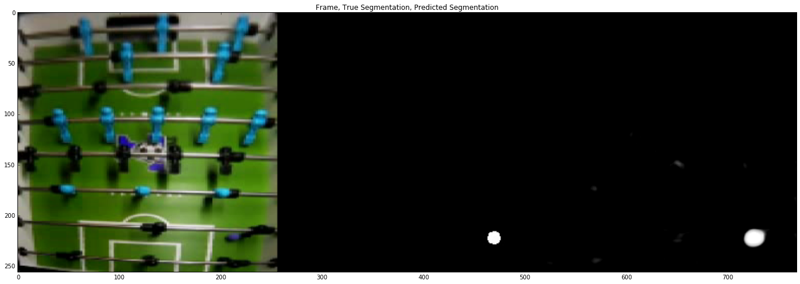


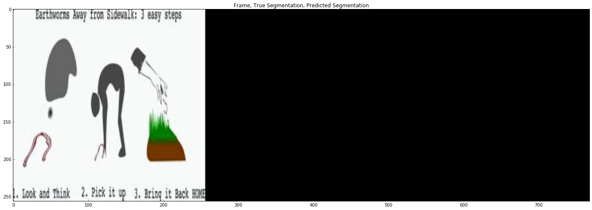


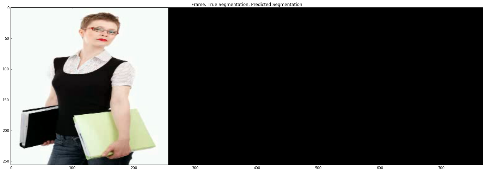


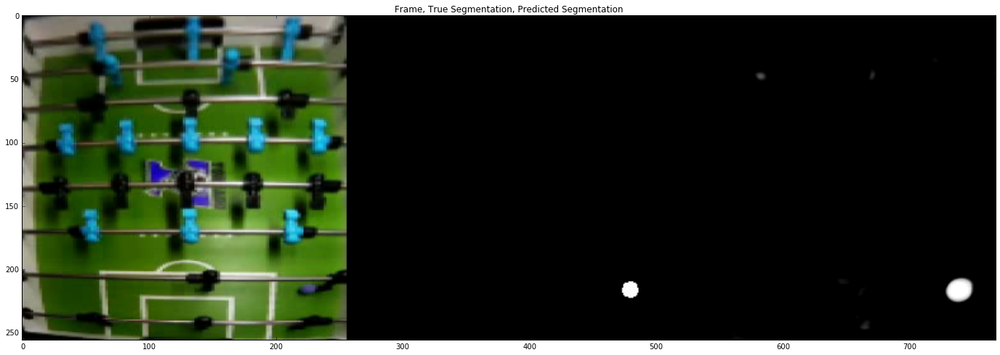


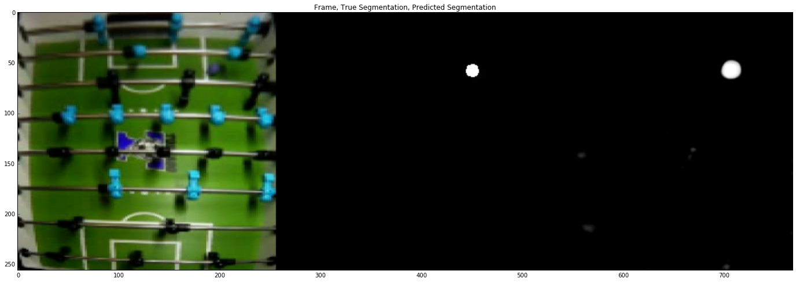


    Wrote model to .\Models\weights_91.hdf
    Epoch 92/92
    

    C:\local\Anaconda3-4.1.1-Windows-x86_64\lib\site-packages\ipykernel\__main__.py:37: UserWarning: Update your `fit_generator` call to the Keras 2 API: `fit_generator(<__main__...., 200, verbose=1, callbacks=None, epochs=92, max_queue_size=50, validation_data=<__main__...., workers=50, use_multiprocessing=False, class_weight=None, validation_steps=5, initial_epoch=91)`
    

    200/200 [==============================] - 205s 1s/step - loss: 4.9457e-04 - balanced_square_error: 4.9457e-04 - mean_squared_error: 0.0018 - val_loss: 3.0642e-05 - val_balanced_square_error: 3.0642e-05 - val_mean_squared_error: 5.7312e-04
    Wrote model to .\Models\weights_92.hdf
    Epoch 93/93
    

    C:\local\Anaconda3-4.1.1-Windows-x86_64\lib\site-packages\ipykernel\__main__.py:37: UserWarning: Update your `fit_generator` call to the Keras 2 API: `fit_generator(<__main__...., 200, verbose=1, callbacks=None, epochs=93, max_queue_size=50, validation_data=<__main__...., workers=50, use_multiprocessing=False, class_weight=None, validation_steps=5, initial_epoch=92)`
    

    200/200 [==============================] - 202s 1s/step - loss: 2.8207e-04 - balanced_square_error: 2.8207e-04 - mean_squared_error: 0.0013 - val_loss: 4.9196e-05 - val_balanced_square_error: 4.9196e-05 - val_mean_squared_error: 0.0011
    Wrote model to .\Models\weights_93.hdf
    Epoch 94/94
    

    C:\local\Anaconda3-4.1.1-Windows-x86_64\lib\site-packages\ipykernel\__main__.py:37: UserWarning: Update your `fit_generator` call to the Keras 2 API: `fit_generator(<__main__...., 200, verbose=1, callbacks=None, epochs=94, max_queue_size=50, validation_data=<__main__...., workers=50, use_multiprocessing=False, class_weight=None, validation_steps=5, initial_epoch=93)`
    

    200/200 [==============================] - 202s 1s/step - loss: 3.8031e-04 - balanced_square_error: 3.8031e-04 - mean_squared_error: 0.0013 - val_loss: 9.2437e-05 - val_balanced_square_error: 9.2437e-05 - val_mean_squared_error: 0.0029
    Wrote model to .\Models\weights_94.hdf
    Epoch 95/95
    

    C:\local\Anaconda3-4.1.1-Windows-x86_64\lib\site-packages\ipykernel\__main__.py:37: UserWarning: Update your `fit_generator` call to the Keras 2 API: `fit_generator(<__main__...., 200, verbose=1, callbacks=None, epochs=95, max_queue_size=50, validation_data=<__main__...., workers=50, use_multiprocessing=False, class_weight=None, validation_steps=5, initial_epoch=94)`
    

    200/200 [==============================] - 202s 1s/step - loss: 6.4029e-04 - balanced_square_error: 6.4029e-04 - mean_squared_error: 0.0017 - val_loss: 3.7386e-05 - val_balanced_square_error: 3.7386e-05 - val_mean_squared_error: 7.2535e-04
    Wrote model to .\Models\weights_95.hdf
    Epoch 96/96
    

    C:\local\Anaconda3-4.1.1-Windows-x86_64\lib\site-packages\ipykernel\__main__.py:37: UserWarning: Update your `fit_generator` call to the Keras 2 API: `fit_generator(<__main__...., 200, verbose=1, callbacks=None, epochs=96, max_queue_size=50, validation_data=<__main__...., workers=50, use_multiprocessing=False, class_weight=None, validation_steps=5, initial_epoch=95)`
    

    200/200 [==============================] - 206s 1s/step - loss: 1.4523e-04 - balanced_square_error: 1.4523e-04 - mean_squared_error: 0.0011 - val_loss: 1.5118e-04 - val_balanced_square_error: 1.5118e-04 - val_mean_squared_error: 0.0050
    


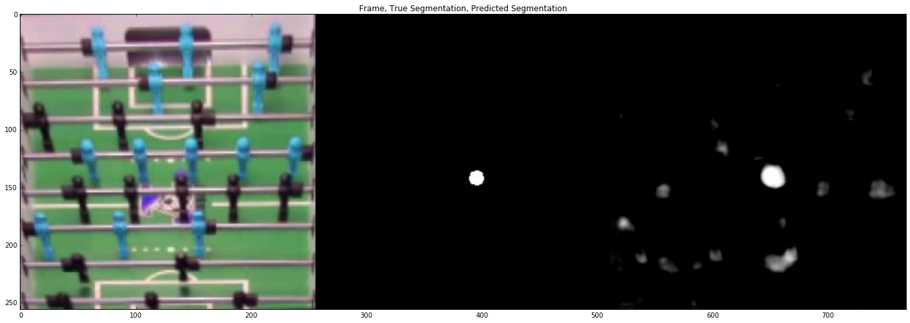


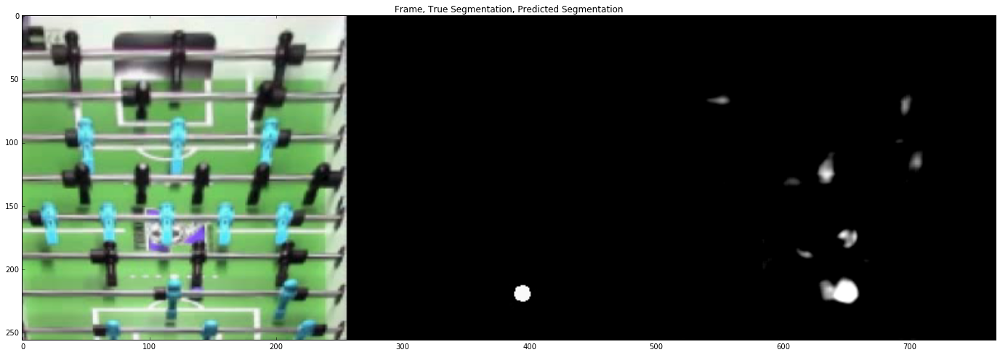


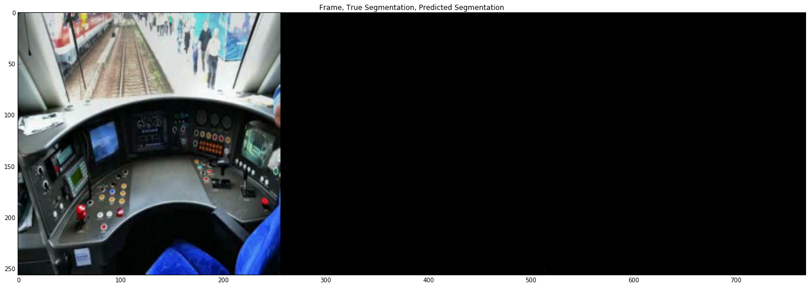


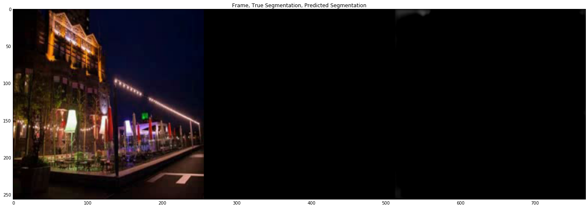


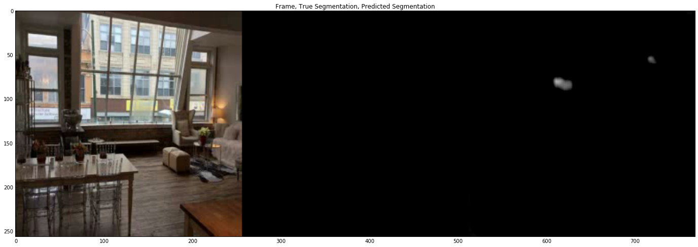


    Wrote model to .\Models\weights_96.hdf
    Epoch 97/97
    

    C:\local\Anaconda3-4.1.1-Windows-x86_64\lib\site-packages\ipykernel\__main__.py:37: UserWarning: Update your `fit_generator` call to the Keras 2 API: `fit_generator(<__main__...., 200, verbose=1, callbacks=None, epochs=97, max_queue_size=50, validation_data=<__main__...., workers=50, use_multiprocessing=False, class_weight=None, validation_steps=5, initial_epoch=96)`
    

    200/200 [==============================] - 205s 1s/step - loss: 2.7639e-04 - balanced_square_error: 2.7639e-04 - mean_squared_error: 0.0013 - val_loss: 0.0016 - val_balanced_square_error: 0.0016 - val_mean_squared_error: 0.0021
    Wrote model to .\Models\weights_97.hdf
    Epoch 98/98
    

    C:\local\Anaconda3-4.1.1-Windows-x86_64\lib\site-packages\ipykernel\__main__.py:37: UserWarning: Update your `fit_generator` call to the Keras 2 API: `fit_generator(<__main__...., 200, verbose=1, callbacks=None, epochs=98, max_queue_size=50, validation_data=<__main__...., workers=50, use_multiprocessing=False, class_weight=None, validation_steps=5, initial_epoch=97)`
    

    200/200 [==============================] - 201s 1s/step - loss: 5.0728e-04 - balanced_square_error: 5.0728e-04 - mean_squared_error: 0.0014 - val_loss: 5.4407e-05 - val_balanced_square_error: 5.4407e-05 - val_mean_squared_error: 4.3705e-04
    Wrote model to .\Models\weights_98.hdf
    Epoch 99/99
    

    C:\local\Anaconda3-4.1.1-Windows-x86_64\lib\site-packages\ipykernel\__main__.py:37: UserWarning: Update your `fit_generator` call to the Keras 2 API: `fit_generator(<__main__...., 200, verbose=1, callbacks=None, epochs=99, max_queue_size=50, validation_data=<__main__...., workers=50, use_multiprocessing=False, class_weight=None, validation_steps=5, initial_epoch=98)`
    

    200/200 [==============================] - 205s 1s/step - loss: 3.7462e-04 - balanced_square_error: 3.7462e-04 - mean_squared_error: 0.0013 - val_loss: 3.6771e-05 - val_balanced_square_error: 3.6771e-05 - val_mean_squared_error: 6.8418e-04
    Wrote model to .\Models\weights_99.hdf
    Epoch 100/100
    

    C:\local\Anaconda3-4.1.1-Windows-x86_64\lib\site-packages\ipykernel\__main__.py:37: UserWarning: Update your `fit_generator` call to the Keras 2 API: `fit_generator(<__main__...., 200, verbose=1, callbacks=None, epochs=100, max_queue_size=50, validation_data=<__main__...., workers=50, use_multiprocessing=False, class_weight=None, validation_steps=5, initial_epoch=99)`
    

    200/200 [==============================] - 205s 1s/step - loss: 5.4379e-04 - balanced_square_error: 5.4379e-04 - mean_squared_error: 0.0015 - val_loss: 3.5355e-05 - val_balanced_square_error: 3.5355e-05 - val_mean_squared_error: 7.4432e-04
    Wrote model to .\Models\weights_100.hdf
    


```python
def balanced_square_error(y_true, y_pred):
    above_loss = 0.1 * K.mean( K.square( K.clip(y_pred - y_true, 0.0, 100000) ) , axis=-1)
    below_loss = K.mean( K.square( K.clip(y_pred - y_true, -100000, 0.0) ) , axis=-1)
    return above_loss + below_loss

frame_prediction_model.compile(optimizer=keras.optimizers.RMSprop(lr=0.00001),
#model.compile(optimizer=keras.optimizers.adam(),
              loss=balanced_square_error,
              metrics=[balanced_square_error,mean_squared_error])

# Was ran on the above simple model, not pre-trained Inceptionv3 run.
#epoch = 125
#batches_validation_per_epoch = 50
#batches_training_per_epoch = 400
batch_size = 10
batches_training_per_epoch = 200
batches_validation_per_epoch = 5
print("Batch size %i: %i training batches, %i validation batches" % (batch_size, batches_training_per_epoch, batches_validation_per_epoch) )
WEIGHTS_FNAME = '.\\Models\\weights_%i.hdf'
MODELS_FNAME = '.\\Models\\models_%i.h5'


for i in range(50):
    frame_prediction_model.fit_generator(
        TrainBatchGen(batch_size, training=training),
        batches_training_per_epoch,
        epochs=epoch+1,
        verbose=1,
        callbacks=None,
        class_weight=None,
        max_q_size=50,
        workers=50,
        validation_data=TrainBatchGen(batch_size, validation),
        validation_steps = batches_validation_per_epoch,
        pickle_safe=False,
        initial_epoch=epoch)
    
    epoch += 1
    
    # Plot occasional validation data plot
    if i % 5 == 0:
        plot_validate(TrainBatchGen(batch_size, validation), frame_prediction_model, 50, "Epoch validation results %i" % epoch)
    
    # Save the model
    frame_prediction_model.save_weights(WEIGHTS_FNAME % epoch)
    frame_prediction_model.save(MODELS_FNAME % epoch)
    print(("Wrote model to " + WEIGHTS_FNAME )  % epoch)

```

    Batch size 10: 200 training batches, 5 validation batches
    

    C:\local\Anaconda3-4.1.1-Windows-x86_64\lib\site-packages\ipykernel\__main__.py:36: UserWarning: Update your `fit_generator` call to the Keras 2 API: `fit_generator(<__main__...., 200, verbose=1, callbacks=None, epochs=101, max_queue_size=50, validation_data=<__main__...., workers=50, use_multiprocessing=False, class_weight=None, validation_steps=5, initial_epoch=100)`
    

    Epoch 101/101
    200/200 [==============================] - 208s 1s/step - loss: 2.3129e-04 - balanced_square_error: 2.3129e-04 - mean_squared_error: 7.3570e-04 - val_loss: 2.7677e-04 - val_balanced_square_error: 2.7677e-04 - val_mean_squared_error: 3.7140e-04
    


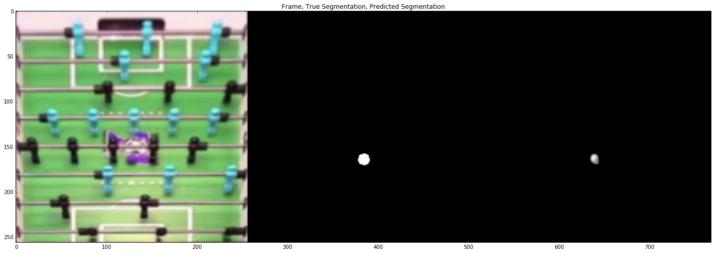


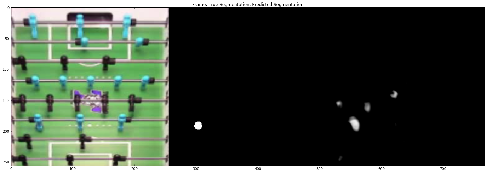


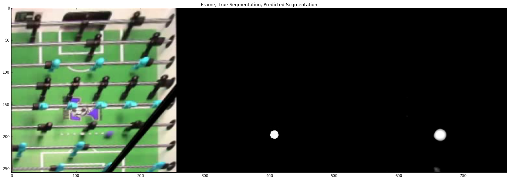


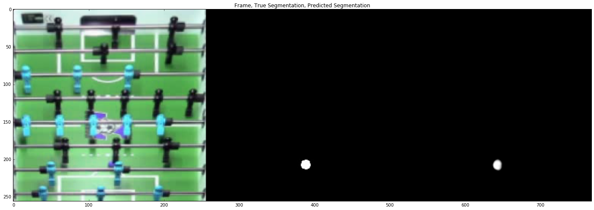


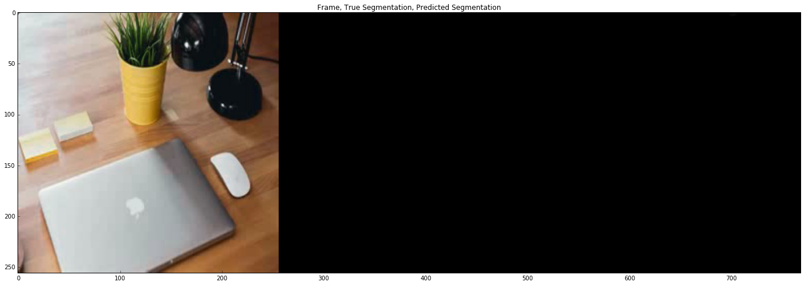


    Wrote model to .\Models\weights_101.hdf
    Epoch 102/102
    

    C:\local\Anaconda3-4.1.1-Windows-x86_64\lib\site-packages\ipykernel\__main__.py:36: UserWarning: Update your `fit_generator` call to the Keras 2 API: `fit_generator(<__main__...., 200, verbose=1, callbacks=None, epochs=102, max_queue_size=50, validation_data=<__main__...., workers=50, use_multiprocessing=False, class_weight=None, validation_steps=5, initial_epoch=101)`
    

    200/200 [==============================] - 205s 1s/step - loss: 4.0585e-04 - balanced_square_error: 4.0585e-04 - mean_squared_error: 8.9698e-04 - val_loss: 6.8919e-05 - val_balanced_square_error: 6.8919e-05 - val_mean_squared_error: 4.9580e-04
    Wrote model to .\Models\weights_102.hdf
    Epoch 103/103
    

    C:\local\Anaconda3-4.1.1-Windows-x86_64\lib\site-packages\ipykernel\__main__.py:36: UserWarning: Update your `fit_generator` call to the Keras 2 API: `fit_generator(<__main__...., 200, verbose=1, callbacks=None, epochs=103, max_queue_size=50, validation_data=<__main__...., workers=50, use_multiprocessing=False, class_weight=None, validation_steps=5, initial_epoch=102)`
    

    200/200 [==============================] - 204s 1s/step - loss: 5.1172e-04 - balanced_square_error: 5.1172e-04 - mean_squared_error: 9.9114e-04 - val_loss: 5.6667e-04 - val_balanced_square_error: 5.6667e-04 - val_mean_squared_error: 6.3798e-04
    Wrote model to .\Models\weights_103.hdf
    Epoch 104/104
    

    C:\local\Anaconda3-4.1.1-Windows-x86_64\lib\site-packages\ipykernel\__main__.py:36: UserWarning: Update your `fit_generator` call to the Keras 2 API: `fit_generator(<__main__...., 200, verbose=1, callbacks=None, epochs=104, max_queue_size=50, validation_data=<__main__...., workers=50, use_multiprocessing=False, class_weight=None, validation_steps=5, initial_epoch=103)`
    

    200/200 [==============================] - 208s 1s/step - loss: 4.8777e-04 - balanced_square_error: 4.8777e-04 - mean_squared_error: 9.6470e-04 - val_loss: 6.6825e-05 - val_balanced_square_error: 6.6825e-05 - val_mean_squared_error: 3.8326e-04
    Wrote model to .\Models\weights_104.hdf
    Epoch 105/105
    

    C:\local\Anaconda3-4.1.1-Windows-x86_64\lib\site-packages\ipykernel\__main__.py:36: UserWarning: Update your `fit_generator` call to the Keras 2 API: `fit_generator(<__main__...., 200, verbose=1, callbacks=None, epochs=105, max_queue_size=50, validation_data=<__main__...., workers=50, use_multiprocessing=False, class_weight=None, validation_steps=5, initial_epoch=104)`
    

    200/200 [==============================] - 204s 1s/step - loss: 4.4194e-04 - balanced_square_error: 4.4194e-04 - mean_squared_error: 8.9942e-04 - val_loss: 1.0081e-04 - val_balanced_square_error: 1.0081e-04 - val_mean_squared_error: 4.2070e-04
    Wrote model to .\Models\weights_105.hdf
    Epoch 106/106
    

    C:\local\Anaconda3-4.1.1-Windows-x86_64\lib\site-packages\ipykernel\__main__.py:36: UserWarning: Update your `fit_generator` call to the Keras 2 API: `fit_generator(<__main__...., 200, verbose=1, callbacks=None, epochs=106, max_queue_size=50, validation_data=<__main__...., workers=50, use_multiprocessing=False, class_weight=None, validation_steps=5, initial_epoch=105)`
    

    200/200 [==============================] - 205s 1s/step - loss: 3.7112e-04 - balanced_square_error: 3.7112e-04 - mean_squared_error: 8.2759e-04 - val_loss: 6.0631e-05 - val_balanced_square_error: 6.0631e-05 - val_mean_squared_error: 3.9487e-04
    


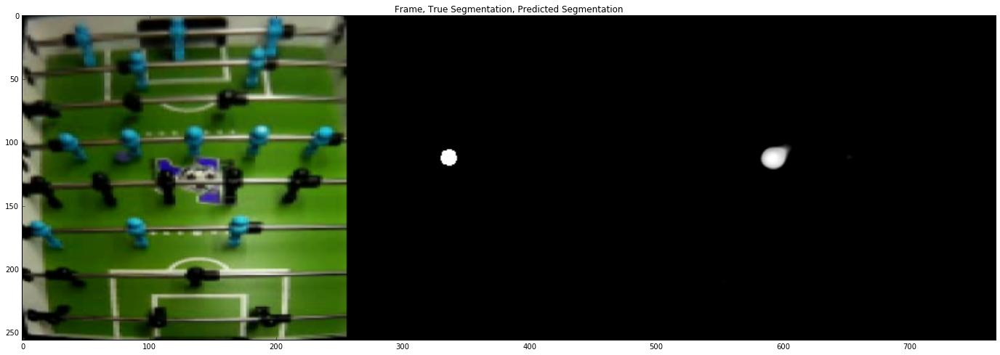


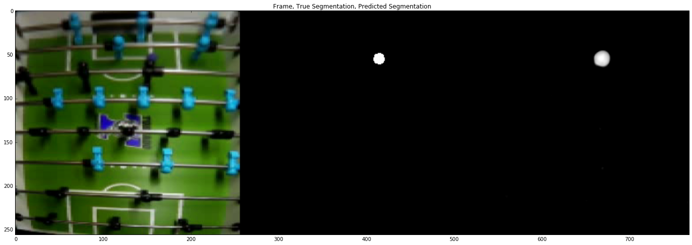


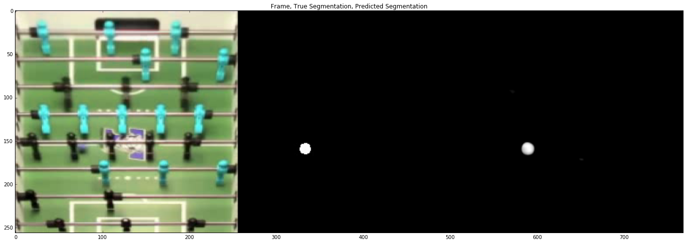


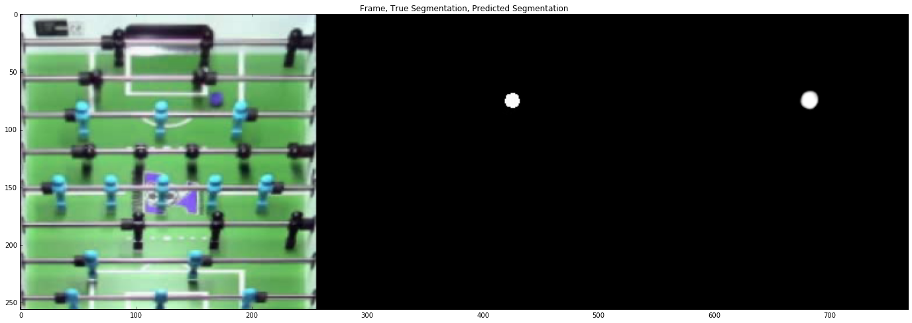


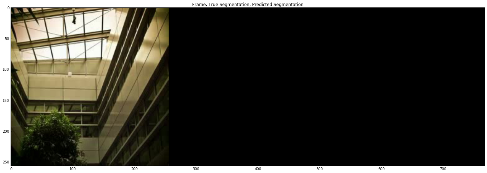


    Wrote model to .\Models\weights_106.hdf
    Epoch 107/107
    

    C:\local\Anaconda3-4.1.1-Windows-x86_64\lib\site-packages\ipykernel\__main__.py:36: UserWarning: Update your `fit_generator` call to the Keras 2 API: `fit_generator(<__main__...., 200, verbose=1, callbacks=None, epochs=107, max_queue_size=50, validation_data=<__main__...., workers=50, use_multiprocessing=False, class_weight=None, validation_steps=5, initial_epoch=106)`
    

    200/200 [==============================] - 208s 1s/step - loss: 3.9613e-04 - balanced_square_error: 3.9613e-04 - mean_squared_error: 8.6851e-04 - val_loss: 5.7891e-05 - val_balanced_square_error: 5.7891e-05 - val_mean_squared_error: 4.6709e-04
    Wrote model to .\Models\weights_107.hdf
    Epoch 108/108
    

    C:\local\Anaconda3-4.1.1-Windows-x86_64\lib\site-packages\ipykernel\__main__.py:36: UserWarning: Update your `fit_generator` call to the Keras 2 API: `fit_generator(<__main__...., 200, verbose=1, callbacks=None, epochs=108, max_queue_size=50, validation_data=<__main__...., workers=50, use_multiprocessing=False, class_weight=None, validation_steps=5, initial_epoch=107)`
    

    200/200 [==============================] - 207s 1s/step - loss: 4.4542e-04 - balanced_square_error: 4.4542e-04 - mean_squared_error: 8.8966e-04 - val_loss: 9.3465e-05 - val_balanced_square_error: 9.3465e-05 - val_mean_squared_error: 8.6938e-04
    Wrote model to .\Models\weights_108.hdf
    Epoch 109/109
    

    C:\local\Anaconda3-4.1.1-Windows-x86_64\lib\site-packages\ipykernel\__main__.py:36: UserWarning: Update your `fit_generator` call to the Keras 2 API: `fit_generator(<__main__...., 200, verbose=1, callbacks=None, epochs=109, max_queue_size=50, validation_data=<__main__...., workers=50, use_multiprocessing=False, class_weight=None, validation_steps=5, initial_epoch=108)`
    

    200/200 [==============================] - 206s 1s/step - loss: 5.5856e-04 - balanced_square_error: 5.5856e-04 - mean_squared_error: 0.0010 - val_loss: 6.5754e-05 - val_balanced_square_error: 6.5754e-05 - val_mean_squared_error: 5.4949e-04
    Wrote model to .\Models\weights_109.hdf
    Epoch 110/110
    

    C:\local\Anaconda3-4.1.1-Windows-x86_64\lib\site-packages\ipykernel\__main__.py:36: UserWarning: Update your `fit_generator` call to the Keras 2 API: `fit_generator(<__main__...., 200, verbose=1, callbacks=None, epochs=110, max_queue_size=50, validation_data=<__main__...., workers=50, use_multiprocessing=False, class_weight=None, validation_steps=5, initial_epoch=109)`
    

    200/200 [==============================] - 207s 1s/step - loss: 4.0983e-04 - balanced_square_error: 4.0983e-04 - mean_squared_error: 8.3926e-04 - val_loss: 5.8499e-05 - val_balanced_square_error: 5.8499e-05 - val_mean_squared_error: 4.0419e-04
    Wrote model to .\Models\weights_110.hdf
    Epoch 111/111
    

    C:\local\Anaconda3-4.1.1-Windows-x86_64\lib\site-packages\ipykernel\__main__.py:36: UserWarning: Update your `fit_generator` call to the Keras 2 API: `fit_generator(<__main__...., 200, verbose=1, callbacks=None, epochs=111, max_queue_size=50, validation_data=<__main__...., workers=50, use_multiprocessing=False, class_weight=None, validation_steps=5, initial_epoch=110)`
    

    200/200 [==============================] - 208s 1s/step - loss: 2.9471e-04 - balanced_square_error: 2.9471e-04 - mean_squared_error: 7.3772e-04 - val_loss: 5.8915e-05 - val_balanced_square_error: 5.8915e-05 - val_mean_squared_error: 4.7972e-04
    


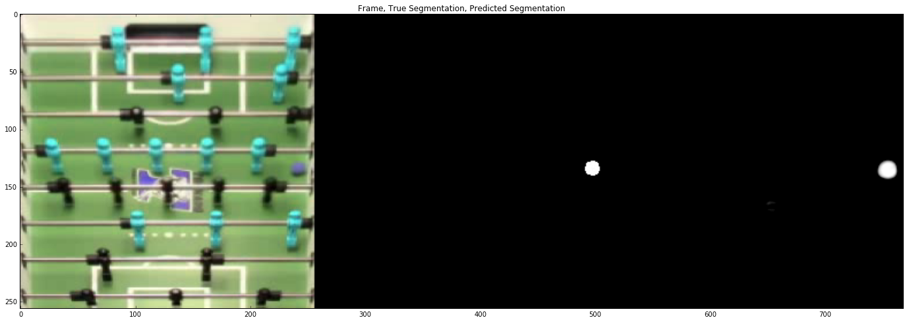


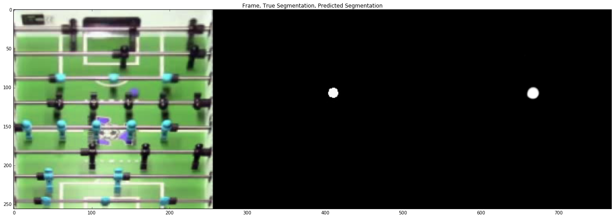


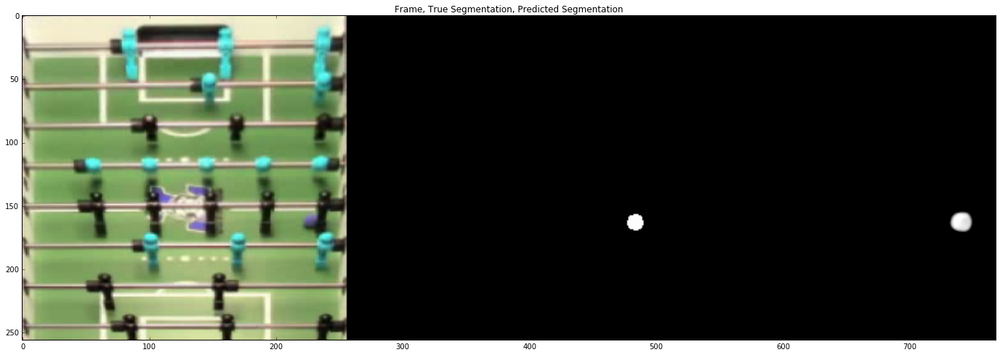


    Wrote model to .\Models\weights_111.hdf
    Epoch 112/112
    

    C:\local\Anaconda3-4.1.1-Windows-x86_64\lib\site-packages\ipykernel\__main__.py:36: UserWarning: Update your `fit_generator` call to the Keras 2 API: `fit_generator(<__main__...., 200, verbose=1, callbacks=None, epochs=112, max_queue_size=50, validation_data=<__main__...., workers=50, use_multiprocessing=False, class_weight=None, validation_steps=5, initial_epoch=111)`
    

    200/200 [==============================] - 207s 1s/step - loss: 3.5293e-04 - balanced_square_error: 3.5293e-04 - mean_squared_error: 7.9787e-04 - val_loss: 2.9957e-04 - val_balanced_square_error: 2.9957e-04 - val_mean_squared_error: 4.9998e-04
    Wrote model to .\Models\weights_112.hdf
    Epoch 113/113
    

    C:\local\Anaconda3-4.1.1-Windows-x86_64\lib\site-packages\ipykernel\__main__.py:36: UserWarning: Update your `fit_generator` call to the Keras 2 API: `fit_generator(<__main__...., 200, verbose=1, callbacks=None, epochs=113, max_queue_size=50, validation_data=<__main__...., workers=50, use_multiprocessing=False, class_weight=None, validation_steps=5, initial_epoch=112)`
    

    200/200 [==============================] - 204s 1s/step - loss: 3.8888e-04 - balanced_square_error: 3.8888e-04 - mean_squared_error: 8.1918e-04 - val_loss: 1.2096e-04 - val_balanced_square_error: 1.2096e-04 - val_mean_squared_error: 0.0012
    Wrote model to .\Models\weights_113.hdf
    Epoch 114/114
    

    C:\local\Anaconda3-4.1.1-Windows-x86_64\lib\site-packages\ipykernel\__main__.py:36: UserWarning: Update your `fit_generator` call to the Keras 2 API: `fit_generator(<__main__...., 200, verbose=1, callbacks=None, epochs=114, max_queue_size=50, validation_data=<__main__...., workers=50, use_multiprocessing=False, class_weight=None, validation_steps=5, initial_epoch=113)`
    

    200/200 [==============================] - 206s 1s/step - loss: 5.0611e-04 - balanced_square_error: 5.0611e-04 - mean_squared_error: 9.3653e-04 - val_loss: 1.3329e-04 - val_balanced_square_error: 1.3329e-04 - val_mean_squared_error: 0.0013
    Wrote model to .\Models\weights_114.hdf
    Epoch 115/115
    

    C:\local\Anaconda3-4.1.1-Windows-x86_64\lib\site-packages\ipykernel\__main__.py:36: UserWarning: Update your `fit_generator` call to the Keras 2 API: `fit_generator(<__main__...., 200, verbose=1, callbacks=None, epochs=115, max_queue_size=50, validation_data=<__main__...., workers=50, use_multiprocessing=False, class_weight=None, validation_steps=5, initial_epoch=114)`
    

    200/200 [==============================] - 209s 1s/step - loss: 2.7321e-04 - balanced_square_error: 2.7321e-04 - mean_squared_error: 6.9711e-04 - val_loss: 9.2098e-05 - val_balanced_square_error: 9.2098e-05 - val_mean_squared_error: 5.8272e-04
    Wrote model to .\Models\weights_115.hdf
    Epoch 116/116
    

    C:\local\Anaconda3-4.1.1-Windows-x86_64\lib\site-packages\ipykernel\__main__.py:36: UserWarning: Update your `fit_generator` call to the Keras 2 API: `fit_generator(<__main__...., 200, verbose=1, callbacks=None, epochs=116, max_queue_size=50, validation_data=<__main__...., workers=50, use_multiprocessing=False, class_weight=None, validation_steps=5, initial_epoch=115)`
    

    200/200 [==============================] - 206s 1s/step - loss: 3.4345e-04 - balanced_square_error: 3.4345e-04 - mean_squared_error: 7.6260e-04 - val_loss: 6.5638e-05 - val_balanced_square_error: 6.5638e-05 - val_mean_squared_error: 5.9016e-04
    


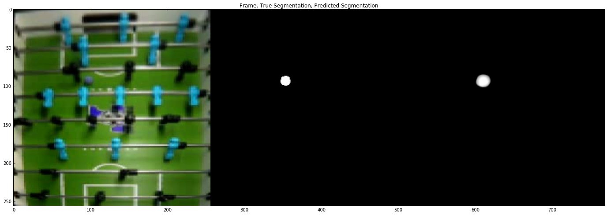


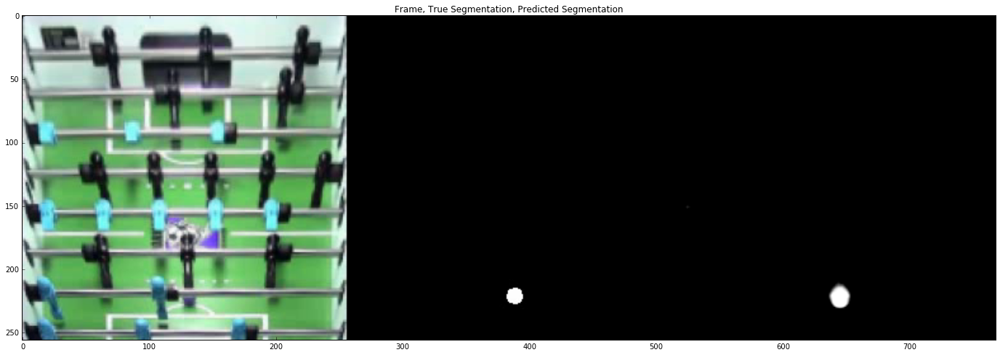


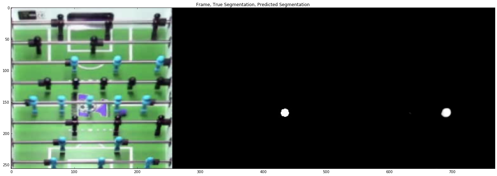


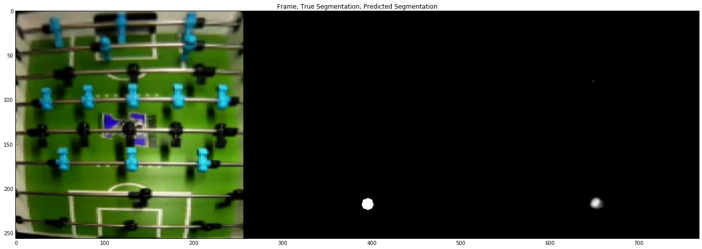


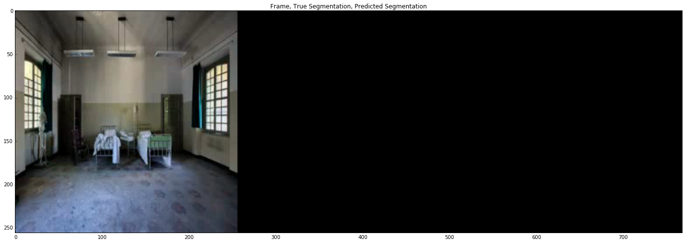


    Wrote model to .\Models\weights_116.hdf
    Epoch 117/117
    

    C:\local\Anaconda3-4.1.1-Windows-x86_64\lib\site-packages\ipykernel\__main__.py:36: UserWarning: Update your `fit_generator` call to the Keras 2 API: `fit_generator(<__main__...., 200, verbose=1, callbacks=None, epochs=117, max_queue_size=50, validation_data=<__main__...., workers=50, use_multiprocessing=False, class_weight=None, validation_steps=5, initial_epoch=116)`
    

    200/200 [==============================] - 206s 1s/step - loss: 5.1182e-04 - balanced_square_error: 5.1182e-04 - mean_squared_error: 9.2388e-04 - val_loss: 9.0742e-05 - val_balanced_square_error: 9.0742e-05 - val_mean_squared_error: 2.7864e-04
    Wrote model to .\Models\weights_117.hdf
    Epoch 118/118
    

    C:\local\Anaconda3-4.1.1-Windows-x86_64\lib\site-packages\ipykernel\__main__.py:36: UserWarning: Update your `fit_generator` call to the Keras 2 API: `fit_generator(<__main__...., 200, verbose=1, callbacks=None, epochs=118, max_queue_size=50, validation_data=<__main__...., workers=50, use_multiprocessing=False, class_weight=None, validation_steps=5, initial_epoch=117)`
    

    200/200 [==============================] - 208s 1s/step - loss: 2.6922e-04 - balanced_square_error: 2.6922e-04 - mean_squared_error: 6.8050e-04 - val_loss: 6.9409e-05 - val_balanced_square_error: 6.9409e-05 - val_mean_squared_error: 4.6806e-04
    Wrote model to .\Models\weights_118.hdf
    Epoch 119/119
    

    C:\local\Anaconda3-4.1.1-Windows-x86_64\lib\site-packages\ipykernel\__main__.py:36: UserWarning: Update your `fit_generator` call to the Keras 2 API: `fit_generator(<__main__...., 200, verbose=1, callbacks=None, epochs=119, max_queue_size=50, validation_data=<__main__...., workers=50, use_multiprocessing=False, class_weight=None, validation_steps=5, initial_epoch=118)`
    

    200/200 [==============================] - 207s 1s/step - loss: 2.4028e-04 - balanced_square_error: 2.4028e-04 - mean_squared_error: 6.4084e-04 - val_loss: 6.5610e-05 - val_balanced_square_error: 6.5610e-05 - val_mean_squared_error: 3.8010e-04
    Wrote model to .\Models\weights_119.hdf
    Epoch 120/120
    

    C:\local\Anaconda3-4.1.1-Windows-x86_64\lib\site-packages\ipykernel\__main__.py:36: UserWarning: Update your `fit_generator` call to the Keras 2 API: `fit_generator(<__main__...., 200, verbose=1, callbacks=None, epochs=120, max_queue_size=50, validation_data=<__main__...., workers=50, use_multiprocessing=False, class_weight=None, validation_steps=5, initial_epoch=119)`
    

    200/200 [==============================] - 208s 1s/step - loss: 6.1701e-04 - balanced_square_error: 6.1701e-04 - mean_squared_error: 0.0010 - val_loss: 3.3344e-04 - val_balanced_square_error: 3.3344e-04 - val_mean_squared_error: 7.2050e-04
    Wrote model to .\Models\weights_120.hdf
    Epoch 121/121
    

    C:\local\Anaconda3-4.1.1-Windows-x86_64\lib\site-packages\ipykernel\__main__.py:36: UserWarning: Update your `fit_generator` call to the Keras 2 API: `fit_generator(<__main__...., 200, verbose=1, callbacks=None, epochs=121, max_queue_size=50, validation_data=<__main__...., workers=50, use_multiprocessing=False, class_weight=None, validation_steps=5, initial_epoch=120)`
    

    200/200 [==============================] - 209s 1s/step - loss: 2.7408e-04 - balanced_square_error: 2.7408e-04 - mean_squared_error: 6.7544e-04 - val_loss: 5.4578e-05 - val_balanced_square_error: 5.4578e-05 - val_mean_squared_error: 4.2068e-04
    


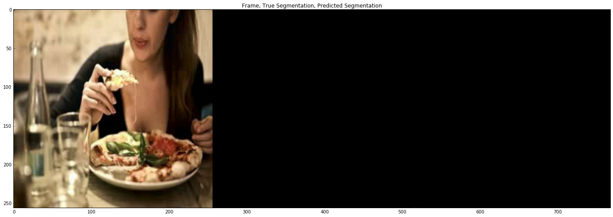


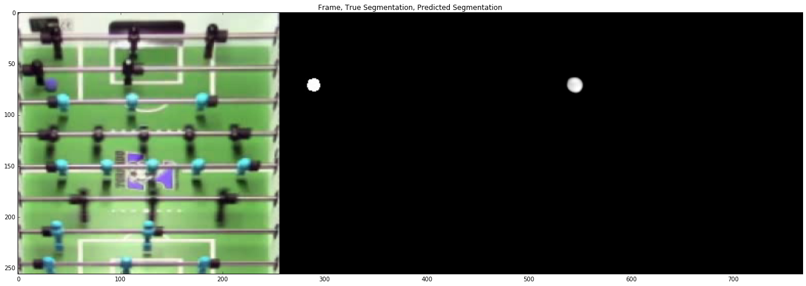


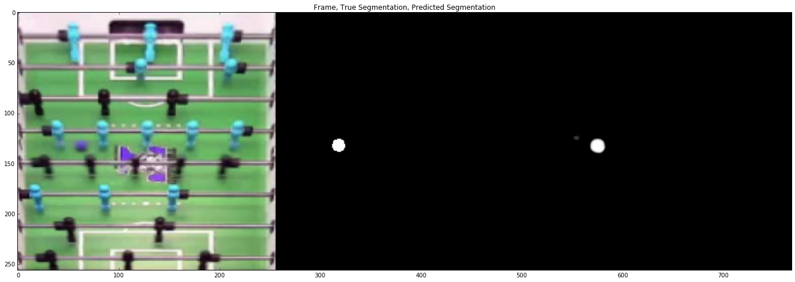


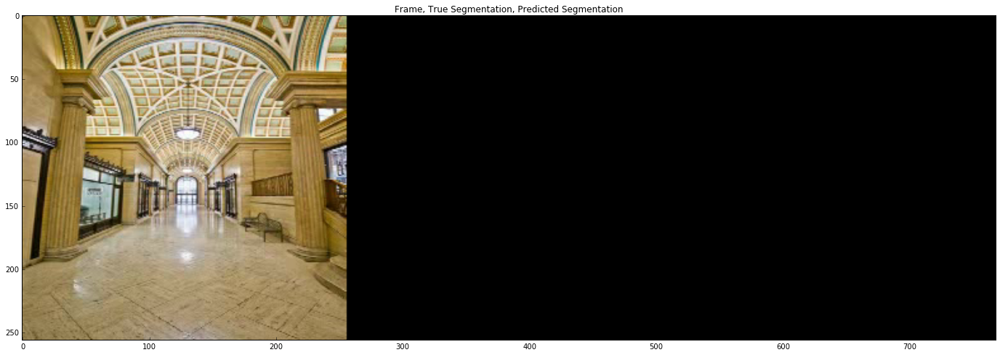


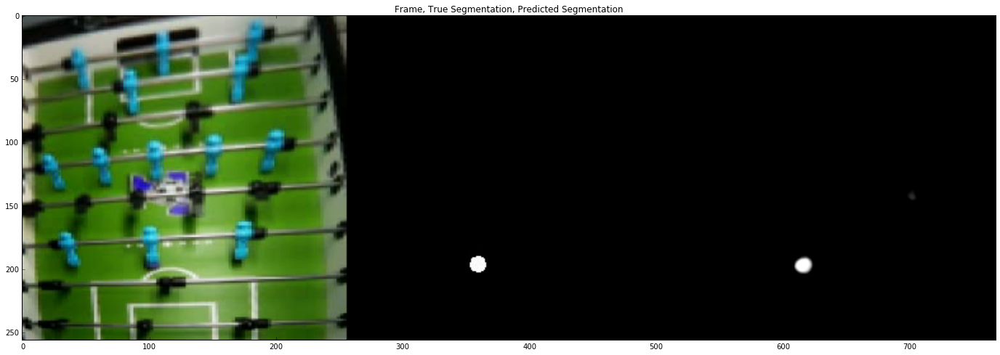


    Wrote model to .\Models\weights_121.hdf
    Epoch 122/122
    

    C:\local\Anaconda3-4.1.1-Windows-x86_64\lib\site-packages\ipykernel\__main__.py:36: UserWarning: Update your `fit_generator` call to the Keras 2 API: `fit_generator(<__main__...., 200, verbose=1, callbacks=None, epochs=122, max_queue_size=50, validation_data=<__main__...., workers=50, use_multiprocessing=False, class_weight=None, validation_steps=5, initial_epoch=121)`
    

    200/200 [==============================] - 206s 1s/step - loss: 2.7505e-04 - balanced_square_error: 2.7505e-04 - mean_squared_error: 6.7926e-04 - val_loss: 3.4564e-04 - val_balanced_square_error: 3.4564e-04 - val_mean_squared_error: 6.7608e-04
    Wrote model to .\Models\weights_122.hdf
    Epoch 123/123
    

    C:\local\Anaconda3-4.1.1-Windows-x86_64\lib\site-packages\ipykernel\__main__.py:36: UserWarning: Update your `fit_generator` call to the Keras 2 API: `fit_generator(<__main__...., 200, verbose=1, callbacks=None, epochs=123, max_queue_size=50, validation_data=<__main__...., workers=50, use_multiprocessing=False, class_weight=None, validation_steps=5, initial_epoch=122)`
    

    200/200 [==============================] - 206s 1s/step - loss: 6.4282e-04 - balanced_square_error: 6.4282e-04 - mean_squared_error: 0.0010 - val_loss: 1.3968e-04 - val_balanced_square_error: 1.3968e-04 - val_mean_squared_error: 0.0011
    Wrote model to .\Models\weights_123.hdf
    Epoch 124/124
    

    C:\local\Anaconda3-4.1.1-Windows-x86_64\lib\site-packages\ipykernel\__main__.py:36: UserWarning: Update your `fit_generator` call to the Keras 2 API: `fit_generator(<__main__...., 200, verbose=1, callbacks=None, epochs=124, max_queue_size=50, validation_data=<__main__...., workers=50, use_multiprocessing=False, class_weight=None, validation_steps=5, initial_epoch=123)`
    

    200/200 [==============================] - 208s 1s/step - loss: 2.8694e-04 - balanced_square_error: 2.8694e-04 - mean_squared_error: 6.9311e-04 - val_loss: 0.0047 - val_balanced_square_error: 0.0047 - val_mean_squared_error: 0.0050
    Wrote model to .\Models\weights_124.hdf
    Epoch 125/125
    

    C:\local\Anaconda3-4.1.1-Windows-x86_64\lib\site-packages\ipykernel\__main__.py:36: UserWarning: Update your `fit_generator` call to the Keras 2 API: `fit_generator(<__main__...., 200, verbose=1, callbacks=None, epochs=125, max_queue_size=50, validation_data=<__main__...., workers=50, use_multiprocessing=False, class_weight=None, validation_steps=5, initial_epoch=124)`
    

    200/200 [==============================] - 205s 1s/step - loss: 5.4880e-04 - balanced_square_error: 5.4880e-04 - mean_squared_error: 9.3705e-04 - val_loss: 6.3154e-05 - val_balanced_square_error: 6.3154e-05 - val_mean_squared_error: 4.7733e-04
    Wrote model to .\Models\weights_125.hdf
    Epoch 126/126
    

    C:\local\Anaconda3-4.1.1-Windows-x86_64\lib\site-packages\ipykernel\__main__.py:36: UserWarning: Update your `fit_generator` call to the Keras 2 API: `fit_generator(<__main__...., 200, verbose=1, callbacks=None, epochs=126, max_queue_size=50, validation_data=<__main__...., workers=50, use_multiprocessing=False, class_weight=None, validation_steps=5, initial_epoch=125)`
    

    200/200 [==============================] - 207s 1s/step - loss: 3.4815e-04 - balanced_square_error: 3.4815e-04 - mean_squared_error: 7.3570e-04 - val_loss: 9.5706e-05 - val_balanced_square_error: 9.5706e-05 - val_mean_squared_error: 2.1095e-04
    


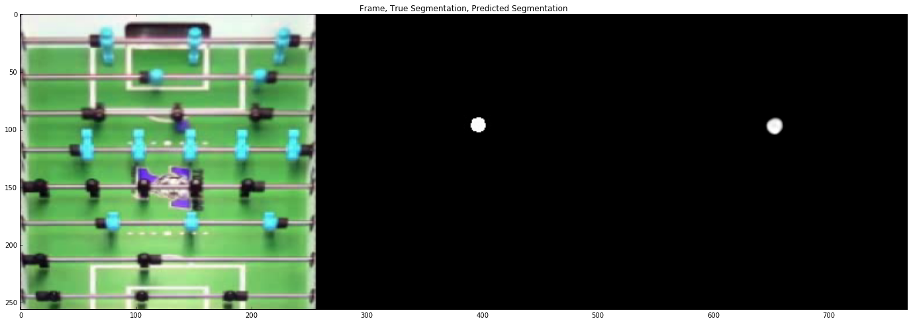


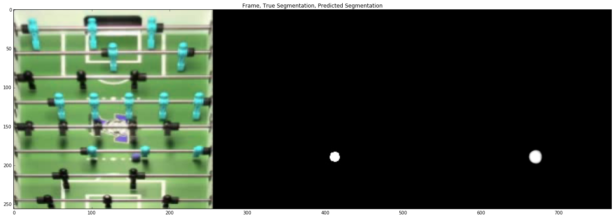


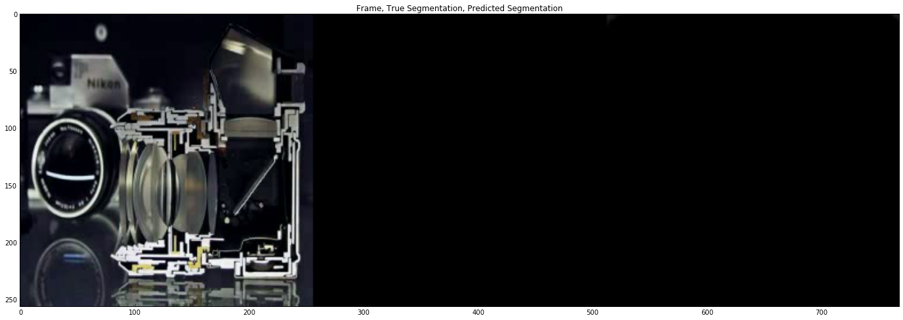


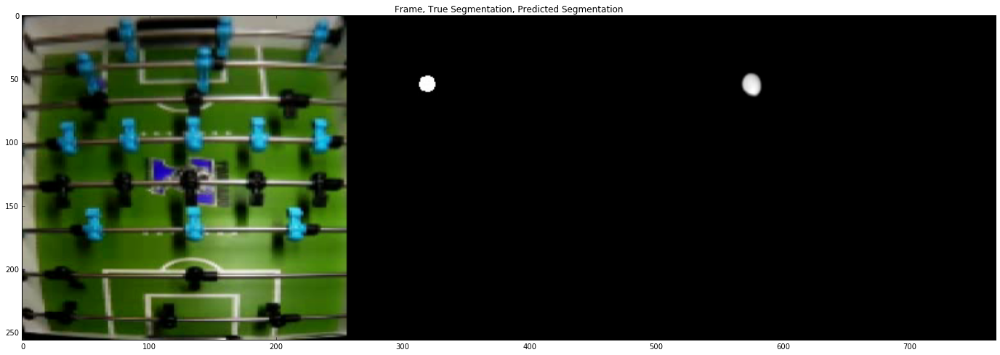


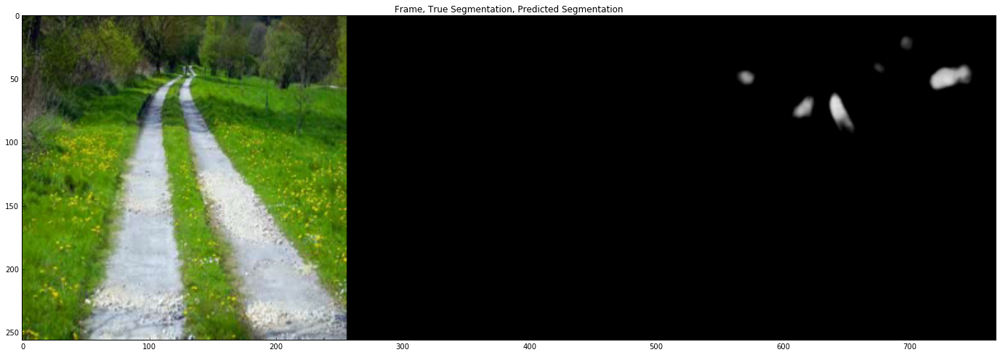


    Wrote model to .\Models\weights_126.hdf
    Epoch 127/127
    

    C:\local\Anaconda3-4.1.1-Windows-x86_64\lib\site-packages\ipykernel\__main__.py:36: UserWarning: Update your `fit_generator` call to the Keras 2 API: `fit_generator(<__main__...., 200, verbose=1, callbacks=None, epochs=127, max_queue_size=50, validation_data=<__main__...., workers=50, use_multiprocessing=False, class_weight=None, validation_steps=5, initial_epoch=126)`
    

    200/200 [==============================] - 208s 1s/step - loss: 4.8700e-04 - balanced_square_error: 4.8700e-04 - mean_squared_error: 8.6749e-04 - val_loss: 4.3211e-05 - val_balanced_square_error: 4.3211e-05 - val_mean_squared_error: 3.4781e-04
    Wrote model to .\Models\weights_127.hdf
    Epoch 128/128
    

    C:\local\Anaconda3-4.1.1-Windows-x86_64\lib\site-packages\ipykernel\__main__.py:36: UserWarning: Update your `fit_generator` call to the Keras 2 API: `fit_generator(<__main__...., 200, verbose=1, callbacks=None, epochs=128, max_queue_size=50, validation_data=<__main__...., workers=50, use_multiprocessing=False, class_weight=None, validation_steps=5, initial_epoch=127)`
    

    200/200 [==============================] - 205s 1s/step - loss: 1.3418e-04 - balanced_square_error: 1.3418e-04 - mean_squared_error: 5.1663e-04 - val_loss: 6.5857e-05 - val_balanced_square_error: 6.5857e-05 - val_mean_squared_error: 2.9070e-04
    Wrote model to .\Models\weights_128.hdf
    Epoch 129/129
    

    C:\local\Anaconda3-4.1.1-Windows-x86_64\lib\site-packages\ipykernel\__main__.py:36: UserWarning: Update your `fit_generator` call to the Keras 2 API: `fit_generator(<__main__...., 200, verbose=1, callbacks=None, epochs=129, max_queue_size=50, validation_data=<__main__...., workers=50, use_multiprocessing=False, class_weight=None, validation_steps=5, initial_epoch=128)`
    

    200/200 [==============================] - 203s 1s/step - loss: 3.1625e-04 - balanced_square_error: 3.1625e-04 - mean_squared_error: 6.9756e-04 - val_loss: 2.8980e-04 - val_balanced_square_error: 2.8980e-04 - val_mean_squared_error: 4.2433e-04
    Wrote model to .\Models\weights_129.hdf
    Epoch 130/130
    

    C:\local\Anaconda3-4.1.1-Windows-x86_64\lib\site-packages\ipykernel\__main__.py:36: UserWarning: Update your `fit_generator` call to the Keras 2 API: `fit_generator(<__main__...., 200, verbose=1, callbacks=None, epochs=130, max_queue_size=50, validation_data=<__main__...., workers=50, use_multiprocessing=False, class_weight=None, validation_steps=5, initial_epoch=129)`
    

    200/200 [==============================] - 206s 1s/step - loss: 4.7415e-04 - balanced_square_error: 4.7415e-04 - mean_squared_error: 8.5296e-04 - val_loss: 4.7702e-05 - val_balanced_square_error: 4.7702e-05 - val_mean_squared_error: 2.8860e-04
    Wrote model to .\Models\weights_130.hdf
    Epoch 131/131
    

    C:\local\Anaconda3-4.1.1-Windows-x86_64\lib\site-packages\ipykernel\__main__.py:36: UserWarning: Update your `fit_generator` call to the Keras 2 API: `fit_generator(<__main__...., 200, verbose=1, callbacks=None, epochs=131, max_queue_size=50, validation_data=<__main__...., workers=50, use_multiprocessing=False, class_weight=None, validation_steps=5, initial_epoch=130)`
    

    200/200 [==============================] - 207s 1s/step - loss: 5.9339e-04 - balanced_square_error: 5.9339e-04 - mean_squared_error: 9.8178e-04 - val_loss: 9.1471e-04 - val_balanced_square_error: 9.1471e-04 - val_mean_squared_error: 0.0012
    


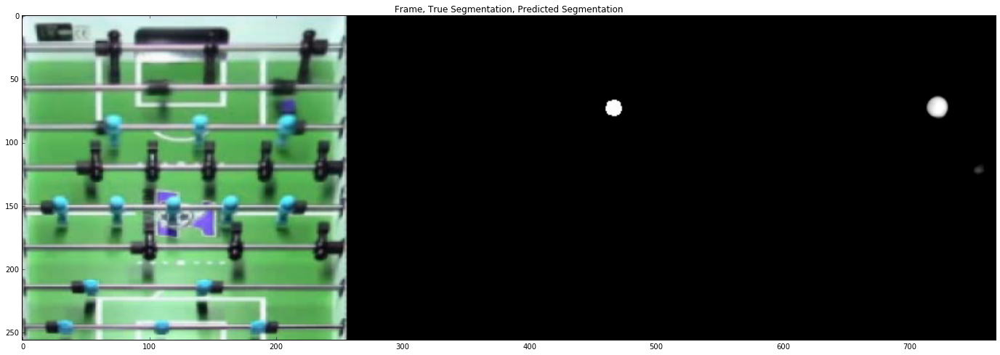


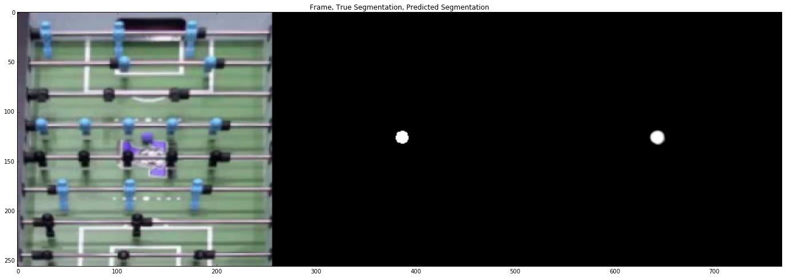


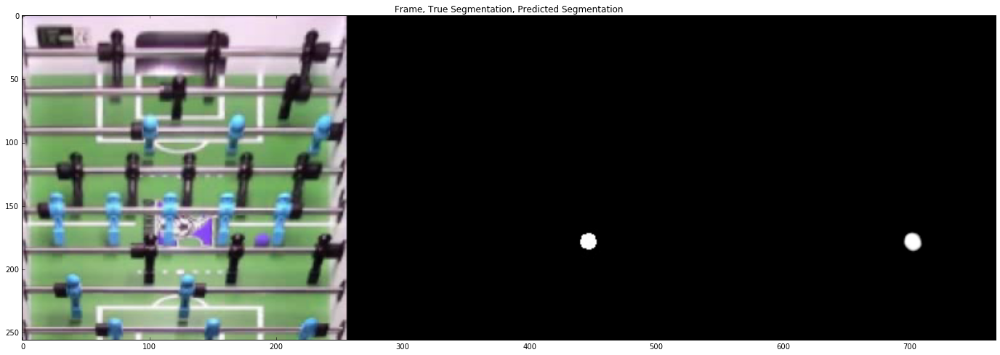


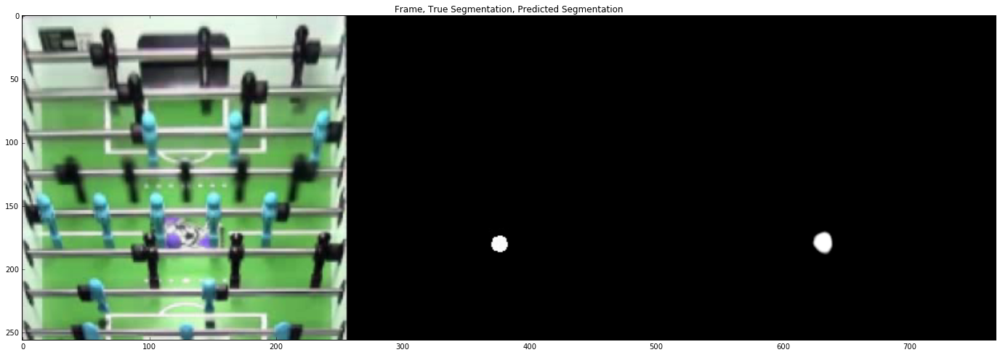


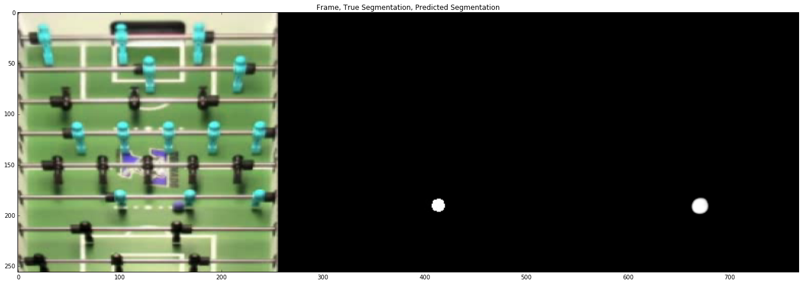


    Wrote model to .\Models\weights_131.hdf
    Epoch 132/132
    

    C:\local\Anaconda3-4.1.1-Windows-x86_64\lib\site-packages\ipykernel\__main__.py:36: UserWarning: Update your `fit_generator` call to the Keras 2 API: `fit_generator(<__main__...., 200, verbose=1, callbacks=None, epochs=132, max_queue_size=50, validation_data=<__main__...., workers=50, use_multiprocessing=False, class_weight=None, validation_steps=5, initial_epoch=131)`
    

    200/200 [==============================] - 205s 1s/step - loss: 3.3990e-04 - balanced_square_error: 3.3990e-04 - mean_squared_error: 7.1018e-04 - val_loss: 5.6392e-04 - val_balanced_square_error: 5.6392e-04 - val_mean_squared_error: 8.1275e-04
    Wrote model to .\Models\weights_132.hdf
    Epoch 133/133
    

    C:\local\Anaconda3-4.1.1-Windows-x86_64\lib\site-packages\ipykernel\__main__.py:36: UserWarning: Update your `fit_generator` call to the Keras 2 API: `fit_generator(<__main__...., 200, verbose=1, callbacks=None, epochs=133, max_queue_size=50, validation_data=<__main__...., workers=50, use_multiprocessing=False, class_weight=None, validation_steps=5, initial_epoch=132)`
    

    200/200 [==============================] - 204s 1s/step - loss: 2.1289e-04 - balanced_square_error: 2.1289e-04 - mean_squared_error: 5.8090e-04 - val_loss: 8.6906e-05 - val_balanced_square_error: 8.6906e-05 - val_mean_squared_error: 3.9280e-04
    Wrote model to .\Models\weights_133.hdf
    Epoch 134/134
    

    C:\local\Anaconda3-4.1.1-Windows-x86_64\lib\site-packages\ipykernel\__main__.py:36: UserWarning: Update your `fit_generator` call to the Keras 2 API: `fit_generator(<__main__...., 200, verbose=1, callbacks=None, epochs=134, max_queue_size=50, validation_data=<__main__...., workers=50, use_multiprocessing=False, class_weight=None, validation_steps=5, initial_epoch=133)`
    

    200/200 [==============================] - 206s 1s/step - loss: 4.8683e-04 - balanced_square_error: 4.8683e-04 - mean_squared_error: 8.6522e-04 - val_loss: 6.0941e-05 - val_balanced_square_error: 6.0941e-05 - val_mean_squared_error: 2.6722e-04
    Wrote model to .\Models\weights_134.hdf
    Epoch 135/135
    

    C:\local\Anaconda3-4.1.1-Windows-x86_64\lib\site-packages\ipykernel\__main__.py:36: UserWarning: Update your `fit_generator` call to the Keras 2 API: `fit_generator(<__main__...., 200, verbose=1, callbacks=None, epochs=135, max_queue_size=50, validation_data=<__main__...., workers=50, use_multiprocessing=False, class_weight=None, validation_steps=5, initial_epoch=134)`
    

    200/200 [==============================] - 205s 1s/step - loss: 5.4415e-04 - balanced_square_error: 5.4415e-04 - mean_squared_error: 9.0569e-04 - val_loss: 4.8302e-05 - val_balanced_square_error: 4.8302e-05 - val_mean_squared_error: 3.6702e-04
    Wrote model to .\Models\weights_135.hdf
    Epoch 136/136
    

    C:\local\Anaconda3-4.1.1-Windows-x86_64\lib\site-packages\ipykernel\__main__.py:36: UserWarning: Update your `fit_generator` call to the Keras 2 API: `fit_generator(<__main__...., 200, verbose=1, callbacks=None, epochs=136, max_queue_size=50, validation_data=<__main__...., workers=50, use_multiprocessing=False, class_weight=None, validation_steps=5, initial_epoch=135)`
    

    200/200 [==============================] - 205s 1s/step - loss: 3.8586e-04 - balanced_square_error: 3.8586e-04 - mean_squared_error: 7.6263e-04 - val_loss: 5.1439e-05 - val_balanced_square_error: 5.1439e-05 - val_mean_squared_error: 4.2227e-04
    


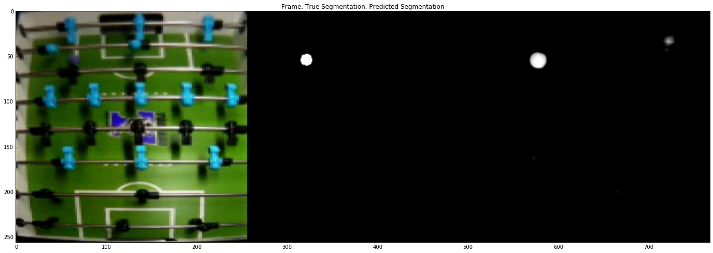


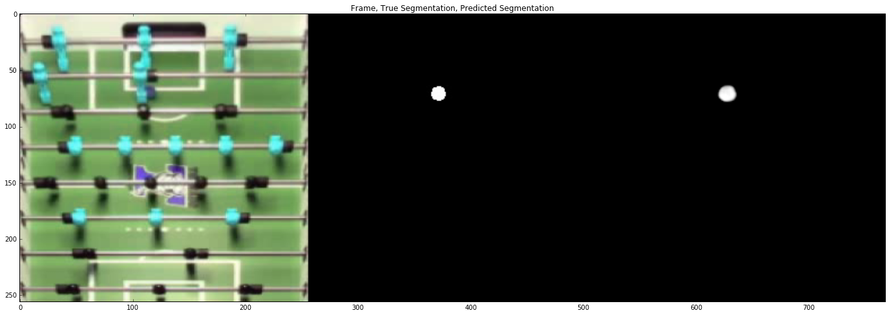


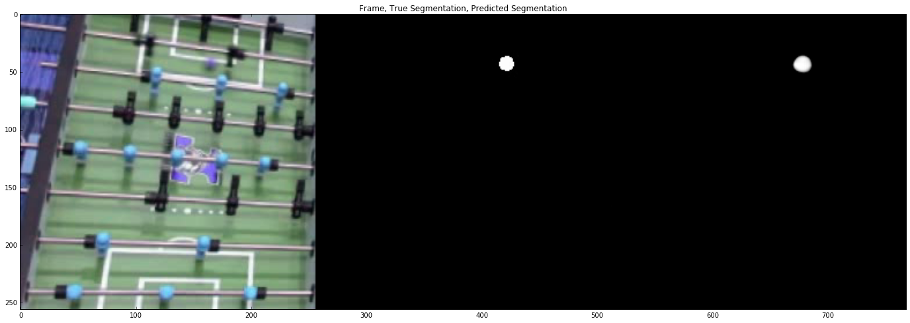


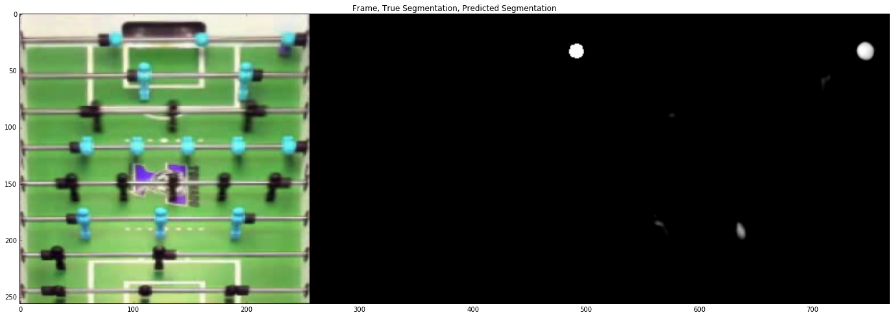


    Wrote model to .\Models\weights_136.hdf
    Epoch 137/137
    

    C:\local\Anaconda3-4.1.1-Windows-x86_64\lib\site-packages\ipykernel\__main__.py:36: UserWarning: Update your `fit_generator` call to the Keras 2 API: `fit_generator(<__main__...., 200, verbose=1, callbacks=None, epochs=137, max_queue_size=50, validation_data=<__main__...., workers=50, use_multiprocessing=False, class_weight=None, validation_steps=5, initial_epoch=136)`
    

    200/200 [==============================] - 207s 1s/step - loss: 5.8382e-04 - balanced_square_error: 5.8382e-04 - mean_squared_error: 9.4796e-04 - val_loss: 4.9113e-05 - val_balanced_square_error: 4.9113e-05 - val_mean_squared_error: 4.0823e-04
    Wrote model to .\Models\weights_137.hdf
    Epoch 138/138
    

    C:\local\Anaconda3-4.1.1-Windows-x86_64\lib\site-packages\ipykernel\__main__.py:36: UserWarning: Update your `fit_generator` call to the Keras 2 API: `fit_generator(<__main__...., 200, verbose=1, callbacks=None, epochs=138, max_queue_size=50, validation_data=<__main__...., workers=50, use_multiprocessing=False, class_weight=None, validation_steps=5, initial_epoch=137)`
    

    200/200 [==============================] - 208s 1s/step - loss: 3.1195e-04 - balanced_square_error: 3.1195e-04 - mean_squared_error: 6.7147e-04 - val_loss: 9.3422e-05 - val_balanced_square_error: 9.3422e-05 - val_mean_squared_error: 2.6918e-04
    Wrote model to .\Models\weights_138.hdf
    Epoch 139/139
    

    C:\local\Anaconda3-4.1.1-Windows-x86_64\lib\site-packages\ipykernel\__main__.py:36: UserWarning: Update your `fit_generator` call to the Keras 2 API: `fit_generator(<__main__...., 200, verbose=1, callbacks=None, epochs=139, max_queue_size=50, validation_data=<__main__...., workers=50, use_multiprocessing=False, class_weight=None, validation_steps=5, initial_epoch=138)`
    

    200/200 [==============================] - 207s 1s/step - loss: 4.5900e-04 - balanced_square_error: 4.5900e-04 - mean_squared_error: 8.2340e-04 - val_loss: 0.0014 - val_balanced_square_error: 0.0014 - val_mean_squared_error: 0.0017
    Wrote model to .\Models\weights_139.hdf
    Epoch 140/140
    

    C:\local\Anaconda3-4.1.1-Windows-x86_64\lib\site-packages\ipykernel\__main__.py:36: UserWarning: Update your `fit_generator` call to the Keras 2 API: `fit_generator(<__main__...., 200, verbose=1, callbacks=None, epochs=140, max_queue_size=50, validation_data=<__main__...., workers=50, use_multiprocessing=False, class_weight=None, validation_steps=5, initial_epoch=139)`
    

    200/200 [==============================] - 206s 1s/step - loss: 2.5853e-04 - balanced_square_error: 2.5853e-04 - mean_squared_error: 6.1887e-04 - val_loss: 5.6922e-04 - val_balanced_square_error: 5.6922e-04 - val_mean_squared_error: 8.8720e-04
    Wrote model to .\Models\weights_140.hdf
    Epoch 141/141
    

    C:\local\Anaconda3-4.1.1-Windows-x86_64\lib\site-packages\ipykernel\__main__.py:36: UserWarning: Update your `fit_generator` call to the Keras 2 API: `fit_generator(<__main__...., 200, verbose=1, callbacks=None, epochs=141, max_queue_size=50, validation_data=<__main__...., workers=50, use_multiprocessing=False, class_weight=None, validation_steps=5, initial_epoch=140)`
    

    200/200 [==============================] - 211s 1s/step - loss: 3.8990e-04 - balanced_square_error: 3.8990e-04 - mean_squared_error: 7.4557e-04 - val_loss: 5.7350e-05 - val_balanced_square_error: 5.7350e-05 - val_mean_squared_error: 5.4097e-04
    


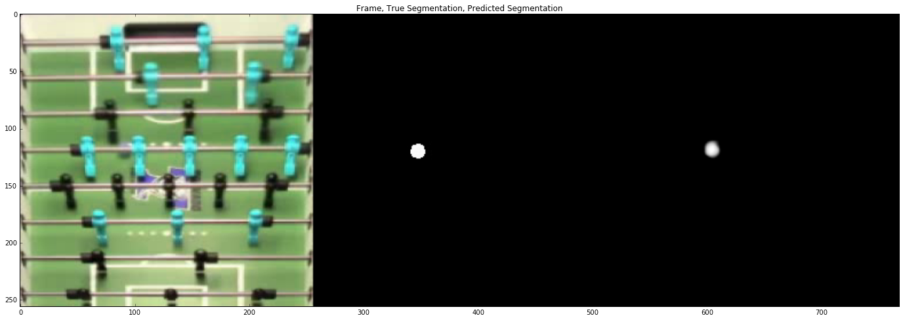


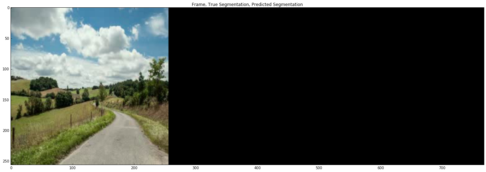


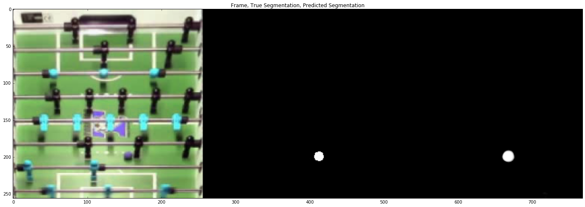


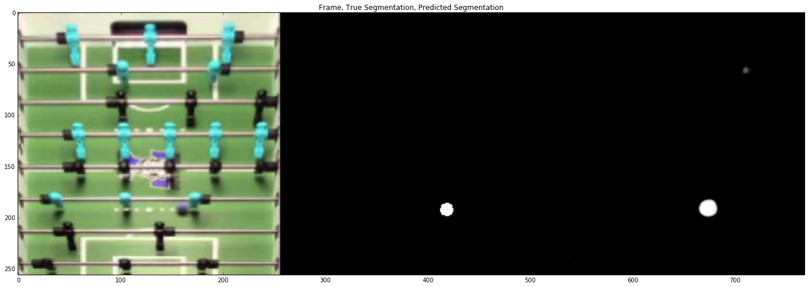


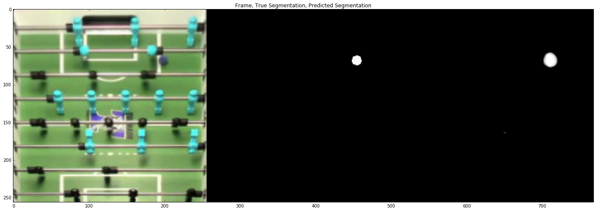


    Wrote model to .\Models\weights_141.hdf
    Epoch 142/142
    

    C:\local\Anaconda3-4.1.1-Windows-x86_64\lib\site-packages\ipykernel\__main__.py:36: UserWarning: Update your `fit_generator` call to the Keras 2 API: `fit_generator(<__main__...., 200, verbose=1, callbacks=None, epochs=142, max_queue_size=50, validation_data=<__main__...., workers=50, use_multiprocessing=False, class_weight=None, validation_steps=5, initial_epoch=141)`
    

    200/200 [==============================] - 204s 1s/step - loss: 3.5270e-04 - balanced_square_error: 3.5269e-04 - mean_squared_error: 7.1978e-04 - val_loss: 4.5128e-05 - val_balanced_square_error: 4.5128e-05 - val_mean_squared_error: 3.4434e-04
    Wrote model to .\Models\weights_142.hdf
    Epoch 143/143
    

    C:\local\Anaconda3-4.1.1-Windows-x86_64\lib\site-packages\ipykernel\__main__.py:36: UserWarning: Update your `fit_generator` call to the Keras 2 API: `fit_generator(<__main__...., 200, verbose=1, callbacks=None, epochs=143, max_queue_size=50, validation_data=<__main__...., workers=50, use_multiprocessing=False, class_weight=None, validation_steps=5, initial_epoch=142)`
    

    200/200 [==============================] - 206s 1s/step - loss: 3.3459e-04 - balanced_square_error: 3.3459e-04 - mean_squared_error: 6.8924e-04 - val_loss: 7.7274e-05 - val_balanced_square_error: 7.7274e-05 - val_mean_squared_error: 2.3514e-04
    Wrote model to .\Models\weights_143.hdf
    Epoch 144/144
    

    C:\local\Anaconda3-4.1.1-Windows-x86_64\lib\site-packages\ipykernel\__main__.py:36: UserWarning: Update your `fit_generator` call to the Keras 2 API: `fit_generator(<__main__...., 200, verbose=1, callbacks=None, epochs=144, max_queue_size=50, validation_data=<__main__...., workers=50, use_multiprocessing=False, class_weight=None, validation_steps=5, initial_epoch=143)`
    

    200/200 [==============================] - 207s 1s/step - loss: 5.4487e-04 - balanced_square_error: 5.4487e-04 - mean_squared_error: 8.9560e-04 - val_loss: 5.1942e-05 - val_balanced_square_error: 5.1942e-05 - val_mean_squared_error: 3.9601e-04
    Wrote model to .\Models\weights_144.hdf
    Epoch 145/145
    

    C:\local\Anaconda3-4.1.1-Windows-x86_64\lib\site-packages\ipykernel\__main__.py:36: UserWarning: Update your `fit_generator` call to the Keras 2 API: `fit_generator(<__main__...., 200, verbose=1, callbacks=None, epochs=145, max_queue_size=50, validation_data=<__main__...., workers=50, use_multiprocessing=False, class_weight=None, validation_steps=5, initial_epoch=144)`
    

    200/200 [==============================] - 206s 1s/step - loss: 2.8137e-04 - balanced_square_error: 2.8137e-04 - mean_squared_error: 6.3890e-04 - val_loss: 4.6780e-05 - val_balanced_square_error: 4.6780e-05 - val_mean_squared_error: 2.9576e-04
    Wrote model to .\Models\weights_145.hdf
    Epoch 146/146
    

    C:\local\Anaconda3-4.1.1-Windows-x86_64\lib\site-packages\ipykernel\__main__.py:36: UserWarning: Update your `fit_generator` call to the Keras 2 API: `fit_generator(<__main__...., 200, verbose=1, callbacks=None, epochs=146, max_queue_size=50, validation_data=<__main__...., workers=50, use_multiprocessing=False, class_weight=None, validation_steps=5, initial_epoch=145)`
    

    200/200 [==============================] - 207s 1s/step - loss: 4.5348e-04 - balanced_square_error: 4.5348e-04 - mean_squared_error: 8.1878e-04 - val_loss: 2.5191e-04 - val_balanced_square_error: 2.5191e-04 - val_mean_squared_error: 4.1548e-04
    


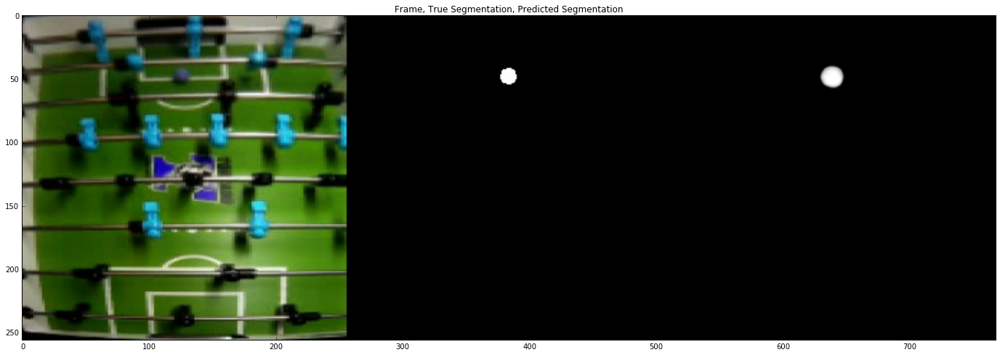


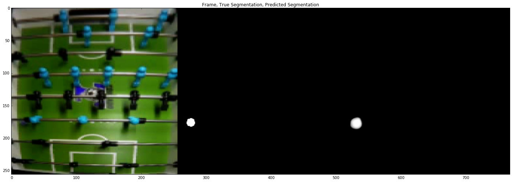


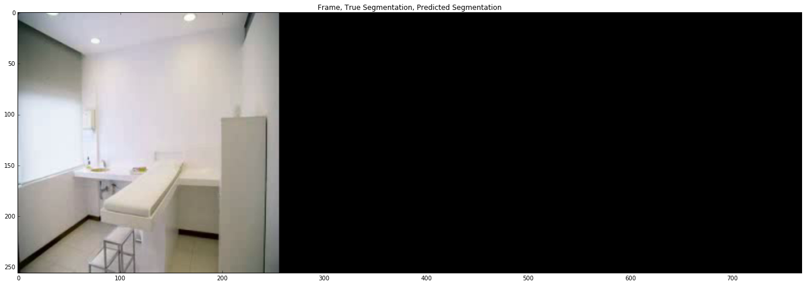


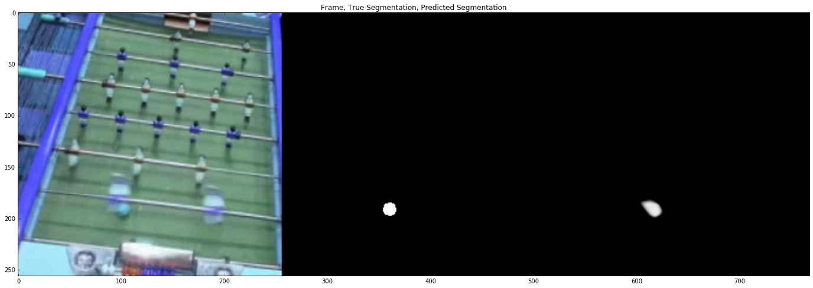


    Wrote model to .\Models\weights_146.hdf
    Epoch 147/147
    

    C:\local\Anaconda3-4.1.1-Windows-x86_64\lib\site-packages\ipykernel\__main__.py:36: UserWarning: Update your `fit_generator` call to the Keras 2 API: `fit_generator(<__main__...., 200, verbose=1, callbacks=None, epochs=147, max_queue_size=50, validation_data=<__main__...., workers=50, use_multiprocessing=False, class_weight=None, validation_steps=5, initial_epoch=146)`
    

    200/200 [==============================] - 206s 1s/step - loss: 3.5678e-04 - balanced_square_error: 3.5678e-04 - mean_squared_error: 6.9994e-04 - val_loss: 0.0020 - val_balanced_square_error: 0.0020 - val_mean_squared_error: 0.0024
    Wrote model to .\Models\weights_147.hdf
    Epoch 148/148
    

    C:\local\Anaconda3-4.1.1-Windows-x86_64\lib\site-packages\ipykernel\__main__.py:36: UserWarning: Update your `fit_generator` call to the Keras 2 API: `fit_generator(<__main__...., 200, verbose=1, callbacks=None, epochs=148, max_queue_size=50, validation_data=<__main__...., workers=50, use_multiprocessing=False, class_weight=None, validation_steps=5, initial_epoch=147)`
    

    200/200 [==============================] - 205s 1s/step - loss: 5.6028e-04 - balanced_square_error: 5.6028e-04 - mean_squared_error: 9.2917e-04 - val_loss: 4.4139e-05 - val_balanced_square_error: 4.4139e-05 - val_mean_squared_error: 2.9022e-04
    Wrote model to .\Models\weights_148.hdf
    Epoch 149/149
    

    C:\local\Anaconda3-4.1.1-Windows-x86_64\lib\site-packages\ipykernel\__main__.py:36: UserWarning: Update your `fit_generator` call to the Keras 2 API: `fit_generator(<__main__...., 200, verbose=1, callbacks=None, epochs=149, max_queue_size=50, validation_data=<__main__...., workers=50, use_multiprocessing=False, class_weight=None, validation_steps=5, initial_epoch=148)`
    

    200/200 [==============================] - 246s 1s/step - loss: 5.5473e-04 - balanced_square_error: 5.5473e-04 - mean_squared_error: 8.8559e-04 - val_loss: 4.8346e-05 - val_balanced_square_error: 4.8346e-05 - val_mean_squared_error: 2.9432e-04
    Wrote model to .\Models\weights_149.hdf
    Epoch 150/150
    

    C:\local\Anaconda3-4.1.1-Windows-x86_64\lib\site-packages\ipykernel\__main__.py:36: UserWarning: Update your `fit_generator` call to the Keras 2 API: `fit_generator(<__main__...., 200, verbose=1, callbacks=None, epochs=150, max_queue_size=50, validation_data=<__main__...., workers=50, use_multiprocessing=False, class_weight=None, validation_steps=5, initial_epoch=149)`
    

    200/200 [==============================] - 263s 1s/step - loss: 3.5973e-04 - balanced_square_error: 3.5973e-04 - mean_squared_error: 6.8898e-04 - val_loss: 8.9449e-05 - val_balanced_square_error: 8.9449e-05 - val_mean_squared_error: 2.3598e-04
    Wrote model to .\Models\weights_150.hdf
    


```python
def balanced_square_error(y_true, y_pred):
    above_loss = 0.2 * K.mean( K.square( K.clip(y_pred - y_true, 0.0, 100000) ) , axis=-1)
    below_loss = K.mean( K.square( K.clip(y_pred - y_true, -100000, 0.0) ) , axis=-1)
    return above_loss + below_loss

frame_prediction_model.compile(optimizer=keras.optimizers.RMSprop(lr=0.00001),
#model.compile(optimizer=keras.optimizers.adam(),
              loss=balanced_square_error,
              metrics=[balanced_square_error,mean_squared_error])

# Was ran on the above simple model, not pre-trained Inceptionv3 run.
#epoch = 125
#batches_validation_per_epoch = 50
#batches_training_per_epoch = 400
batch_size = 10
batches_training_per_epoch = 200
batches_validation_per_epoch = 5
print("Batch size %i: %i training batches, %i validation batches" % (batch_size, batches_training_per_epoch, batches_validation_per_epoch) )
WEIGHTS_FNAME = '.\\Models\\weights_%i.hdf'
MODELS_FNAME = '.\\Models\\models_%i.h5'


for i in range(50):
    frame_prediction_model.fit_generator(
        TrainBatchGen(batch_size, training=training),
        batches_training_per_epoch,
        epochs=epoch+1,
        verbose=1,
        callbacks=None,
        class_weight=None,
        max_q_size=50,
        workers=50,
        validation_data=TrainBatchGen(batch_size, validation),
        validation_steps = batches_validation_per_epoch,
        pickle_safe=False,
        initial_epoch=epoch)
    
    epoch += 1
    
    # Plot occasional validation data plot
    if i % 5 == 0:
        plot_validate(TrainBatchGen(batch_size, validation), frame_prediction_model, 50, "Epoch validation results %i" % epoch)
    
    # Save the model
    frame_prediction_model.save_weights(WEIGHTS_FNAME % epoch)
    frame_prediction_model.save(MODELS_FNAME % epoch)
    print(("Wrote model to " + WEIGHTS_FNAME )  % epoch)


```

    Batch size 10: 200 training batches, 5 validation batches
    

    C:\local\Anaconda3-4.1.1-Windows-x86_64\lib\site-packages\ipykernel\__main__.py:36: UserWarning: Update your `fit_generator` call to the Keras 2 API: `fit_generator(<__main__...., 200, verbose=1, callbacks=None, epochs=151, max_queue_size=50, validation_data=<__main__...., workers=50, use_multiprocessing=False, class_weight=None, validation_steps=5, initial_epoch=150)`
    

    Epoch 151/151
    200/200 [==============================] - 224s 1s/step - loss: 3.0452e-04 - balanced_square_error: 3.0452e-04 - mean_squared_error: 5.4907e-04 - val_loss: 0.0023 - val_balanced_square_error: 0.0023 - val_mean_squared_error: 0.0025
    


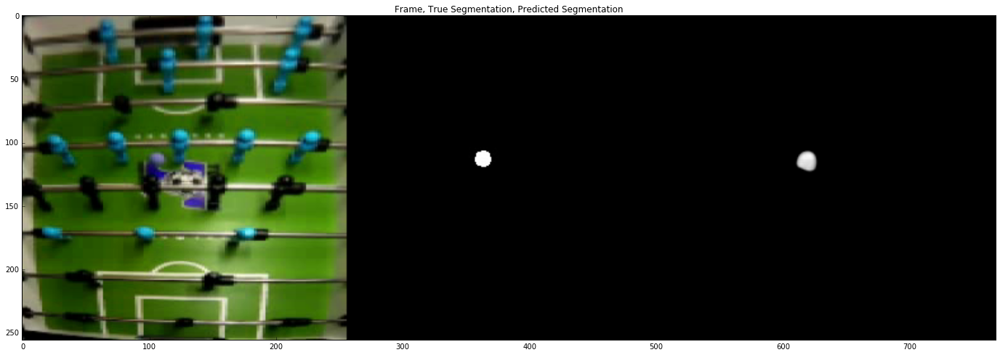


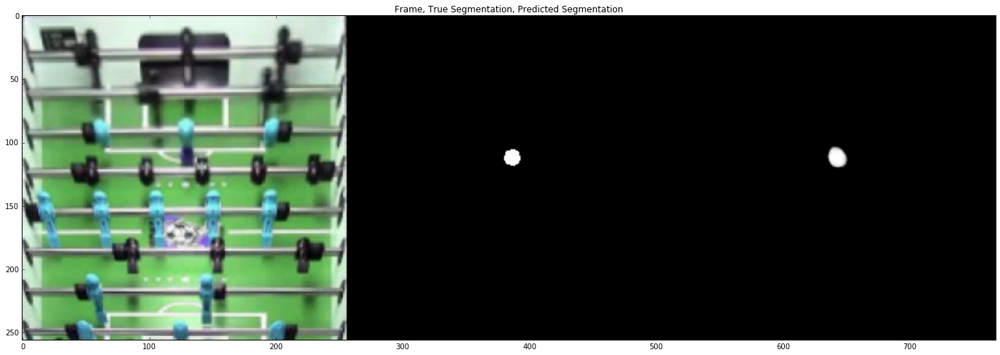


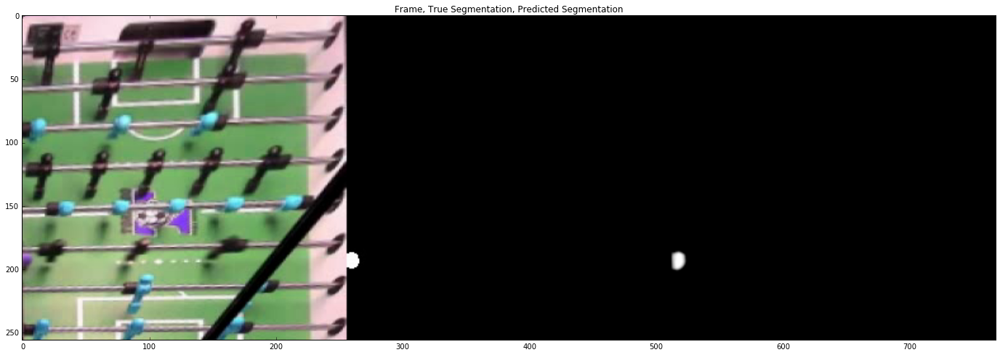


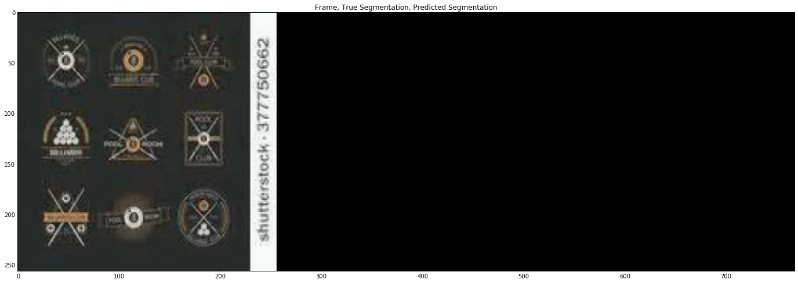


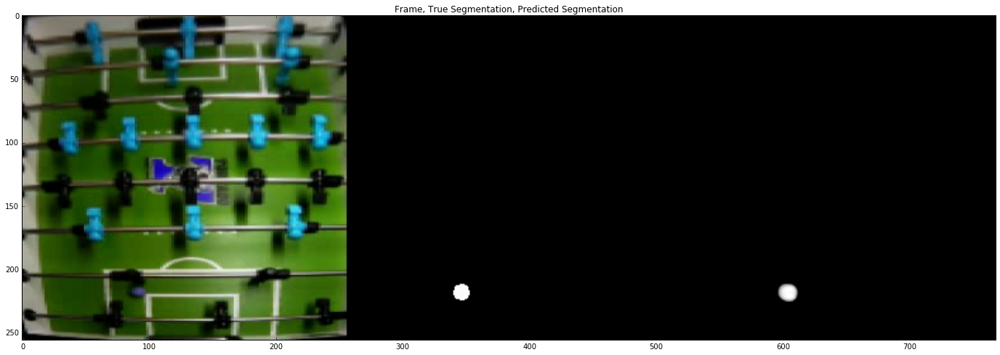


    Wrote model to .\Models\weights_151.hdf
    Epoch 152/152
    

    C:\local\Anaconda3-4.1.1-Windows-x86_64\lib\site-packages\ipykernel\__main__.py:36: UserWarning: Update your `fit_generator` call to the Keras 2 API: `fit_generator(<__main__...., 200, verbose=1, callbacks=None, epochs=152, max_queue_size=50, validation_data=<__main__...., workers=50, use_multiprocessing=False, class_weight=None, validation_steps=5, initial_epoch=151)`
    

    200/200 [==============================] - 222s 1s/step - loss: 5.9343e-04 - balanced_square_error: 5.9343e-04 - mean_squared_error: 8.2036e-04 - val_loss: 7.8286e-05 - val_balanced_square_error: 7.8286e-05 - val_mean_squared_error: 2.4064e-04
    Wrote model to .\Models\weights_152.hdf
    Epoch 153/153
    

    C:\local\Anaconda3-4.1.1-Windows-x86_64\lib\site-packages\ipykernel\__main__.py:36: UserWarning: Update your `fit_generator` call to the Keras 2 API: `fit_generator(<__main__...., 200, verbose=1, callbacks=None, epochs=153, max_queue_size=50, validation_data=<__main__...., workers=50, use_multiprocessing=False, class_weight=None, validation_steps=5, initial_epoch=152)`
    

    200/200 [==============================] - 224s 1s/step - loss: 1.8195e-04 - balanced_square_error: 1.8195e-04 - mean_squared_error: 4.1445e-04 - val_loss: 3.0092e-04 - val_balanced_square_error: 3.0092e-04 - val_mean_squared_error: 4.9940e-04
    Wrote model to .\Models\weights_153.hdf
    Epoch 154/154
    

    C:\local\Anaconda3-4.1.1-Windows-x86_64\lib\site-packages\ipykernel\__main__.py:36: UserWarning: Update your `fit_generator` call to the Keras 2 API: `fit_generator(<__main__...., 200, verbose=1, callbacks=None, epochs=154, max_queue_size=50, validation_data=<__main__...., workers=50, use_multiprocessing=False, class_weight=None, validation_steps=5, initial_epoch=153)`
    

    200/200 [==============================] - 224s 1s/step - loss: 4.4991e-04 - balanced_square_error: 4.4991e-04 - mean_squared_error: 6.7189e-04 - val_loss: 6.6045e-05 - val_balanced_square_error: 6.6045e-05 - val_mean_squared_error: 2.0579e-04
    Wrote model to .\Models\weights_154.hdf
    Epoch 155/155
    

    C:\local\Anaconda3-4.1.1-Windows-x86_64\lib\site-packages\ipykernel\__main__.py:36: UserWarning: Update your `fit_generator` call to the Keras 2 API: `fit_generator(<__main__...., 200, verbose=1, callbacks=None, epochs=155, max_queue_size=50, validation_data=<__main__...., workers=50, use_multiprocessing=False, class_weight=None, validation_steps=5, initial_epoch=154)`
    

    200/200 [==============================] - 223s 1s/step - loss: 4.8223e-04 - balanced_square_error: 4.8223e-04 - mean_squared_error: 6.9581e-04 - val_loss: 0.0014 - val_balanced_square_error: 0.0014 - val_mean_squared_error: 0.0015
    Wrote model to .\Models\weights_155.hdf
    Epoch 156/156
    

    C:\local\Anaconda3-4.1.1-Windows-x86_64\lib\site-packages\ipykernel\__main__.py:36: UserWarning: Update your `fit_generator` call to the Keras 2 API: `fit_generator(<__main__...., 200, verbose=1, callbacks=None, epochs=156, max_queue_size=50, validation_data=<__main__...., workers=50, use_multiprocessing=False, class_weight=None, validation_steps=5, initial_epoch=155)`
    

    200/200 [==============================] - 222s 1s/step - loss: 3.7441e-04 - balanced_square_error: 3.7441e-04 - mean_squared_error: 5.9252e-04 - val_loss: 7.0059e-05 - val_balanced_square_error: 7.0059e-05 - val_mean_squared_error: 2.5712e-04
    


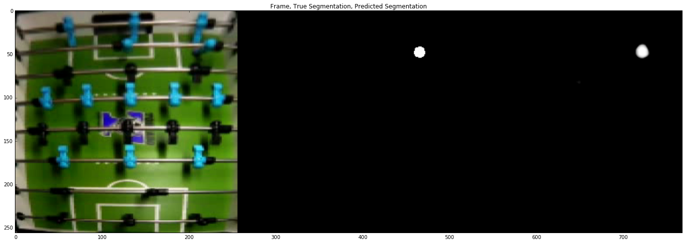


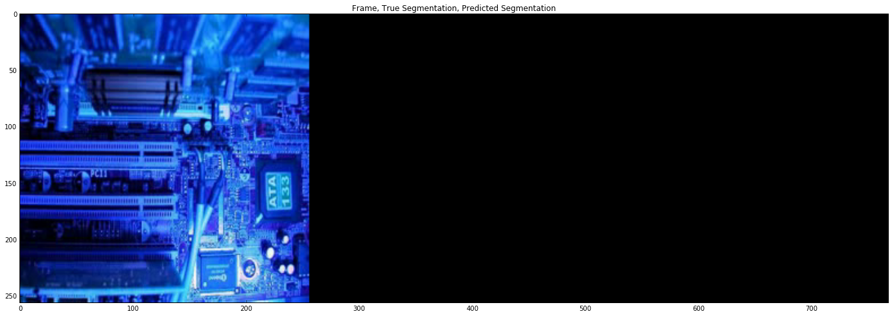


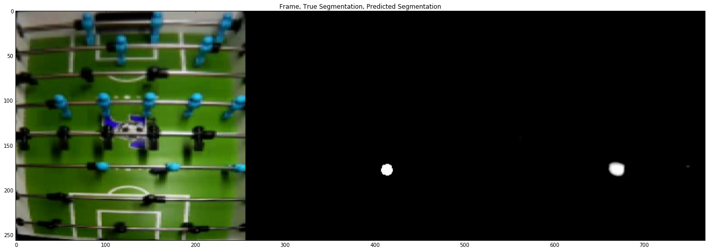


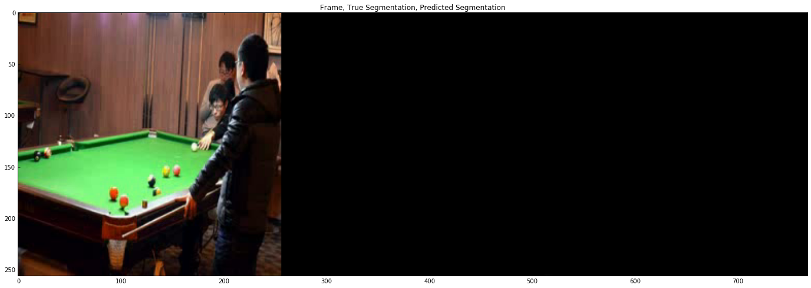


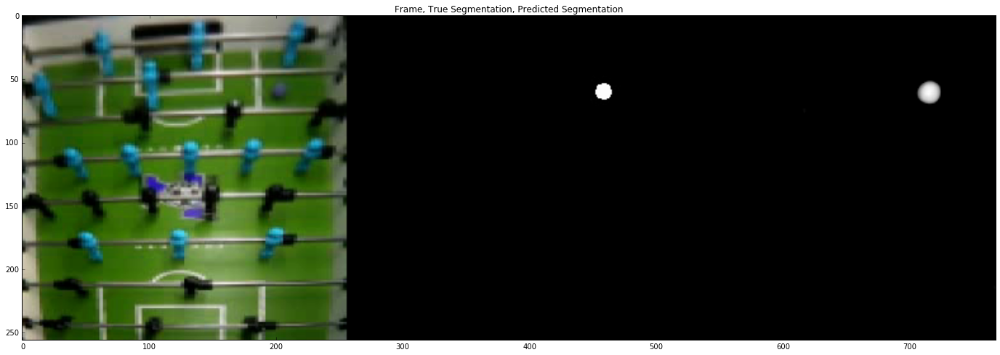


    Wrote model to .\Models\weights_156.hdf
    Epoch 157/157
    

    C:\local\Anaconda3-4.1.1-Windows-x86_64\lib\site-packages\ipykernel\__main__.py:36: UserWarning: Update your `fit_generator` call to the Keras 2 API: `fit_generator(<__main__...., 200, verbose=1, callbacks=None, epochs=157, max_queue_size=50, validation_data=<__main__...., workers=50, use_multiprocessing=False, class_weight=None, validation_steps=5, initial_epoch=156)`
    

    200/200 [==============================] - 226s 1s/step - loss: 3.6231e-04 - balanced_square_error: 3.6231e-04 - mean_squared_error: 5.7657e-04 - val_loss: 6.6399e-05 - val_balanced_square_error: 6.6399e-05 - val_mean_squared_error: 1.9344e-04
    Wrote model to .\Models\weights_157.hdf
    Epoch 158/158
    

    C:\local\Anaconda3-4.1.1-Windows-x86_64\lib\site-packages\ipykernel\__main__.py:36: UserWarning: Update your `fit_generator` call to the Keras 2 API: `fit_generator(<__main__...., 200, verbose=1, callbacks=None, epochs=158, max_queue_size=50, validation_data=<__main__...., workers=50, use_multiprocessing=False, class_weight=None, validation_steps=5, initial_epoch=157)`
    

    200/200 [==============================] - 225s 1s/step - loss: 2.2780e-04 - balanced_square_error: 2.2780e-04 - mean_squared_error: 4.4218e-04 - val_loss: 2.3690e-04 - val_balanced_square_error: 2.3690e-04 - val_mean_squared_error: 3.7633e-04
    Wrote model to .\Models\weights_158.hdf
    Epoch 159/159
    

    C:\local\Anaconda3-4.1.1-Windows-x86_64\lib\site-packages\ipykernel\__main__.py:36: UserWarning: Update your `fit_generator` call to the Keras 2 API: `fit_generator(<__main__...., 200, verbose=1, callbacks=None, epochs=159, max_queue_size=50, validation_data=<__main__...., workers=50, use_multiprocessing=False, class_weight=None, validation_steps=5, initial_epoch=158)`
    

    200/200 [==============================] - 224s 1s/step - loss: 3.3754e-04 - balanced_square_error: 3.3754e-04 - mean_squared_error: 5.5224e-04 - val_loss: 0.0046 - val_balanced_square_error: 0.0046 - val_mean_squared_error: 0.0048
    Wrote model to .\Models\weights_159.hdf
    Epoch 160/160
    

    C:\local\Anaconda3-4.1.1-Windows-x86_64\lib\site-packages\ipykernel\__main__.py:36: UserWarning: Update your `fit_generator` call to the Keras 2 API: `fit_generator(<__main__...., 200, verbose=1, callbacks=None, epochs=160, max_queue_size=50, validation_data=<__main__...., workers=50, use_multiprocessing=False, class_weight=None, validation_steps=5, initial_epoch=159)`
    

    200/200 [==============================] - 224s 1s/step - loss: 5.3640e-04 - balanced_square_error: 5.3640e-04 - mean_squared_error: 7.4761e-04 - val_loss: 0.0017 - val_balanced_square_error: 0.0017 - val_mean_squared_error: 0.0019
    Wrote model to .\Models\weights_160.hdf
    Epoch 161/161
    

    C:\local\Anaconda3-4.1.1-Windows-x86_64\lib\site-packages\ipykernel\__main__.py:36: UserWarning: Update your `fit_generator` call to the Keras 2 API: `fit_generator(<__main__...., 200, verbose=1, callbacks=None, epochs=161, max_queue_size=50, validation_data=<__main__...., workers=50, use_multiprocessing=False, class_weight=None, validation_steps=5, initial_epoch=160)`
    

    200/200 [==============================] - 223s 1s/step - loss: 4.9644e-04 - balanced_square_error: 4.9644e-04 - mean_squared_error: 7.0629e-04 - val_loss: 1.0065e-04 - val_balanced_square_error: 1.0065e-04 - val_mean_squared_error: 4.8343e-04
    


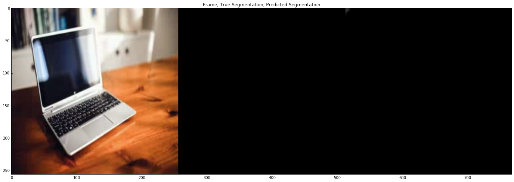


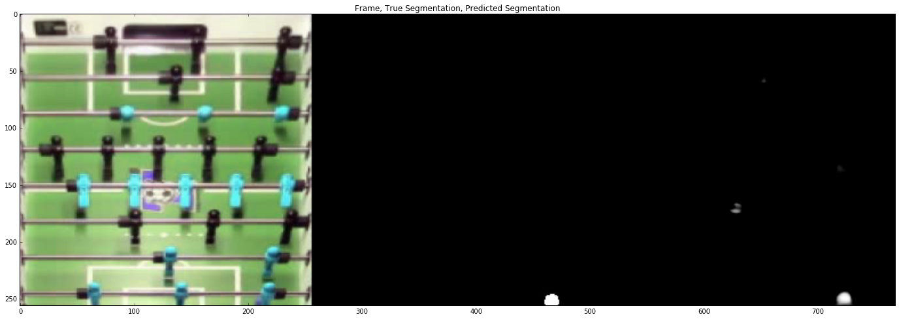


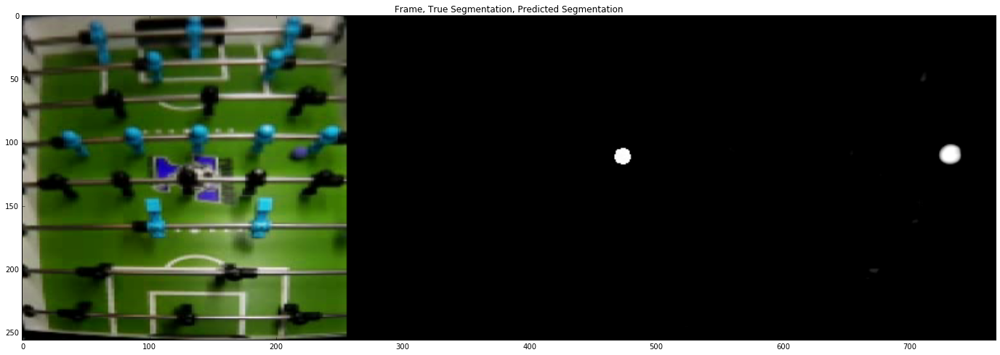


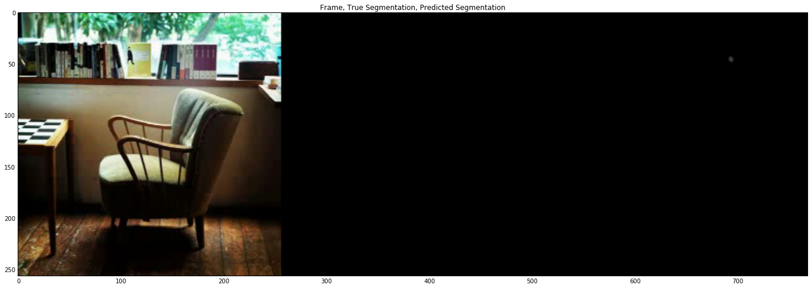


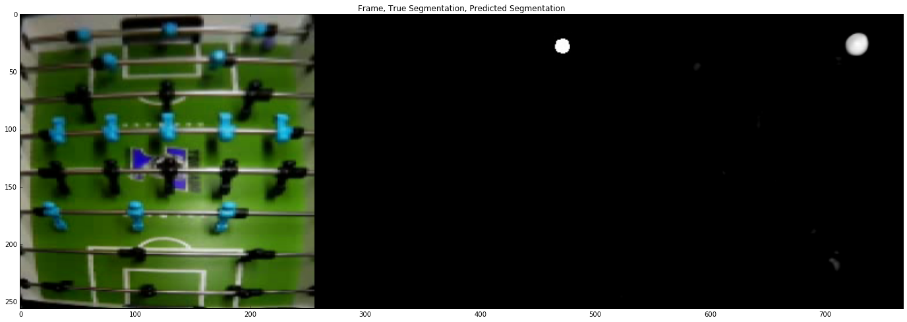


    Wrote model to .\Models\weights_161.hdf
    Epoch 162/162
    

    C:\local\Anaconda3-4.1.1-Windows-x86_64\lib\site-packages\ipykernel\__main__.py:36: UserWarning: Update your `fit_generator` call to the Keras 2 API: `fit_generator(<__main__...., 200, verbose=1, callbacks=None, epochs=162, max_queue_size=50, validation_data=<__main__...., workers=50, use_multiprocessing=False, class_weight=None, validation_steps=5, initial_epoch=161)`
    

    200/200 [==============================] - 222s 1s/step - loss: 3.4981e-04 - balanced_square_error: 3.4981e-04 - mean_squared_error: 5.6060e-04 - val_loss: 0.0074 - val_balanced_square_error: 0.0074 - val_mean_squared_error: 0.0076
    Wrote model to .\Models\weights_162.hdf
    Epoch 163/163
    

    C:\local\Anaconda3-4.1.1-Windows-x86_64\lib\site-packages\ipykernel\__main__.py:36: UserWarning: Update your `fit_generator` call to the Keras 2 API: `fit_generator(<__main__...., 200, verbose=1, callbacks=None, epochs=163, max_queue_size=50, validation_data=<__main__...., workers=50, use_multiprocessing=False, class_weight=None, validation_steps=5, initial_epoch=162)`
    

    200/200 [==============================] - 224s 1s/step - loss: 2.7346e-04 - balanced_square_error: 2.7346e-04 - mean_squared_error: 4.9381e-04 - val_loss: 9.9922e-05 - val_balanced_square_error: 9.9922e-05 - val_mean_squared_error: 2.1895e-04
    Wrote model to .\Models\weights_163.hdf
    Epoch 164/164
    

    C:\local\Anaconda3-4.1.1-Windows-x86_64\lib\site-packages\ipykernel\__main__.py:36: UserWarning: Update your `fit_generator` call to the Keras 2 API: `fit_generator(<__main__...., 200, verbose=1, callbacks=None, epochs=164, max_queue_size=50, validation_data=<__main__...., workers=50, use_multiprocessing=False, class_weight=None, validation_steps=5, initial_epoch=163)`
    

    200/200 [==============================] - 226s 1s/step - loss: 5.6127e-04 - balanced_square_error: 5.6127e-04 - mean_squared_error: 7.7206e-04 - val_loss: 7.5409e-05 - val_balanced_square_error: 7.5409e-05 - val_mean_squared_error: 3.2981e-04
    Wrote model to .\Models\weights_164.hdf
    Epoch 165/165
    

    C:\local\Anaconda3-4.1.1-Windows-x86_64\lib\site-packages\ipykernel\__main__.py:36: UserWarning: Update your `fit_generator` call to the Keras 2 API: `fit_generator(<__main__...., 200, verbose=1, callbacks=None, epochs=165, max_queue_size=50, validation_data=<__main__...., workers=50, use_multiprocessing=False, class_weight=None, validation_steps=5, initial_epoch=164)`
    

    200/200 [==============================] - 223s 1s/step - loss: 5.7264e-04 - balanced_square_error: 5.7264e-04 - mean_squared_error: 7.8379e-04 - val_loss: 6.7967e-04 - val_balanced_square_error: 6.7967e-04 - val_mean_squared_error: 8.7335e-04
    Wrote model to .\Models\weights_165.hdf
    Epoch 166/166
    

    C:\local\Anaconda3-4.1.1-Windows-x86_64\lib\site-packages\ipykernel\__main__.py:36: UserWarning: Update your `fit_generator` call to the Keras 2 API: `fit_generator(<__main__...., 200, verbose=1, callbacks=None, epochs=166, max_queue_size=50, validation_data=<__main__...., workers=50, use_multiprocessing=False, class_weight=None, validation_steps=5, initial_epoch=165)`
    

    200/200 [==============================] - 223s 1s/step - loss: 2.8124e-04 - balanced_square_error: 2.8124e-04 - mean_squared_error: 4.8809e-04 - val_loss: 6.8013e-05 - val_balanced_square_error: 6.8013e-05 - val_mean_squared_error: 2.8338e-04
    


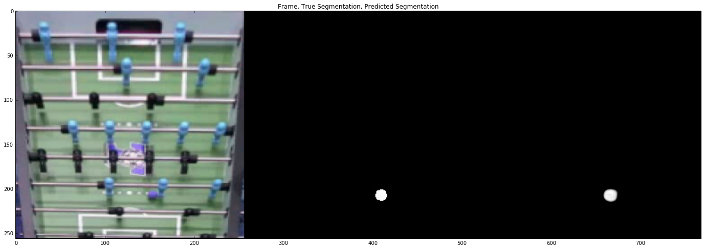


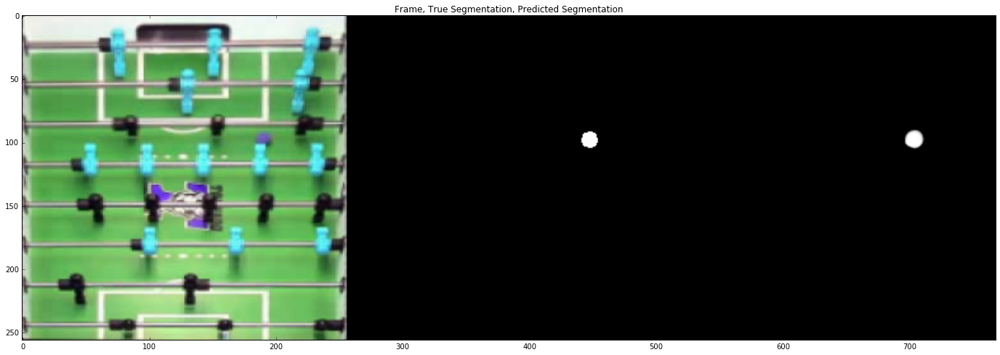


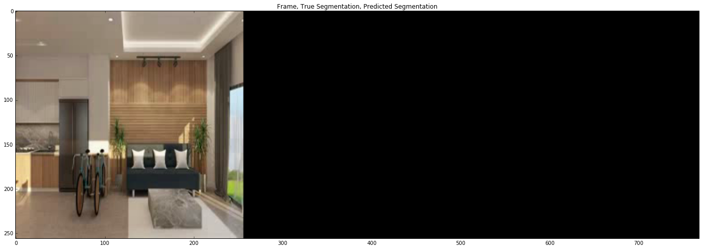


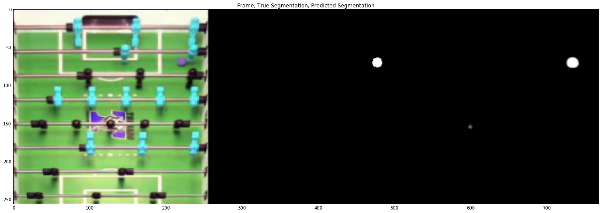


    Wrote model to .\Models\weights_166.hdf
    Epoch 167/167
    

    C:\local\Anaconda3-4.1.1-Windows-x86_64\lib\site-packages\ipykernel\__main__.py:36: UserWarning: Update your `fit_generator` call to the Keras 2 API: `fit_generator(<__main__...., 200, verbose=1, callbacks=None, epochs=167, max_queue_size=50, validation_data=<__main__...., workers=50, use_multiprocessing=False, class_weight=None, validation_steps=5, initial_epoch=166)`
    

    200/200 [==============================] - 226s 1s/step - loss: 4.3868e-04 - balanced_square_error: 4.3868e-04 - mean_squared_error: 6.4537e-04 - val_loss: 7.8571e-05 - val_balanced_square_error: 7.8571e-05 - val_mean_squared_error: 2.1868e-04
    Wrote model to .\Models\weights_167.hdf
    Epoch 168/168
    

    C:\local\Anaconda3-4.1.1-Windows-x86_64\lib\site-packages\ipykernel\__main__.py:36: UserWarning: Update your `fit_generator` call to the Keras 2 API: `fit_generator(<__main__...., 200, verbose=1, callbacks=None, epochs=168, max_queue_size=50, validation_data=<__main__...., workers=50, use_multiprocessing=False, class_weight=None, validation_steps=5, initial_epoch=167)`
    

    200/200 [==============================] - 224s 1s/step - loss: 3.5907e-04 - balanced_square_error: 3.5907e-04 - mean_squared_error: 5.5937e-04 - val_loss: 0.0010 - val_balanced_square_error: 0.0010 - val_mean_squared_error: 0.0012
    Wrote model to .\Models\weights_168.hdf
    Epoch 169/169
    

    C:\local\Anaconda3-4.1.1-Windows-x86_64\lib\site-packages\ipykernel\__main__.py:36: UserWarning: Update your `fit_generator` call to the Keras 2 API: `fit_generator(<__main__...., 200, verbose=1, callbacks=None, epochs=169, max_queue_size=50, validation_data=<__main__...., workers=50, use_multiprocessing=False, class_weight=None, validation_steps=5, initial_epoch=168)`
    

    200/200 [==============================] - 224s 1s/step - loss: 5.3458e-04 - balanced_square_error: 5.3458e-04 - mean_squared_error: 7.3737e-04 - val_loss: 8.9304e-05 - val_balanced_square_error: 8.9304e-05 - val_mean_squared_error: 2.0657e-04
    Wrote model to .\Models\weights_169.hdf
    Epoch 170/170
    

    C:\local\Anaconda3-4.1.1-Windows-x86_64\lib\site-packages\ipykernel\__main__.py:36: UserWarning: Update your `fit_generator` call to the Keras 2 API: `fit_generator(<__main__...., 200, verbose=1, callbacks=None, epochs=170, max_queue_size=50, validation_data=<__main__...., workers=50, use_multiprocessing=False, class_weight=None, validation_steps=5, initial_epoch=169)`
    

    200/200 [==============================] - 223s 1s/step - loss: 3.8434e-04 - balanced_square_error: 3.8434e-04 - mean_squared_error: 5.8427e-04 - val_loss: 5.7336e-05 - val_balanced_square_error: 5.7336e-05 - val_mean_squared_error: 2.0243e-04
    Wrote model to .\Models\weights_170.hdf
    Epoch 171/171
    

    C:\local\Anaconda3-4.1.1-Windows-x86_64\lib\site-packages\ipykernel\__main__.py:36: UserWarning: Update your `fit_generator` call to the Keras 2 API: `fit_generator(<__main__...., 200, verbose=1, callbacks=None, epochs=171, max_queue_size=50, validation_data=<__main__...., workers=50, use_multiprocessing=False, class_weight=None, validation_steps=5, initial_epoch=170)`
    

    200/200 [==============================] - 221s 1s/step - loss: 4.2559e-04 - balanced_square_error: 4.2559e-04 - mean_squared_error: 6.3740e-04 - val_loss: 9.5526e-05 - val_balanced_square_error: 9.5526e-05 - val_mean_squared_error: 2.4148e-04
    


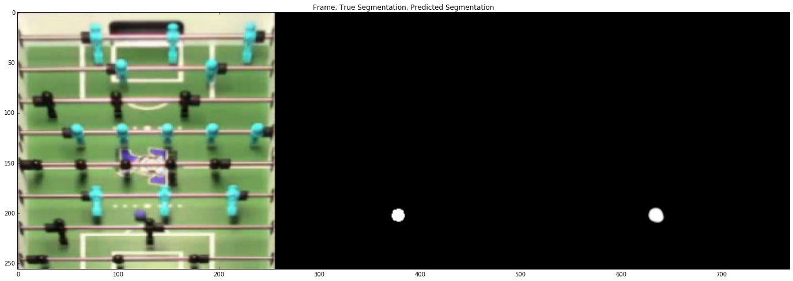


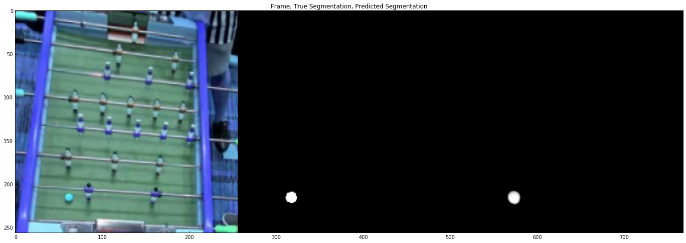


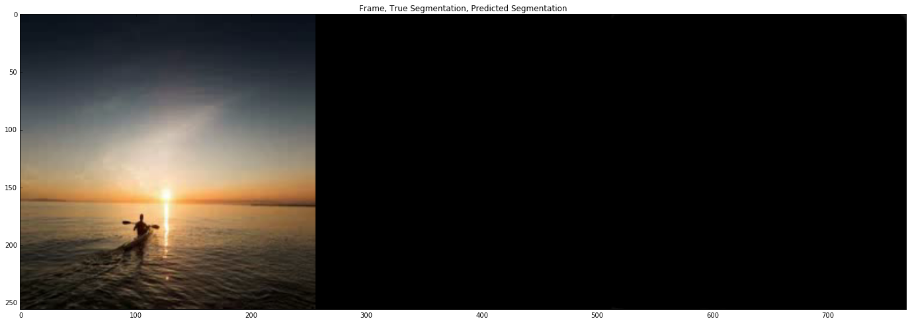


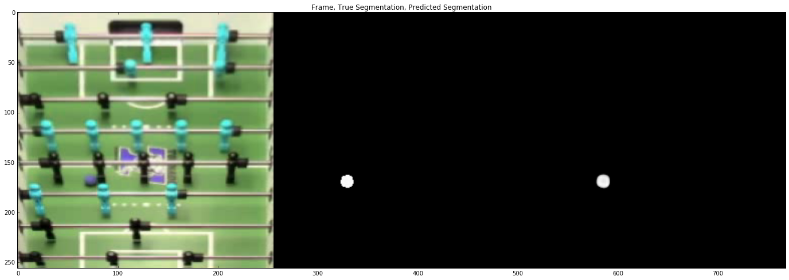


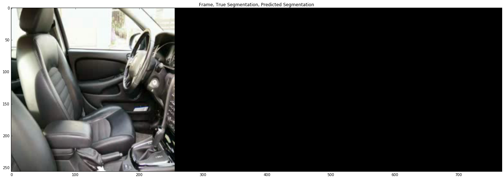


    Wrote model to .\Models\weights_171.hdf
    Epoch 172/172
    

    C:\local\Anaconda3-4.1.1-Windows-x86_64\lib\site-packages\ipykernel\__main__.py:36: UserWarning: Update your `fit_generator` call to the Keras 2 API: `fit_generator(<__main__...., 200, verbose=1, callbacks=None, epochs=172, max_queue_size=50, validation_data=<__main__...., workers=50, use_multiprocessing=False, class_weight=None, validation_steps=5, initial_epoch=171)`
    

    200/200 [==============================] - 222s 1s/step - loss: 2.8309e-04 - balanced_square_error: 2.8309e-04 - mean_squared_error: 4.8692e-04 - val_loss: 6.8583e-05 - val_balanced_square_error: 6.8583e-05 - val_mean_squared_error: 2.4774e-04
    Wrote model to .\Models\weights_172.hdf
    Epoch 173/173
    

    C:\local\Anaconda3-4.1.1-Windows-x86_64\lib\site-packages\ipykernel\__main__.py:36: UserWarning: Update your `fit_generator` call to the Keras 2 API: `fit_generator(<__main__...., 200, verbose=1, callbacks=None, epochs=173, max_queue_size=50, validation_data=<__main__...., workers=50, use_multiprocessing=False, class_weight=None, validation_steps=5, initial_epoch=172)`
    

    200/200 [==============================] - 222s 1s/step - loss: 4.4835e-04 - balanced_square_error: 4.4835e-04 - mean_squared_error: 6.4120e-04 - val_loss: 6.5205e-05 - val_balanced_square_error: 6.5205e-05 - val_mean_squared_error: 1.5727e-04
    Wrote model to .\Models\weights_173.hdf
    Epoch 174/174
    

    C:\local\Anaconda3-4.1.1-Windows-x86_64\lib\site-packages\ipykernel\__main__.py:36: UserWarning: Update your `fit_generator` call to the Keras 2 API: `fit_generator(<__main__...., 200, verbose=1, callbacks=None, epochs=174, max_queue_size=50, validation_data=<__main__...., workers=50, use_multiprocessing=False, class_weight=None, validation_steps=5, initial_epoch=173)`
    

    200/200 [==============================] - 221s 1s/step - loss: 5.0622e-04 - balanced_square_error: 5.0622e-04 - mean_squared_error: 7.1410e-04 - val_loss: 2.2551e-04 - val_balanced_square_error: 2.2551e-04 - val_mean_squared_error: 4.2945e-04
    Wrote model to .\Models\weights_174.hdf
    Epoch 175/175
    

    C:\local\Anaconda3-4.1.1-Windows-x86_64\lib\site-packages\ipykernel\__main__.py:36: UserWarning: Update your `fit_generator` call to the Keras 2 API: `fit_generator(<__main__...., 200, verbose=1, callbacks=None, epochs=175, max_queue_size=50, validation_data=<__main__...., workers=50, use_multiprocessing=False, class_weight=None, validation_steps=5, initial_epoch=174)`
    

    200/200 [==============================] - 224s 1s/step - loss: 2.2028e-04 - balanced_square_error: 2.2028e-04 - mean_squared_error: 4.1926e-04 - val_loss: 8.5884e-04 - val_balanced_square_error: 8.5884e-04 - val_mean_squared_error: 0.0011
    Wrote model to .\Models\weights_175.hdf
    Epoch 176/176
    

    C:\local\Anaconda3-4.1.1-Windows-x86_64\lib\site-packages\ipykernel\__main__.py:36: UserWarning: Update your `fit_generator` call to the Keras 2 API: `fit_generator(<__main__...., 200, verbose=1, callbacks=None, epochs=176, max_queue_size=50, validation_data=<__main__...., workers=50, use_multiprocessing=False, class_weight=None, validation_steps=5, initial_epoch=175)`
    

    200/200 [==============================] - 223s 1s/step - loss: 2.9362e-04 - balanced_square_error: 2.9362e-04 - mean_squared_error: 4.8821e-04 - val_loss: 7.5368e-05 - val_balanced_square_error: 7.5368e-05 - val_mean_squared_error: 2.2008e-04
    


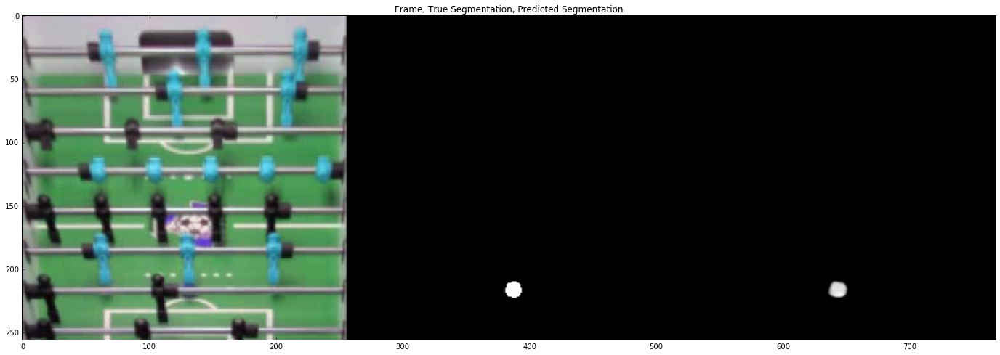


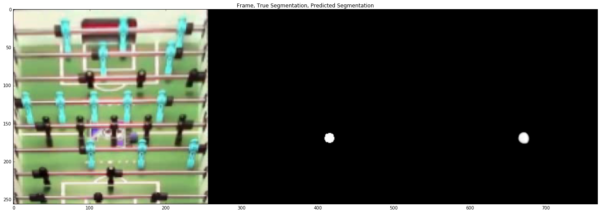


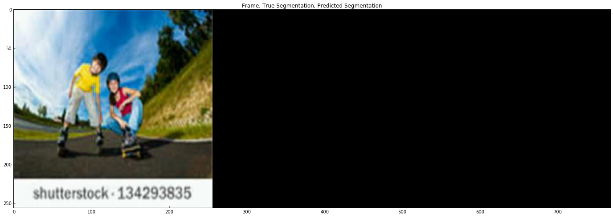


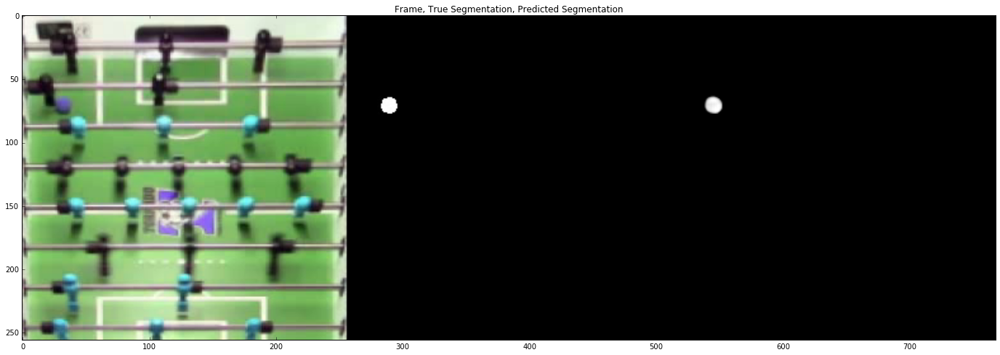


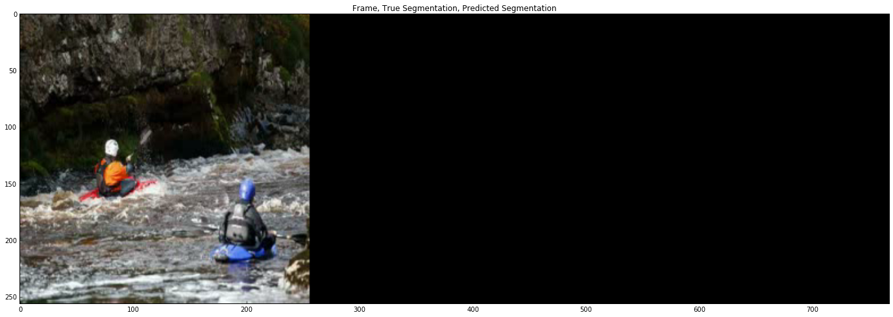


    Wrote model to .\Models\weights_176.hdf
    Epoch 177/177
    

    C:\local\Anaconda3-4.1.1-Windows-x86_64\lib\site-packages\ipykernel\__main__.py:36: UserWarning: Update your `fit_generator` call to the Keras 2 API: `fit_generator(<__main__...., 200, verbose=1, callbacks=None, epochs=177, max_queue_size=50, validation_data=<__main__...., workers=50, use_multiprocessing=False, class_weight=None, validation_steps=5, initial_epoch=176)`
    

    200/200 [==============================] - 226s 1s/step - loss: 5.5499e-04 - balanced_square_error: 5.5499e-04 - mean_squared_error: 7.6131e-04 - val_loss: 6.1476e-05 - val_balanced_square_error: 6.1476e-05 - val_mean_squared_error: 2.2733e-04
    Wrote model to .\Models\weights_177.hdf
    Epoch 178/178
    

    C:\local\Anaconda3-4.1.1-Windows-x86_64\lib\site-packages\ipykernel\__main__.py:36: UserWarning: Update your `fit_generator` call to the Keras 2 API: `fit_generator(<__main__...., 200, verbose=1, callbacks=None, epochs=178, max_queue_size=50, validation_data=<__main__...., workers=50, use_multiprocessing=False, class_weight=None, validation_steps=5, initial_epoch=177)`
    

    180/200 [==========================>...] - ETA: 25s - loss: 4.1362e-04 - balanced_square_error: 4.1362e-04 - mean_squared_error: 6.1043e-04


    ---------------------------------------------------------------------------

    KeyboardInterrupt                         Traceback (most recent call last)

    <ipython-input-22-88ad926c3565> in <module>()
         34         validation_steps = batches_validation_per_epoch,
         35         pickle_safe=False,
    ---> 36         initial_epoch=epoch)
         37 
         38     epoch += 1
    

    C:\local\Anaconda3-4.1.1-Windows-x86_64\lib\site-packages\keras\legacy\interfaces.py in wrapper(*args, **kwargs)
         89                 warnings.warn('Update your `' + object_name +
         90                               '` call to the Keras 2 API: ' + signature, stacklevel=2)
    ---> 91             return func(*args, **kwargs)
         92         wrapper._original_function = func
         93         return wrapper
    

    C:\local\Anaconda3-4.1.1-Windows-x86_64\lib\site-packages\keras\engine\training.py in fit_generator(self, generator, steps_per_epoch, epochs, verbose, callbacks, validation_data, validation_steps, class_weight, max_queue_size, workers, use_multiprocessing, shuffle, initial_epoch)
       1424             use_multiprocessing=use_multiprocessing,
       1425             shuffle=shuffle,
    -> 1426             initial_epoch=initial_epoch)
       1427 
       1428     @interfaces.legacy_generator_methods_support
    

    C:\local\Anaconda3-4.1.1-Windows-x86_64\lib\site-packages\keras\engine\training_generator.py in fit_generator(model, generator, steps_per_epoch, epochs, verbose, callbacks, validation_data, validation_steps, class_weight, max_queue_size, workers, use_multiprocessing, shuffle, initial_epoch)
        189                 outs = model.train_on_batch(x, y,
        190                                             sample_weight=sample_weight,
    --> 191                                             class_weight=class_weight)
        192 
        193                 if not isinstance(outs, list):
    

    C:\local\Anaconda3-4.1.1-Windows-x86_64\lib\site-packages\keras\engine\training.py in train_on_batch(self, x, y, sample_weight, class_weight)
       1218             ins = x + y + sample_weights
       1219         self._make_train_function()
    -> 1220         outputs = self.train_function(ins)
       1221         if len(outputs) == 1:
       1222             return outputs[0]
    

    C:\local\Anaconda3-4.1.1-Windows-x86_64\lib\site-packages\keras\backend\tensorflow_backend.py in __call__(self, inputs)
       2665                     'In order to feed symbolic tensors to a Keras model '
       2666                     'in TensorFlow, you need tensorflow 1.8 or higher.')
    -> 2667             return self._legacy_call(inputs)
       2668 
       2669 
    

    C:\local\Anaconda3-4.1.1-Windows-x86_64\lib\site-packages\keras\backend\tensorflow_backend.py in _legacy_call(self, inputs)
       2647         session = get_session()
       2648         updated = session.run(fetches=fetches, feed_dict=feed_dict,
    -> 2649                               **self.session_kwargs)
       2650         return updated[:len(self.outputs)]
       2651 
    

    C:\local\Anaconda3-4.1.1-Windows-x86_64\lib\site-packages\tensorflow\python\client\session.py in run(self, fetches, feed_dict, options, run_metadata)
        776     try:
        777       result = self._run(None, fetches, feed_dict, options_ptr,
    --> 778                          run_metadata_ptr)
        779       if run_metadata:
        780         proto_data = tf_session.TF_GetBuffer(run_metadata_ptr)
    

    C:\local\Anaconda3-4.1.1-Windows-x86_64\lib\site-packages\tensorflow\python\client\session.py in _run(self, handle, fetches, feed_dict, options, run_metadata)
        980     if final_fetches or final_targets:
        981       results = self._do_run(handle, final_targets, final_fetches,
    --> 982                              feed_dict_string, options, run_metadata)
        983     else:
        984       results = []
    

    C:\local\Anaconda3-4.1.1-Windows-x86_64\lib\site-packages\tensorflow\python\client\session.py in _do_run(self, handle, target_list, fetch_list, feed_dict, options, run_metadata)
       1030     if handle is None:
       1031       return self._do_call(_run_fn, self._session, feed_dict, fetch_list,
    -> 1032                            target_list, options, run_metadata)
       1033     else:
       1034       return self._do_call(_prun_fn, self._session, handle, feed_dict,
    

    C:\local\Anaconda3-4.1.1-Windows-x86_64\lib\site-packages\tensorflow\python\client\session.py in _do_call(self, fn, *args)
       1037   def _do_call(self, fn, *args):
       1038     try:
    -> 1039       return fn(*args)
       1040     except errors.OpError as e:
       1041       message = compat.as_text(e.message)
    

    C:\local\Anaconda3-4.1.1-Windows-x86_64\lib\site-packages\tensorflow\python\client\session.py in _run_fn(session, feed_dict, fetch_list, target_list, options, run_metadata)
       1019         return tf_session.TF_Run(session, options,
       1020                                  feed_dict, fetch_list, target_list,
    -> 1021                                  status, run_metadata)
       1022 
       1023     def _prun_fn(session, handle, feed_dict, fetch_list):
    

    KeyboardInterrupt: 


```python
def balanced_square_error(y_true, y_pred):
    above_loss = 0.2 * K.mean( K.square( K.clip(y_pred - y_true, 0.0, 100000) ) , axis=-1)
    below_loss = K.mean( K.square( K.clip(y_pred - y_true, -100000, 0.0) ) , axis=-1)
    return above_loss + below_loss

frame_prediction_model.compile(optimizer=keras.optimizers.RMSprop(lr=0.000001),
#model.compile(optimizer=keras.optimizers.adam(),
              loss=balanced_square_error,
              metrics=[balanced_square_error,mean_squared_error])

# Was ran on the above simple model, not pre-trained Inceptionv3 run.
#epoch = 125
#batches_validation_per_epoch = 50
#batches_training_per_epoch = 400
batch_size = 10
batches_training_per_epoch = 200
batches_validation_per_epoch = 5
print("Batch size %i: %i training batches, %i validation batches" % (batch_size, batches_training_per_epoch, batches_validation_per_epoch) )
WEIGHTS_FNAME = '.\\Models\\weights_%i.hdf'
MODELS_FNAME = '.\\Models\\models_%i.h5'


for i in range(50):
    frame_prediction_model.fit_generator(
        TrainBatchGen(batch_size, training=training),
        batches_training_per_epoch,
        epochs=epoch+1,
        verbose=1,
        callbacks=None,
        class_weight=None,
        max_q_size=50,
        workers=50,
        validation_data=TrainBatchGen(batch_size, validation),
        validation_steps = batches_validation_per_epoch,
        pickle_safe=False,
        initial_epoch=epoch)
    
    epoch += 1
    
    # Plot occasional validation data plot
    if i % 5 == 0:
        plot_validate(TrainBatchGen(batch_size, validation), frame_prediction_model, 50, "Epoch validation results %i" % epoch)
    
    # Save the model
    frame_prediction_model.save_weights(WEIGHTS_FNAME % epoch)
    frame_prediction_model.save(MODELS_FNAME % epoch)
    print(("Wrote model to " + WEIGHTS_FNAME )  % epoch)


```
