```python
#!pip install keras
#!pip install numpy
#!pip install imageio
#!pip install matplotlib
#!pip install opencv-python
#!pip install pydot
#!pip install graphviz


import threading
import sys
import cv2
import sys
import os
import csv
import itertools
import numpy as np
from PIL import Image
import imageio
import itertools as it
import tensorflow as tf
import keras
import pprint as pp
print("Keras version %s" % keras.__version__)
from keras.models import Sequential
from keras.layers import Dense, Dropout
from keras import backend as K

print("Tensorflow version %s" % tf.__version__)

import pprint
pp = pprint.PrettyPrinter(depth=6)
```

    Requirement already satisfied: keras in c:\anaconda\lib\site-packages
    Requirement already satisfied: pyyaml in c:\anaconda\lib\site-packages (from keras)
    Requirement already satisfied: six>=1.9.0 in c:\anaconda\lib\site-packages (from keras)
    Requirement already satisfied: scipy>=0.14 in c:\anaconda\lib\site-packages (from keras)
    Requirement already satisfied: numpy>=1.9.1 in c:\anaconda\lib\site-packages (from keras)
    

    You are using pip version 9.0.1, however version 10.0.1 is available.
    You should consider upgrading via the 'python -m pip install --upgrade pip' command.
    

    Requirement already satisfied: numpy in c:\anaconda\lib\site-packages
    

    You are using pip version 9.0.1, however version 10.0.1 is available.
    You should consider upgrading via the 'python -m pip install --upgrade pip' command.
    

    Requirement already satisfied: imageio in c:\anaconda\lib\site-packages
    

    You are using pip version 9.0.1, however version 10.0.1 is available.
    You should consider upgrading via the 'python -m pip install --upgrade pip' command.
    

    Requirement already satisfied: matplotlib in c:\anaconda\lib\site-packages
    Requirement already satisfied: backports.functools-lru-cache in c:\anaconda\lib\site-packages (from matplotlib)
    Requirement already satisfied: six>=1.10 in c:\anaconda\lib\site-packages (from matplotlib)
    Requirement already satisfied: pytz in c:\anaconda\lib\site-packages (from matplotlib)
    Requirement already satisfied: cycler>=0.10 in c:\anaconda\lib\site-packages (from matplotlib)
    Requirement already satisfied: python-dateutil>=2.0 in c:\anaconda\lib\site-packages (from matplotlib)
    Requirement already satisfied: pyparsing!=2.0.4,!=2.1.2,!=2.1.6,>=2.0.1 in c:\anaconda\lib\site-packages (from matplotlib)
    Requirement already satisfied: numpy>=1.7.1 in c:\anaconda\lib\site-packages (from matplotlib)
    

    You are using pip version 9.0.1, however version 10.0.1 is available.
    You should consider upgrading via the 'python -m pip install --upgrade pip' command.
    

    Collecting opencv-python
      Downloading https://files.pythonhosted.org/packages/98/aa/4dc81693db941149690381bf030d7caadb5e5dd021ccab58f252893fd728/opencv_python-3.4.1.15-cp27-cp27m-win_amd64.whl (33.6MB)
    Requirement already satisfied: numpy>=1.11.1 in c:\anaconda\lib\site-packages (from opencv-python)
    Installing collected packages: opencv-python
    Successfully installed opencv-python-3.4.1.15
    

    You are using pip version 9.0.1, however version 10.0.1 is available.
    You should consider upgrading via the 'python -m pip install --upgrade pip' command.
    

    Requirement already satisfied: pydot in c:\anaconda\lib\site-packages
    Requirement already satisfied: pyparsing>=2.1.4 in c:\anaconda\lib\site-packages (from pydot)
    

    You are using pip version 9.0.1, however version 10.0.1 is available.
    You should consider upgrading via the 'python -m pip install --upgrade pip' command.
    

    Requirement already satisfied: graphviz in c:\anaconda\lib\site-packages
    

    You are using pip version 9.0.1, however version 10.0.1 is available.
    You should consider upgrading via the 'python -m pip install --upgrade pip' command.
    Using TensorFlow backend.
    

    Keras version 2.0.8
    Tensorflow version 1.3.0
    


```python
# Add the standard include path for FoosMetrics
sys.path.insert(0, './../../Code')

import importlib
import process
importlib.reload(process)
```


    <module 'process' from './../../Code\\process.py'>


```python
# Load the data and frames, and add the normalizer
training = process.Processor("segmentation_loader.json")
validation = process.Processor("segmentation_loader.json")
#validation = process.Processor("data_loader_validation.json")
#output_names = ["g1","d1","o1","f1","f2","o2","d2","g2","-2"]
```

    Creating transform: random_video_loader
    Adding folder '.\..\..\Data\Raw\RawMatchesContinuous\'
    '.\..\..\Data\Raw\RawMatchesContinuous\Bart9_1.mp4': 3430 frames found.
    '.\..\..\Data\Raw\RawMatchesContinuous\Bart9_2.mp4': 8916 frames found.
    '.\..\..\Data\Raw\RawMatchesContinuous\Bart9_3.mp4': 15947 frames found.
    '.\..\..\Data\Raw\RawMatchesContinuous\Bart9_4.mp4': 15260 frames found.
    '.\..\..\Data\Raw\RawMatchesContinuous\Bart9_5.mp4': 6345 frames found.
    '.\..\..\Data\Raw\RawMatchesContinuous\Nationals2_1.mp4': 511 frames found.
    '.\..\..\Data\Raw\RawMatchesContinuous\Nationals2_2.mp4': 1471 frames found.
    '.\..\..\Data\Raw\RawMatchesContinuous\Nationals2_3.mp4': 931 frames found.
    '.\..\..\Data\Raw\RawMatchesContinuous\Texas9_1.mp4': 10354 frames found.
    '.\..\..\Data\Raw\RawMatchesContinuous\Texas9_2.mp4': 5318 frames found.
    '.\..\..\Data\Raw\RawMatchesContinuous\Texas9_3.mp4': 6016 frames found.
    '.\..\..\Data\Raw\RawMatchesContinuous\Texas9_4.mp4': 7837 frames found.
    '.\..\..\Data\Raw\RawMatchesContinuous\Tko10_1.mp4': 3196 frames found.
    '.\..\..\Data\Raw\RawMatchesContinuous\Tko10_2.mp4': 4374 frames found.
    '.\..\..\Data\Raw\RawMatchesContinuous\Tko10_3.mp4': 3954 frames found.
    '.\..\..\Data\Raw\RawMatchesContinuous\Tko12_1.mp4': 815 frames found.
    '.\..\..\Data\Raw\RawMatchesContinuous\Tko12_2.mp4': 840 frames found.
    '.\..\..\Data\Raw\RawMatchesContinuous\Tko6_1.mp4': 3263 frames found.
    '.\..\..\Data\Raw\RawMatchesContinuous\Tko6_2.mp4': 2947 frames found.
    '.\..\..\Data\Raw\RawMatchesContinuous\Tko6_3.mp4': 3262 frames found.
    '.\..\..\Data\Raw\RawMatchesContinuous\Tko6_4.mp4': 2631 frames found.
    '.\..\..\Data\Raw\RawMatchesContinuous\Tko8_1.mp4': 5276 frames found.
    '.\..\..\Data\Raw\RawMatchesContinuous\Tko8_2.mp4': 4760 frames found.
    '.\..\..\Data\Raw\RawMatchesContinuous\Worlds2_1.mp4': 931 frames found.
    Loaded 118585 frames in loader.
    Distribution:
    {'Nationals_.mp': 2913, 'Worlds_.mp': 931, 'Tko_.mp': 35318, 'Texas_.mp': 29525, 'Bart_.mp': 49898}
    Creating transform: require
    Creating transform: require
    Creating transform: zeros_like
    Creating transform: draw_polygon
    Creating transform: draw_lines
    Creating transform: draw_lines
    Creating transform: resize
    Creating transform: resize
    Creating transform: add_random_number
    Creating transform: randomize_frame
    Creating transform: randomize_frame
    Creating transform: normalize_channels
    Creating transform: normalize_channels
    Creating transform: random_video_loader
    Adding folder '.\..\..\Data\Raw\RawMatchesContinuous\'
    '.\..\..\Data\Raw\RawMatchesContinuous\Bart9_1.mp4': 3430 frames found.
    '.\..\..\Data\Raw\RawMatchesContinuous\Bart9_2.mp4': 8916 frames found.
    '.\..\..\Data\Raw\RawMatchesContinuous\Bart9_3.mp4': 15947 frames found.
    '.\..\..\Data\Raw\RawMatchesContinuous\Bart9_4.mp4': 15260 frames found.
    '.\..\..\Data\Raw\RawMatchesContinuous\Bart9_5.mp4': 6345 frames found.
    '.\..\..\Data\Raw\RawMatchesContinuous\Nationals2_1.mp4': 511 frames found.
    '.\..\..\Data\Raw\RawMatchesContinuous\Nationals2_2.mp4': 1471 frames found.
    '.\..\..\Data\Raw\RawMatchesContinuous\Nationals2_3.mp4': 931 frames found.
    '.\..\..\Data\Raw\RawMatchesContinuous\Texas9_1.mp4': 10354 frames found.
    '.\..\..\Data\Raw\RawMatchesContinuous\Texas9_2.mp4': 5318 frames found.
    '.\..\..\Data\Raw\RawMatchesContinuous\Texas9_3.mp4': 6016 frames found.
    '.\..\..\Data\Raw\RawMatchesContinuous\Texas9_4.mp4': 7837 frames found.
    '.\..\..\Data\Raw\RawMatchesContinuous\Tko10_1.mp4': 3196 frames found.
    '.\..\..\Data\Raw\RawMatchesContinuous\Tko10_2.mp4': 4374 frames found.
    '.\..\..\Data\Raw\RawMatchesContinuous\Tko10_3.mp4': 3954 frames found.
    '.\..\..\Data\Raw\RawMatchesContinuous\Tko12_1.mp4': 815 frames found.
    '.\..\..\Data\Raw\RawMatchesContinuous\Tko12_2.mp4': 840 frames found.
    '.\..\..\Data\Raw\RawMatchesContinuous\Tko6_1.mp4': 3263 frames found.
    '.\..\..\Data\Raw\RawMatchesContinuous\Tko6_2.mp4': 2947 frames found.
    '.\..\..\Data\Raw\RawMatchesContinuous\Tko6_3.mp4': 3262 frames found.
    '.\..\..\Data\Raw\RawMatchesContinuous\Tko6_4.mp4': 2631 frames found.
    '.\..\..\Data\Raw\RawMatchesContinuous\Tko8_1.mp4': 5276 frames found.
    '.\..\..\Data\Raw\RawMatchesContinuous\Tko8_2.mp4': 4760 frames found.
    '.\..\..\Data\Raw\RawMatchesContinuous\Worlds2_1.mp4': 931 frames found.
    Loaded 118585 frames in loader.
    Distribution:
    {'Nationals_.mp': 2913, 'Worlds_.mp': 931, 'Tko_.mp': 35318, 'Texas_.mp': 29525, 'Bart_.mp': 49898}
    Creating transform: require
    Creating transform: require
    Creating transform: zeros_like
    Creating transform: draw_polygon
    Creating transform: draw_lines
    Creating transform: draw_lines
    Creating transform: resize
    Creating transform: resize
    Creating transform: add_random_number
    Creating transform: randomize_frame
    Creating transform: randomize_frame
    Creating transform: normalize_channels
    Creating transform: normalize_channels
    


```python
import matplotlib
import matplotlib.image as mpimg
import matplotlib.pyplot as plt
%matplotlib inline

# View the first few frames
for k in range(20):
    data = training.get_next_frame()
    print(data["frame"].shape)
    frames = np.concatenate((data["frame"],data["segmentation"]),1)
    print(frames.shape)
    fig, ax = plt.subplots(figsize=(24, 5))
    plt.imshow(frames)
    plt.show()
```

    (256, 512, 3)
    (256, 1024, 3)
    


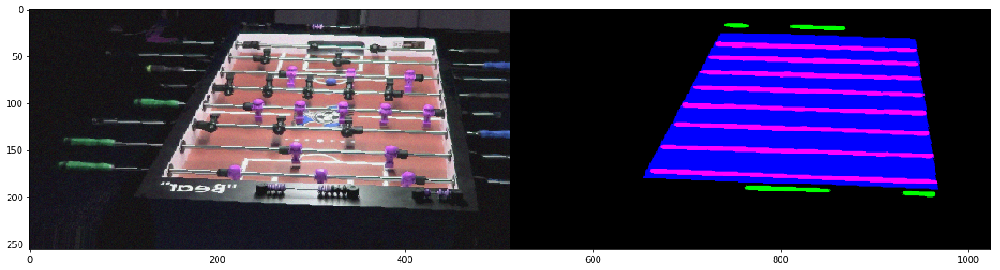


    (256, 512, 3)
    (256, 1024, 3)
    


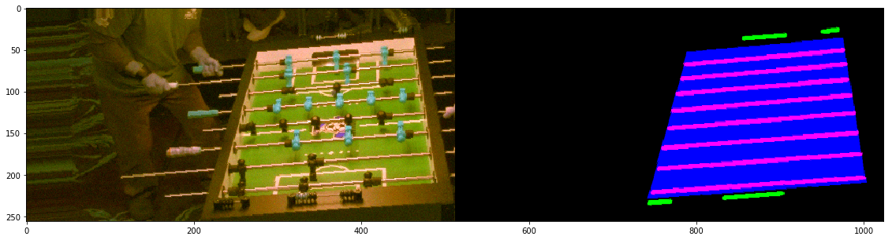


    (256, 512, 3)
    (256, 1024, 3)
    


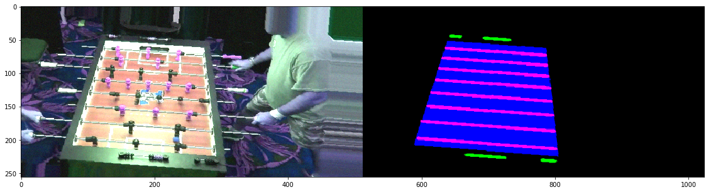


    (256, 512, 3)
    (256, 1024, 3)
    


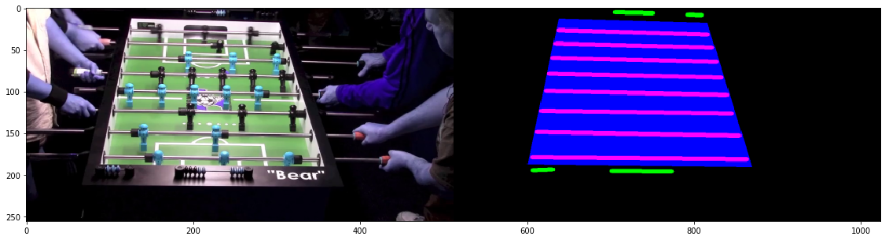


    (256, 512, 3)
    (256, 1024, 3)
    


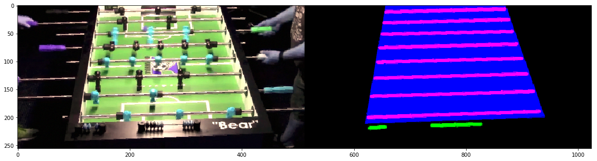


    (256, 512, 3)
    (256, 1024, 3)
    


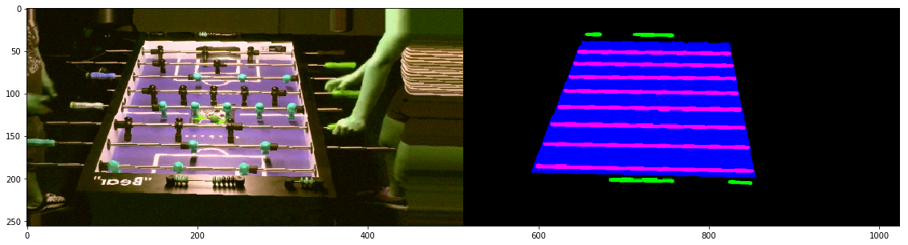


    (256, 512, 3)
    (256, 1024, 3)
    


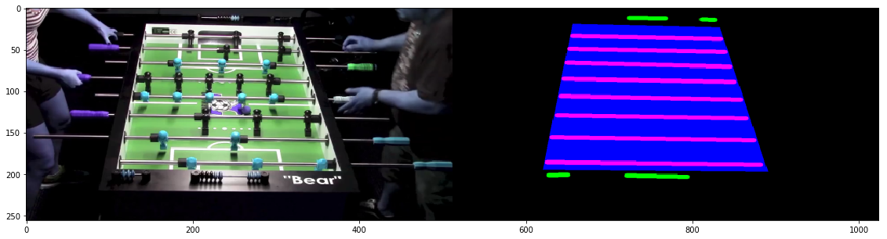


    (256, 512, 3)
    (256, 1024, 3)
    


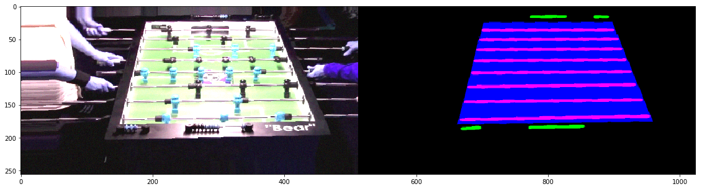


    (256, 512, 3)
    (256, 1024, 3)
    


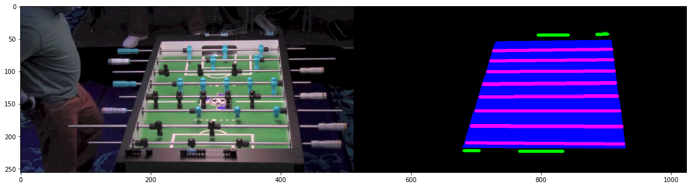


    (256, 512, 3)
    (256, 1024, 3)
    


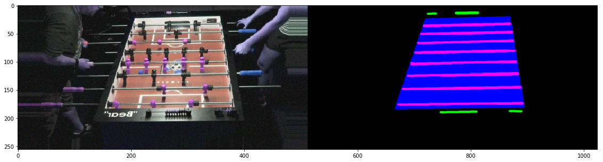


    (256, 512, 3)
    (256, 1024, 3)
    


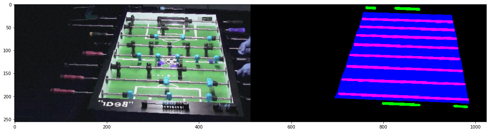


    (256, 512, 3)
    (256, 1024, 3)
    


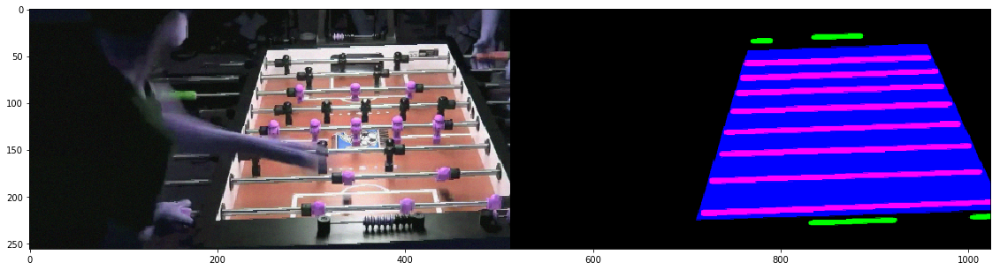


    (256, 512, 3)
    (256, 1024, 3)
    


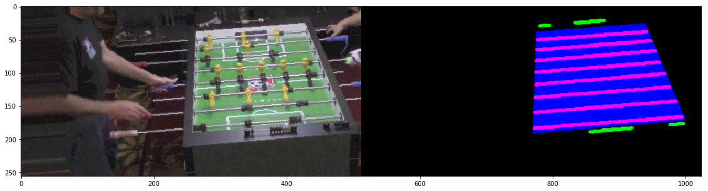


    (256, 512, 3)
    (256, 1024, 3)
    


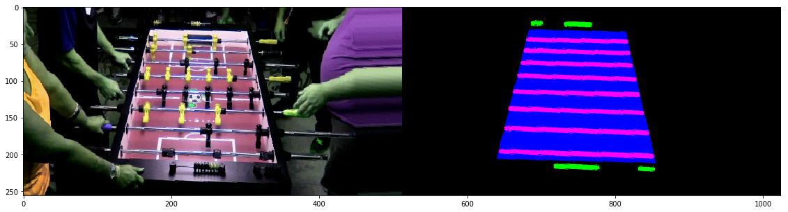


    (256, 512, 3)
    (256, 1024, 3)
    


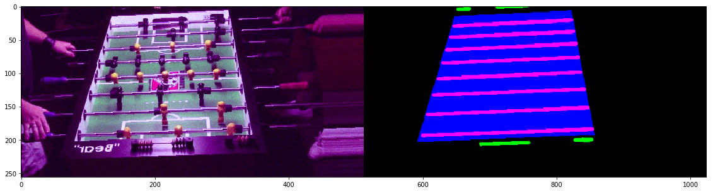


    (256, 512, 3)
    (256, 1024, 3)
    


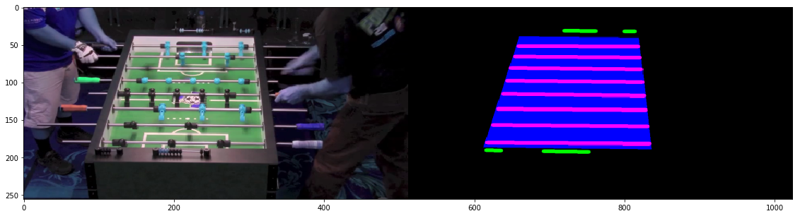


    (256, 512, 3)
    (256, 1024, 3)
    


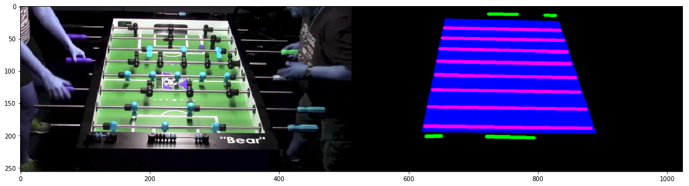


    (256, 512, 3)
    (256, 1024, 3)
    


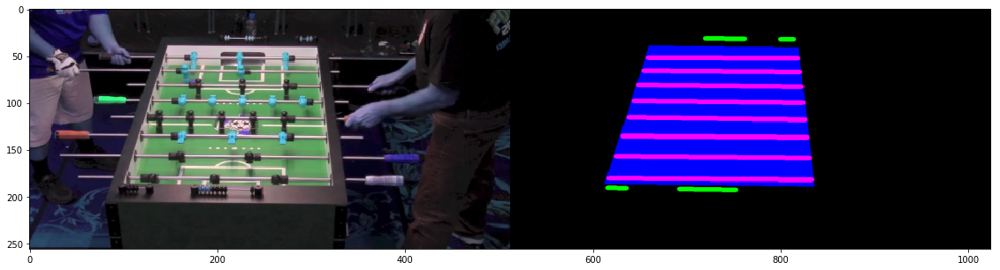


    (256, 512, 3)
    (256, 1024, 3)
    


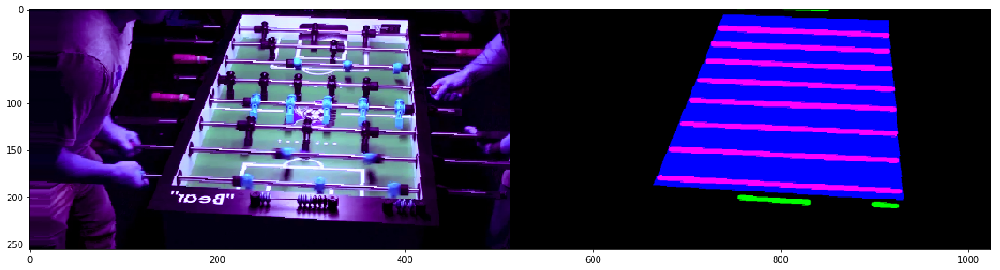


    (256, 512, 3)
    (256, 1024, 3)
    


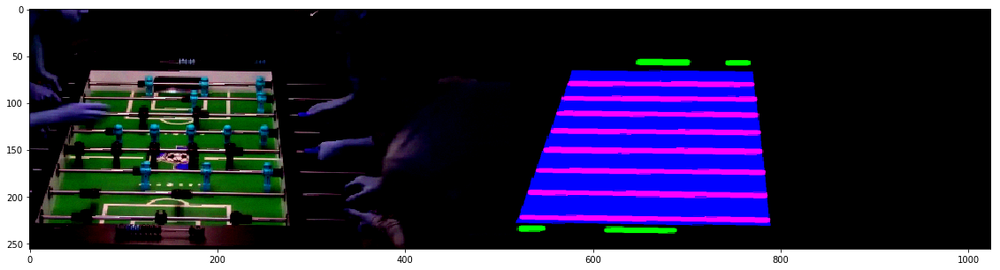


```python
# https://stanford.edu/~shervine/blog/keras-generator-multiprocessing.html
class threadsafe_iter(object):
  """
    Takes an iterator/generator and makes it thread-safe by
    serializing call to the `next` method of given iterator/generator.
    """
  def __init__(self, it):
      self.it = it
      self.lock = threading.Lock()

  def __iter__(self):
      return self

  def __next__(self):
      with self.lock:
          return self.it.__next__()

# https://stanford.edu/~shervine/blog/keras-generator-multiprocessing.html
def threadsafe_generator(f):
  """
    A decorator that takes a generator function and makes it thread-safe.
    """
  def g(*a, **kw):
      return threadsafe_iter(f(*a, **kw))
  return g


# Define our training and validation iterators
@threadsafe_generator
def TrainGen(training):
    while True:
        data = training.get_next_frame()
        if data is not None:
            frame = data["frame"]
            segmentation = data["segmentation"]
            
            while frame is not None:
                yield (frame, segmentation)
                data = training.get_next_frame()
                if data is not None:
                    frame = data["frame"]
                    segmentation = data["segmentation"]
                else:
                    frame = None
                    segmentation = None
                
             
# Generators for training the position
@threadsafe_generator
def TrainBatchGen(batch_size, training):
    gen = TrainGen(training)
    while True:
        # Build the next batch
        batch_frames = np.zeros(shape=(batch_size, 256, 512, 3), dtype=np.float32)
        batch_segmentations = np.zeros(shape=(batch_size, 256, 512, 3), dtype=np.float32)
        for i in range(batch_size):
            (frame, segmentation) = next(gen)
            batch_frames[i,:,:,:] = frame
            batch_segmentations[i,:,:,:] = segmentation
            
        
        #pp.pprint("Yielding batch")
        #pp.pprint(batch_outputs)
        yield (batch_frames, batch_segmentations)
        #pp.pprint("Yielded batch")

    
    
        
    

```


```python
from keras.losses import mean_squared_error

# Utilities for plotting the result and training
def plot_validate(generator, model, count, name):   
    errors_true = []
    errors_prediction = []
    
    
    while len(errors_true) < count:
        
        (frames, outputs_true) = next(generator)
        outputs_predicted = model.predict(frames, batch_size=frames[0].shape[0], verbose=0)
        
        for i in range(outputs_predicted.shape[0]):
            if len(errors_true) < 5:
                # View the first set
                inputs = np.concatenate((frames[i], outputs_true[i], outputs_predicted[i]),1)
                fig, ax = plt.subplots(figsize=(45, 8))
                h = plt.imshow(inputs)
                plt.title( 'Frame, True Segmentation, Predicted Segmentation' )
                plt.show()
            
            # Calculate the actual difference and predicted image difference
            mse_predicted = ((outputs_true[i] - outputs_predicted[i]) ** 2).mean()
            #mse_true = K.eval(K.mean(mean_squared_error(outputs_true[i], frames[1][i,6:,16:])))
            #mse_predicted = K.eval(K.mean(mean_squared_error(outputs_true[i], outputs_predicted[i])))
            errors_prediction.append(mse_predicted)
            errors_true.append(mse_predicted)
    
    
    true, predicted = zip(*sorted(zip(errors_true, errors_prediction)))
    l1, = plt.plot(range(len(errors_true)), true, label="Error baseline by assuming no changes")
    l2, = plt.plot(range(len(errors_true)), predicted, label="Predicted error to next frame")
    plt.legend(handles=[l1, l2])
    plt.show()

#plot_validate(TrainBatchGen(batch_size, validation), frame_prediction_model, 5, "Epoch validation results %i" % epoch)


```


```python
from keras.models import Sequential
from keras.layers import *
from keras.models import Model
from keras.utils import plot_model
#from IPython.display import SVG, display
#from keras.utils.vis_utils import model_to_dot

import gc
K.clear_session()
gc.collect()


image_height       = 256
image_width        = 512
image_channels     = 3

# Model options
batch_size = 10
lstm_output_size = 300
cnn_kernel_count = 40

# Build an hourglass model. Notes on the model structure:
# Two camera frames as input.
# frame0 -> Conv and pooling until embedding (shared convoluations to both frame0 and frame1)
# frame1 -> Conv and pooling until embedding
# Conv both paths together
# Residual upsampling of frame1 until original size
# Pixel-wise error to frame2 as loss

pp.pprint("Input shape without batches:")
pp.pprint((image_height, image_width, image_channels))

# Used to give fixed names to the layers for transferring the model
conv_num = 0 
pool_num = 0
dense_num = 0


# Create the embedding module, the same model runs both frames
frame_in = Input(shape=(image_height, image_width, image_channels,))
x = Conv2D(cnn_kernel_count, (3, 3),
           padding = "same",
           activation = "relu",)(frame_in)
x = Conv2D(cnn_kernel_count, (3, 3),
           padding = "same",
           activation = "relu",)(x)
res0 = x

x = MaxPooling2D((1, 2))(x)

x = Conv2D(cnn_kernel_count, (3, 3),
           padding = "same",
           activation = "relu",)(x)
x = Conv2D(cnn_kernel_count, (3, 3),
           padding = "same",
           activation = "relu",)(x)
res1 = x

x = MaxPooling2D((2, 2))(x)


x = Conv2D(cnn_kernel_count, (3, 3),
           padding = "same",
           activation = "relu",)(x)
x = Conv2D(cnn_kernel_count, (3, 3),
           padding = "same",
           activation = "relu",)(x)
res2 = x
x = MaxPooling2D((2, 2))(x)


x = Conv2D(cnn_kernel_count, (3, 3),
           padding = "same",
           activation = "relu",)(x)
x = Conv2D(cnn_kernel_count, (3, 3),
           padding = "same",
           activation = "relu",)(x)
res3 = x
x = MaxPooling2D((2, 2))(x)


x = Conv2D(cnn_kernel_count, (3, 3),
           padding = "same",
           activation = "relu",)(x)
x = Conv2D(cnn_kernel_count, (3, 3),
           padding = "same",
           activation = "relu",)(x)
res4 = x
x = MaxPooling2D((2, 2))(x)


x = Conv2D(cnn_kernel_count, (3, 3),
           padding = "same",
           activation = "relu",)(x)
x = Conv2D(cnn_kernel_count, (3, 3),
           padding = "same",
           activation = "relu",)(x)
res5 = x
x = MaxPooling2D((2, 2))(x)


# Start the upsampling and residual joining

x = Conv2D(cnn_kernel_count, (3, 3),
           padding = "same",
           activation = "relu",)(x)
x = Conv2D(cnn_kernel_count, (3, 3),
           padding = "same",
           activation = "relu",)(x)

# Create the upsampling stages, feeding residual from frame1
x = UpSampling2D(size=(2, 2), data_format=None)(x)
#res5 = Cropping2D(cropping=(((0, 0), (1, 0))), data_format=None)(res4_b)
x = keras.layers.concatenate([x, res5])
x = Conv2D(cnn_kernel_count, (3, 3),
           padding = "same",
           activation = "relu",)(x)
x = Conv2D(cnn_kernel_count, (3, 3),
           padding = "same",
           activation = "relu",)(x)

x = UpSampling2D(size=(2, 2), data_format=None)(x)
#res5 = Cropping2D(cropping=(((0, 0), (1, 0))), data_format=None)(res4_b)
x = keras.layers.concatenate([x, res4])
x = Conv2D(cnn_kernel_count, (3, 3),
           padding = "same",
           activation = "relu",)(x)
x = Conv2D(cnn_kernel_count, (3, 3),
           padding = "same",
           activation = "relu",)(x)

x = UpSampling2D(size=(2, 2), data_format=None)(x)
#res5 = Cropping2D(cropping=(((0, 0), (1, 0))), data_format=None)(res4_b)
x = keras.layers.concatenate([x, res3])
x = Conv2D(cnn_kernel_count, (3, 3),
           padding = "same",
           activation = "relu",)(x)
x = Conv2D(cnn_kernel_count, (3, 3),
           padding = "same",
           activation = "relu",)(x)

x = UpSampling2D(size=(2, 2), data_format=None)(x)
#res5 = Cropping2D(cropping=(((0, 0), (1, 0))), data_format=None)(res4_b)
x = keras.layers.concatenate([x, res2])
x = Conv2D(cnn_kernel_count, (3, 3),
           padding = "same",
           activation = "relu",)(x)
x = Conv2D(cnn_kernel_count, (3, 3),
           padding = "same",
           activation = "relu",)(x)

x = UpSampling2D(size=(2, 2), data_format=None)(x)
#res5 = Cropping2D(cropping=(((0, 0), (1, 0))), data_format=None)(res4_b)
x = keras.layers.concatenate([x, res1])
x = Conv2D(cnn_kernel_count, (3, 3),
           padding = "same",
           activation = "relu",)(x)
x = Conv2D(cnn_kernel_count, (3, 3),
           padding = "same",
           activation = "relu",)(x)

x = UpSampling2D(size=(1, 2), data_format=None)(x)
#res5 = Cropping2D(cropping=(((0, 0), (1, 0))), data_format=None)(res4_b)
x = keras.layers.concatenate([x, res0])
x = Conv2D(cnn_kernel_count, (3, 3),
           padding = "same",
           activation = "relu",)(x)
x = Conv2D(cnn_kernel_count, (3, 3),
           padding = "same",
           activation = "relu",)(x)

# RGB output as three channels
x = Conv2D(3, (1, 1),
           padding = "same",
           activation = "relu",)(x)

frame_prediction_model = Model([frame_in], [x])

# For a multi-class classification problem
frame_prediction_model.compile(optimizer=keras.optimizers.RMSprop(lr=0.00002),
#model.compile(optimizer=keras.optimizers.adam(),
              loss='categorical_crossentropy',
              metrics=['categorical_accuracy'])


frame_prediction_model.summary()

#plot_model(frame_prediction_model, to_file='model.png')
#from IPython.display import SVG, display
#from keras.utils.vis_utils import model_to_dot
#display(SVG(model_to_dot(frame_prediction_model).create(prog='dot', format='svg')))

# Train the model to predict the future position. This is the control signal to the robot AI
WEIGHTS_FNAME = '.\\Goalie3Frames\\weights_%i.hdf'
MODELS_FNAME = '.\\Goalie3Frames\\models_%i.h5'
```

    'Input shape without batches:'
    (256, 512, 3)
    ____________________________________________________________________________________________________
    Layer (type)                     Output Shape          Param #     Connected to                     
    ====================================================================================================
    input_1 (InputLayer)             (None, 256, 512, 3)   0                                            
    ____________________________________________________________________________________________________
    conv2d_1 (Conv2D)                (None, 256, 512, 40)  1120        input_1[0][0]                    
    ____________________________________________________________________________________________________
    conv2d_2 (Conv2D)                (None, 256, 512, 40)  14440       conv2d_1[0][0]                   
    ____________________________________________________________________________________________________
    max_pooling2d_1 (MaxPooling2D)   (None, 256, 256, 40)  0           conv2d_2[0][0]                   
    ____________________________________________________________________________________________________
    conv2d_3 (Conv2D)                (None, 256, 256, 40)  14440       max_pooling2d_1[0][0]            
    ____________________________________________________________________________________________________
    conv2d_4 (Conv2D)                (None, 256, 256, 40)  14440       conv2d_3[0][0]                   
    ____________________________________________________________________________________________________
    max_pooling2d_2 (MaxPooling2D)   (None, 128, 128, 40)  0           conv2d_4[0][0]                   
    ____________________________________________________________________________________________________
    conv2d_5 (Conv2D)                (None, 128, 128, 40)  14440       max_pooling2d_2[0][0]            
    ____________________________________________________________________________________________________
    conv2d_6 (Conv2D)                (None, 128, 128, 40)  14440       conv2d_5[0][0]                   
    ____________________________________________________________________________________________________
    max_pooling2d_3 (MaxPooling2D)   (None, 64, 64, 40)    0           conv2d_6[0][0]                   
    ____________________________________________________________________________________________________
    conv2d_7 (Conv2D)                (None, 64, 64, 40)    14440       max_pooling2d_3[0][0]            
    ____________________________________________________________________________________________________
    conv2d_8 (Conv2D)                (None, 64, 64, 40)    14440       conv2d_7[0][0]                   
    ____________________________________________________________________________________________________
    max_pooling2d_4 (MaxPooling2D)   (None, 32, 32, 40)    0           conv2d_8[0][0]                   
    ____________________________________________________________________________________________________
    conv2d_9 (Conv2D)                (None, 32, 32, 40)    14440       max_pooling2d_4[0][0]            
    ____________________________________________________________________________________________________
    conv2d_10 (Conv2D)               (None, 32, 32, 40)    14440       conv2d_9[0][0]                   
    ____________________________________________________________________________________________________
    max_pooling2d_5 (MaxPooling2D)   (None, 16, 16, 40)    0           conv2d_10[0][0]                  
    ____________________________________________________________________________________________________
    conv2d_11 (Conv2D)               (None, 16, 16, 40)    14440       max_pooling2d_5[0][0]            
    ____________________________________________________________________________________________________
    conv2d_12 (Conv2D)               (None, 16, 16, 40)    14440       conv2d_11[0][0]                  
    ____________________________________________________________________________________________________
    max_pooling2d_6 (MaxPooling2D)   (None, 8, 8, 40)      0           conv2d_12[0][0]                  
    ____________________________________________________________________________________________________
    conv2d_13 (Conv2D)               (None, 8, 8, 40)      14440       max_pooling2d_6[0][0]            
    ____________________________________________________________________________________________________
    conv2d_14 (Conv2D)               (None, 8, 8, 40)      14440       conv2d_13[0][0]                  
    ____________________________________________________________________________________________________
    up_sampling2d_1 (UpSampling2D)   (None, 16, 16, 40)    0           conv2d_14[0][0]                  
    ____________________________________________________________________________________________________
    concatenate_1 (Concatenate)      (None, 16, 16, 80)    0           up_sampling2d_1[0][0]            
                                                                       conv2d_12[0][0]                  
    ____________________________________________________________________________________________________
    conv2d_15 (Conv2D)               (None, 16, 16, 40)    28840       concatenate_1[0][0]              
    ____________________________________________________________________________________________________
    conv2d_16 (Conv2D)               (None, 16, 16, 40)    14440       conv2d_15[0][0]                  
    ____________________________________________________________________________________________________
    up_sampling2d_2 (UpSampling2D)   (None, 32, 32, 40)    0           conv2d_16[0][0]                  
    ____________________________________________________________________________________________________
    concatenate_2 (Concatenate)      (None, 32, 32, 80)    0           up_sampling2d_2[0][0]            
                                                                       conv2d_10[0][0]                  
    ____________________________________________________________________________________________________
    conv2d_17 (Conv2D)               (None, 32, 32, 40)    28840       concatenate_2[0][0]              
    ____________________________________________________________________________________________________
    conv2d_18 (Conv2D)               (None, 32, 32, 40)    14440       conv2d_17[0][0]                  
    ____________________________________________________________________________________________________
    up_sampling2d_3 (UpSampling2D)   (None, 64, 64, 40)    0           conv2d_18[0][0]                  
    ____________________________________________________________________________________________________
    concatenate_3 (Concatenate)      (None, 64, 64, 80)    0           up_sampling2d_3[0][0]            
                                                                       conv2d_8[0][0]                   
    ____________________________________________________________________________________________________
    conv2d_19 (Conv2D)               (None, 64, 64, 40)    28840       concatenate_3[0][0]              
    ____________________________________________________________________________________________________
    conv2d_20 (Conv2D)               (None, 64, 64, 40)    14440       conv2d_19[0][0]                  
    ____________________________________________________________________________________________________
    up_sampling2d_4 (UpSampling2D)   (None, 128, 128, 40)  0           conv2d_20[0][0]                  
    ____________________________________________________________________________________________________
    concatenate_4 (Concatenate)      (None, 128, 128, 80)  0           up_sampling2d_4[0][0]            
                                                                       conv2d_6[0][0]                   
    ____________________________________________________________________________________________________
    conv2d_21 (Conv2D)               (None, 128, 128, 40)  28840       concatenate_4[0][0]              
    ____________________________________________________________________________________________________
    conv2d_22 (Conv2D)               (None, 128, 128, 40)  14440       conv2d_21[0][0]                  
    ____________________________________________________________________________________________________
    up_sampling2d_5 (UpSampling2D)   (None, 256, 256, 40)  0           conv2d_22[0][0]                  
    ____________________________________________________________________________________________________
    concatenate_5 (Concatenate)      (None, 256, 256, 80)  0           up_sampling2d_5[0][0]            
                                                                       conv2d_4[0][0]                   
    ____________________________________________________________________________________________________
    conv2d_23 (Conv2D)               (None, 256, 256, 40)  28840       concatenate_5[0][0]              
    ____________________________________________________________________________________________________
    conv2d_24 (Conv2D)               (None, 256, 256, 40)  14440       conv2d_23[0][0]                  
    ____________________________________________________________________________________________________
    up_sampling2d_6 (UpSampling2D)   (None, 256, 512, 40)  0           conv2d_24[0][0]                  
    ____________________________________________________________________________________________________
    concatenate_6 (Concatenate)      (None, 256, 512, 80)  0           up_sampling2d_6[0][0]            
                                                                       conv2d_2[0][0]                   
    ____________________________________________________________________________________________________
    conv2d_25 (Conv2D)               (None, 256, 512, 40)  28840       concatenate_6[0][0]              
    ____________________________________________________________________________________________________
    conv2d_26 (Conv2D)               (None, 256, 512, 40)  14440       conv2d_25[0][0]                  
    ____________________________________________________________________________________________________
    conv2d_27 (Conv2D)               (None, 256, 512, 3)   123         conv2d_26[0][0]                  
    ====================================================================================================
    Total params: 448,643
    Trainable params: 448,643
    Non-trainable params: 0
    ____________________________________________________________________________________________________
    


```python
# For a multi-class classification problem
frame_prediction_model.compile(optimizer=keras.optimizers.RMSprop(lr=0.00005),
#model.compile(optimizer=keras.optimizers.adam(),
              loss='mean_squared_error',
              metrics=['mean_squared_error'])

# Was ran on the above simple model, not pre-trained Inceptionv3 run.
epoch = 0
#batches_validation_per_epoch = 50
#batches_training_per_epoch = 400
batch_size = 10
batches_training_per_epoch = 200
batches_validation_per_epoch = 40
print("Batch size %i: %i training batches, %i validation batches" % (batch_size, batches_training_per_epoch, batches_validation_per_epoch) )
WEIGHTS_FNAME = '.\\Models\\weights_%i.hdf'
MODELS_FNAME = '.\\Models\\models_%i.h5'

for i in range(50):
    frame_prediction_model.fit_generator(
        TrainBatchGen(batch_size, training=training),
        batches_training_per_epoch,
        epochs=epoch+1,
        verbose=1,
        callbacks=None,
        class_weight=None,
        max_q_size=50,
        workers=50,
        validation_data=TrainBatchGen(batch_size, validation),
        validation_steps = batches_validation_per_epoch,
        pickle_safe=False,
        initial_epoch=epoch)
    
    epoch += 1
    
    # Plot occasional validation data plot
    if i % 5 == 0:
        plot_validate(TrainBatchGen(batch_size, validation), frame_prediction_model, 50, "Epoch validation results %i" % epoch)
    
    # Save the model
    frame_prediction_model.save_weights(WEIGHTS_FNAME % epoch)
    frame_prediction_model.save(MODELS_FNAME % epoch)
    print(("Wrote model to " + WEIGHTS_FNAME )  % epoch)


```

    Batch size 10: 200 training batches, 40 validation batches
    

    C:\Anaconda\envs\py35\lib\site-packages\ipykernel\__main__.py:31: UserWarning: Update your `fit_generator` call to the Keras 2 API: `fit_generator(<__main__...., 200, use_multiprocessing=False, initial_epoch=0, validation_steps=40, workers=50, validation_data=<__main__...., max_queue_size=50, verbose=1, epochs=1, class_weight=None, callbacks=None)`
    

    Epoch 1/1
    200/200 [==============================] - 490s - loss: 0.0378 - mean_squared_error: 0.0378 - val_loss: 0.0273 - val_mean_squared_error: 0.0273
    


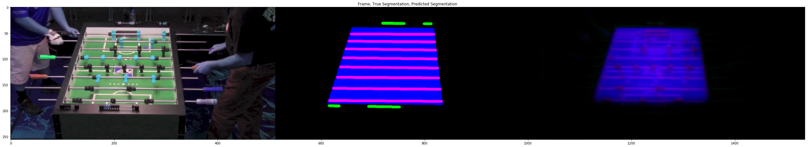


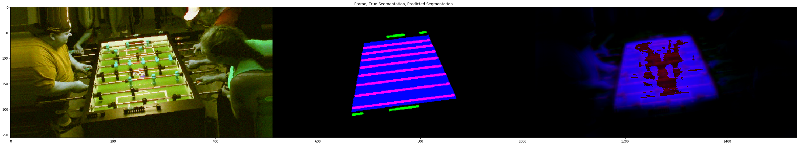


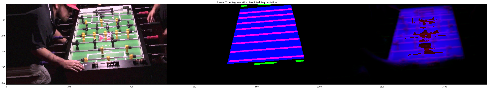


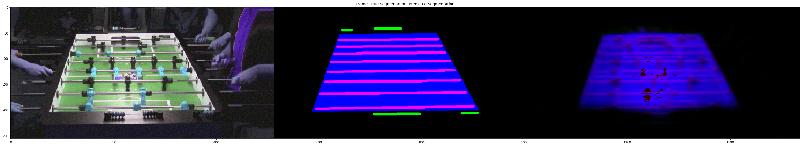


    IOPub data rate exceeded.
    The notebook server will temporarily stop sending output
    to the client in order to avoid crashing it.
    To change this limit, set the config variable
    `--NotebookApp.iopub_data_rate_limit`.
    


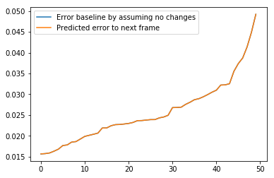


    Wrote model to .\Models\weights_1.hdf
    Epoch 2/2
    

    C:\Anaconda\envs\py35\lib\site-packages\ipykernel\__main__.py:31: UserWarning: Update your `fit_generator` call to the Keras 2 API: `fit_generator(<__main__...., 200, use_multiprocessing=False, initial_epoch=1, validation_steps=40, workers=50, validation_data=<__main__...., max_queue_size=50, verbose=1, epochs=2, class_weight=None, callbacks=None)`
    

    200/200 [==============================] - 402s - loss: 0.0206 - mean_squared_error: 0.0206 - val_loss: 0.0151 - val_mean_squared_error: 0.0151
    Wrote model to .\Models\weights_2.hdf
    Epoch 3/3
    

    C:\Anaconda\envs\py35\lib\site-packages\ipykernel\__main__.py:31: UserWarning: Update your `fit_generator` call to the Keras 2 API: `fit_generator(<__main__...., 200, use_multiprocessing=False, initial_epoch=2, validation_steps=40, workers=50, validation_data=<__main__...., max_queue_size=50, verbose=1, epochs=3, class_weight=None, callbacks=None)`
    

    200/200 [==============================] - 404s - loss: 0.0131 - mean_squared_error: 0.0131 - val_loss: 0.0106 - val_mean_squared_error: 0.0106
    Wrote model to .\Models\weights_3.hdf
    Epoch 4/4
    

    C:\Anaconda\envs\py35\lib\site-packages\ipykernel\__main__.py:31: UserWarning: Update your `fit_generator` call to the Keras 2 API: `fit_generator(<__main__...., 200, use_multiprocessing=False, initial_epoch=3, validation_steps=40, workers=50, validation_data=<__main__...., max_queue_size=50, verbose=1, epochs=4, class_weight=None, callbacks=None)`
    

    200/200 [==============================] - 403s - loss: 0.0092 - mean_squared_error: 0.0092 - val_loss: 0.0086 - val_mean_squared_error: 0.0086
    Wrote model to .\Models\weights_4.hdf
    Epoch 5/5
    

    C:\Anaconda\envs\py35\lib\site-packages\ipykernel\__main__.py:31: UserWarning: Update your `fit_generator` call to the Keras 2 API: `fit_generator(<__main__...., 200, use_multiprocessing=False, initial_epoch=4, validation_steps=40, workers=50, validation_data=<__main__...., max_queue_size=50, verbose=1, epochs=5, class_weight=None, callbacks=None)`
    

    200/200 [==============================] - 403s - loss: 0.0075 - mean_squared_error: 0.0075 - val_loss: 0.0060 - val_mean_squared_error: 0.0060
    Wrote model to .\Models\weights_5.hdf
    Epoch 6/6
    

    C:\Anaconda\envs\py35\lib\site-packages\ipykernel\__main__.py:31: UserWarning: Update your `fit_generator` call to the Keras 2 API: `fit_generator(<__main__...., 200, use_multiprocessing=False, initial_epoch=5, validation_steps=40, workers=50, validation_data=<__main__...., max_queue_size=50, verbose=1, epochs=6, class_weight=None, callbacks=None)`
    

    200/200 [==============================] - 403s - loss: 0.0061 - mean_squared_error: 0.0061 - val_loss: 0.0057 - val_mean_squared_error: 0.0057
    


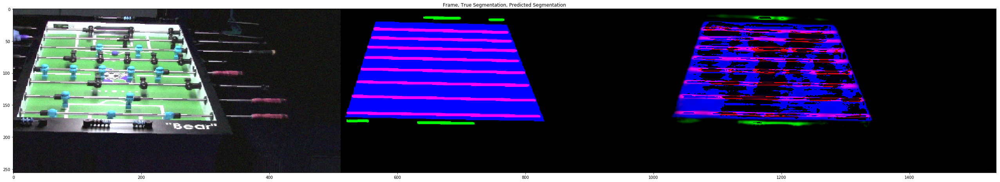


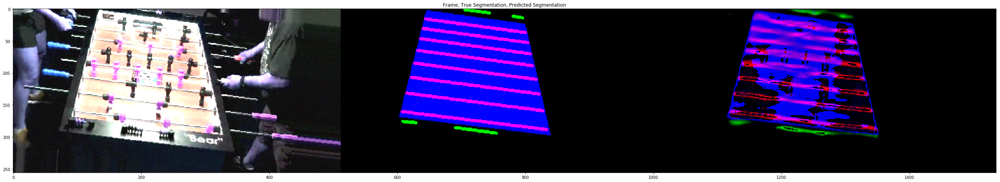


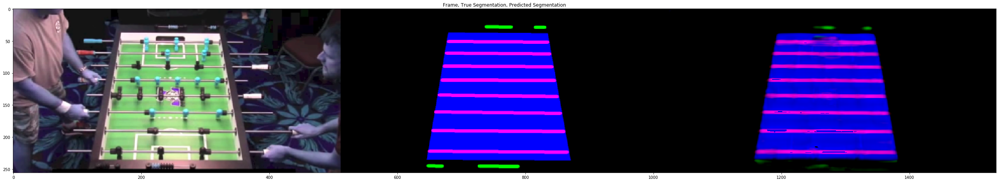


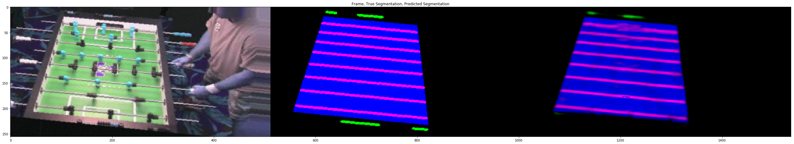


    IOPub data rate exceeded.
    The notebook server will temporarily stop sending output
    to the client in order to avoid crashing it.
    To change this limit, set the config variable
    `--NotebookApp.iopub_data_rate_limit`.
    


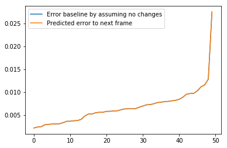


    Wrote model to .\Models\weights_6.hdf
    Epoch 7/7
    

    C:\Anaconda\envs\py35\lib\site-packages\ipykernel\__main__.py:31: UserWarning: Update your `fit_generator` call to the Keras 2 API: `fit_generator(<__main__...., 200, use_multiprocessing=False, initial_epoch=6, validation_steps=40, workers=50, validation_data=<__main__...., max_queue_size=50, verbose=1, epochs=7, class_weight=None, callbacks=None)`
    

    200/200 [==============================] - 401s - loss: 0.0054 - mean_squared_error: 0.0054 - val_loss: 0.0043 - val_mean_squared_error: 0.0043
    Wrote model to .\Models\weights_7.hdf
    Epoch 8/8
    

    C:\Anaconda\envs\py35\lib\site-packages\ipykernel\__main__.py:31: UserWarning: Update your `fit_generator` call to the Keras 2 API: `fit_generator(<__main__...., 200, use_multiprocessing=False, initial_epoch=7, validation_steps=40, workers=50, validation_data=<__main__...., max_queue_size=50, verbose=1, epochs=8, class_weight=None, callbacks=None)`
    

    200/200 [==============================] - 404s - loss: 0.0048 - mean_squared_error: 0.0048 - val_loss: 0.0047 - val_mean_squared_error: 0.0047
    Wrote model to .\Models\weights_8.hdf
    Epoch 9/9
    

    C:\Anaconda\envs\py35\lib\site-packages\ipykernel\__main__.py:31: UserWarning: Update your `fit_generator` call to the Keras 2 API: `fit_generator(<__main__...., 200, use_multiprocessing=False, initial_epoch=8, validation_steps=40, workers=50, validation_data=<__main__...., max_queue_size=50, verbose=1, epochs=9, class_weight=None, callbacks=None)`
    

    200/200 [==============================] - 404s - loss: 0.0043 - mean_squared_error: 0.0043 - val_loss: 0.0045 - val_mean_squared_error: 0.0045
    Wrote model to .\Models\weights_9.hdf
    Epoch 10/10
    

    C:\Anaconda\envs\py35\lib\site-packages\ipykernel\__main__.py:31: UserWarning: Update your `fit_generator` call to the Keras 2 API: `fit_generator(<__main__...., 200, use_multiprocessing=False, initial_epoch=9, validation_steps=40, workers=50, validation_data=<__main__...., max_queue_size=50, verbose=1, epochs=10, class_weight=None, callbacks=None)`
    

    200/200 [==============================] - 406s - loss: 0.0042 - mean_squared_error: 0.0042 - val_loss: 0.0060 - val_mean_squared_error: 0.0060
    Wrote model to .\Models\weights_10.hdf
    Epoch 11/11
    

    C:\Anaconda\envs\py35\lib\site-packages\ipykernel\__main__.py:31: UserWarning: Update your `fit_generator` call to the Keras 2 API: `fit_generator(<__main__...., 200, use_multiprocessing=False, initial_epoch=10, validation_steps=40, workers=50, validation_data=<__main__...., max_queue_size=50, verbose=1, epochs=11, class_weight=None, callbacks=None)`
    

    200/200 [==============================] - 405s - loss: 0.0038 - mean_squared_error: 0.0038 - val_loss: 0.0034 - val_mean_squared_error: 0.0034
    


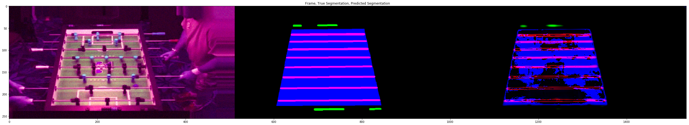


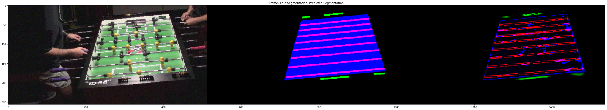


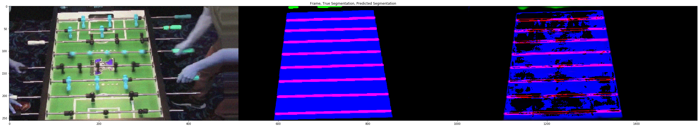


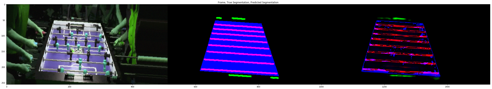


    IOPub data rate exceeded.
    The notebook server will temporarily stop sending output
    to the client in order to avoid crashing it.
    To change this limit, set the config variable
    `--NotebookApp.iopub_data_rate_limit`.
    


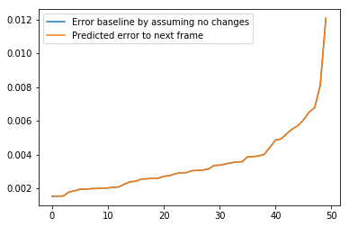


    Wrote model to .\Models\weights_11.hdf
    Epoch 12/12
    

    C:\Anaconda\envs\py35\lib\site-packages\ipykernel\__main__.py:31: UserWarning: Update your `fit_generator` call to the Keras 2 API: `fit_generator(<__main__...., 200, use_multiprocessing=False, initial_epoch=11, validation_steps=40, workers=50, validation_data=<__main__...., max_queue_size=50, verbose=1, epochs=12, class_weight=None, callbacks=None)`
    

    200/200 [==============================] - 407s - loss: 0.0035 - mean_squared_error: 0.0035 - val_loss: 0.0028 - val_mean_squared_error: 0.0028
    Wrote model to .\Models\weights_12.hdf
    Epoch 13/13
    

    C:\Anaconda\envs\py35\lib\site-packages\ipykernel\__main__.py:31: UserWarning: Update your `fit_generator` call to the Keras 2 API: `fit_generator(<__main__...., 200, use_multiprocessing=False, initial_epoch=12, validation_steps=40, workers=50, validation_data=<__main__...., max_queue_size=50, verbose=1, epochs=13, class_weight=None, callbacks=None)`
    

    200/200 [==============================] - 406s - loss: 0.0035 - mean_squared_error: 0.0035 - val_loss: 0.0033 - val_mean_squared_error: 0.0033
    Wrote model to .\Models\weights_13.hdf
    Epoch 14/14
    

    C:\Anaconda\envs\py35\lib\site-packages\ipykernel\__main__.py:31: UserWarning: Update your `fit_generator` call to the Keras 2 API: `fit_generator(<__main__...., 200, use_multiprocessing=False, initial_epoch=13, validation_steps=40, workers=50, validation_data=<__main__...., max_queue_size=50, verbose=1, epochs=14, class_weight=None, callbacks=None)`
    

    200/200 [==============================] - 403s - loss: 0.0034 - mean_squared_error: 0.0034 - val_loss: 0.0028 - val_mean_squared_error: 0.0028
    Wrote model to .\Models\weights_14.hdf
    Epoch 15/15
    

    C:\Anaconda\envs\py35\lib\site-packages\ipykernel\__main__.py:31: UserWarning: Update your `fit_generator` call to the Keras 2 API: `fit_generator(<__main__...., 200, use_multiprocessing=False, initial_epoch=14, validation_steps=40, workers=50, validation_data=<__main__...., max_queue_size=50, verbose=1, epochs=15, class_weight=None, callbacks=None)`
    

    200/200 [==============================] - 406s - loss: 0.0032 - mean_squared_error: 0.0032 - val_loss: 0.0028 - val_mean_squared_error: 0.0028
    Wrote model to .\Models\weights_15.hdf
    Epoch 16/16
    

    C:\Anaconda\envs\py35\lib\site-packages\ipykernel\__main__.py:31: UserWarning: Update your `fit_generator` call to the Keras 2 API: `fit_generator(<__main__...., 200, use_multiprocessing=False, initial_epoch=15, validation_steps=40, workers=50, validation_data=<__main__...., max_queue_size=50, verbose=1, epochs=16, class_weight=None, callbacks=None)`
    

    200/200 [==============================] - 402s - loss: 0.0032 - mean_squared_error: 0.0032 - val_loss: 0.0029 - val_mean_squared_error: 0.0029
    


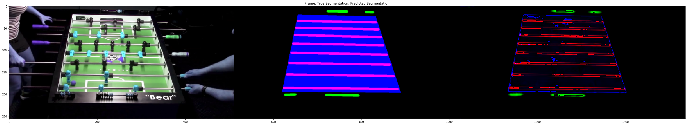


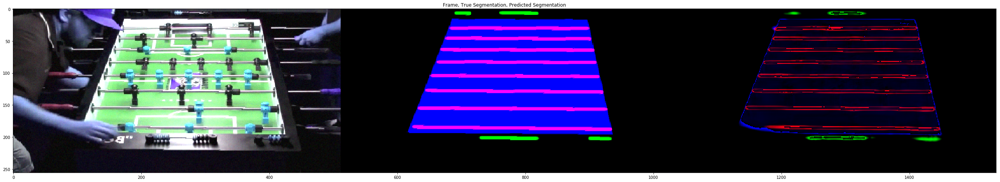


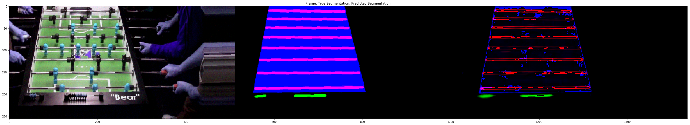


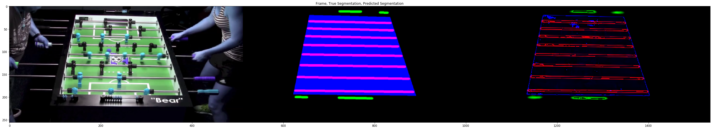


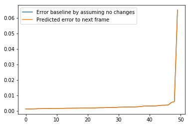


    Wrote model to .\Models\weights_16.hdf
    Epoch 17/17
    

    C:\Anaconda\envs\py35\lib\site-packages\ipykernel\__main__.py:31: UserWarning: Update your `fit_generator` call to the Keras 2 API: `fit_generator(<__main__...., 200, use_multiprocessing=False, initial_epoch=16, validation_steps=40, workers=50, validation_data=<__main__...., max_queue_size=50, verbose=1, epochs=17, class_weight=None, callbacks=None)`
    

    200/200 [==============================] - 402s - loss: 0.0028 - mean_squared_error: 0.0028 - val_loss: 0.0026 - val_mean_squared_error: 0.0026
    Wrote model to .\Models\weights_17.hdf
    Epoch 18/18
    

    C:\Anaconda\envs\py35\lib\site-packages\ipykernel\__main__.py:31: UserWarning: Update your `fit_generator` call to the Keras 2 API: `fit_generator(<__main__...., 200, use_multiprocessing=False, initial_epoch=17, validation_steps=40, workers=50, validation_data=<__main__...., max_queue_size=50, verbose=1, epochs=18, class_weight=None, callbacks=None)`
    

    200/200 [==============================] - 404s - loss: 0.0026 - mean_squared_error: 0.0026 - val_loss: 0.0022 - val_mean_squared_error: 0.0022
    Wrote model to .\Models\weights_18.hdf
    Epoch 19/19
    

    C:\Anaconda\envs\py35\lib\site-packages\ipykernel\__main__.py:31: UserWarning: Update your `fit_generator` call to the Keras 2 API: `fit_generator(<__main__...., 200, use_multiprocessing=False, initial_epoch=18, validation_steps=40, workers=50, validation_data=<__main__...., max_queue_size=50, verbose=1, epochs=19, class_weight=None, callbacks=None)`
    

    200/200 [==============================] - 406s - loss: 0.0027 - mean_squared_error: 0.0027 - val_loss: 0.0029 - val_mean_squared_error: 0.0029
    Wrote model to .\Models\weights_19.hdf
    Epoch 20/20
    

    C:\Anaconda\envs\py35\lib\site-packages\ipykernel\__main__.py:31: UserWarning: Update your `fit_generator` call to the Keras 2 API: `fit_generator(<__main__...., 200, use_multiprocessing=False, initial_epoch=19, validation_steps=40, workers=50, validation_data=<__main__...., max_queue_size=50, verbose=1, epochs=20, class_weight=None, callbacks=None)`
    

    200/200 [==============================] - 407s - loss: 0.0027 - mean_squared_error: 0.0027 - val_loss: 0.0027 - val_mean_squared_error: 0.0027
    Wrote model to .\Models\weights_20.hdf
    Epoch 21/21
    

    C:\Anaconda\envs\py35\lib\site-packages\ipykernel\__main__.py:31: UserWarning: Update your `fit_generator` call to the Keras 2 API: `fit_generator(<__main__...., 200, use_multiprocessing=False, initial_epoch=20, validation_steps=40, workers=50, validation_data=<__main__...., max_queue_size=50, verbose=1, epochs=21, class_weight=None, callbacks=None)`
    

    200/200 [==============================] - 411s - loss: 0.0025 - mean_squared_error: 0.0025 - val_loss: 0.0030 - val_mean_squared_error: 0.0030
    


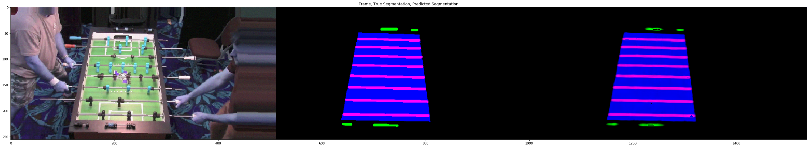


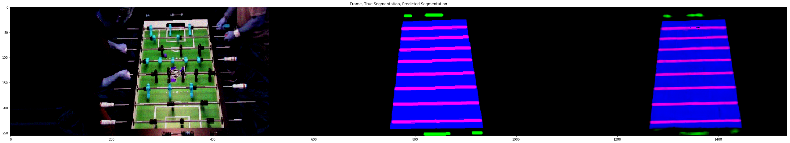


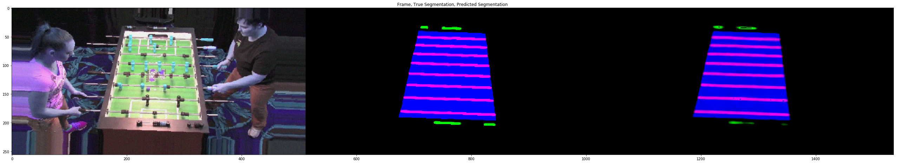


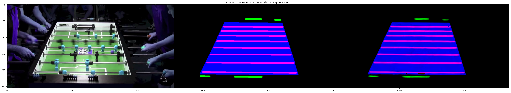


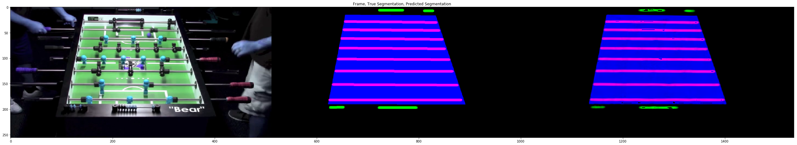


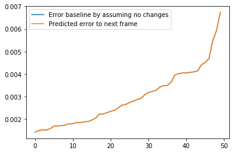


    Wrote model to .\Models\weights_21.hdf
    Epoch 22/22
    

    C:\Anaconda\envs\py35\lib\site-packages\ipykernel\__main__.py:31: UserWarning: Update your `fit_generator` call to the Keras 2 API: `fit_generator(<__main__...., 200, use_multiprocessing=False, initial_epoch=21, validation_steps=40, workers=50, validation_data=<__main__...., max_queue_size=50, verbose=1, epochs=22, class_weight=None, callbacks=None)`
    

    200/200 [==============================] - 409s - loss: 0.0025 - mean_squared_error: 0.0025 - val_loss: 0.0023 - val_mean_squared_error: 0.0023
    Wrote model to .\Models\weights_22.hdf
    Epoch 23/23
    

    C:\Anaconda\envs\py35\lib\site-packages\ipykernel\__main__.py:31: UserWarning: Update your `fit_generator` call to the Keras 2 API: `fit_generator(<__main__...., 200, use_multiprocessing=False, initial_epoch=22, validation_steps=40, workers=50, validation_data=<__main__...., max_queue_size=50, verbose=1, epochs=23, class_weight=None, callbacks=None)`
    

    200/200 [==============================] - 409s - loss: 0.0025 - mean_squared_error: 0.0025 - val_loss: 0.0028 - val_mean_squared_error: 0.0028
    Wrote model to .\Models\weights_23.hdf
    Epoch 24/24
    

    C:\Anaconda\envs\py35\lib\site-packages\ipykernel\__main__.py:31: UserWarning: Update your `fit_generator` call to the Keras 2 API: `fit_generator(<__main__...., 200, use_multiprocessing=False, initial_epoch=23, validation_steps=40, workers=50, validation_data=<__main__...., max_queue_size=50, verbose=1, epochs=24, class_weight=None, callbacks=None)`
    

    200/200 [==============================] - 407s - loss: 0.0023 - mean_squared_error: 0.0023 - val_loss: 0.0025 - val_mean_squared_error: 0.0025
    Wrote model to .\Models\weights_24.hdf
    Epoch 25/25
    

    C:\Anaconda\envs\py35\lib\site-packages\ipykernel\__main__.py:31: UserWarning: Update your `fit_generator` call to the Keras 2 API: `fit_generator(<__main__...., 200, use_multiprocessing=False, initial_epoch=24, validation_steps=40, workers=50, validation_data=<__main__...., max_queue_size=50, verbose=1, epochs=25, class_weight=None, callbacks=None)`
    

    200/200 [==============================] - 406s - loss: 0.0023 - mean_squared_error: 0.0023 - val_loss: 0.0023 - val_mean_squared_error: 0.0023
    Wrote model to .\Models\weights_25.hdf
    Epoch 26/26
    

    C:\Anaconda\envs\py35\lib\site-packages\ipykernel\__main__.py:31: UserWarning: Update your `fit_generator` call to the Keras 2 API: `fit_generator(<__main__...., 200, use_multiprocessing=False, initial_epoch=25, validation_steps=40, workers=50, validation_data=<__main__...., max_queue_size=50, verbose=1, epochs=26, class_weight=None, callbacks=None)`
    

    200/200 [==============================] - 406s - loss: 0.0025 - mean_squared_error: 0.0025 - val_loss: 0.0024 - val_mean_squared_error: 0.0024
    


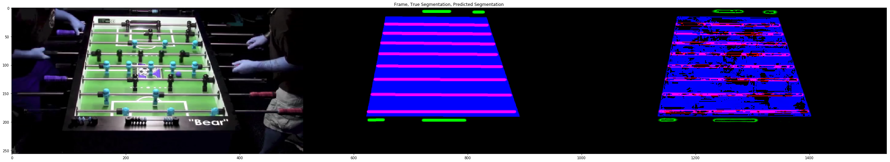


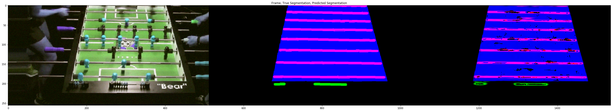


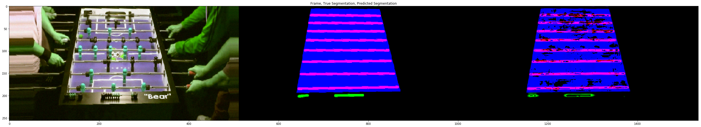


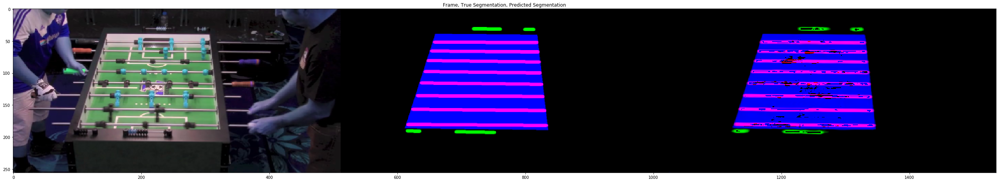


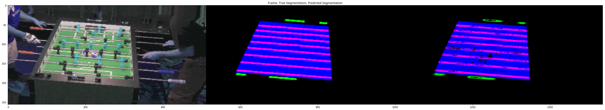


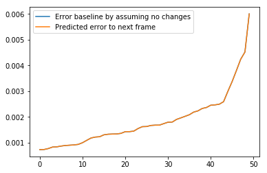


    Wrote model to .\Models\weights_26.hdf
    Epoch 27/27
    

    C:\Anaconda\envs\py35\lib\site-packages\ipykernel\__main__.py:31: UserWarning: Update your `fit_generator` call to the Keras 2 API: `fit_generator(<__main__...., 200, use_multiprocessing=False, initial_epoch=26, validation_steps=40, workers=50, validation_data=<__main__...., max_queue_size=50, verbose=1, epochs=27, class_weight=None, callbacks=None)`
    

    200/200 [==============================] - 416s - loss: 0.0023 - mean_squared_error: 0.0023 - val_loss: 0.0020 - val_mean_squared_error: 0.0020
    Wrote model to .\Models\weights_27.hdf
    Epoch 28/28
    

    C:\Anaconda\envs\py35\lib\site-packages\ipykernel\__main__.py:31: UserWarning: Update your `fit_generator` call to the Keras 2 API: `fit_generator(<__main__...., 200, use_multiprocessing=False, initial_epoch=27, validation_steps=40, workers=50, validation_data=<__main__...., max_queue_size=50, verbose=1, epochs=28, class_weight=None, callbacks=None)`
    

    200/200 [==============================] - 419s - loss: 0.0021 - mean_squared_error: 0.0021 - val_loss: 0.0021 - val_mean_squared_error: 0.0021
    Wrote model to .\Models\weights_28.hdf
    Epoch 29/29
    

    C:\Anaconda\envs\py35\lib\site-packages\ipykernel\__main__.py:31: UserWarning: Update your `fit_generator` call to the Keras 2 API: `fit_generator(<__main__...., 200, use_multiprocessing=False, initial_epoch=28, validation_steps=40, workers=50, validation_data=<__main__...., max_queue_size=50, verbose=1, epochs=29, class_weight=None, callbacks=None)`
    

    200/200 [==============================] - 411s - loss: 0.0023 - mean_squared_error: 0.0023 - val_loss: 0.0022 - val_mean_squared_error: 0.0022
    Wrote model to .\Models\weights_29.hdf
    Epoch 30/30
    

    C:\Anaconda\envs\py35\lib\site-packages\ipykernel\__main__.py:31: UserWarning: Update your `fit_generator` call to the Keras 2 API: `fit_generator(<__main__...., 200, use_multiprocessing=False, initial_epoch=29, validation_steps=40, workers=50, validation_data=<__main__...., max_queue_size=50, verbose=1, epochs=30, class_weight=None, callbacks=None)`
    

    200/200 [==============================] - 406s - loss: 0.0021 - mean_squared_error: 0.0021 - val_loss: 0.0022 - val_mean_squared_error: 0.0022
    Wrote model to .\Models\weights_30.hdf
    Epoch 31/31
    

    C:\Anaconda\envs\py35\lib\site-packages\ipykernel\__main__.py:31: UserWarning: Update your `fit_generator` call to the Keras 2 API: `fit_generator(<__main__...., 200, use_multiprocessing=False, initial_epoch=30, validation_steps=40, workers=50, validation_data=<__main__...., max_queue_size=50, verbose=1, epochs=31, class_weight=None, callbacks=None)`
    

    200/200 [==============================] - 408s - loss: 0.0023 - mean_squared_error: 0.0023 - val_loss: 0.0021 - val_mean_squared_error: 0.0021
    


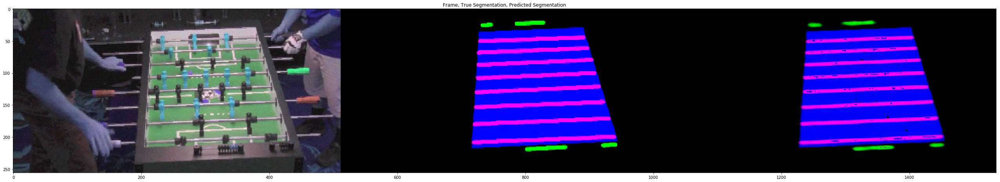


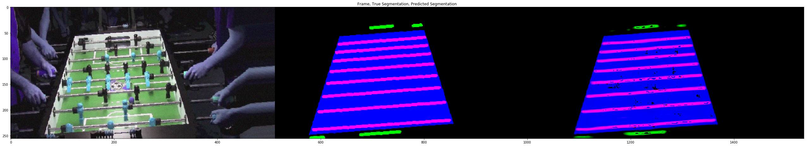


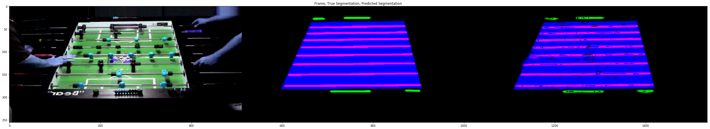


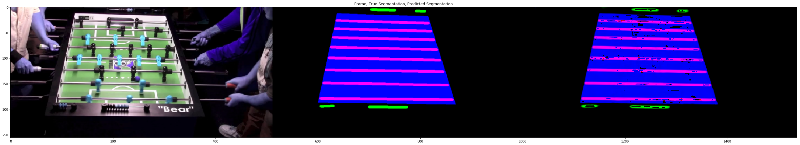


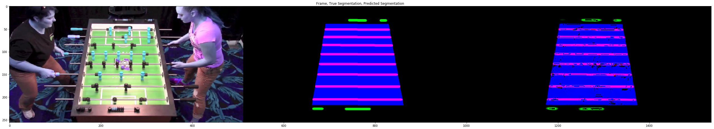


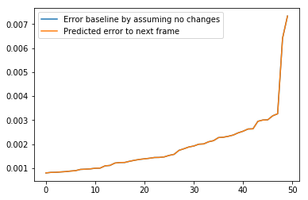


    Wrote model to .\Models\weights_31.hdf
    Epoch 32/32
    

    C:\Anaconda\envs\py35\lib\site-packages\ipykernel\__main__.py:31: UserWarning: Update your `fit_generator` call to the Keras 2 API: `fit_generator(<__main__...., 200, use_multiprocessing=False, initial_epoch=31, validation_steps=40, workers=50, validation_data=<__main__...., max_queue_size=50, verbose=1, epochs=32, class_weight=None, callbacks=None)`
    

    200/200 [==============================] - 407s - loss: 0.0021 - mean_squared_error: 0.0021 - val_loss: 0.0023 - val_mean_squared_error: 0.0023
    Wrote model to .\Models\weights_32.hdf
    Epoch 33/33
    

    C:\Anaconda\envs\py35\lib\site-packages\ipykernel\__main__.py:31: UserWarning: Update your `fit_generator` call to the Keras 2 API: `fit_generator(<__main__...., 200, use_multiprocessing=False, initial_epoch=32, validation_steps=40, workers=50, validation_data=<__main__...., max_queue_size=50, verbose=1, epochs=33, class_weight=None, callbacks=None)`
    

    200/200 [==============================] - 405s - loss: 0.0022 - mean_squared_error: 0.0022 - val_loss: 0.0020 - val_mean_squared_error: 0.0020
    Wrote model to .\Models\weights_33.hdf
    Epoch 34/34
    

    C:\Anaconda\envs\py35\lib\site-packages\ipykernel\__main__.py:31: UserWarning: Update your `fit_generator` call to the Keras 2 API: `fit_generator(<__main__...., 200, use_multiprocessing=False, initial_epoch=33, validation_steps=40, workers=50, validation_data=<__main__...., max_queue_size=50, verbose=1, epochs=34, class_weight=None, callbacks=None)`
    

    200/200 [==============================] - 409s - loss: 0.0021 - mean_squared_error: 0.0021 - val_loss: 0.0020 - val_mean_squared_error: 0.0020
    Wrote model to .\Models\weights_34.hdf
    Epoch 35/35
    

    C:\Anaconda\envs\py35\lib\site-packages\ipykernel\__main__.py:31: UserWarning: Update your `fit_generator` call to the Keras 2 API: `fit_generator(<__main__...., 200, use_multiprocessing=False, initial_epoch=34, validation_steps=40, workers=50, validation_data=<__main__...., max_queue_size=50, verbose=1, epochs=35, class_weight=None, callbacks=None)`
    

    200/200 [==============================] - 410s - loss: 0.0021 - mean_squared_error: 0.0021 - val_loss: 0.0021 - val_mean_squared_error: 0.0021
    Wrote model to .\Models\weights_35.hdf
    Epoch 36/36
    

    C:\Anaconda\envs\py35\lib\site-packages\ipykernel\__main__.py:31: UserWarning: Update your `fit_generator` call to the Keras 2 API: `fit_generator(<__main__...., 200, use_multiprocessing=False, initial_epoch=35, validation_steps=40, workers=50, validation_data=<__main__...., max_queue_size=50, verbose=1, epochs=36, class_weight=None, callbacks=None)`
    

    200/200 [==============================] - 414s - loss: 0.0021 - mean_squared_error: 0.0021 - val_loss: 0.0019 - val_mean_squared_error: 0.0019
    


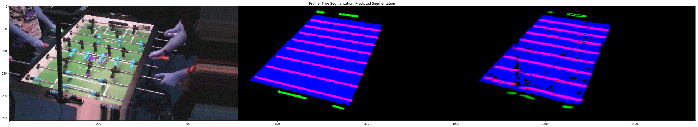


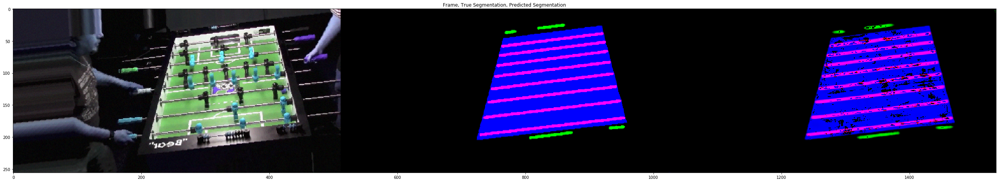


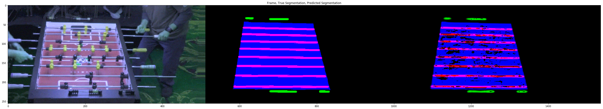


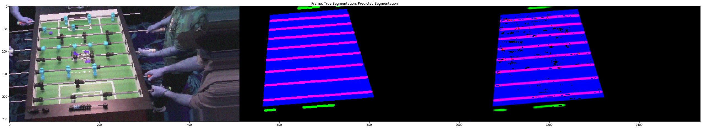


    IOPub data rate exceeded.
    The notebook server will temporarily stop sending output
    to the client in order to avoid crashing it.
    To change this limit, set the config variable
    `--NotebookApp.iopub_data_rate_limit`.
    


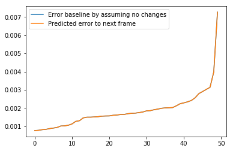


    Wrote model to .\Models\weights_36.hdf
    Epoch 37/37
    

    C:\Anaconda\envs\py35\lib\site-packages\ipykernel\__main__.py:31: UserWarning: Update your `fit_generator` call to the Keras 2 API: `fit_generator(<__main__...., 200, use_multiprocessing=False, initial_epoch=36, validation_steps=40, workers=50, validation_data=<__main__...., max_queue_size=50, verbose=1, epochs=37, class_weight=None, callbacks=None)`
    

    200/200 [==============================] - 415s - loss: 0.0020 - mean_squared_error: 0.0020 - val_loss: 0.0025 - val_mean_squared_error: 0.0025
    Wrote model to .\Models\weights_37.hdf
    Epoch 38/38
    

    C:\Anaconda\envs\py35\lib\site-packages\ipykernel\__main__.py:31: UserWarning: Update your `fit_generator` call to the Keras 2 API: `fit_generator(<__main__...., 200, use_multiprocessing=False, initial_epoch=37, validation_steps=40, workers=50, validation_data=<__main__...., max_queue_size=50, verbose=1, epochs=38, class_weight=None, callbacks=None)`
    

    200/200 [==============================] - 409s - loss: 0.0019 - mean_squared_error: 0.0019 - val_loss: 0.0020 - val_mean_squared_error: 0.0020
    Wrote model to .\Models\weights_38.hdf
    Epoch 39/39
    

    C:\Anaconda\envs\py35\lib\site-packages\ipykernel\__main__.py:31: UserWarning: Update your `fit_generator` call to the Keras 2 API: `fit_generator(<__main__...., 200, use_multiprocessing=False, initial_epoch=38, validation_steps=40, workers=50, validation_data=<__main__...., max_queue_size=50, verbose=1, epochs=39, class_weight=None, callbacks=None)`
    

    200/200 [==============================] - 409s - loss: 0.0019 - mean_squared_error: 0.0019 - val_loss: 0.0020 - val_mean_squared_error: 0.0020
    Wrote model to .\Models\weights_39.hdf
    Epoch 40/40
    

    C:\Anaconda\envs\py35\lib\site-packages\ipykernel\__main__.py:31: UserWarning: Update your `fit_generator` call to the Keras 2 API: `fit_generator(<__main__...., 200, use_multiprocessing=False, initial_epoch=39, validation_steps=40, workers=50, validation_data=<__main__...., max_queue_size=50, verbose=1, epochs=40, class_weight=None, callbacks=None)`
    

    200/200 [==============================] - 408s - loss: 0.0019 - mean_squared_error: 0.0019 - val_loss: 0.0020 - val_mean_squared_error: 0.0020
    Wrote model to .\Models\weights_40.hdf
    Epoch 41/41
    

    C:\Anaconda\envs\py35\lib\site-packages\ipykernel\__main__.py:31: UserWarning: Update your `fit_generator` call to the Keras 2 API: `fit_generator(<__main__...., 200, use_multiprocessing=False, initial_epoch=40, validation_steps=40, workers=50, validation_data=<__main__...., max_queue_size=50, verbose=1, epochs=41, class_weight=None, callbacks=None)`
    

    200/200 [==============================] - 411s - loss: 0.0021 - mean_squared_error: 0.0021 - val_loss: 0.0020 - val_mean_squared_error: 0.0020
    


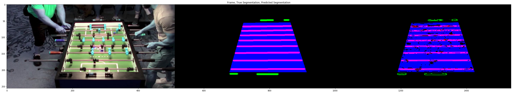


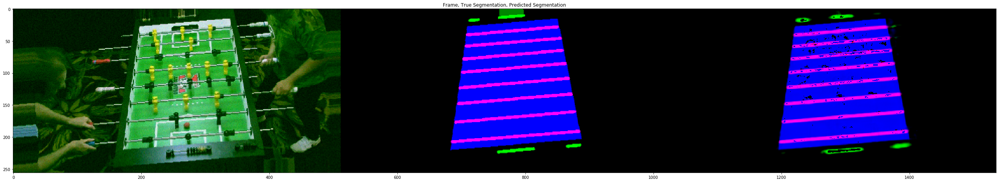


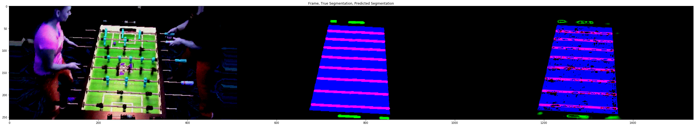


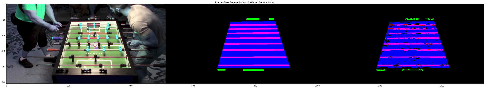


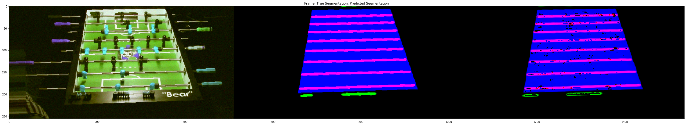


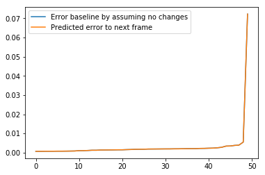


    Wrote model to .\Models\weights_41.hdf
    Epoch 42/42
    

    C:\Anaconda\envs\py35\lib\site-packages\ipykernel\__main__.py:31: UserWarning: Update your `fit_generator` call to the Keras 2 API: `fit_generator(<__main__...., 200, use_multiprocessing=False, initial_epoch=41, validation_steps=40, workers=50, validation_data=<__main__...., max_queue_size=50, verbose=1, epochs=42, class_weight=None, callbacks=None)`
    

    200/200 [==============================] - 408s - loss: 0.0020 - mean_squared_error: 0.0020 - val_loss: 0.0021 - val_mean_squared_error: 0.0021
    Wrote model to .\Models\weights_42.hdf
    Epoch 43/43
    

    C:\Anaconda\envs\py35\lib\site-packages\ipykernel\__main__.py:31: UserWarning: Update your `fit_generator` call to the Keras 2 API: `fit_generator(<__main__...., 200, use_multiprocessing=False, initial_epoch=42, validation_steps=40, workers=50, validation_data=<__main__...., max_queue_size=50, verbose=1, epochs=43, class_weight=None, callbacks=None)`
    

    200/200 [==============================] - 410s - loss: 0.0020 - mean_squared_error: 0.0020 - val_loss: 0.0021 - val_mean_squared_error: 0.0021
    Wrote model to .\Models\weights_43.hdf
    Epoch 44/44
    

    C:\Anaconda\envs\py35\lib\site-packages\ipykernel\__main__.py:31: UserWarning: Update your `fit_generator` call to the Keras 2 API: `fit_generator(<__main__...., 200, use_multiprocessing=False, initial_epoch=43, validation_steps=40, workers=50, validation_data=<__main__...., max_queue_size=50, verbose=1, epochs=44, class_weight=None, callbacks=None)`
    

    200/200 [==============================] - 407s - loss: 0.0020 - mean_squared_error: 0.0020 - val_loss: 0.0017 - val_mean_squared_error: 0.0017
    Wrote model to .\Models\weights_44.hdf
    Epoch 45/45
    

    C:\Anaconda\envs\py35\lib\site-packages\ipykernel\__main__.py:31: UserWarning: Update your `fit_generator` call to the Keras 2 API: `fit_generator(<__main__...., 200, use_multiprocessing=False, initial_epoch=44, validation_steps=40, workers=50, validation_data=<__main__...., max_queue_size=50, verbose=1, epochs=45, class_weight=None, callbacks=None)`
    

    200/200 [==============================] - 409s - loss: 0.0018 - mean_squared_error: 0.0018 - val_loss: 0.0018 - val_mean_squared_error: 0.0018
    Wrote model to .\Models\weights_45.hdf
    Epoch 46/46
    

    C:\Anaconda\envs\py35\lib\site-packages\ipykernel\__main__.py:31: UserWarning: Update your `fit_generator` call to the Keras 2 API: `fit_generator(<__main__...., 200, use_multiprocessing=False, initial_epoch=45, validation_steps=40, workers=50, validation_data=<__main__...., max_queue_size=50, verbose=1, epochs=46, class_weight=None, callbacks=None)`
    

    200/200 [==============================] - 406s - loss: 0.0019 - mean_squared_error: 0.0019 - val_loss: 0.0020 - val_mean_squared_error: 0.0020
    


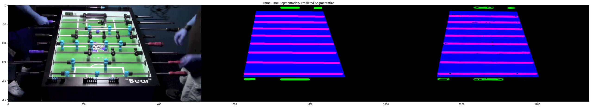


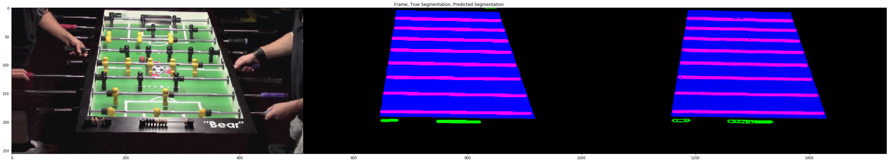


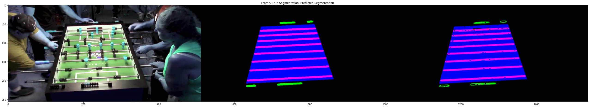


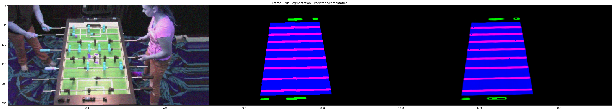


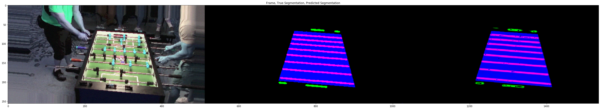


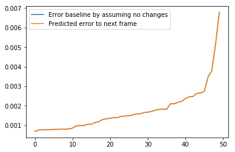


    Wrote model to .\Models\weights_46.hdf
    Epoch 47/47
    

    C:\Anaconda\envs\py35\lib\site-packages\ipykernel\__main__.py:31: UserWarning: Update your `fit_generator` call to the Keras 2 API: `fit_generator(<__main__...., 200, use_multiprocessing=False, initial_epoch=46, validation_steps=40, workers=50, validation_data=<__main__...., max_queue_size=50, verbose=1, epochs=47, class_weight=None, callbacks=None)`
    

    200/200 [==============================] - 408s - loss: 0.0018 - mean_squared_error: 0.0018 - val_loss: 0.0019 - val_mean_squared_error: 0.0019
    Wrote model to .\Models\weights_47.hdf
    Epoch 48/48
    

    C:\Anaconda\envs\py35\lib\site-packages\ipykernel\__main__.py:31: UserWarning: Update your `fit_generator` call to the Keras 2 API: `fit_generator(<__main__...., 200, use_multiprocessing=False, initial_epoch=47, validation_steps=40, workers=50, validation_data=<__main__...., max_queue_size=50, verbose=1, epochs=48, class_weight=None, callbacks=None)`
    

    200/200 [==============================] - 411s - loss: 0.0019 - mean_squared_error: 0.0019 - val_loss: 0.0018 - val_mean_squared_error: 0.0018
    Wrote model to .\Models\weights_48.hdf
    Epoch 49/49
    

    C:\Anaconda\envs\py35\lib\site-packages\ipykernel\__main__.py:31: UserWarning: Update your `fit_generator` call to the Keras 2 API: `fit_generator(<__main__...., 200, use_multiprocessing=False, initial_epoch=48, validation_steps=40, workers=50, validation_data=<__main__...., max_queue_size=50, verbose=1, epochs=49, class_weight=None, callbacks=None)`
    

    200/200 [==============================] - 407s - loss: 0.0018 - mean_squared_error: 0.0018 - val_loss: 0.0022 - val_mean_squared_error: 0.0022
    Wrote model to .\Models\weights_49.hdf
    Epoch 50/50
    

    C:\Anaconda\envs\py35\lib\site-packages\ipykernel\__main__.py:31: UserWarning: Update your `fit_generator` call to the Keras 2 API: `fit_generator(<__main__...., 200, use_multiprocessing=False, initial_epoch=49, validation_steps=40, workers=50, validation_data=<__main__...., max_queue_size=50, verbose=1, epochs=50, class_weight=None, callbacks=None)`
    

    200/200 [==============================] - 403s - loss: 0.0020 - mean_squared_error: 0.0020 - val_loss: 0.0018 - val_mean_squared_error: 0.0018
    Wrote model to .\Models\weights_50.hdf
    


```python
# For a multi-class classification problem
frame_prediction_model.compile(optimizer=keras.optimizers.RMSprop(lr=0.000005),
#model.compile(optimizer=keras.optimizers.adam(),
              loss='mean_squared_error',
              metrics=['mean_squared_error'])

# Was ran on the above simple model, not pre-trained Inceptionv3 run.
epoch = 51
#batches_validation_per_epoch = 50
#batches_training_per_epoch = 400
batch_size = 10
batches_training_per_epoch = 200
batches_validation_per_epoch = 40
print("Batch size %i: %i training batches, %i validation batches" % (batch_size, batches_training_per_epoch, batches_validation_per_epoch) )
WEIGHTS_FNAME = '.\\Models\\weights_%i.hdf'
MODELS_FNAME = '.\\Models\\models_%i.h5'

for i in range(200):
    frame_prediction_model.fit_generator(
        TrainBatchGen(batch_size, training=training),
        batches_training_per_epoch,
        epochs=epoch+1,
        verbose=1,
        callbacks=None,
        class_weight=None,
        max_q_size=50,
        workers=50,
        validation_data=TrainBatchGen(batch_size, validation),
        validation_steps = batches_validation_per_epoch,
        pickle_safe=False,
        initial_epoch=epoch)
    
    epoch += 1
    
    # Plot occasional validation data plot
    if i % 5 == 0:
        plot_validate(TrainBatchGen(batch_size, validation), frame_prediction_model, 50, "Epoch validation results %i" % epoch)
    
    # Save the model
    frame_prediction_model.save_weights(WEIGHTS_FNAME % epoch)
    frame_prediction_model.save(MODELS_FNAME % epoch)
    print(("Wrote model to " + WEIGHTS_FNAME )  % epoch)


```

    Batch size 10: 200 training batches, 40 validation batches
    

    C:\Anaconda\envs\py35\lib\site-packages\ipykernel\__main__.py:31: UserWarning: Update your `fit_generator` call to the Keras 2 API: `fit_generator(<__main__...., 200, use_multiprocessing=False, initial_epoch=51, validation_steps=40, workers=50, validation_data=<__main__...., max_queue_size=50, verbose=1, epochs=52, class_weight=None, callbacks=None)`
    

    Epoch 52/52
    200/200 [==============================] - 406s - loss: 0.0017 - mean_squared_error: 0.0017 - val_loss: 0.0019 - val_mean_squared_error: 0.0019
    


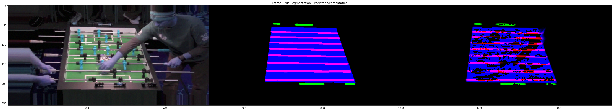


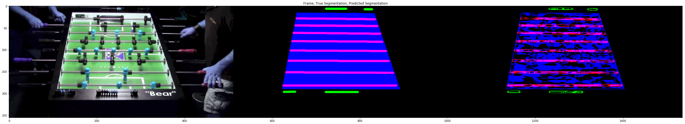


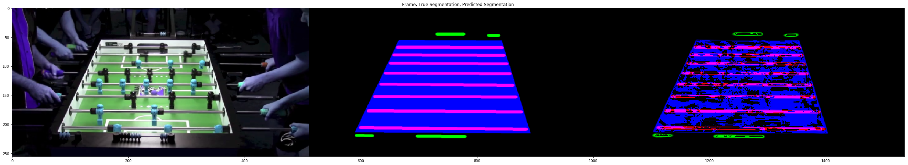


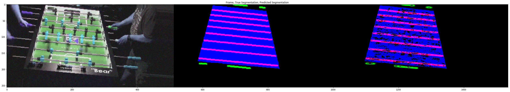


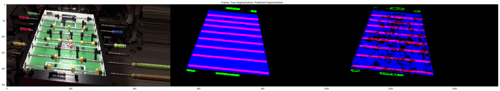


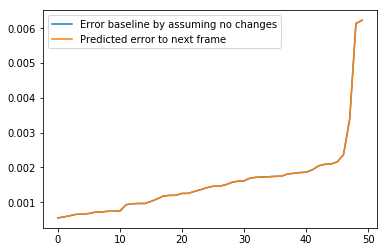


    Wrote model to .\Models\weights_52.hdf
    Epoch 53/53
    

    C:\Anaconda\envs\py35\lib\site-packages\ipykernel\__main__.py:31: UserWarning: Update your `fit_generator` call to the Keras 2 API: `fit_generator(<__main__...., 200, use_multiprocessing=False, initial_epoch=52, validation_steps=40, workers=50, validation_data=<__main__...., max_queue_size=50, verbose=1, epochs=53, class_weight=None, callbacks=None)`
    

    200/200 [==============================] - 403s - loss: 0.0017 - mean_squared_error: 0.0017 - val_loss: 0.0016 - val_mean_squared_error: 0.0016
    Wrote model to .\Models\weights_53.hdf
    Epoch 54/54
    

    C:\Anaconda\envs\py35\lib\site-packages\ipykernel\__main__.py:31: UserWarning: Update your `fit_generator` call to the Keras 2 API: `fit_generator(<__main__...., 200, use_multiprocessing=False, initial_epoch=53, validation_steps=40, workers=50, validation_data=<__main__...., max_queue_size=50, verbose=1, epochs=54, class_weight=None, callbacks=None)`
    

    200/200 [==============================] - 405s - loss: 0.0016 - mean_squared_error: 0.0016 - val_loss: 0.0016 - val_mean_squared_error: 0.0016
    Wrote model to .\Models\weights_54.hdf
    Epoch 55/55
    

    C:\Anaconda\envs\py35\lib\site-packages\ipykernel\__main__.py:31: UserWarning: Update your `fit_generator` call to the Keras 2 API: `fit_generator(<__main__...., 200, use_multiprocessing=False, initial_epoch=54, validation_steps=40, workers=50, validation_data=<__main__...., max_queue_size=50, verbose=1, epochs=55, class_weight=None, callbacks=None)`
    

    200/200 [==============================] - 404s - loss: 0.0018 - mean_squared_error: 0.0018 - val_loss: 0.0016 - val_mean_squared_error: 0.0016
    Wrote model to .\Models\weights_55.hdf
    Epoch 56/56
    

    C:\Anaconda\envs\py35\lib\site-packages\ipykernel\__main__.py:31: UserWarning: Update your `fit_generator` call to the Keras 2 API: `fit_generator(<__main__...., 200, use_multiprocessing=False, initial_epoch=55, validation_steps=40, workers=50, validation_data=<__main__...., max_queue_size=50, verbose=1, epochs=56, class_weight=None, callbacks=None)`
    

    200/200 [==============================] - 403s - loss: 0.0017 - mean_squared_error: 0.0017 - val_loss: 0.0017 - val_mean_squared_error: 0.0017
    Wrote model to .\Models\weights_56.hdf
    Epoch 57/57
    

    C:\Anaconda\envs\py35\lib\site-packages\ipykernel\__main__.py:31: UserWarning: Update your `fit_generator` call to the Keras 2 API: `fit_generator(<__main__...., 200, use_multiprocessing=False, initial_epoch=56, validation_steps=40, workers=50, validation_data=<__main__...., max_queue_size=50, verbose=1, epochs=57, class_weight=None, callbacks=None)`
    

    200/200 [==============================] - 403s - loss: 0.0017 - mean_squared_error: 0.0017 - val_loss: 0.0016 - val_mean_squared_error: 0.0016
    


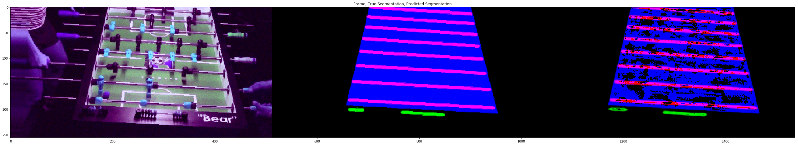


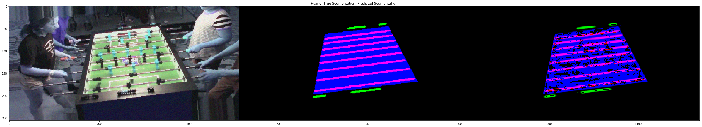


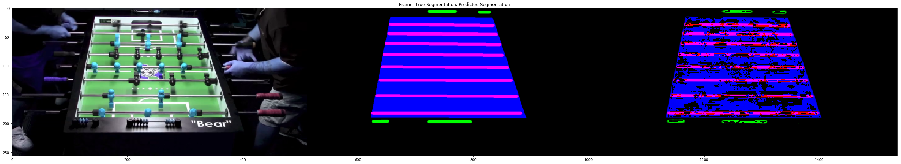


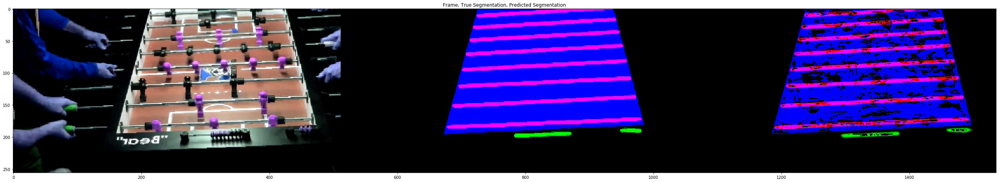


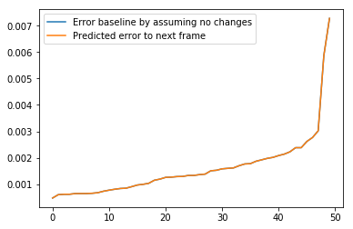


    Wrote model to .\Models\weights_57.hdf
    Epoch 58/58
    

    C:\Anaconda\envs\py35\lib\site-packages\ipykernel\__main__.py:31: UserWarning: Update your `fit_generator` call to the Keras 2 API: `fit_generator(<__main__...., 200, use_multiprocessing=False, initial_epoch=57, validation_steps=40, workers=50, validation_data=<__main__...., max_queue_size=50, verbose=1, epochs=58, class_weight=None, callbacks=None)`
    

    200/200 [==============================] - 400s - loss: 0.0016 - mean_squared_error: 0.0016 - val_loss: 0.0016 - val_mean_squared_error: 0.0016
    Wrote model to .\Models\weights_58.hdf
    Epoch 59/59
    

    C:\Anaconda\envs\py35\lib\site-packages\ipykernel\__main__.py:31: UserWarning: Update your `fit_generator` call to the Keras 2 API: `fit_generator(<__main__...., 200, use_multiprocessing=False, initial_epoch=58, validation_steps=40, workers=50, validation_data=<__main__...., max_queue_size=50, verbose=1, epochs=59, class_weight=None, callbacks=None)`
    

    200/200 [==============================] - 402s - loss: 0.0016 - mean_squared_error: 0.0016 - val_loss: 0.0017 - val_mean_squared_error: 0.0017
    Wrote model to .\Models\weights_59.hdf
    Epoch 60/60
    

    C:\Anaconda\envs\py35\lib\site-packages\ipykernel\__main__.py:31: UserWarning: Update your `fit_generator` call to the Keras 2 API: `fit_generator(<__main__...., 200, use_multiprocessing=False, initial_epoch=59, validation_steps=40, workers=50, validation_data=<__main__...., max_queue_size=50, verbose=1, epochs=60, class_weight=None, callbacks=None)`
    

    200/200 [==============================] - 401s - loss: 0.0017 - mean_squared_error: 0.0017 - val_loss: 0.0016 - val_mean_squared_error: 0.0016
    Wrote model to .\Models\weights_60.hdf
    Epoch 61/61
    

    C:\Anaconda\envs\py35\lib\site-packages\ipykernel\__main__.py:31: UserWarning: Update your `fit_generator` call to the Keras 2 API: `fit_generator(<__main__...., 200, use_multiprocessing=False, initial_epoch=60, validation_steps=40, workers=50, validation_data=<__main__...., max_queue_size=50, verbose=1, epochs=61, class_weight=None, callbacks=None)`
    

    200/200 [==============================] - 403s - loss: 0.0017 - mean_squared_error: 0.0017 - val_loss: 0.0016 - val_mean_squared_error: 0.0016
    Wrote model to .\Models\weights_61.hdf
    Epoch 62/62
    

    C:\Anaconda\envs\py35\lib\site-packages\ipykernel\__main__.py:31: UserWarning: Update your `fit_generator` call to the Keras 2 API: `fit_generator(<__main__...., 200, use_multiprocessing=False, initial_epoch=61, validation_steps=40, workers=50, validation_data=<__main__...., max_queue_size=50, verbose=1, epochs=62, class_weight=None, callbacks=None)`
    

    200/200 [==============================] - 400s - loss: 0.0016 - mean_squared_error: 0.0016 - val_loss: 0.0015 - val_mean_squared_error: 0.0015
    


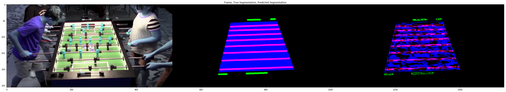


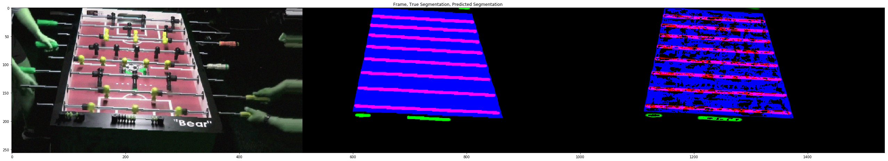


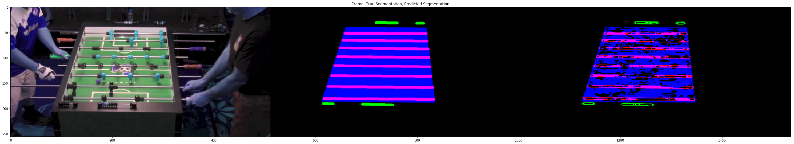


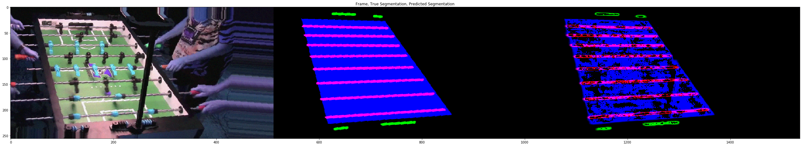


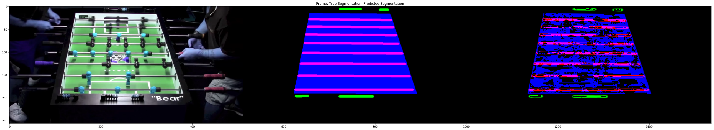


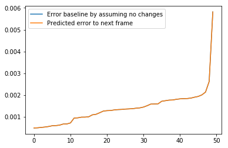


    Wrote model to .\Models\weights_62.hdf
    Epoch 63/63
    

    C:\Anaconda\envs\py35\lib\site-packages\ipykernel\__main__.py:31: UserWarning: Update your `fit_generator` call to the Keras 2 API: `fit_generator(<__main__...., 200, use_multiprocessing=False, initial_epoch=62, validation_steps=40, workers=50, validation_data=<__main__...., max_queue_size=50, verbose=1, epochs=63, class_weight=None, callbacks=None)`
    

    200/200 [==============================] - 402s - loss: 0.0015 - mean_squared_error: 0.0015 - val_loss: 0.0017 - val_mean_squared_error: 0.0017
    Wrote model to .\Models\weights_63.hdf
    Epoch 64/64
    

    C:\Anaconda\envs\py35\lib\site-packages\ipykernel\__main__.py:31: UserWarning: Update your `fit_generator` call to the Keras 2 API: `fit_generator(<__main__...., 200, use_multiprocessing=False, initial_epoch=63, validation_steps=40, workers=50, validation_data=<__main__...., max_queue_size=50, verbose=1, epochs=64, class_weight=None, callbacks=None)`
    

    200/200 [==============================] - 401s - loss: 0.0017 - mean_squared_error: 0.0017 - val_loss: 0.0018 - val_mean_squared_error: 0.0018
    Wrote model to .\Models\weights_64.hdf
    Epoch 65/65
    

    C:\Anaconda\envs\py35\lib\site-packages\ipykernel\__main__.py:31: UserWarning: Update your `fit_generator` call to the Keras 2 API: `fit_generator(<__main__...., 200, use_multiprocessing=False, initial_epoch=64, validation_steps=40, workers=50, validation_data=<__main__...., max_queue_size=50, verbose=1, epochs=65, class_weight=None, callbacks=None)`
    

    200/200 [==============================] - 403s - loss: 0.0016 - mean_squared_error: 0.0016 - val_loss: 0.0017 - val_mean_squared_error: 0.0017
    Wrote model to .\Models\weights_65.hdf
    Epoch 66/66
    

    C:\Anaconda\envs\py35\lib\site-packages\ipykernel\__main__.py:31: UserWarning: Update your `fit_generator` call to the Keras 2 API: `fit_generator(<__main__...., 200, use_multiprocessing=False, initial_epoch=65, validation_steps=40, workers=50, validation_data=<__main__...., max_queue_size=50, verbose=1, epochs=66, class_weight=None, callbacks=None)`
    

    200/200 [==============================] - 403s - loss: 0.0016 - mean_squared_error: 0.0016 - val_loss: 0.0015 - val_mean_squared_error: 0.0015
    Wrote model to .\Models\weights_66.hdf
    Epoch 67/67
    

    C:\Anaconda\envs\py35\lib\site-packages\ipykernel\__main__.py:31: UserWarning: Update your `fit_generator` call to the Keras 2 API: `fit_generator(<__main__...., 200, use_multiprocessing=False, initial_epoch=66, validation_steps=40, workers=50, validation_data=<__main__...., max_queue_size=50, verbose=1, epochs=67, class_weight=None, callbacks=None)`
    

    200/200 [==============================] - 402s - loss: 0.0018 - mean_squared_error: 0.0018 - val_loss: 0.0017 - val_mean_squared_error: 0.0017
    


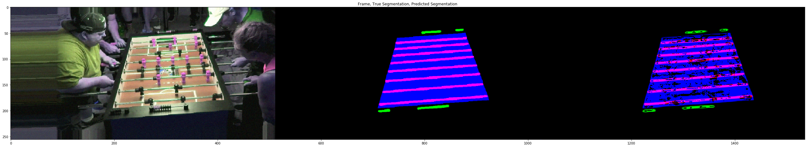


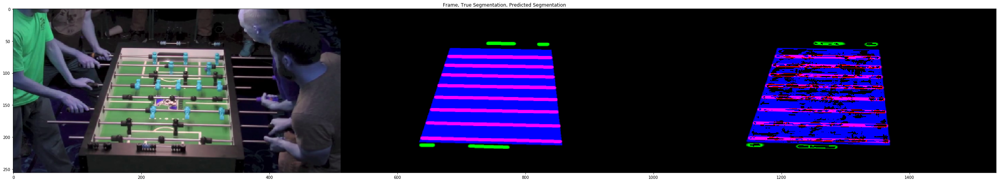


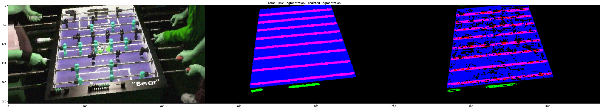


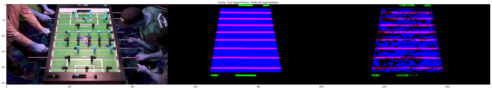


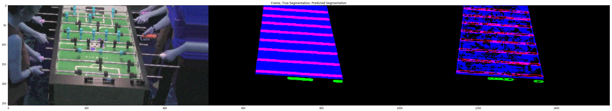


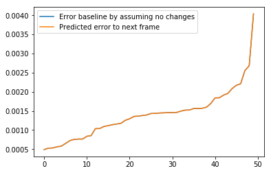


    Wrote model to .\Models\weights_67.hdf
    Epoch 68/68
    

    C:\Anaconda\envs\py35\lib\site-packages\ipykernel\__main__.py:31: UserWarning: Update your `fit_generator` call to the Keras 2 API: `fit_generator(<__main__...., 200, use_multiprocessing=False, initial_epoch=67, validation_steps=40, workers=50, validation_data=<__main__...., max_queue_size=50, verbose=1, epochs=68, class_weight=None, callbacks=None)`
    

    200/200 [==============================] - 399s - loss: 0.0016 - mean_squared_error: 0.0016 - val_loss: 0.0014 - val_mean_squared_error: 0.0014
    Wrote model to .\Models\weights_68.hdf
    Epoch 69/69
    

    C:\Anaconda\envs\py35\lib\site-packages\ipykernel\__main__.py:31: UserWarning: Update your `fit_generator` call to the Keras 2 API: `fit_generator(<__main__...., 200, use_multiprocessing=False, initial_epoch=68, validation_steps=40, workers=50, validation_data=<__main__...., max_queue_size=50, verbose=1, epochs=69, class_weight=None, callbacks=None)`
    

    200/200 [==============================] - 404s - loss: 0.0015 - mean_squared_error: 0.0015 - val_loss: 0.0015 - val_mean_squared_error: 0.0015
    Wrote model to .\Models\weights_69.hdf
    Epoch 70/70
    

    C:\Anaconda\envs\py35\lib\site-packages\ipykernel\__main__.py:31: UserWarning: Update your `fit_generator` call to the Keras 2 API: `fit_generator(<__main__...., 200, use_multiprocessing=False, initial_epoch=69, validation_steps=40, workers=50, validation_data=<__main__...., max_queue_size=50, verbose=1, epochs=70, class_weight=None, callbacks=None)`
    

    200/200 [==============================] - 401s - loss: 0.0017 - mean_squared_error: 0.0017 - val_loss: 0.0016 - val_mean_squared_error: 0.0016
    Wrote model to .\Models\weights_70.hdf
    Epoch 71/71
    

    C:\Anaconda\envs\py35\lib\site-packages\ipykernel\__main__.py:31: UserWarning: Update your `fit_generator` call to the Keras 2 API: `fit_generator(<__main__...., 200, use_multiprocessing=False, initial_epoch=70, validation_steps=40, workers=50, validation_data=<__main__...., max_queue_size=50, verbose=1, epochs=71, class_weight=None, callbacks=None)`
    

    200/200 [==============================] - 403s - loss: 0.0016 - mean_squared_error: 0.0016 - val_loss: 0.0016 - val_mean_squared_error: 0.0016
    Wrote model to .\Models\weights_71.hdf
    Epoch 72/72
    

    C:\Anaconda\envs\py35\lib\site-packages\ipykernel\__main__.py:31: UserWarning: Update your `fit_generator` call to the Keras 2 API: `fit_generator(<__main__...., 200, use_multiprocessing=False, initial_epoch=71, validation_steps=40, workers=50, validation_data=<__main__...., max_queue_size=50, verbose=1, epochs=72, class_weight=None, callbacks=None)`
    

    200/200 [==============================] - 401s - loss: 0.0017 - mean_squared_error: 0.0017 - val_loss: 0.0015 - val_mean_squared_error: 0.0015
    


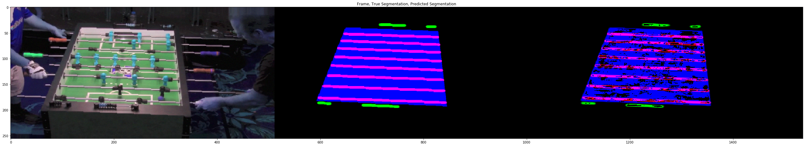


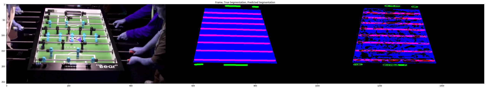


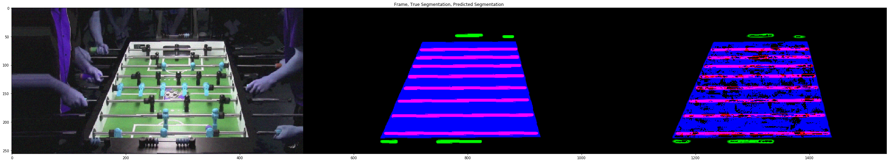


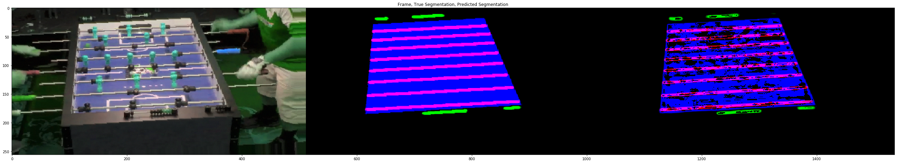


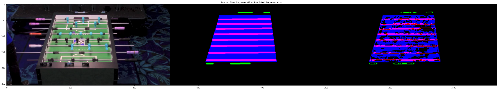


    Wrote model to .\Models\weights_72.hdf
    Epoch 73/73
    

    C:\Anaconda\envs\py35\lib\site-packages\ipykernel\__main__.py:31: UserWarning: Update your `fit_generator` call to the Keras 2 API: `fit_generator(<__main__...., 200, use_multiprocessing=False, initial_epoch=72, validation_steps=40, workers=50, validation_data=<__main__...., max_queue_size=50, verbose=1, epochs=73, class_weight=None, callbacks=None)`
    

    200/200 [==============================] - 404s - loss: 0.0016 - mean_squared_error: 0.0016 - val_loss: 0.0016 - val_mean_squared_error: 0.0016
    Wrote model to .\Models\weights_73.hdf
    Epoch 74/74
    

    C:\Anaconda\envs\py35\lib\site-packages\ipykernel\__main__.py:31: UserWarning: Update your `fit_generator` call to the Keras 2 API: `fit_generator(<__main__...., 200, use_multiprocessing=False, initial_epoch=73, validation_steps=40, workers=50, validation_data=<__main__...., max_queue_size=50, verbose=1, epochs=74, class_weight=None, callbacks=None)`
    

    200/200 [==============================] - 402s - loss: 0.0015 - mean_squared_error: 0.0015 - val_loss: 0.0015 - val_mean_squared_error: 0.0015
    Wrote model to .\Models\weights_74.hdf
    Epoch 75/75
    

    C:\Anaconda\envs\py35\lib\site-packages\ipykernel\__main__.py:31: UserWarning: Update your `fit_generator` call to the Keras 2 API: `fit_generator(<__main__...., 200, use_multiprocessing=False, initial_epoch=74, validation_steps=40, workers=50, validation_data=<__main__...., max_queue_size=50, verbose=1, epochs=75, class_weight=None, callbacks=None)`
    

    200/200 [==============================] - 402s - loss: 0.0016 - mean_squared_error: 0.0016 - val_loss: 0.0018 - val_mean_squared_error: 0.0018
    Wrote model to .\Models\weights_75.hdf
    Epoch 76/76
    

    C:\Anaconda\envs\py35\lib\site-packages\ipykernel\__main__.py:31: UserWarning: Update your `fit_generator` call to the Keras 2 API: `fit_generator(<__main__...., 200, use_multiprocessing=False, initial_epoch=75, validation_steps=40, workers=50, validation_data=<__main__...., max_queue_size=50, verbose=1, epochs=76, class_weight=None, callbacks=None)`
    

    200/200 [==============================] - 402s - loss: 0.0017 - mean_squared_error: 0.0017 - val_loss: 0.0016 - val_mean_squared_error: 0.0016
    Wrote model to .\Models\weights_76.hdf
    Epoch 77/77
    

    C:\Anaconda\envs\py35\lib\site-packages\ipykernel\__main__.py:31: UserWarning: Update your `fit_generator` call to the Keras 2 API: `fit_generator(<__main__...., 200, use_multiprocessing=False, initial_epoch=76, validation_steps=40, workers=50, validation_data=<__main__...., max_queue_size=50, verbose=1, epochs=77, class_weight=None, callbacks=None)`
    

    200/200 [==============================] - 403s - loss: 0.0015 - mean_squared_error: 0.0015 - val_loss: 0.0016 - val_mean_squared_error: 0.0016
    


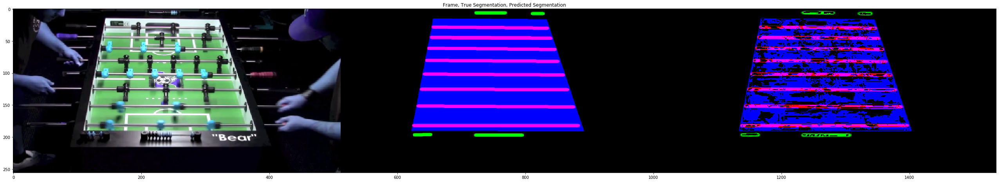


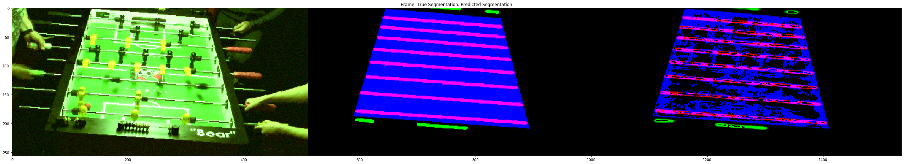


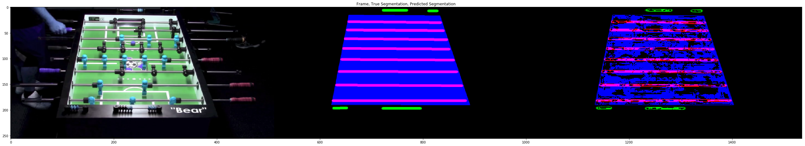


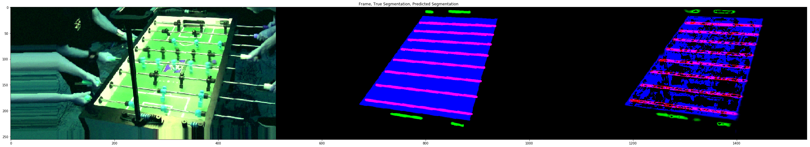


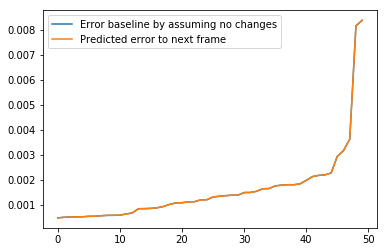


    Wrote model to .\Models\weights_77.hdf
    Epoch 78/78
    

    C:\Anaconda\envs\py35\lib\site-packages\ipykernel\__main__.py:31: UserWarning: Update your `fit_generator` call to the Keras 2 API: `fit_generator(<__main__...., 200, use_multiprocessing=False, initial_epoch=77, validation_steps=40, workers=50, validation_data=<__main__...., max_queue_size=50, verbose=1, epochs=78, class_weight=None, callbacks=None)`
    

    200/200 [==============================] - 402s - loss: 0.0016 - mean_squared_error: 0.0016 - val_loss: 0.0015 - val_mean_squared_error: 0.0015
    Wrote model to .\Models\weights_78.hdf
    Epoch 79/79
    

    C:\Anaconda\envs\py35\lib\site-packages\ipykernel\__main__.py:31: UserWarning: Update your `fit_generator` call to the Keras 2 API: `fit_generator(<__main__...., 200, use_multiprocessing=False, initial_epoch=78, validation_steps=40, workers=50, validation_data=<__main__...., max_queue_size=50, verbose=1, epochs=79, class_weight=None, callbacks=None)`
    

    200/200 [==============================] - 403s - loss: 0.0016 - mean_squared_error: 0.0016 - val_loss: 0.0015 - val_mean_squared_error: 0.0015
    Wrote model to .\Models\weights_79.hdf
    Epoch 80/80
    

    C:\Anaconda\envs\py35\lib\site-packages\ipykernel\__main__.py:31: UserWarning: Update your `fit_generator` call to the Keras 2 API: `fit_generator(<__main__...., 200, use_multiprocessing=False, initial_epoch=79, validation_steps=40, workers=50, validation_data=<__main__...., max_queue_size=50, verbose=1, epochs=80, class_weight=None, callbacks=None)`
    

    200/200 [==============================] - 406s - loss: 0.0016 - mean_squared_error: 0.0016 - val_loss: 0.0018 - val_mean_squared_error: 0.0018
    Wrote model to .\Models\weights_80.hdf
    Epoch 81/81
    

    C:\Anaconda\envs\py35\lib\site-packages\ipykernel\__main__.py:31: UserWarning: Update your `fit_generator` call to the Keras 2 API: `fit_generator(<__main__...., 200, use_multiprocessing=False, initial_epoch=80, validation_steps=40, workers=50, validation_data=<__main__...., max_queue_size=50, verbose=1, epochs=81, class_weight=None, callbacks=None)`
    

     46/200 [=====>........................] - ETA: 233s - loss: 0.0017 - mean_squared_error: 0.0017


    ---------------------------------------------------------------------------

    KeyboardInterrupt                         Traceback (most recent call last)

    C:\Anaconda\envs\py35\lib\site-packages\keras\engine\training.py in fit_generator(self, generator, steps_per_epoch, epochs, verbose, callbacks, validation_data, validation_steps, class_weight, max_queue_size, workers, use_multiprocessing, shuffle, initial_epoch)
       2041                                                sample_weight=sample_weight,
    -> 2042                                                class_weight=class_weight)
       2043 
    

    C:\Anaconda\envs\py35\lib\site-packages\keras\engine\training.py in train_on_batch(self, x, y, sample_weight, class_weight)
       1761         self._make_train_function()
    -> 1762         outputs = self.train_function(ins)
       1763         if len(outputs) == 1:
    

    C:\Anaconda\envs\py35\lib\site-packages\keras\backend\tensorflow_backend.py in __call__(self, inputs)
       2272                               feed_dict=feed_dict,
    -> 2273                               **self.session_kwargs)
       2274         return updated[:len(self.outputs)]
    

    C:\Anaconda\envs\py35\lib\site-packages\tensorflow\python\client\session.py in run(self, fetches, feed_dict, options, run_metadata)
        894       result = self._run(None, fetches, feed_dict, options_ptr,
    --> 895                          run_metadata_ptr)
        896       if run_metadata:
    

    C:\Anaconda\envs\py35\lib\site-packages\tensorflow\python\client\session.py in _run(self, handle, fetches, feed_dict, options, run_metadata)
       1123       results = self._do_run(handle, final_targets, final_fetches,
    -> 1124                              feed_dict_tensor, options, run_metadata)
       1125     else:
    

    C:\Anaconda\envs\py35\lib\site-packages\tensorflow\python\client\session.py in _do_run(self, handle, target_list, fetch_list, feed_dict, options, run_metadata)
       1320       return self._do_call(_run_fn, self._session, feeds, fetches, targets,
    -> 1321                            options, run_metadata)
       1322     else:
    

    C:\Anaconda\envs\py35\lib\site-packages\tensorflow\python\client\session.py in _do_call(self, fn, *args)
       1326     try:
    -> 1327       return fn(*args)
       1328     except errors.OpError as e:
    

    C:\Anaconda\envs\py35\lib\site-packages\tensorflow\python\client\session.py in _run_fn(session, feed_dict, fetch_list, target_list, options, run_metadata)
       1305                                    feed_dict, fetch_list, target_list,
    -> 1306                                    status, run_metadata)
       1307 
    

    KeyboardInterrupt: 

    
    During handling of the above exception, another exception occurred:
    

    KeyboardInterrupt                         Traceback (most recent call last)

    <ipython-input-10-3eb0f945f781> in <module>()
         29         validation_steps = batches_validation_per_epoch,
         30         pickle_safe=False,
    ---> 31         initial_epoch=epoch)
         32 
         33     epoch += 1
    

    C:\Anaconda\envs\py35\lib\site-packages\keras\legacy\interfaces.py in wrapper(*args, **kwargs)
         85                 warnings.warn('Update your `' + object_name +
         86                               '` call to the Keras 2 API: ' + signature, stacklevel=2)
    ---> 87             return func(*args, **kwargs)
         88         wrapper._original_function = func
         89         return wrapper
    

    C:\Anaconda\envs\py35\lib\site-packages\keras\engine\training.py in fit_generator(self, generator, steps_per_epoch, epochs, verbose, callbacks, validation_data, validation_steps, class_weight, max_queue_size, workers, use_multiprocessing, shuffle, initial_epoch)
       2087         finally:
       2088             if enqueuer is not None:
    -> 2089                 enqueuer.stop()
       2090 
       2091         callbacks.on_train_end()
    

    C:\Anaconda\envs\py35\lib\site-packages\keras\utils\data_utils.py in stop(self, timeout)
        618                     thread.terminate()
        619                 else:
    --> 620                     thread.join(timeout)
        621 
        622         if self._use_multiprocessing:
    

    C:\Anaconda\envs\py35\lib\threading.py in join(self, timeout)
       1052 
       1053         if timeout is None:
    -> 1054             self._wait_for_tstate_lock()
       1055         else:
       1056             # the behavior of a negative timeout isn't documented, but
    

    C:\Anaconda\envs\py35\lib\threading.py in _wait_for_tstate_lock(self, block, timeout)
       1068         if lock is None:  # already determined that the C code is done
       1069             assert self._is_stopped
    -> 1070         elif lock.acquire(block, timeout):
       1071             lock.release()
       1072             self._stop()
    

    KeyboardInterrupt: 


```python
# For a multi-class classification problem
frame_prediction_model.compile(optimizer=keras.optimizers.RMSprop(lr=0.0000005),
#model.compile(optimizer=keras.optimizers.adam(),
              loss='mean_squared_error',
              metrics=['mean_squared_error'])

# Was ran on the above simple model, not pre-trained Inceptionv3 run.
epoch = 251
#batches_validation_per_epoch = 50
#batches_training_per_epoch = 400
batch_size = 10
batches_training_per_epoch = 200
batches_validation_per_epoch = 40
print("Batch size %i: %i training batches, %i validation batches" % (batch_size, batches_training_per_epoch, batches_validation_per_epoch) )
WEIGHTS_FNAME = '.\\Models\\weights_%i.hdf'
MODELS_FNAME = '.\\Models\\models_%i.h5'

for i in range(200):
    frame_prediction_model.fit_generator(
        TrainBatchGen(batch_size, training=training),
        batches_training_per_epoch,
        epochs=epoch+1,
        verbose=1,
        callbacks=None,
        class_weight=None,
        max_q_size=50,
        workers=50,
        validation_data=TrainBatchGen(batch_size, validation),
        validation_steps = batches_validation_per_epoch,
        pickle_safe=False,
        initial_epoch=epoch)
    
    epoch += 1
    
    # Plot occasional validation data plot
    if i % 5 == 0:
        plot_validate(TrainBatchGen(batch_size, validation), frame_prediction_model, 50, "Epoch validation results %i" % epoch)
    
    # Save the model
    frame_prediction_model.save_weights(WEIGHTS_FNAME % epoch)
    frame_prediction_model.save(MODELS_FNAME % epoch)
    print(("Wrote model to " + WEIGHTS_FNAME )  % epoch)


```

    Batch size 10: 200 training batches, 40 validation batches
    

    C:\Anaconda\envs\py35\lib\site-packages\ipykernel\__main__.py:31: UserWarning: Update your `fit_generator` call to the Keras 2 API: `fit_generator(<__main__...., 200, use_multiprocessing=False, initial_epoch=251, validation_steps=40, workers=50, validation_data=<__main__...., max_queue_size=50, verbose=1, epochs=252, class_weight=None, callbacks=None)`
    

    Epoch 252/252
    200/200 [==============================] - 402s - loss: 0.0016 - mean_squared_error: 0.0016 - val_loss: 0.0015 - val_mean_squared_error: 0.0015
    


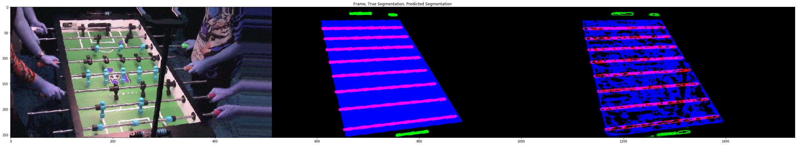


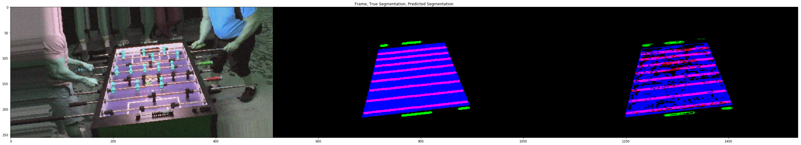


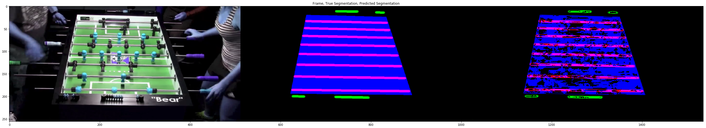


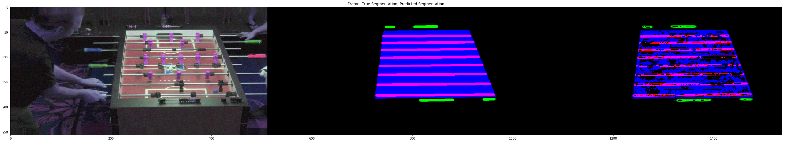


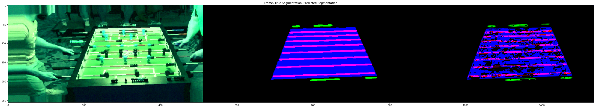


    Wrote model to .\Models\weights_252.hdf
    Epoch 253/253
    

    C:\Anaconda\envs\py35\lib\site-packages\ipykernel\__main__.py:31: UserWarning: Update your `fit_generator` call to the Keras 2 API: `fit_generator(<__main__...., 200, use_multiprocessing=False, initial_epoch=252, validation_steps=40, workers=50, validation_data=<__main__...., max_queue_size=50, verbose=1, epochs=253, class_weight=None, callbacks=None)`
    

    200/200 [==============================] - 405s - loss: 0.0016 - mean_squared_error: 0.0016 - val_loss: 0.0015 - val_mean_squared_error: 0.0015
    Wrote model to .\Models\weights_253.hdf
    Epoch 254/254
    

    C:\Anaconda\envs\py35\lib\site-packages\ipykernel\__main__.py:31: UserWarning: Update your `fit_generator` call to the Keras 2 API: `fit_generator(<__main__...., 200, use_multiprocessing=False, initial_epoch=253, validation_steps=40, workers=50, validation_data=<__main__...., max_queue_size=50, verbose=1, epochs=254, class_weight=None, callbacks=None)`
    

    200/200 [==============================] - 403s - loss: 0.0016 - mean_squared_error: 0.0016 - val_loss: 0.0017 - val_mean_squared_error: 0.0017
    Wrote model to .\Models\weights_254.hdf
    Epoch 255/255
    

    C:\Anaconda\envs\py35\lib\site-packages\ipykernel\__main__.py:31: UserWarning: Update your `fit_generator` call to the Keras 2 API: `fit_generator(<__main__...., 200, use_multiprocessing=False, initial_epoch=254, validation_steps=40, workers=50, validation_data=<__main__...., max_queue_size=50, verbose=1, epochs=255, class_weight=None, callbacks=None)`
    

    200/200 [==============================] - 403s - loss: 0.0016 - mean_squared_error: 0.0016 - val_loss: 0.0017 - val_mean_squared_error: 0.0017
    Wrote model to .\Models\weights_255.hdf
    Epoch 256/256
    

    C:\Anaconda\envs\py35\lib\site-packages\ipykernel\__main__.py:31: UserWarning: Update your `fit_generator` call to the Keras 2 API: `fit_generator(<__main__...., 200, use_multiprocessing=False, initial_epoch=255, validation_steps=40, workers=50, validation_data=<__main__...., max_queue_size=50, verbose=1, epochs=256, class_weight=None, callbacks=None)`
    

    200/200 [==============================] - 403s - loss: 0.0016 - mean_squared_error: 0.0016 - val_loss: 0.0018 - val_mean_squared_error: 0.0018
    Wrote model to .\Models\weights_256.hdf
    Epoch 257/257
    

    C:\Anaconda\envs\py35\lib\site-packages\ipykernel\__main__.py:31: UserWarning: Update your `fit_generator` call to the Keras 2 API: `fit_generator(<__main__...., 200, use_multiprocessing=False, initial_epoch=256, validation_steps=40, workers=50, validation_data=<__main__...., max_queue_size=50, verbose=1, epochs=257, class_weight=None, callbacks=None)`
    

    200/200 [==============================] - 407s - loss: 0.0016 - mean_squared_error: 0.0016 - val_loss: 0.0016 - val_mean_squared_error: 0.0016
    


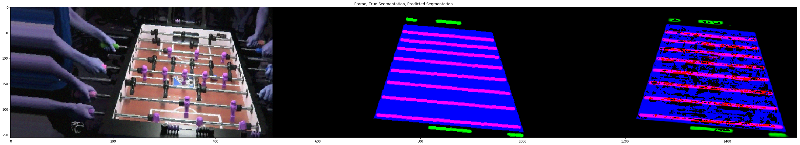


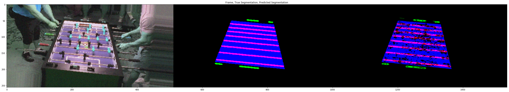


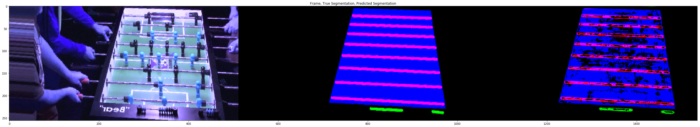


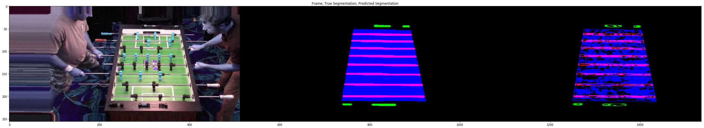


    IOPub data rate exceeded.
    The notebook server will temporarily stop sending output
    to the client in order to avoid crashing it.
    To change this limit, set the config variable
    `--NotebookApp.iopub_data_rate_limit`.
    


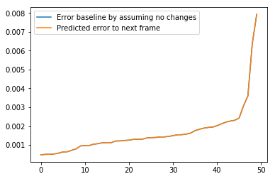


    Wrote model to .\Models\weights_257.hdf
    Epoch 258/258
    

    C:\Anaconda\envs\py35\lib\site-packages\ipykernel\__main__.py:31: UserWarning: Update your `fit_generator` call to the Keras 2 API: `fit_generator(<__main__...., 200, use_multiprocessing=False, initial_epoch=257, validation_steps=40, workers=50, validation_data=<__main__...., max_queue_size=50, verbose=1, epochs=258, class_weight=None, callbacks=None)`
    

    200/200 [==============================] - 401s - loss: 0.0016 - mean_squared_error: 0.0016 - val_loss: 0.0016 - val_mean_squared_error: 0.0016
    Wrote model to .\Models\weights_258.hdf
    Epoch 259/259
    

    C:\Anaconda\envs\py35\lib\site-packages\ipykernel\__main__.py:31: UserWarning: Update your `fit_generator` call to the Keras 2 API: `fit_generator(<__main__...., 200, use_multiprocessing=False, initial_epoch=258, validation_steps=40, workers=50, validation_data=<__main__...., max_queue_size=50, verbose=1, epochs=259, class_weight=None, callbacks=None)`
    

    200/200 [==============================] - 404s - loss: 0.0016 - mean_squared_error: 0.0016 - val_loss: 0.0015 - val_mean_squared_error: 0.0015
    Wrote model to .\Models\weights_259.hdf
    Epoch 260/260
    

    C:\Anaconda\envs\py35\lib\site-packages\ipykernel\__main__.py:31: UserWarning: Update your `fit_generator` call to the Keras 2 API: `fit_generator(<__main__...., 200, use_multiprocessing=False, initial_epoch=259, validation_steps=40, workers=50, validation_data=<__main__...., max_queue_size=50, verbose=1, epochs=260, class_weight=None, callbacks=None)`
    

    200/200 [==============================] - 403s - loss: 0.0015 - mean_squared_error: 0.0015 - val_loss: 0.0015 - val_mean_squared_error: 0.0015
    Wrote model to .\Models\weights_260.hdf
    Epoch 261/261
    

    C:\Anaconda\envs\py35\lib\site-packages\ipykernel\__main__.py:31: UserWarning: Update your `fit_generator` call to the Keras 2 API: `fit_generator(<__main__...., 200, use_multiprocessing=False, initial_epoch=260, validation_steps=40, workers=50, validation_data=<__main__...., max_queue_size=50, verbose=1, epochs=261, class_weight=None, callbacks=None)`
    

    200/200 [==============================] - 404s - loss: 0.0017 - mean_squared_error: 0.0017 - val_loss: 0.0016 - val_mean_squared_error: 0.0016
    Wrote model to .\Models\weights_261.hdf
    Epoch 262/262
    

    C:\Anaconda\envs\py35\lib\site-packages\ipykernel\__main__.py:31: UserWarning: Update your `fit_generator` call to the Keras 2 API: `fit_generator(<__main__...., 200, use_multiprocessing=False, initial_epoch=261, validation_steps=40, workers=50, validation_data=<__main__...., max_queue_size=50, verbose=1, epochs=262, class_weight=None, callbacks=None)`
    

    200/200 [==============================] - 405s - loss: 0.0016 - mean_squared_error: 0.0016 - val_loss: 0.0015 - val_mean_squared_error: 0.0015
    


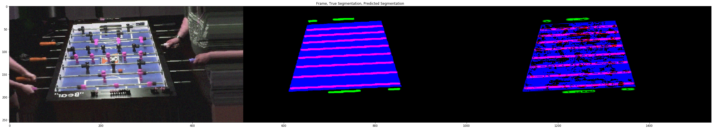


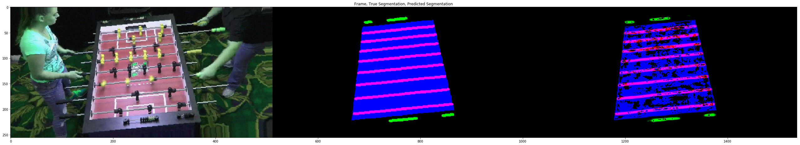


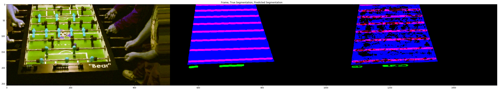


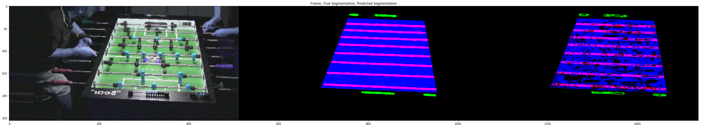


    IOPub data rate exceeded.
    The notebook server will temporarily stop sending output
    to the client in order to avoid crashing it.
    To change this limit, set the config variable
    `--NotebookApp.iopub_data_rate_limit`.
    


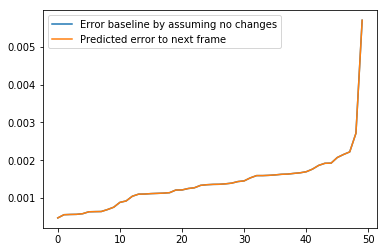


    Wrote model to .\Models\weights_262.hdf
    Epoch 263/263
    

    C:\Anaconda\envs\py35\lib\site-packages\ipykernel\__main__.py:31: UserWarning: Update your `fit_generator` call to the Keras 2 API: `fit_generator(<__main__...., 200, use_multiprocessing=False, initial_epoch=262, validation_steps=40, workers=50, validation_data=<__main__...., max_queue_size=50, verbose=1, epochs=263, class_weight=None, callbacks=None)`
    

    200/200 [==============================] - 405s - loss: 0.0016 - mean_squared_error: 0.0016 - val_loss: 0.0017 - val_mean_squared_error: 0.0017
    Wrote model to .\Models\weights_263.hdf
    Epoch 264/264
    

    C:\Anaconda\envs\py35\lib\site-packages\ipykernel\__main__.py:31: UserWarning: Update your `fit_generator` call to the Keras 2 API: `fit_generator(<__main__...., 200, use_multiprocessing=False, initial_epoch=263, validation_steps=40, workers=50, validation_data=<__main__...., max_queue_size=50, verbose=1, epochs=264, class_weight=None, callbacks=None)`
    

    200/200 [==============================] - 409s - loss: 0.0016 - mean_squared_error: 0.0016 - val_loss: 0.0018 - val_mean_squared_error: 0.0018
    Wrote model to .\Models\weights_264.hdf
    Epoch 265/265
    

    C:\Anaconda\envs\py35\lib\site-packages\ipykernel\__main__.py:31: UserWarning: Update your `fit_generator` call to the Keras 2 API: `fit_generator(<__main__...., 200, use_multiprocessing=False, initial_epoch=264, validation_steps=40, workers=50, validation_data=<__main__...., max_queue_size=50, verbose=1, epochs=265, class_weight=None, callbacks=None)`
    

    200/200 [==============================] - 409s - loss: 0.0017 - mean_squared_error: 0.0017 - val_loss: 0.0016 - val_mean_squared_error: 0.0016
    Wrote model to .\Models\weights_265.hdf
    Epoch 266/266
    

    C:\Anaconda\envs\py35\lib\site-packages\ipykernel\__main__.py:31: UserWarning: Update your `fit_generator` call to the Keras 2 API: `fit_generator(<__main__...., 200, use_multiprocessing=False, initial_epoch=265, validation_steps=40, workers=50, validation_data=<__main__...., max_queue_size=50, verbose=1, epochs=266, class_weight=None, callbacks=None)`
    

    200/200 [==============================] - 406s - loss: 0.0016 - mean_squared_error: 0.0016 - val_loss: 0.0017 - val_mean_squared_error: 0.0017
    Wrote model to .\Models\weights_266.hdf
    Epoch 267/267
    

    C:\Anaconda\envs\py35\lib\site-packages\ipykernel\__main__.py:31: UserWarning: Update your `fit_generator` call to the Keras 2 API: `fit_generator(<__main__...., 200, use_multiprocessing=False, initial_epoch=266, validation_steps=40, workers=50, validation_data=<__main__...., max_queue_size=50, verbose=1, epochs=267, class_weight=None, callbacks=None)`
    

    200/200 [==============================] - 407s - loss: 0.0017 - mean_squared_error: 0.0017 - val_loss: 0.0016 - val_mean_squared_error: 0.0016
    


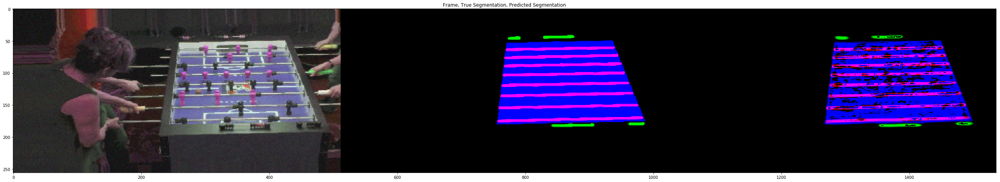


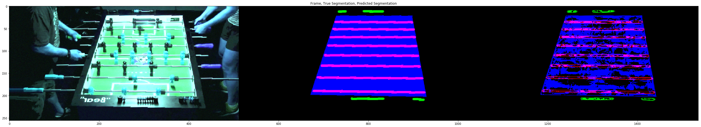


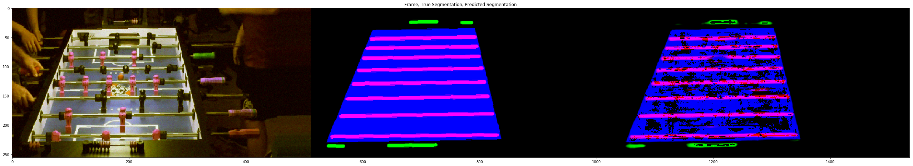


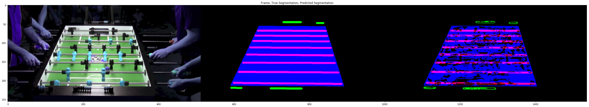


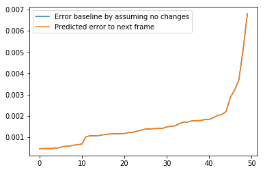


    Wrote model to .\Models\weights_267.hdf
    Epoch 268/268
    

    C:\Anaconda\envs\py35\lib\site-packages\ipykernel\__main__.py:31: UserWarning: Update your `fit_generator` call to the Keras 2 API: `fit_generator(<__main__...., 200, use_multiprocessing=False, initial_epoch=267, validation_steps=40, workers=50, validation_data=<__main__...., max_queue_size=50, verbose=1, epochs=268, class_weight=None, callbacks=None)`
    

    200/200 [==============================] - 407s - loss: 0.0016 - mean_squared_error: 0.0016 - val_loss: 0.0015 - val_mean_squared_error: 0.0015
    Wrote model to .\Models\weights_268.hdf
    Epoch 269/269
    

    C:\Anaconda\envs\py35\lib\site-packages\ipykernel\__main__.py:31: UserWarning: Update your `fit_generator` call to the Keras 2 API: `fit_generator(<__main__...., 200, use_multiprocessing=False, initial_epoch=268, validation_steps=40, workers=50, validation_data=<__main__...., max_queue_size=50, verbose=1, epochs=269, class_weight=None, callbacks=None)`
    

    200/200 [==============================] - 406s - loss: 0.0015 - mean_squared_error: 0.0015 - val_loss: 0.0021 - val_mean_squared_error: 0.0021
    Wrote model to .\Models\weights_269.hdf
    Epoch 270/270
    

    C:\Anaconda\envs\py35\lib\site-packages\ipykernel\__main__.py:31: UserWarning: Update your `fit_generator` call to the Keras 2 API: `fit_generator(<__main__...., 200, use_multiprocessing=False, initial_epoch=269, validation_steps=40, workers=50, validation_data=<__main__...., max_queue_size=50, verbose=1, epochs=270, class_weight=None, callbacks=None)`
    

    200/200 [==============================] - 407s - loss: 0.0016 - mean_squared_error: 0.0016 - val_loss: 0.0015 - val_mean_squared_error: 0.0015
    Wrote model to .\Models\weights_270.hdf
    Epoch 271/271
    

    C:\Anaconda\envs\py35\lib\site-packages\ipykernel\__main__.py:31: UserWarning: Update your `fit_generator` call to the Keras 2 API: `fit_generator(<__main__...., 200, use_multiprocessing=False, initial_epoch=270, validation_steps=40, workers=50, validation_data=<__main__...., max_queue_size=50, verbose=1, epochs=271, class_weight=None, callbacks=None)`
    

    200/200 [==============================] - 408s - loss: 0.0016 - mean_squared_error: 0.0016 - val_loss: 0.0015 - val_mean_squared_error: 0.0015
    Wrote model to .\Models\weights_271.hdf
    Epoch 272/272
    

    C:\Anaconda\envs\py35\lib\site-packages\ipykernel\__main__.py:31: UserWarning: Update your `fit_generator` call to the Keras 2 API: `fit_generator(<__main__...., 200, use_multiprocessing=False, initial_epoch=271, validation_steps=40, workers=50, validation_data=<__main__...., max_queue_size=50, verbose=1, epochs=272, class_weight=None, callbacks=None)`
    

    200/200 [==============================] - 408s - loss: 0.0016 - mean_squared_error: 0.0016 - val_loss: 0.0015 - val_mean_squared_error: 0.0015
    


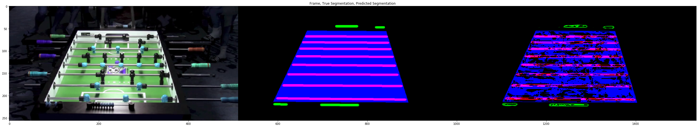


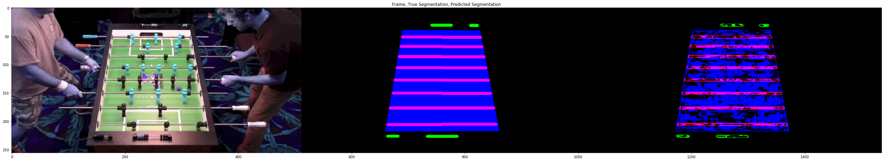


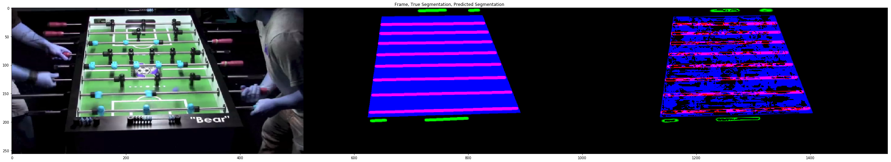


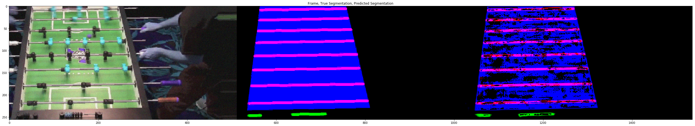


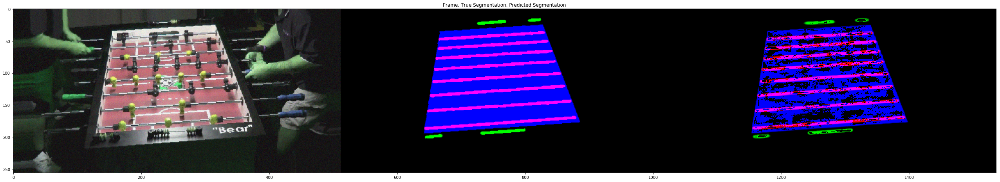


    Wrote model to .\Models\weights_272.hdf
    Epoch 273/273
    

    C:\Anaconda\envs\py35\lib\site-packages\ipykernel\__main__.py:31: UserWarning: Update your `fit_generator` call to the Keras 2 API: `fit_generator(<__main__...., 200, use_multiprocessing=False, initial_epoch=272, validation_steps=40, workers=50, validation_data=<__main__...., max_queue_size=50, verbose=1, epochs=273, class_weight=None, callbacks=None)`
    

    200/200 [==============================] - 410s - loss: 0.0016 - mean_squared_error: 0.0016 - val_loss: 0.0016 - val_mean_squared_error: 0.0016
    Wrote model to .\Models\weights_273.hdf
    Epoch 274/274
    

    C:\Anaconda\envs\py35\lib\site-packages\ipykernel\__main__.py:31: UserWarning: Update your `fit_generator` call to the Keras 2 API: `fit_generator(<__main__...., 200, use_multiprocessing=False, initial_epoch=273, validation_steps=40, workers=50, validation_data=<__main__...., max_queue_size=50, verbose=1, epochs=274, class_weight=None, callbacks=None)`
    

    200/200 [==============================] - 407s - loss: 0.0016 - mean_squared_error: 0.0016 - val_loss: 0.0018 - val_mean_squared_error: 0.0018
    Wrote model to .\Models\weights_274.hdf
    Epoch 275/275
    

    C:\Anaconda\envs\py35\lib\site-packages\ipykernel\__main__.py:31: UserWarning: Update your `fit_generator` call to the Keras 2 API: `fit_generator(<__main__...., 200, use_multiprocessing=False, initial_epoch=274, validation_steps=40, workers=50, validation_data=<__main__...., max_queue_size=50, verbose=1, epochs=275, class_weight=None, callbacks=None)`
    

    200/200 [==============================] - 407s - loss: 0.0016 - mean_squared_error: 0.0016 - val_loss: 0.0017 - val_mean_squared_error: 0.0017
    Wrote model to .\Models\weights_275.hdf
    Epoch 276/276
    

    C:\Anaconda\envs\py35\lib\site-packages\ipykernel\__main__.py:31: UserWarning: Update your `fit_generator` call to the Keras 2 API: `fit_generator(<__main__...., 200, use_multiprocessing=False, initial_epoch=275, validation_steps=40, workers=50, validation_data=<__main__...., max_queue_size=50, verbose=1, epochs=276, class_weight=None, callbacks=None)`
    

    200/200 [==============================] - 407s - loss: 0.0015 - mean_squared_error: 0.0015 - val_loss: 0.0016 - val_mean_squared_error: 0.0016
    Wrote model to .\Models\weights_276.hdf
    Epoch 277/277
    

    C:\Anaconda\envs\py35\lib\site-packages\ipykernel\__main__.py:31: UserWarning: Update your `fit_generator` call to the Keras 2 API: `fit_generator(<__main__...., 200, use_multiprocessing=False, initial_epoch=276, validation_steps=40, workers=50, validation_data=<__main__...., max_queue_size=50, verbose=1, epochs=277, class_weight=None, callbacks=None)`
    

    145/200 [====================>.........] - ETA: 84s - loss: 0.0017 - mean_squared_error: 0.0017
