```python
#!pip install keras
#!pip install numpy
#!pip install imageio
#!pip install matplotlib
#!pip install opencv-python
#!pip install pydot
#!pip install graphviz


import threading
import sys
import cv2
import sys
import os
import csv
import itertools
import numpy as np
from PIL import Image
import imageio
import itertools as it
import tensorflow as tf
import keras
print("Keras version %s" % keras.__version__)
from keras.models import Sequential
from keras.layers import Dense, Dropout
from keras import backend as K

print("Tensorflow version %s" % tf.__version__)

import pprint
pp = pprint.PrettyPrinter(depth=6)
```

    Using TensorFlow backend.
    

    Keras version 2.0.4
    Tensorflow version 1.1.0
    


```python
# Add the standard include path for FoosMetrics
sys.path.insert(0, './../../Code')

import importlib
import process
importlib.reload(process)
```


    <module 'process' from './../../Code\\process.py'>


```python
# Load the data and frames, and add the normalizer
training = process.Processor("data_loader_framediff_training.json")
validation = process.Processor("data_loader_framediff_training.json")
#validation = process.Processor("data_loader_validation.json")
#output_names = ["g1","d1","o1","f1","f2","o2","d2","g2","-2"]
```

    Creating transform: random_video_loader
    Adding folder '.\..\..\Data\Processed\FramePrediction\Training\'
    '.\..\..\Data\Processed\FramePrediction\Training\2017 National Championships 3.avi': 50000 frames found.
    '.\..\..\Data\Processed\FramePrediction\Training\2017 Tornado World Championships 1.avi': 50000 frames found.
    '.\..\..\Data\Processed\FramePrediction\Training\2018 Bart O'Hearn Celebration 1.avi': 50000 frames found.
    '.\..\..\Data\Processed\FramePrediction\Training\2018 Bart O'Hearn Celebration 2.avi': 50000 frames found.
    '.\..\..\Data\Processed\FramePrediction\Training\2018 Bart O'Hearn Celebration 3.avi': 50000 frames found.
    '.\..\..\Data\Processed\FramePrediction\Training\2018 Bart O'Hearn Celebration 4.avi': 50000 frames found.
    '.\..\..\Data\Processed\FramePrediction\Training\2018 Bart O'Hearn Celebration 5.avi': 50000 frames found.
    '.\..\..\Data\Processed\FramePrediction\Training\2018 Bart O'Hearn Celebration 6.avi': 50000 frames found.
    '.\..\..\Data\Processed\FramePrediction\Training\2018 Bart O'Hearn Celebration 7.avi': 50000 frames found.
    '.\..\..\Data\Processed\FramePrediction\Training\2018 Bart O'Hearn Celebration 8.avi': 50000 frames found.
    '.\..\..\Data\Processed\FramePrediction\Training\2018 Bart O'Hearn Celebration 9.avi': 50000 frames found.
    '.\..\..\Data\Processed\FramePrediction\Training\2018 Texas State Championships 1.avi': 50000 frames found.
    '.\..\..\Data\Processed\FramePrediction\Training\2018 Texas State Championships 10.avi': 50000 frames found.
    '.\..\..\Data\Processed\FramePrediction\Training\2018 Texas State Championships 3.avi': 50000 frames found.
    '.\..\..\Data\Processed\FramePrediction\Training\2018 Texas State Championships 4.avi': 50000 frames found.
    '.\..\..\Data\Processed\FramePrediction\Training\2018 Texas State Championships 5.avi': 50000 frames found.
    '.\..\..\Data\Processed\FramePrediction\Training\2018 Texas State Championships 6.avi': 50000 frames found.
    '.\..\..\Data\Processed\FramePrediction\Training\2018 Texas State Championships 7.avi': 50000 frames found.
    '.\..\..\Data\Processed\FramePrediction\Training\2018 Texas State Championships 8.avi': 50000 frames found.
    '.\..\..\Data\Processed\FramePrediction\Training\2018 Texas State Championships 9.avi': 50000 frames found.
    '.\..\..\Data\Processed\FramePrediction\Training\2018 TKO 1.avi': 50000 frames found.
    '.\..\..\Data\Processed\FramePrediction\Training\2018 TKO 10.avi': 50000 frames found.
    '.\..\..\Data\Processed\FramePrediction\Training\2018 TKO 12.avi': 30886 frames found.
    '.\..\..\Data\Processed\FramePrediction\Training\2018 TKO 3.avi': 50000 frames found.
    '.\..\..\Data\Processed\FramePrediction\Training\2018 TKO 6.avi': 50000 frames found.
    '.\..\..\Data\Processed\FramePrediction\Training\2018 TKO 8.avi': 50000 frames found.
    Loaded 1280834 frames in loader.
    Distribution:
    {' TKO .avi': 280886, ' Texas State Championships .avi': 450000, ' Tornado World Championships .avi': 50000, ' National Championships .avi': 50000, " Bart O'Hearn Celebration .avi": 450000}
    Creating transform: add_random_number
    Creating transform: randomize_frame
    Creating transform: randomize_frame
    Creating transform: randomize_frame
    Creating transform: normalize_channels
    Creating transform: normalize_channels
    Creating transform: normalize_channels
    Creating transform: frame_difference
    Creating transform: threshold
    Creating transform: channel_max
    Creating transform: random_video_loader
    Adding folder '.\..\..\Data\Processed\FramePrediction\Training\'
    '.\..\..\Data\Processed\FramePrediction\Training\2017 National Championships 3.avi': 50000 frames found.
    '.\..\..\Data\Processed\FramePrediction\Training\2017 Tornado World Championships 1.avi': 50000 frames found.
    '.\..\..\Data\Processed\FramePrediction\Training\2018 Bart O'Hearn Celebration 1.avi': 50000 frames found.
    '.\..\..\Data\Processed\FramePrediction\Training\2018 Bart O'Hearn Celebration 2.avi': 50000 frames found.
    '.\..\..\Data\Processed\FramePrediction\Training\2018 Bart O'Hearn Celebration 3.avi': 50000 frames found.
    '.\..\..\Data\Processed\FramePrediction\Training\2018 Bart O'Hearn Celebration 4.avi': 50000 frames found.
    '.\..\..\Data\Processed\FramePrediction\Training\2018 Bart O'Hearn Celebration 5.avi': 50000 frames found.
    '.\..\..\Data\Processed\FramePrediction\Training\2018 Bart O'Hearn Celebration 6.avi': 50000 frames found.
    '.\..\..\Data\Processed\FramePrediction\Training\2018 Bart O'Hearn Celebration 7.avi': 50000 frames found.
    '.\..\..\Data\Processed\FramePrediction\Training\2018 Bart O'Hearn Celebration 8.avi': 50000 frames found.
    '.\..\..\Data\Processed\FramePrediction\Training\2018 Bart O'Hearn Celebration 9.avi': 50000 frames found.
    '.\..\..\Data\Processed\FramePrediction\Training\2018 Texas State Championships 1.avi': 50000 frames found.
    '.\..\..\Data\Processed\FramePrediction\Training\2018 Texas State Championships 10.avi': 50000 frames found.
    '.\..\..\Data\Processed\FramePrediction\Training\2018 Texas State Championships 3.avi': 50000 frames found.
    '.\..\..\Data\Processed\FramePrediction\Training\2018 Texas State Championships 4.avi': 50000 frames found.
    '.\..\..\Data\Processed\FramePrediction\Training\2018 Texas State Championships 5.avi': 50000 frames found.
    '.\..\..\Data\Processed\FramePrediction\Training\2018 Texas State Championships 6.avi': 50000 frames found.
    '.\..\..\Data\Processed\FramePrediction\Training\2018 Texas State Championships 7.avi': 50000 frames found.
    '.\..\..\Data\Processed\FramePrediction\Training\2018 Texas State Championships 8.avi': 50000 frames found.
    '.\..\..\Data\Processed\FramePrediction\Training\2018 Texas State Championships 9.avi': 50000 frames found.
    '.\..\..\Data\Processed\FramePrediction\Training\2018 TKO 1.avi': 50000 frames found.
    '.\..\..\Data\Processed\FramePrediction\Training\2018 TKO 10.avi': 50000 frames found.
    '.\..\..\Data\Processed\FramePrediction\Training\2018 TKO 12.avi': 30886 frames found.
    '.\..\..\Data\Processed\FramePrediction\Training\2018 TKO 3.avi': 50000 frames found.
    '.\..\..\Data\Processed\FramePrediction\Training\2018 TKO 6.avi': 50000 frames found.
    '.\..\..\Data\Processed\FramePrediction\Training\2018 TKO 8.avi': 50000 frames found.
    Loaded 1280834 frames in loader.
    Distribution:
    {' TKO .avi': 280886, ' Texas State Championships .avi': 450000, ' Tornado World Championships .avi': 50000, ' National Championships .avi': 50000, " Bart O'Hearn Celebration .avi": 450000}
    Creating transform: add_random_number
    Creating transform: randomize_frame
    Creating transform: randomize_frame
    Creating transform: randomize_frame
    Creating transform: normalize_channels
    Creating transform: normalize_channels
    Creating transform: normalize_channels
    Creating transform: frame_difference
    Creating transform: threshold
    Creating transform: channel_max
    


```python
import matplotlib
import matplotlib.image as mpimg
import matplotlib.pyplot as plt
%matplotlib inline

# View the first few frames
for k in range(20):
    data = training.get_next_frame()
    print(data["frame0"].shape)
    frames = np.concatenate((data["frame0"],data["frame1"],data["frame2"]),1)
    print(frames.shape)
    fig, ax = plt.subplots(figsize=(18, 2))
    plt.imshow(frames)
    plt.show()
```

    (134, 240, 3)
    (134, 720, 3)
    


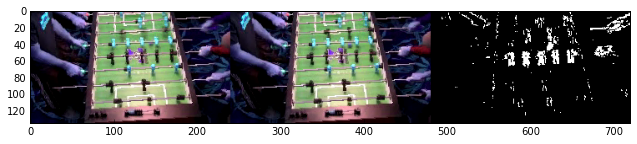


    (134, 240, 3)
    (134, 720, 3)
    


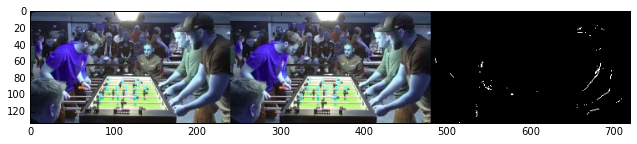


    (134, 240, 3)
    (134, 720, 3)
    


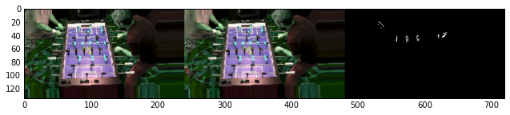


    (134, 240, 3)
    (134, 720, 3)
    


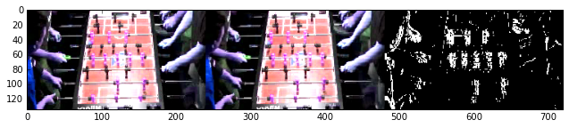


    (134, 240, 3)
    (134, 720, 3)
    


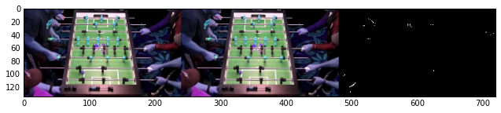


    (134, 240, 3)
    (134, 720, 3)
    


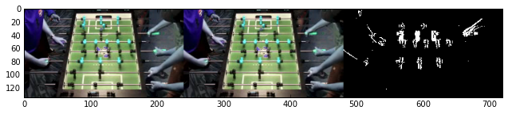


    (134, 240, 3)
    (134, 720, 3)
    


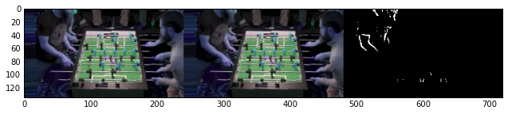


    (134, 240, 3)
    (134, 720, 3)
    


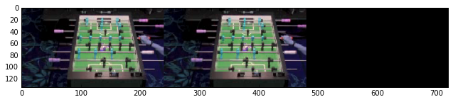


    (134, 240, 3)
    (134, 720, 3)
    


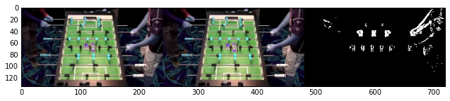


    (134, 240, 3)
    (134, 720, 3)
    


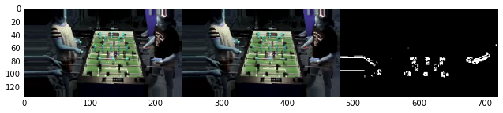


    (134, 240, 3)
    (134, 720, 3)
    


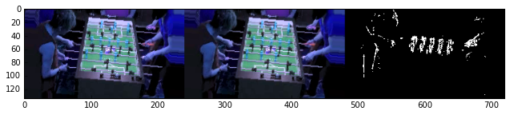


    (134, 240, 3)
    (134, 720, 3)
    


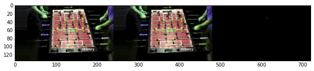


    (134, 240, 3)
    (134, 720, 3)
    


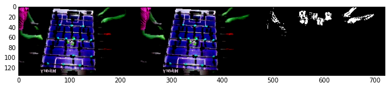


    (134, 240, 3)
    (134, 720, 3)
    


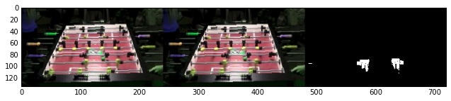


    (134, 240, 3)
    (134, 720, 3)
    


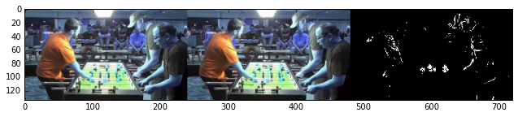


    (134, 240, 3)
    (134, 720, 3)
    


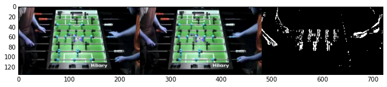


    (134, 240, 3)
    (134, 720, 3)
    


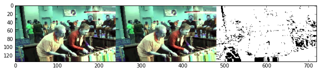


    (134, 240, 3)
    (134, 720, 3)
    


    (134, 240, 3)
    (134, 720, 3)
    


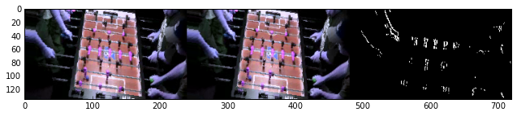


    (134, 240, 3)
    (134, 720, 3)
    


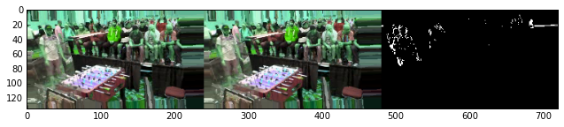


```python
# https://stanford.edu/~shervine/blog/keras-generator-multiprocessing.html
class threadsafe_iter(object):
  """
    Takes an iterator/generator and makes it thread-safe by
    serializing call to the `next` method of given iterator/generator.
    """
  def __init__(self, it):
      self.it = it
      self.lock = threading.Lock()

  def __iter__(self):
      return self

  def __next__(self):
      with self.lock:
          return self.it.__next__()

# https://stanford.edu/~shervine/blog/keras-generator-multiprocessing.html
def threadsafe_generator(f):
  """
    A decorator that takes a generator function and makes it thread-safe.
    """
  def g(*a, **kw):
      return threadsafe_iter(f(*a, **kw))
  return g


# Define our training and validation iterators
@threadsafe_generator
def TrainGen(training):
    while True:
        data = training.get_next_frame()
        if data is not None:
            frame0 = data["frame0"]
            frame1 = data["frame1"]
            frame2 = data["frame2"]
            
            while frame0 is not None:
                yield (frame0, frame1, frame2)
                data = training.get_next_frame()
                if data is not None:
                    frame0 = data["frame0"]
                    frame1 = data["frame1"]
                    frame2 = data["frame2"]
                else:
                    frame0 = None
                    frame1 = None
                    frame2 = None
                
             
# Generators for training the position
@threadsafe_generator
def TrainBatchGen(batch_size, training):
    gen = TrainGen(training)
    while True:
        # Build the next batch
        batch_frame0s = np.zeros(shape=(batch_size, 134, 240, 3), dtype=np.float32)
        batch_frame1s = np.zeros(shape=(batch_size, 134, 240, 3), dtype=np.float32)
        # (None, 128, 224, 3)
        # ((top_crop, bottom_crop), (left_crop, right_crop))
        # Crop 6 from top, crop 16 from left
        batch_frame2s = np.zeros(shape=(batch_size, 128, 224, 3), dtype=np.float32)
        for i in range(batch_size):
            (frame0, frame1, frame2) = next(gen)
            batch_frame0s[i,:,:,:] = frame0
            batch_frame1s[i,:,:,:] = frame1
            batch_frame2s[i,:,:,:] = frame2[6:,16:]
            
        
        #pp.pprint("Yielding batch")
        #pp.pprint(batch_outputs)
        yield ([batch_frame0s, batch_frame1s], batch_frame2s)
        #pp.pprint("Yielded batch")

                
             
# Generators for training the position
@threadsafe_generator
def ValidationBatchGen(batch_size, validation):
    gen = TrainGen(validation)
    while True:
        # Build the next batch
        batch_frame0s = np.zeros(shape=(batch_size, 134, 240, 3), dtype=np.float32)
        batch_frame1s = np.zeros(shape=(batch_size, 134, 240, 3), dtype=np.float32)
        batch_frame2s = np.zeros(shape=(batch_size, 128, 224, 3), dtype=np.float32)
        for i in range(batch_size):
            (frame0, frame1, frame2) = next(gen)
            batch_frame0s[i,:,:,:] = frame0
            batch_frame1s[i,:,:,:] = frame1
            batch_frame2s[i,:,:,:] = frame2[6:,16:]
            
        
        #pp.pprint("Yielding batch")
        #pp.pprint(batch_outputs)
        yield ([batch_frame0s, batch_frame1s], batch_frame2s)
        #pp.pprint("Yielded batch")
        
    
    
        
    

```


```python
from keras.losses import mean_squared_error

# Utilities for plotting the result and training
def plot_validate(generator, model, count, name):   
    errors_true = []
    errors_prediction = []
    
    
    while len(errors_true) < count:
        
        (frames, outputs_true) = next(generator)
        outputs_predicted = model.predict(frames, batch_size=frames[0].shape[0], verbose=0)
        
        for i in range(outputs_predicted.shape[0]):
            if len(errors_true) < 5:
                # View the first set
                inputs = np.concatenate((frames[0][i,6:,16:],frames[1][i,6:,16:]),1)
                fig, ax = plt.subplots(figsize=(45, 8))
                h = plt.imshow(inputs)
                plt.title( 'Frame0,Frame1' )
                plt.show()

                results = np.concatenate((outputs_true[i],outputs_predicted[i]),1)
                fig, ax = plt.subplots(figsize=(45, 8))
                h = plt.imshow(results)
                plt.title( 'True,Predicted' )
                plt.show()
            
            # Calculate the actual difference and predicted image difference
            zero_frame = np.zeros_like(frames[1][i,6:,16:])
            mse_true = ((outputs_true[i] - zero_frame) ** 2).mean()
            mse_predicted = ((outputs_true[i] - outputs_predicted[i]) ** 2).mean()
            #mse_true = K.eval(K.mean(mean_squared_error(outputs_true[i], frames[1][i,6:,16:])))
            #mse_predicted = K.eval(K.mean(mean_squared_error(outputs_true[i], outputs_predicted[i])))
            errors_true.append(mse_true)
            errors_prediction.append(mse_predicted)
    
    
    true, predicted = zip(*sorted(zip(errors_true, errors_prediction)))
    l1, = plt.plot(range(len(errors_true)), true, label="Error baseline by assuming no changes")
    l2, = plt.plot(range(len(errors_true)), predicted, label="Predicted error to next frame")
    plt.legend(handles=[l1, l2])
    plt.show()

#plot_validate(ValidationBatchGen(batch_size, validation), frame_prediction_model, 5, "Epoch validation results %i" % epoch)


```


```python
from keras.models import Sequential
from keras.layers import *
from keras.models import Model
from keras.utils import plot_model

import gc
K.clear_session()
gc.collect()


image_height       = 134
image_width        = 240
image_channels     = 3

# Model options
batch_size = 10
lstm_output_size = 300
cnn_kernel_count = 40

# Build an hourglass model. Notes on the model structure:
# Two camera frames as input.
# frame0 -> Conv and pooling until embedding (shared convoluations to both frame0 and frame1)
# frame1 -> Conv and pooling until embedding
# Conv both paths together
# Residual upsampling of frame1 until original size
# Pixel-wise error to frame2 as loss

pp.pprint("Input shape without batches:")
pp.pprint((image_height, image_width, image_channels))

# Used to give fixed names to the layers for transferring the model
conv_num = 0 
pool_num = 0
dense_num = 0


# Create the embedding module, the same model runs both frames
frame_in = Input(shape=(image_height, image_width, image_channels,))
x = Conv2D(cnn_kernel_count, (3, 3),
           padding = "same",
           activation = "relu",)(frame_in)
x = Conv2D(cnn_kernel_count, (3, 3),
           padding = "same",
           activation = "relu",)(x)
res0 = x

x = MaxPooling2D((1, 2))(x)

x = Conv2D(cnn_kernel_count, (3, 3),
           padding = "same",
           activation = "relu",)(x)
x = Conv2D(cnn_kernel_count, (3, 3),
           padding = "same",
           activation = "relu",)(x)
res1 = x

x = MaxPooling2D((2, 2))(x)


x = Conv2D(cnn_kernel_count, (3, 3),
           padding = "same",
           activation = "relu",)(x)
x = Conv2D(cnn_kernel_count, (3, 3),
           padding = "same",
           activation = "relu",)(x)
res2 = x
x = MaxPooling2D((2, 2))(x)


x = Conv2D(cnn_kernel_count, (3, 3),
           padding = "same",
           activation = "relu",)(x)
x = Conv2D(cnn_kernel_count, (3, 3),
           padding = "same",
           activation = "relu",)(x)
res3 = x
x = MaxPooling2D((2, 2))(x)


x = Conv2D(cnn_kernel_count, (3, 3),
           padding = "same",
           activation = "relu",)(x)
x = Conv2D(cnn_kernel_count, (3, 3),
           padding = "same",
           activation = "relu",)(x)
res4 = x
embedding = MaxPooling2D((2, 2))(x)


foosball_embedding = Model(frame_in, [embedding, res0, res1, res2, res3, res4])
foosball_embedding.summary()

from IPython.display import SVG, display
from keras.utils.vis_utils import model_to_dot
display(SVG(model_to_dot(foosball_embedding).create(prog='dot', format='svg')))

# Create the frame embeddings
frame0 = Input(shape=(image_height, image_width, image_channels,),
              name="frame0")
frame1 = Input(shape=(image_height, image_width, image_channels,),
              name="frame1")
[embedding_a, res0_a, res1_a, res2_a, res3_a, res4_a] = foosball_embedding(frame0)
[embedding_b, res0_b, res1_b, res2_b, res3_b, res4_b] = foosball_embedding(frame1)
concatenated = keras.layers.concatenate([embedding_a, embedding_b])
x = Conv2D(cnn_kernel_count, (3, 3),
           padding = "same",
           activation = "relu",)(concatenated)
x = Conv2D(cnn_kernel_count, (3, 3),
           padding = "same",
           activation = "relu",)(x)

# Create the upsampling stages, feeding residual from frame1
x = UpSampling2D(size=(2, 2), data_format=None)(x)
# [(None, 16, 14, 40), (None, 16, 15, 40)]
res4_b = Cropping2D(cropping=(((0, 0), (1, 0))), data_format=None)(res4_b)
x = keras.layers.concatenate([x, res4_b])
x = Conv2D(cnn_kernel_count, (3, 3),
           padding = "same",
           activation = "relu",)(x)
x = Conv2D(cnn_kernel_count, (3, 3),
           padding = "same",
           activation = "relu",)(x)

x = UpSampling2D(size=(2, 2), data_format=None)(x)
# [(None, 32, 28, 40), (None, 32, 30, 40)]
res3_b = Cropping2D(cropping=(((1, 0), (2, 0))), data_format=None)(res3_b)
x = keras.layers.concatenate([x, res3_b])
x = Conv2D(cnn_kernel_count, (3, 3),
           padding = "same",
           activation = "relu",)(x)
x = Conv2D(cnn_kernel_count, (3, 3),
           padding = "same",
           activation = "relu",)(x)

x = UpSampling2D(size=(2, 2), data_format=None)(x)
# (None, 64, 60, 40), (None, 67, 60, 40)
res2_b = Cropping2D(cropping=(((3, 0), (4, 0))), data_format=None)(res2_b)
x = keras.layers.concatenate([x, res2_b])
x = Conv2D(cnn_kernel_count, (3, 3),
           padding = "same",
           activation = "relu",)(x)
x = Conv2D(cnn_kernel_count, (3, 3),
           padding = "same",
           activation = "relu",)(x)

x = UpSampling2D(size=(2, 2))(x)
# [(None, 128, 120, 40), (None, 134, 120, 40)]
res1_b = Cropping2D(cropping=(((6, 0), (8, 0))), data_format=None)(res1_b)
x = keras.layers.concatenate([x, res1_b])
x = Conv2D(cnn_kernel_count, (3, 3),
           padding = "same",
           activation = "relu",)(x)
x = Conv2D(cnn_kernel_count, (3, 3),
           padding = "same",
           activation = "relu",)(x)


x = UpSampling2D(size=(1, 2))(x)
# 
res0_b = Cropping2D(cropping=(((6, 0), (16, 0))), data_format=None)(res0_b)
x = keras.layers.concatenate([x, res0_b])
x = Conv2D(cnn_kernel_count, (3, 3),
           padding = "same",
           activation = "relu",)(x)
x = Conv2D(cnn_kernel_count, (3, 3),
           padding = "same",
           activation = "relu",)(x)


# RGB output as three channels
x = Conv2D(3, (1, 1),
           padding = "same",
           activation = "relu",)(x)

frame_prediction_model = Model([frame0, frame1], [x])

# For a multi-class classification problem
frame_prediction_model.compile(optimizer=keras.optimizers.RMSprop(lr=0.00002),
#model.compile(optimizer=keras.optimizers.adam(),
              loss='categorical_crossentropy',
              metrics=['categorical_accuracy'])


frame_prediction_model.summary()

#plot_model(frame_prediction_model, to_file='model.png')
from IPython.display import SVG, display
from keras.utils.vis_utils import model_to_dot
display(SVG(model_to_dot(frame_prediction_model).create(prog='dot', format='svg')))

# Train the model to predict the future position. This is the control signal to the robot AI
WEIGHTS_FNAME = '.\\Goalie3Frames\\weights_%i.hdf'
MODELS_FNAME = '.\\Goalie3Frames\\models_%i.h5'
```

    'Input shape without batches:'
    (134, 240, 3)
    _________________________________________________________________
    Layer (type)                 Output Shape              Param #   
    =================================================================
    input_1 (InputLayer)         (None, 134, 240, 3)       0         
    _________________________________________________________________
    conv2d_1 (Conv2D)            (None, 134, 240, 40)      1120      
    _________________________________________________________________
    conv2d_2 (Conv2D)            (None, 134, 240, 40)      14440     
    _________________________________________________________________
    max_pooling2d_1 (MaxPooling2 (None, 134, 120, 40)      0         
    _________________________________________________________________
    conv2d_3 (Conv2D)            (None, 134, 120, 40)      14440     
    _________________________________________________________________
    conv2d_4 (Conv2D)            (None, 134, 120, 40)      14440     
    _________________________________________________________________
    max_pooling2d_2 (MaxPooling2 (None, 67, 60, 40)        0         
    _________________________________________________________________
    conv2d_5 (Conv2D)            (None, 67, 60, 40)        14440     
    _________________________________________________________________
    conv2d_6 (Conv2D)            (None, 67, 60, 40)        14440     
    _________________________________________________________________
    max_pooling2d_3 (MaxPooling2 (None, 33, 30, 40)        0         
    _________________________________________________________________
    conv2d_7 (Conv2D)            (None, 33, 30, 40)        14440     
    _________________________________________________________________
    conv2d_8 (Conv2D)            (None, 33, 30, 40)        14440     
    _________________________________________________________________
    max_pooling2d_4 (MaxPooling2 (None, 16, 15, 40)        0         
    _________________________________________________________________
    conv2d_9 (Conv2D)            (None, 16, 15, 40)        14440     
    _________________________________________________________________
    conv2d_10 (Conv2D)           (None, 16, 15, 40)        14440     
    _________________________________________________________________
    max_pooling2d_5 (MaxPooling2 (None, 8, 7, 40)          0         
    =================================================================
    Total params: 131,080
    Trainable params: 131,080
    Non-trainable params: 0
    _________________________________________________________________
    


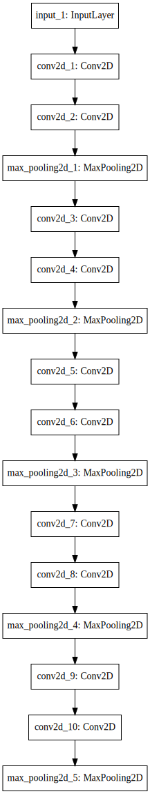


    ____________________________________________________________________________________________________
    Layer (type)                     Output Shape          Param #     Connected to                     
    ====================================================================================================
    frame0 (InputLayer)              (None, 134, 240, 3)   0                                            
    ____________________________________________________________________________________________________
    frame1 (InputLayer)              (None, 134, 240, 3)   0                                            
    ____________________________________________________________________________________________________
    model_1 (Model)                  [(None, 8, 7, 40), (N 131080      frame0[0][0]                     
                                                                       frame1[0][0]                     
    ____________________________________________________________________________________________________
    concatenate_1 (Concatenate)      (None, 8, 7, 80)      0           model_1[1][0]                    
                                                                       model_1[2][0]                    
    ____________________________________________________________________________________________________
    conv2d_11 (Conv2D)               (None, 8, 7, 40)      28840       concatenate_1[0][0]              
    ____________________________________________________________________________________________________
    conv2d_12 (Conv2D)               (None, 8, 7, 40)      14440       conv2d_11[0][0]                  
    ____________________________________________________________________________________________________
    up_sampling2d_1 (UpSampling2D)   (None, 16, 14, 40)    0           conv2d_12[0][0]                  
    ____________________________________________________________________________________________________
    cropping2d_1 (Cropping2D)        (None, 16, 14, 40)    0           model_1[2][5]                    
    ____________________________________________________________________________________________________
    concatenate_2 (Concatenate)      (None, 16, 14, 80)    0           up_sampling2d_1[0][0]            
                                                                       cropping2d_1[0][0]               
    ____________________________________________________________________________________________________
    conv2d_13 (Conv2D)               (None, 16, 14, 40)    28840       concatenate_2[0][0]              
    ____________________________________________________________________________________________________
    conv2d_14 (Conv2D)               (None, 16, 14, 40)    14440       conv2d_13[0][0]                  
    ____________________________________________________________________________________________________
    up_sampling2d_2 (UpSampling2D)   (None, 32, 28, 40)    0           conv2d_14[0][0]                  
    ____________________________________________________________________________________________________
    cropping2d_2 (Cropping2D)        (None, 32, 28, 40)    0           model_1[2][4]                    
    ____________________________________________________________________________________________________
    concatenate_3 (Concatenate)      (None, 32, 28, 80)    0           up_sampling2d_2[0][0]            
                                                                       cropping2d_2[0][0]               
    ____________________________________________________________________________________________________
    conv2d_15 (Conv2D)               (None, 32, 28, 40)    28840       concatenate_3[0][0]              
    ____________________________________________________________________________________________________
    conv2d_16 (Conv2D)               (None, 32, 28, 40)    14440       conv2d_15[0][0]                  
    ____________________________________________________________________________________________________
    up_sampling2d_3 (UpSampling2D)   (None, 64, 56, 40)    0           conv2d_16[0][0]                  
    ____________________________________________________________________________________________________
    cropping2d_3 (Cropping2D)        (None, 64, 56, 40)    0           model_1[2][3]                    
    ____________________________________________________________________________________________________
    concatenate_4 (Concatenate)      (None, 64, 56, 80)    0           up_sampling2d_3[0][0]            
                                                                       cropping2d_3[0][0]               
    ____________________________________________________________________________________________________
    conv2d_17 (Conv2D)               (None, 64, 56, 40)    28840       concatenate_4[0][0]              
    ____________________________________________________________________________________________________
    conv2d_18 (Conv2D)               (None, 64, 56, 40)    14440       conv2d_17[0][0]                  
    ____________________________________________________________________________________________________
    up_sampling2d_4 (UpSampling2D)   (None, 128, 112, 40)  0           conv2d_18[0][0]                  
    ____________________________________________________________________________________________________
    cropping2d_4 (Cropping2D)        (None, 128, 112, 40)  0           model_1[2][2]                    
    ____________________________________________________________________________________________________
    concatenate_5 (Concatenate)      (None, 128, 112, 80)  0           up_sampling2d_4[0][0]            
                                                                       cropping2d_4[0][0]               
    ____________________________________________________________________________________________________
    conv2d_19 (Conv2D)               (None, 128, 112, 40)  28840       concatenate_5[0][0]              
    ____________________________________________________________________________________________________
    conv2d_20 (Conv2D)               (None, 128, 112, 40)  14440       conv2d_19[0][0]                  
    ____________________________________________________________________________________________________
    up_sampling2d_5 (UpSampling2D)   (None, 128, 224, 40)  0           conv2d_20[0][0]                  
    ____________________________________________________________________________________________________
    cropping2d_5 (Cropping2D)        (None, 128, 224, 40)  0           model_1[2][1]                    
    ____________________________________________________________________________________________________
    concatenate_6 (Concatenate)      (None, 128, 224, 80)  0           up_sampling2d_5[0][0]            
                                                                       cropping2d_5[0][0]               
    ____________________________________________________________________________________________________
    conv2d_21 (Conv2D)               (None, 128, 224, 40)  28840       concatenate_6[0][0]              
    ____________________________________________________________________________________________________
    conv2d_22 (Conv2D)               (None, 128, 224, 40)  14440       conv2d_21[0][0]                  
    ____________________________________________________________________________________________________
    conv2d_23 (Conv2D)               (None, 128, 224, 3)   123         conv2d_22[0][0]                  
    ====================================================================================================
    Total params: 390,883
    Trainable params: 390,883
    Non-trainable params: 0
    ____________________________________________________________________________________________________
    


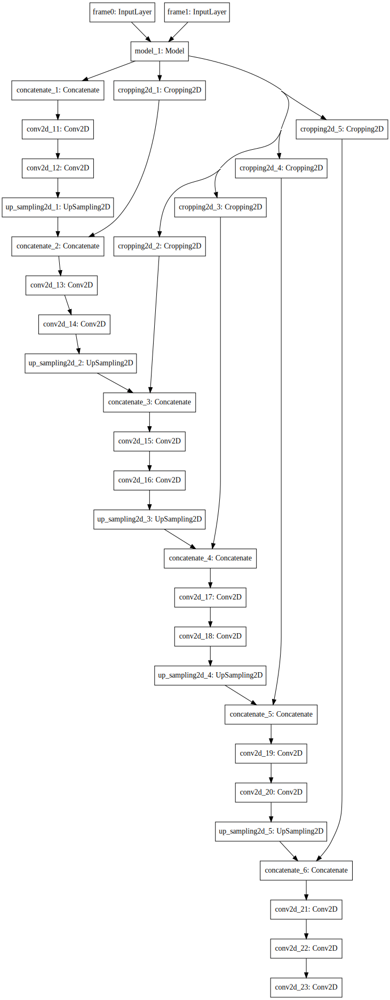


```python
# For a multi-class classification problem
frame_prediction_model.compile(optimizer=keras.optimizers.RMSprop(lr=0.00005),
#model.compile(optimizer=keras.optimizers.adam(),
              loss='mean_squared_error',
              metrics=['mean_squared_error'])

# Was ran on the above simple model, not pre-trained Inceptionv3 run.
epoch = 0
#batches_validation_per_epoch = 50
#batches_training_per_epoch = 400
batch_size = 10
batches_training_per_epoch = 500
batches_validation_per_epoch = 50
print("Batch size %i: %i training batches, %i validation batches" % (batch_size, batches_training_per_epoch, batches_validation_per_epoch) )
WEIGHTS_FNAME = '.\\Models\\weights_%i.hdf'
MODELS_FNAME = '.\\Models\\models_%i.h5'

for i in range(50):
    frame_prediction_model.fit_generator(
        TrainBatchGen(batch_size, training=training),
        batches_training_per_epoch,
        epochs=epoch+1,
        verbose=1,
        callbacks=None,
        class_weight=None,
        max_q_size=50,
        workers=50,
        validation_data=ValidationBatchGen(batch_size, validation),
        validation_steps = batches_validation_per_epoch,
        pickle_safe=False,
        initial_epoch=epoch)
    
    epoch += 1
    
    # Plot occasional validation data plot
    if i % 5 == 0:
        plot_validate(ValidationBatchGen(batch_size, validation), frame_prediction_model, 500, "Epoch validation results %i" % epoch)
    
    # Save the model
    frame_prediction_model.save_weights(WEIGHTS_FNAME % epoch)
    frame_prediction_model.save(MODELS_FNAME % epoch)
    print(("Wrote model to " + WEIGHTS_FNAME )  % epoch)


```

    Batch size 10: 500 training batches, 50 validation batches
    Epoch 1/1
    500/500 [==============================] - 340s - loss: 0.0324 - mean_squared_error: 0.0324 - val_loss: 0.0998 - val_mean_squared_error: 0.0998
    


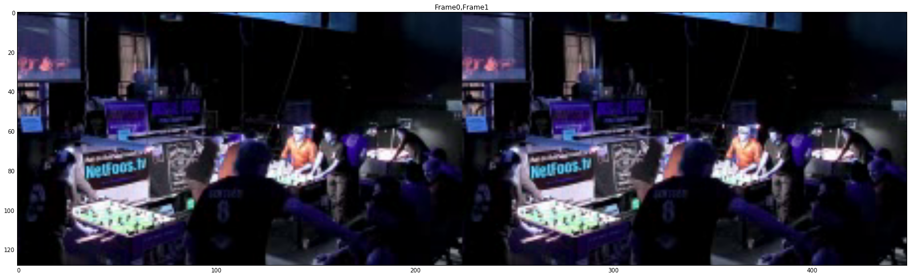


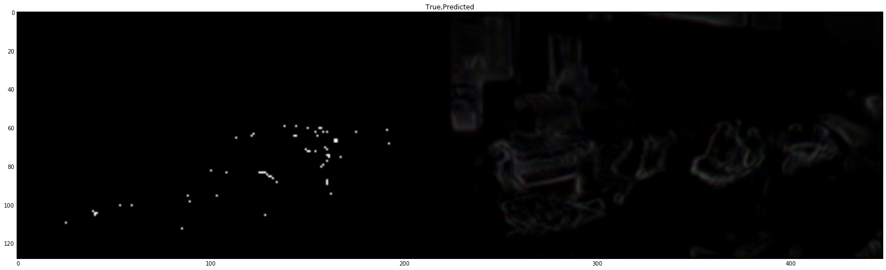


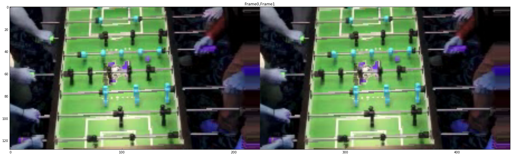


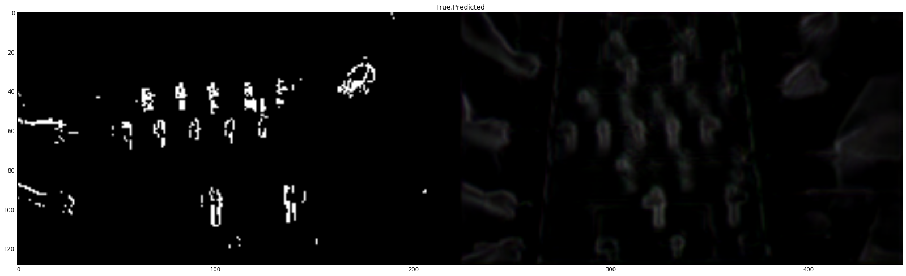


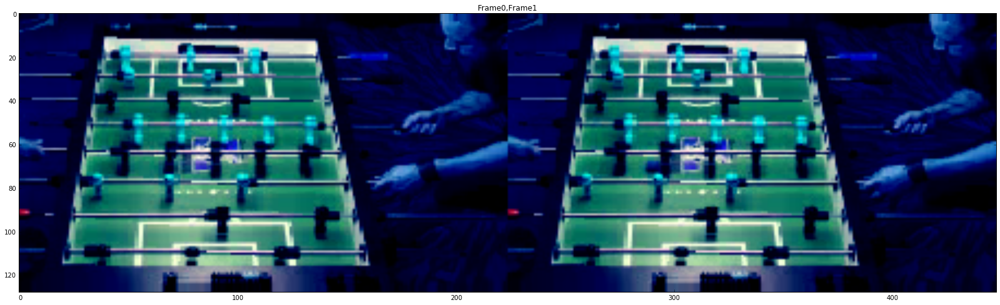


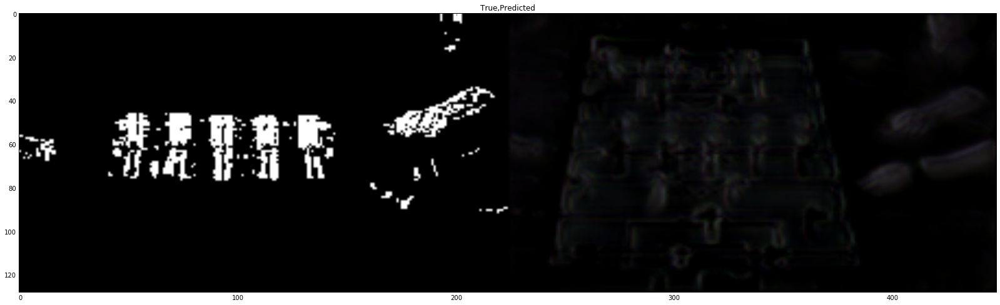


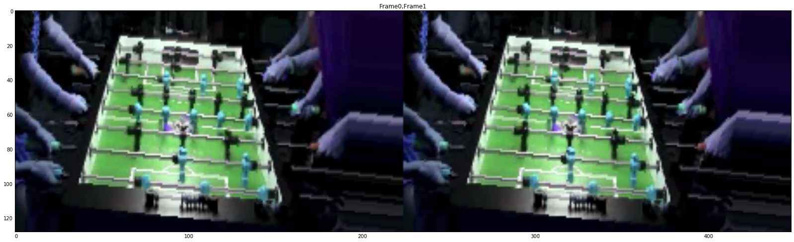


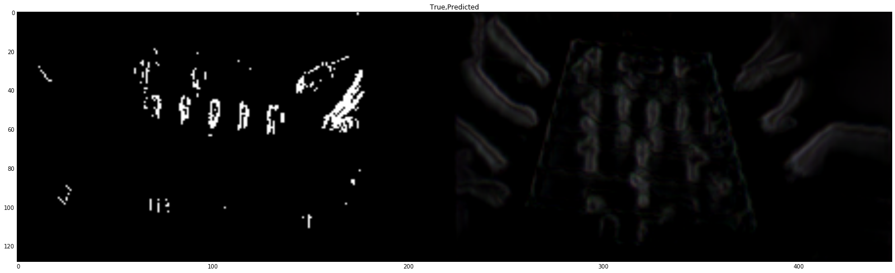


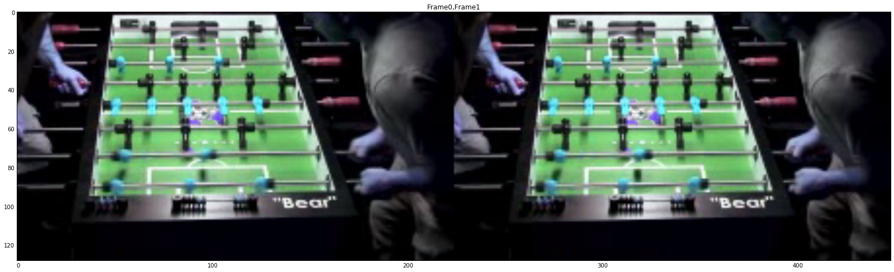


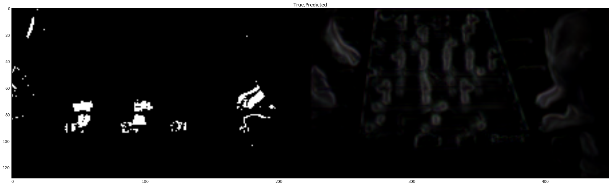


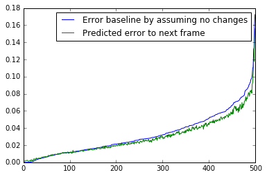


    Wrote model to .\Models\weights_1.hdf
    Epoch 2/2
    500/500 [==============================] - 319s - loss: 0.0305 - mean_squared_error: 0.0305 - val_loss: 0.1030 - val_mean_squared_error: 0.1030
    Wrote model to .\Models\weights_2.hdf
    Epoch 3/3
    500/500 [==============================] - 306s - loss: 0.0307 - mean_squared_error: 0.0307 - val_loss: 0.1053 - val_mean_squared_error: 0.1053
    Wrote model to .\Models\weights_3.hdf
    Epoch 4/4
    500/500 [==============================] - 297s - loss: 0.0304 - mean_squared_error: 0.0304 - val_loss: 0.0926 - val_mean_squared_error: 0.0926
    Wrote model to .\Models\weights_4.hdf
    Epoch 5/5
    500/500 [==============================] - 294s - loss: 0.0308 - mean_squared_error: 0.0308 - val_loss: 0.1037 - val_mean_squared_error: 0.1037
    Wrote model to .\Models\weights_5.hdf
    Epoch 6/6
    500/500 [==============================] - 289s - loss: 0.0291 - mean_squared_error: 0.0291 - val_loss: 0.0864 - val_mean_squared_error: 0.0864
    


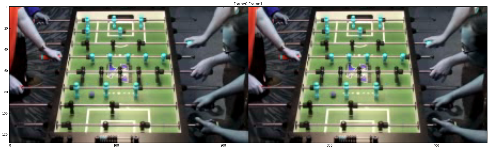


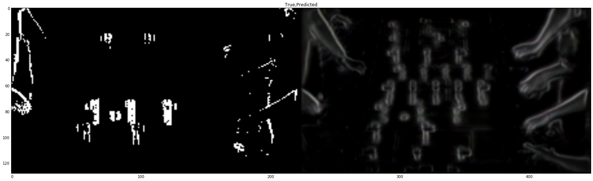


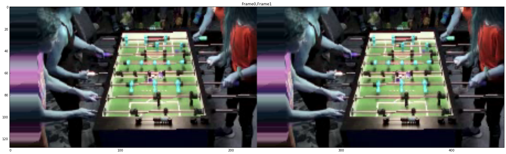


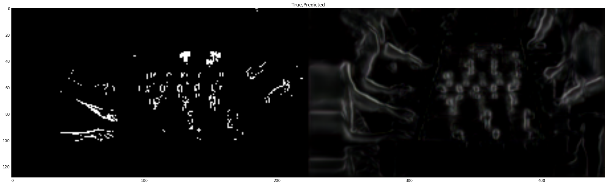


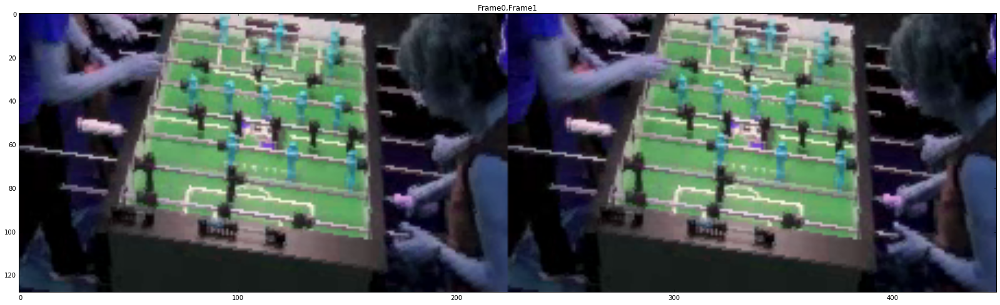


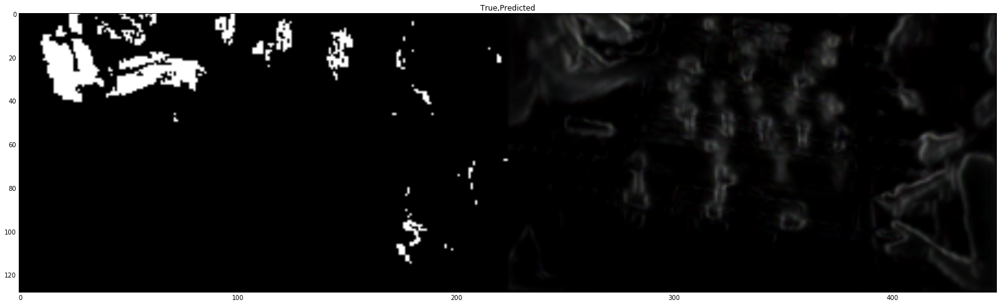


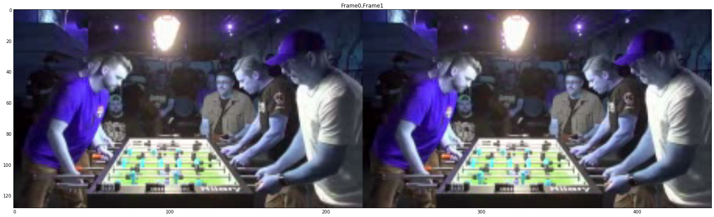


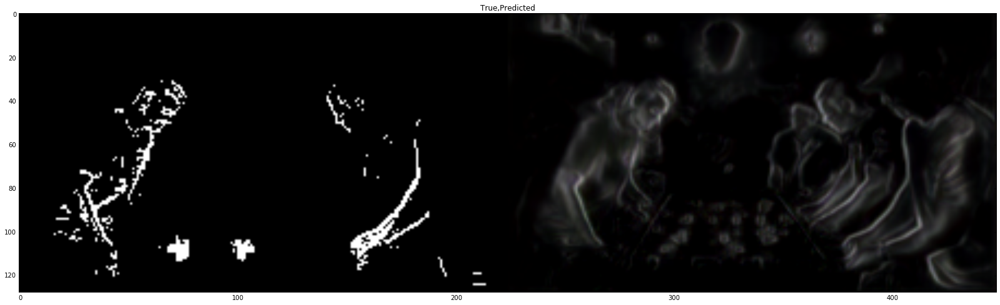


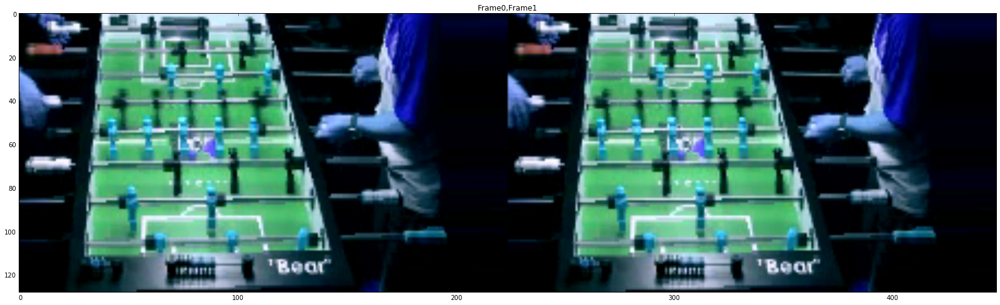


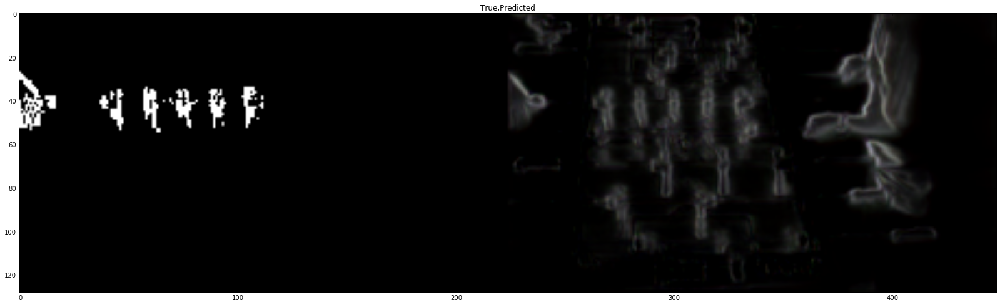


    Wrote model to .\Models\weights_6.hdf
    Epoch 7/7
    500/500 [==============================] - 289s - loss: 0.0298 - mean_squared_error: 0.0298 - val_loss: 0.1058 - val_mean_squared_error: 0.1058
    Wrote model to .\Models\weights_7.hdf
    Epoch 8/8
    500/500 [==============================] - 289s - loss: 0.0299 - mean_squared_error: 0.0299 - val_loss: 0.0838 - val_mean_squared_error: 0.0838
    Wrote model to .\Models\weights_8.hdf
    Epoch 9/9
    500/500 [==============================] - 289s - loss: 0.0291 - mean_squared_error: 0.0291 - val_loss: 0.0854 - val_mean_squared_error: 0.0854
    Wrote model to .\Models\weights_9.hdf
    Epoch 10/10
    500/500 [==============================] - 288s - loss: 0.0292 - mean_squared_error: 0.0292 - val_loss: 0.1028 - val_mean_squared_error: 0.1028
    Wrote model to .\Models\weights_10.hdf
    Epoch 11/11
    500/500 [==============================] - 287s - loss: 0.0282 - mean_squared_error: 0.0282 - val_loss: 0.0787 - val_mean_squared_error: 0.0787
    


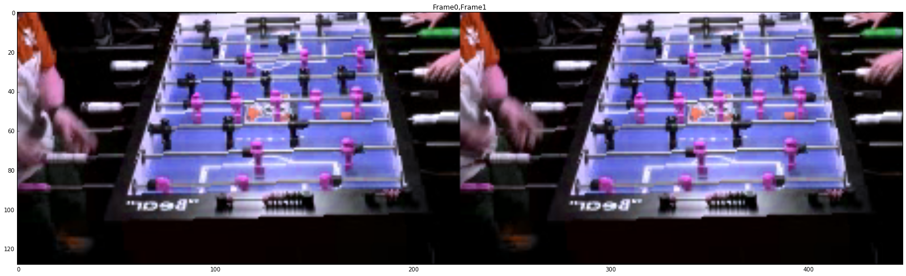


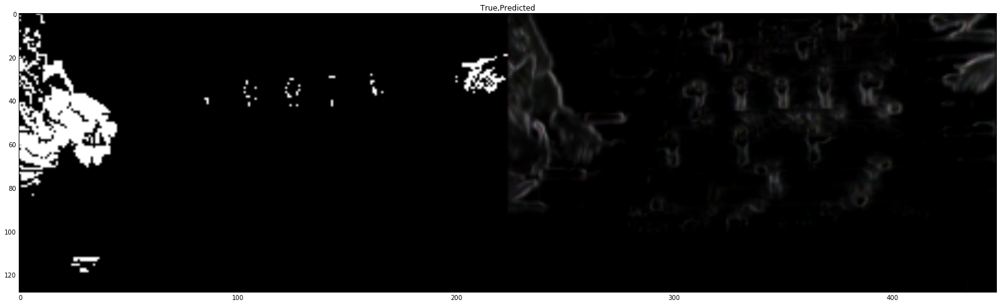


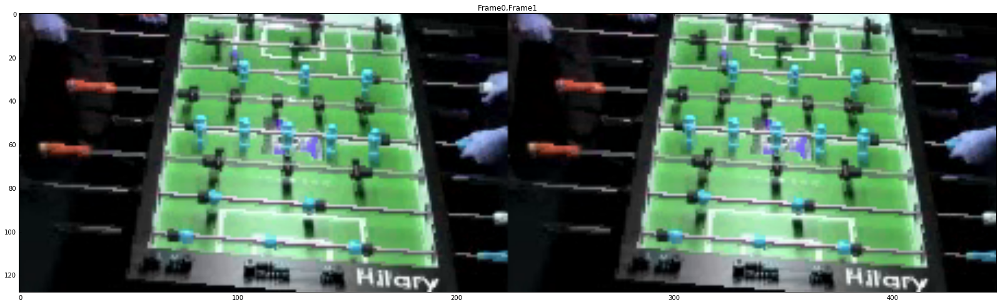


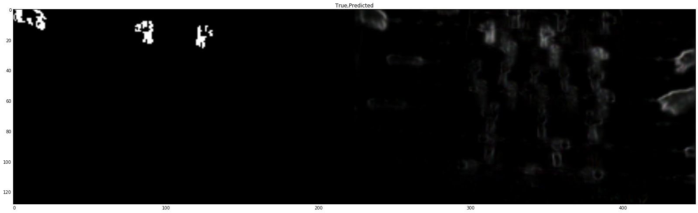


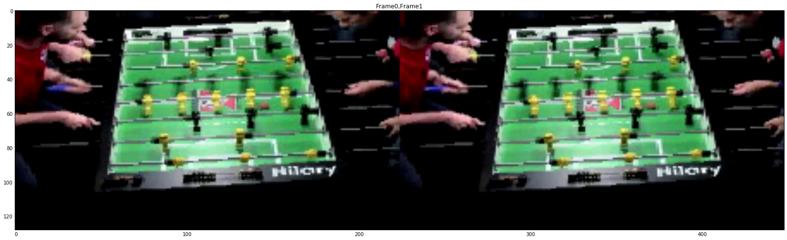


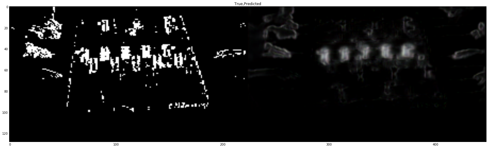


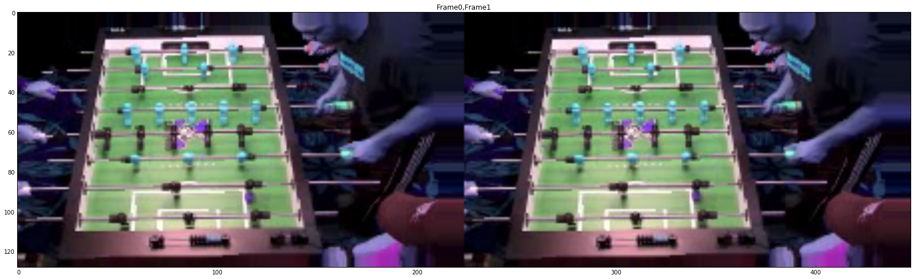


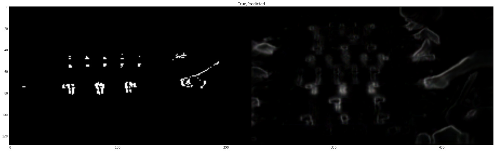


    Wrote model to .\Models\weights_11.hdf
    Epoch 12/12
    500/500 [==============================] - 288s - loss: 0.0278 - mean_squared_error: 0.0278 - val_loss: 0.0931 - val_mean_squared_error: 0.0931
    Wrote model to .\Models\weights_12.hdf
    Epoch 13/13
    500/500 [==============================] - 288s - loss: 0.0277 - mean_squared_error: 0.0277 - val_loss: 0.0818 - val_mean_squared_error: 0.0818
    Wrote model to .\Models\weights_13.hdf
    Epoch 14/14
    500/500 [==============================] - 288s - loss: 0.0283 - mean_squared_error: 0.0283 - val_loss: 0.0939 - val_mean_squared_error: 0.0939
    Wrote model to .\Models\weights_14.hdf
    Epoch 15/15
    500/500 [==============================] - 287s - loss: 0.0268 - mean_squared_error: 0.0268 - val_loss: 0.0935 - val_mean_squared_error: 0.0935
    Wrote model to .\Models\weights_15.hdf
    Epoch 16/16
    500/500 [==============================] - 287s - loss: 0.0279 - mean_squared_error: 0.0279 - val_loss: 0.0831 - val_mean_squared_error: 0.0831
    


    Wrote model to .\Models\weights_16.hdf
    Epoch 17/17
    500/500 [==============================] - 287s - loss: 0.0269 - mean_squared_error: 0.0269 - val_loss: 0.0932 - val_mean_squared_error: 0.0932
    Wrote model to .\Models\weights_17.hdf
    Epoch 18/18
    500/500 [==============================] - 287s - loss: 0.0271 - mean_squared_error: 0.0271 - val_loss: 0.1016 - val_mean_squared_error: 0.1016
    Wrote model to .\Models\weights_18.hdf
    Epoch 19/19
    500/500 [==============================] - 287s - loss: 0.0272 - mean_squared_error: 0.0272 - val_loss: 0.0891 - val_mean_squared_error: 0.0891
    Wrote model to .\Models\weights_19.hdf
    Epoch 20/20
    500/500 [==============================] - 286s - loss: 0.0275 - mean_squared_error: 0.0275 - val_loss: 0.0948 - val_mean_squared_error: 0.0948
    Wrote model to .\Models\weights_20.hdf
    Epoch 21/21
    500/500 [==============================] - 287s - loss: 0.0273 - mean_squared_error: 0.0273 - val_loss: 0.0898 - val_mean_squared_error: 0.0898
    


    Wrote model to .\Models\weights_21.hdf
    Epoch 22/22
    500/500 [==============================] - 287s - loss: 0.0271 - mean_squared_error: 0.0271 - val_loss: 0.0828 - val_mean_squared_error: 0.0828
    Wrote model to .\Models\weights_22.hdf
    Epoch 23/23
    500/500 [==============================] - 286s - loss: 0.0253 - mean_squared_error: 0.0253 - val_loss: 0.0878 - val_mean_squared_error: 0.0878
    Wrote model to .\Models\weights_23.hdf
    Epoch 24/24
    500/500 [==============================] - 287s - loss: 0.0261 - mean_squared_error: 0.0261 - val_loss: 0.0856 - val_mean_squared_error: 0.0856
    Wrote model to .\Models\weights_24.hdf
    Epoch 25/25
    500/500 [==============================] - 286s - loss: 0.0266 - mean_squared_error: 0.0266 - val_loss: 0.0710 - val_mean_squared_error: 0.0710
    Wrote model to .\Models\weights_25.hdf
    Epoch 26/26
    500/500 [==============================] - 286s - loss: 0.0264 - mean_squared_error: 0.0264 - val_loss: 0.0778 - val_mean_squared_error: 0.0778
    


    Wrote model to .\Models\weights_26.hdf
    Epoch 27/27
    500/500 [==============================] - 286s - loss: 0.0259 - mean_squared_error: 0.0259 - val_loss: 0.1080 - val_mean_squared_error: 0.1080
    Wrote model to .\Models\weights_27.hdf
    Epoch 28/28
    500/500 [==============================] - 285s - loss: 0.0257 - mean_squared_error: 0.0257 - val_loss: 0.0874 - val_mean_squared_error: 0.0874
    Wrote model to .\Models\weights_28.hdf
    Epoch 29/29
    500/500 [==============================] - 287s - loss: 0.0261 - mean_squared_error: 0.0261 - val_loss: 0.0987 - val_mean_squared_error: 0.0987
    Wrote model to .\Models\weights_29.hdf
    Epoch 30/30
    500/500 [==============================] - 287s - loss: 0.0251 - mean_squared_error: 0.0251 - val_loss: 0.1037 - val_mean_squared_error: 0.1037
    Wrote model to .\Models\weights_30.hdf
    Epoch 31/31
    500/500 [==============================] - 286s - loss: 0.0264 - mean_squared_error: 0.0264 - val_loss: 0.0462 - val_mean_squared_error: 0.0462
    


    Wrote model to .\Models\weights_31.hdf
    Epoch 32/32
    500/500 [==============================] - 286s - loss: 0.0251 - mean_squared_error: 0.0251 - val_loss: 0.0939 - val_mean_squared_error: 0.0939
    Wrote model to .\Models\weights_32.hdf
    Epoch 33/33
    500/500 [==============================] - 286s - loss: 0.0254 - mean_squared_error: 0.0254 - val_loss: 0.0861 - val_mean_squared_error: 0.0861
    Wrote model to .\Models\weights_33.hdf
    Epoch 34/34
    500/500 [==============================] - 286s - loss: 0.0255 - mean_squared_error: 0.0255 - val_loss: 0.0998 - val_mean_squared_error: 0.0998
    Wrote model to .\Models\weights_34.hdf
    Epoch 35/35
    500/500 [==============================] - 286s - loss: 0.0258 - mean_squared_error: 0.0258 - val_loss: 0.0958 - val_mean_squared_error: 0.0958
    Wrote model to .\Models\weights_35.hdf
    Epoch 36/36
    500/500 [==============================] - 286s - loss: 0.0257 - mean_squared_error: 0.0257 - val_loss: 0.0960 - val_mean_squared_error: 0.0960
    


    Wrote model to .\Models\weights_36.hdf
    Epoch 37/37
    500/500 [==============================] - 285s - loss: 0.0254 - mean_squared_error: 0.0254 - val_loss: 0.0741 - val_mean_squared_error: 0.0741
    Wrote model to .\Models\weights_37.hdf
    Epoch 38/38
    500/500 [==============================] - 286s - loss: 0.0253 - mean_squared_error: 0.0253 - val_loss: 0.0796 - val_mean_squared_error: 0.0796
    Wrote model to .\Models\weights_38.hdf
    Epoch 39/39
    500/500 [==============================] - 285s - loss: 0.0267 - mean_squared_error: 0.0267 - val_loss: 0.0777 - val_mean_squared_error: 0.0777
    Wrote model to .\Models\weights_39.hdf
    Epoch 40/40
    500/500 [==============================] - 287s - loss: 0.0256 - mean_squared_error: 0.0256 - val_loss: 0.0922 - val_mean_squared_error: 0.0922
    Wrote model to .\Models\weights_40.hdf
    Epoch 41/41
    500/500 [==============================] - 285s - loss: 0.0248 - mean_squared_error: 0.0248 - val_loss: 0.0996 - val_mean_squared_error: 0.0996
    


    Wrote model to .\Models\weights_41.hdf
    Epoch 42/42
    500/500 [==============================] - 286s - loss: 0.0246 - mean_squared_error: 0.0246 - val_loss: 0.1014 - val_mean_squared_error: 0.1014
    Wrote model to .\Models\weights_42.hdf
    Epoch 43/43
    500/500 [==============================] - 286s - loss: 0.0252 - mean_squared_error: 0.0252 - val_loss: 0.0927 - val_mean_squared_error: 0.0927
    Wrote model to .\Models\weights_43.hdf
    Epoch 44/44
    500/500 [==============================] - 286s - loss: 0.0252 - mean_squared_error: 0.0252 - val_loss: 0.0734 - val_mean_squared_error: 0.0734
    Wrote model to .\Models\weights_44.hdf
    Epoch 45/45
    500/500 [==============================] - 286s - loss: 0.0253 - mean_squared_error: 0.0253 - val_loss: 0.0879 - val_mean_squared_error: 0.0879
    Wrote model to .\Models\weights_45.hdf
    Epoch 46/46
    500/500 [==============================] - 286s - loss: 0.0246 - mean_squared_error: 0.0246 - val_loss: 0.0897 - val_mean_squared_error: 0.0897
    


    Wrote model to .\Models\weights_46.hdf
    Epoch 47/47
    500/500 [==============================] - 286s - loss: 0.0264 - mean_squared_error: 0.0264 - val_loss: 0.0958 - val_mean_squared_error: 0.0958
    Wrote model to .\Models\weights_47.hdf
    Epoch 48/48
    500/500 [==============================] - 289s - loss: 0.0258 - mean_squared_error: 0.0258 - val_loss: 0.0901 - val_mean_squared_error: 0.0901
    Wrote model to .\Models\weights_48.hdf
    Epoch 49/49
    500/500 [==============================] - 286s - loss: 0.0247 - mean_squared_error: 0.0247 - val_loss: 0.0956 - val_mean_squared_error: 0.0956
    Wrote model to .\Models\weights_49.hdf
    Epoch 50/50
    500/500 [==============================] - 286s - loss: 0.0247 - mean_squared_error: 0.0247 - val_loss: 0.1001 - val_mean_squared_error: 0.1001
    Wrote model to .\Models\weights_50.hdf
    


```python
from keras.models import load_model

#import gc
#K.clear_session()
#gc.collect()

# Was ran on the above simple model, not pre-trained Inceptionv3 run.
WEIGHTS_FNAME = '.\\Models\\weights_%i.hdf'
MODELS_FNAME = '.\\Models\\models_%i.h5'

frame_prediction_model.load_weights(WEIGHTS_FNAME % 50)

# For a multi-class classification problem
frame_prediction_model.compile(optimizer=keras.optimizers.RMSprop(lr=0.000005),
#model.compile(optimizer=keras.optimizers.adam(),
              loss='mean_squared_error',
              metrics=['mean_squared_error'])


#model = load_model(MODELS_FNAME % 50)
epoch = 51
#batches_validation_per_epoch = 50
#batches_training_per_epoch = 400
batch_size = 10
batches_training_per_epoch = 500
batches_validation_per_epoch = 50
print("Batch size %i: %i training batches, %i validation batches" % (batch_size, batches_training_per_epoch, batches_validation_per_epoch) )
WEIGHTS_FNAME = '.\\Models\\weights_%i.hdf'
MODELS_FNAME = '.\\Models\\models_%i.h5'

for i in range(50):
    frame_prediction_model.fit_generator(
        TrainBatchGen(batch_size, training=training),
        batches_training_per_epoch,
        epochs=epoch+1,
        verbose=1,
        callbacks=None,
        class_weight=None,
        max_q_size=50,
        workers=50,
        validation_data=ValidationBatchGen(batch_size, validation),
        validation_steps = batches_validation_per_epoch,
        pickle_safe=False,
        initial_epoch=epoch)
    
    epoch += 1
    
    # Plot occasional validation data plot
    if i % 5 == 0:
        plot_validate(ValidationBatchGen(batch_size, validation), frame_prediction_model, 500, "Epoch validation results %i" % epoch)
    
    # Save the model
    frame_prediction_model.save_weights(WEIGHTS_FNAME % epoch)
    frame_prediction_model.save(MODELS_FNAME % epoch)
    print(("Wrote model to " + WEIGHTS_FNAME )  % epoch)


```

    Batch size 10: 500 training batches, 50 validation batches
    Epoch 52/52
    500/500 [==============================] - 341s - loss: 0.0231 - mean_squared_error: 0.0231 - val_loss: 0.0863 - val_mean_squared_error: 0.0863
    


    Wrote model to .\Models\weights_52.hdf
    Epoch 53/53
    500/500 [==============================] - 319s - loss: 0.0233 - mean_squared_error: 0.0233 - val_loss: 0.0820 - val_mean_squared_error: 0.0820
    Wrote model to .\Models\weights_53.hdf
    Epoch 54/54
    500/500 [==============================] - 306s - loss: 0.0232 - mean_squared_error: 0.0232 - val_loss: 0.0858 - val_mean_squared_error: 0.0858
    Wrote model to .\Models\weights_54.hdf
    Epoch 55/55
    500/500 [==============================] - 298s - loss: 0.0235 - mean_squared_error: 0.0235 - val_loss: 0.0929 - val_mean_squared_error: 0.0929
    Wrote model to .\Models\weights_55.hdf
    Epoch 56/56
    500/500 [==============================] - 294s - loss: 0.0238 - mean_squared_error: 0.0238 - val_loss: 0.0838 - val_mean_squared_error: 0.0838
    Wrote model to .\Models\weights_56.hdf
    Epoch 57/57
    500/500 [==============================] - 291s - loss: 0.0237 - mean_squared_error: 0.0237 - val_loss: 0.0804 - val_mean_squared_error: 0.0804
    


    Wrote model to .\Models\weights_57.hdf
    Epoch 58/58
    500/500 [==============================] - 292s - loss: 0.0241 - mean_squared_error: 0.0241 - val_loss: 0.0801 - val_mean_squared_error: 0.0801
    Wrote model to .\Models\weights_58.hdf
    Epoch 59/59
    500/500 [==============================] - 290s - loss: 0.0235 - mean_squared_error: 0.0235 - val_loss: 0.0875 - val_mean_squared_error: 0.0875
    Wrote model to .\Models\weights_59.hdf
    Epoch 60/60
    500/500 [==============================] - 296s - loss: 0.0233 - mean_squared_error: 0.0233 - val_loss: 0.0919 - val_mean_squared_error: 0.0919
    Wrote model to .\Models\weights_60.hdf
    Epoch 61/61
    500/500 [==============================] - 290s - loss: 0.0236 - mean_squared_error: 0.0236 - val_loss: 0.0882 - val_mean_squared_error: 0.0882
    Wrote model to .\Models\weights_61.hdf
    Epoch 62/62
    500/500 [==============================] - 289s - loss: 0.0239 - mean_squared_error: 0.0239 - val_loss: 0.0836 - val_mean_squared_error: 0.0836
    


    Wrote model to .\Models\weights_62.hdf
    Epoch 63/63
    500/500 [==============================] - 290s - loss: 0.0233 - mean_squared_error: 0.0233 - val_loss: 0.0882 - val_mean_squared_error: 0.0882
    Wrote model to .\Models\weights_63.hdf
    Epoch 64/64
    500/500 [==============================] - 293s - loss: 0.0239 - mean_squared_error: 0.0239 - val_loss: 0.0893 - val_mean_squared_error: 0.0893
    Wrote model to .\Models\weights_64.hdf
    Epoch 65/65
    500/500 [==============================] - 292s - loss: 0.0236 - mean_squared_error: 0.0236 - val_loss: 0.0986 - val_mean_squared_error: 0.0986
    Wrote model to .\Models\weights_65.hdf
    Epoch 66/66
     23/500 [>.............................] - ETA: 662s - loss: 0.0228 - mean_squared_error: 0.0228


```python
# For a multi-class classification problem
frame_prediction_model.compile(optimizer=keras.optimizers.RMSprop(lr=0.000005),
#model.compile(optimizer=keras.optimizers.adam(),
              loss='mean_squared_error',
              metrics=['mean_squared_error'])

# Was ran on the above simple model, not pre-trained Inceptionv3 run.
epoch = 0
#batches_validation_per_epoch = 50
#batches_training_per_epoch = 400
batch_size = 10
batches_training_per_epoch = 500
batches_validation_per_epoch = 50
print("Batch size %i: %i training batches, %i validation batches" % (batch_size, batches_training_per_epoch, batches_validation_per_epoch) )
WEIGHTS_FNAME = '.\\Models\\weights_%i.hdf'
MODELS_FNAME = '.\\Models\\models_%i.h5'

for i in range(500):
    frame_prediction_model.fit_generator(
        TrainBatchGen(batch_size, training=training),
        batches_training_per_epoch,
        epochs=epoch+1,
        verbose=1,
        callbacks=None,
        class_weight=None,
        max_q_size=50,
        workers=50,
        validation_data=ValidationBatchGen(batch_size, validation),
        validation_steps = batches_validation_per_epoch,
        pickle_safe=False,
        initial_epoch=epoch)
    
    epoch += 1
    
    # Plot occasional validation data plot
    if i % 5 == 0:
        plot_validate(ValidationBatchGen(batch_size, validation), frame_prediction_model, 500, "Epoch validation results %i" % epoch)
    
    # Save the model
    frame_prediction_model.save_weights(WEIGHTS_FNAME % epoch)
    frame_prediction_model.save(MODELS_FNAME % epoch)
    print(("Wrote model to " + WEIGHTS_FNAME )  % epoch)


```
